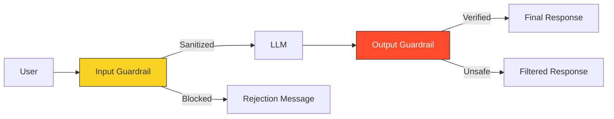

# 🔴 Part 3: Governance & Ethics

> **"With great power comes great responsibility. AI accelerates development, but it also accelerates risk if not governed correctly."**

## 📖 Overview

In the final part, we address the critical non-functional requirements of AI usage: **Security**, **Privacy**, and **Reliability**. We explore the dangers of "Hallucination," the risks of data leakage, and the ethical considerations of automation. We also look at how to build "Guardrails" to ensure AI remains a helper, not a liability.

---

## 🛡️ The AI Guardrails

---

## 🎯 Learning Objectives

By the end of this part, you will:

- ✅ Identify and mitigate **AI Hallucinations**.
- ✅ Protect **PII and Secrets** from leaking into public models.
- ✅ Understand **Data Sovereignty** and Enterprise AI limits.
- ✅ Define a corporate **AI Usage Policy**.
- ✅ Navigate the ethical dilemmas of automation and job displacement.

---

## 🗺️ Included Modules

1. **[05-Security-and-Ethics](./05-Security-and-Ethics/README.md)**: Privacy, Security, and Truth.

---

## 🎓 Career Readiness

**Interview Question:** "What is 'Prompt Injection'?"

**Strong Answer:** "Prompt Injection is a security vulnerability where a malicious user crafts an input that tricks the AI into ignoring its original instructions (System Prompt) and performing an unauthorized action, such as revealing hidden instructions or generating harmful content. It's the AI equivalent of SQL Injection."

---

**Next Step**: Secure your workflow in **[05-Security-and-Ethics](./05-Security-and-Ethics/README.md)** 🚀
