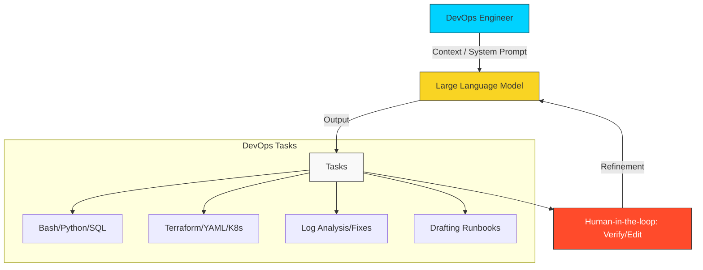

# 🤖 Prompt Engineering for DevOps

> **"AI won't replace DevOps Engineers, but DevOps Engineers who use AI will replace those who don't. Mastering the prompt is the new 'Command Line' proficiency."**

## 📚 Overview

In the modern infrastructure landscape, **Prompt Engineering** is the art of communicating with AI to automate complex operations. For a DevOps engineer, this means more than just "chatting"; it's about providing the right **Context**, **Constraints**, and **Mental Models** to generate production-ready code, troubleshoot outages, and design architecture at lightning speed.

This curriculum teaches you how to turn AI into your most powerful "Force Multiplier."

## 🎓 Learning Objectives

By the end of this curriculum, you will:

- ✅ Master the **CIRO (Context, Instruction, Role, Output)** framework.
- ✅ Generate complex **Bash and Python** automation scripts with 90%+ accuracy.
- ✅ Troubleshoot **Infrastructure Outages** by feeding logs to AI.
- ✅ Automate the creation of **Terraform and Kubernetes** manifests.
- ✅ Use AI to **Document Architecture** and generate Mermaid diagrams.
- ✅ Understand the **Security and Privacy** implications of using AI in enterprise.

---

## 🏗️ Curriculum Structure

| # | Module | Topic | Description |
| :--- | :--- | :--- | :--- |
| 01 | **[Foundations & Mental Models](./01-Foundations-and-Mental-Models/)** | The AI Mindset | How LLMs work and the "System Prompt" philosophy. |
| 02 | **[The DevOps Prompt Toolkit](./02-Prompt-Toolkit/)** | Professional Frameworks | Structure, Persona, and Zero-shot vs. Few-shot prompting. |
| 03 | **[Automating Code & IaC](./03-Automating-Code-and-IaC/)** | The Forge | Generating Bash, Python, YAML, and HCL with precision. |
| 04 | **[Troubleshooting & Debugging](./04-Debugging-with-AI/)** | The Diagnostic | Analyzing stack traces, logs, and fixing "Ghost" bugs. |
| 05 | **[Security & Ethics](./05-Security-and-Ethics/)** | The Guardrails | Token limits, data privacy, and avoiding "AI Hallucinations." |
| App | **[Prompt Templates](./examples/)** | The Library | A collection of professional DevOps system prompts. |

---

## 🚀 The "Force Multiplier" Effect

### 1. Speed to Implementation
What used to take 2 hours of searching StackOverflow now takes 2 minutes of prompt-refinement. AI handles the "Boilerplate" while you handle the "Architecture."

### 2. Crossing the Language Barrier

Need to convert a legacy Bash script into Python? AI can perform the translation with a single high-context prompt, preserving all logic.

### 3. Log Interrogation

Fed a 100-line Linux kernel log or an Nginx error trace? AI can spot the pattern of a "504 Gateway Timeout" or a disk-space issue faster than any human eye.

---

## 🏆 Real-World DevOps Story: The 3:00 AM Kubernetes Crisis

**The Scenario**: A Senior SRE was paged for a production outage. A Kubernetes cluster was stuck in a "CrashLoopBackOff," and the logs showed obscure networking errors that didn't match any known documentation.
**The Discovery**: The SRE copied the last 50 lines of the log and fed them to an LLM with the prompt: *"You are a Principal K8s Networking Expert. Analyze these logs and identify the root cause involving Calico CNI."*
**The Fix**: The AI immediately spotted an MTU mismatch between the cloud provider and the CNI overlay—a configuration error that was hidden deep in the YAML. It even suggested the exact `kubectl patch` command to fix it.
**The Lesson**: AI isn't just for writing code; it's a **Junior-to-Mid level pair programmer** that never sleeps and has read every manual. Use it to shorten your "Mean Time to Recovery" (MTTR).

---

## ❓ Interview Preparation (Prompting)

1. **Q: How can AI help in reducing 'Technical Debt' in a DevOps project?**
   *A: AI is excellent at refactoring old code. You can prompt it to: "Add error handling to this legacy script" or "Convert these hardcoded variables into a structured configuration file," allowing you to clean up old systems without manual rewriting.*

2. **Q: What is 'Few-Shot' prompting and how is it used in DevOps?**
   *A: Few-shot prompting involves giving the AI 2-3 examples of the input and output you want before asking for the final task. For example, show it two correctly formatted Terraform modules, then ask it to generate a third one in that exact style.*

3. **Q: What are the risks of using AI for infrastructure automation?**
   *A: The biggest risk is **Hallucination** (AI generating code that doesn't work or is insecure). Every AI-generated script MUST be reviewed by a human and tested in a sandbox before reaching production.*

4. **Q: In an enterprise environment, why is it dangerous to paste production logs into a public AI?**
   *A: Production logs often contain **PII (Personally Identifiable Information)**, API keys, or IP addresses. Pasting them into public AIs could violate company policy or data laws like GDPR.*

5. **Q: How do you prompt an AI to explain a complex shell command?**
   *A: Use the "Deconstruct" prompt: "Break down this command line by line and explain exactly what each flag (`-a`, `-x`, etc.) is doing in the context of a Linux server."*

---

## 🔗 Next Steps

The tools are ready. Now let's master the language.

Proceed to: **[01-Foundations & Mental Models](./01-Foundations-and-Mental-Models/README.md)** →
