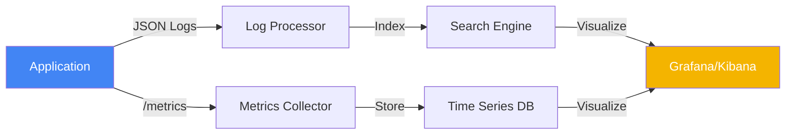

# 🔭 Observability Fundamentals (Beginner)

> **"If it's not monitored, it doesn't exist."**

## 📚 Overview

Observability is the ability to measure the internal states of a system by examining its outputs. In this module, we move beyond simple "is it running?" checks and into understanding system health through data.

## 🎯 Learning Objectives

- ✅ Understand the **MELT** framework (Metrics, Events, Logs, Traces).
- ✅ Differentiate between **Monitoring** (Passive) and **Observability** (Active).
- ✅ Perform manual system health checks using simple terminal tools.
- ✅ Understand the importance of structured logging.

## 🗺️ Module Structure

1.  **[🟢 01-MELT-Introduction](./01-MELT-Introduction/)**
    - Metrics: The numbers (CPU, RAM).
    - Events: The occurrences (Deployments, Errors).
    - Logs: The stories (Text strings, JSON).
    - Traces: The journeys (Request paths).
2.  **[🟢 02-Manual-Health-Checks](./02-Manual-Health-Checks/)**
    - Using `curl` for HTTP status checks.
    - Monitoring system resources with `top` and `df`.
    - Basic log tailing and grep.

---

## 🏗️ Visual: The Observability Data Pipeline

## 📋 Professional Pattern: The "Health Endpoint"
Always implement a `/health` or `/ready` endpoint in your services. This allows load balancers and container orchestrators to know if your app is alive without needing complex probes.

---
**Next Step**: Start with [MELT Introduction](./01-MELT-Introduction/) 🚀
