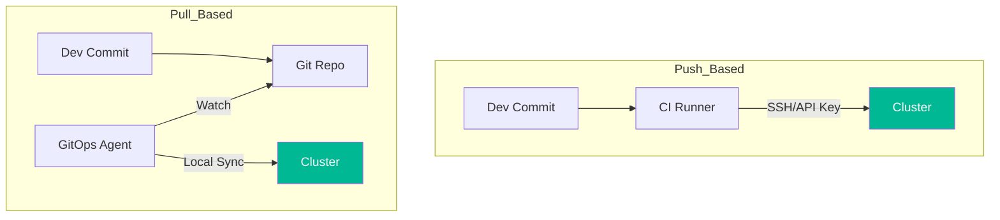

# 📈 GitOps Fundamentals (Beginner)

> **"Your Git repository is the single source of truth for your desired infrastructure state."**

## 📚 Overview

GitOps is an operational framework that takes DevOps best practices used for application development, such as version control, collaboration, compliance, and CI/CD, and applies them to infrastructure automation.

## 🎯 Learning Objectives

- ✅ Understand the core principle: **Git as Source of Truth**.
- ✅ Differentiate between **CI** (Continuous Integration) and **CD** (Continuous Deployment/Delivery).
- ✅ Learn the difference between **Push-based** and **Pull-based** deployments.
- ✅ Understand how "Drift" is detected and remediated.

## 🗺️ Module Structure

1.  **[🟢 01-Git-Source-of-Truth](./01-Git-Source-of-Truth/)**
    - Declarative vs. Imperative configurations.
    - Version controlling your YAMLs.
2.  **[🟢 02-Push-vs-Pull-Basics](./02-Push-vs-Pull-Basics/)**
    - The "Push" model (Jenkins, GitHub Actions).
    - The "Pull" model (ArgoCD, FluxCD).
    - Why Pull-based is more secure.

---

## 🏗️ Visual: Push vs. Pull Architectures

## 📋 Professional Pattern: Declarative Everything
Never use `kubectl edit` or `ansible-playbook` manually on production nodes. If you want to change the system, change the code in Git, and let the system reconcile itself.

---
**Next Step**: Start with [Git Source of Truth](./01-Git-Source-of-Truth/) 🚀
