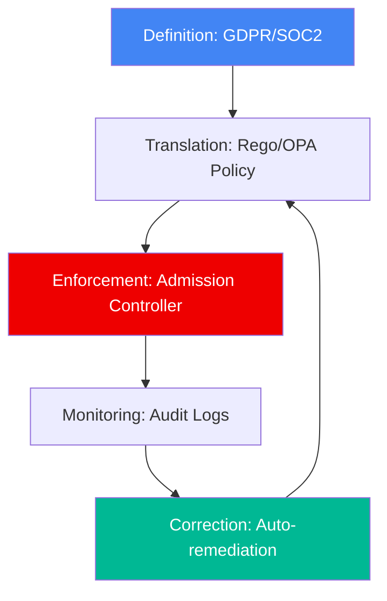

# 🛡️ Compliance as Code Foundations (Beginner)

> **"Compliance is not a point-in-time check, but a continuous state of being."**

## 📚 Overview

Compliance as Code (CaC) is the automation of auditing and managing regulatory requirements using software best practices. Instead of manual spreadsheets, we use declarative policies to ensure our infrastructure meets security standards.

## 🎯 Learning Objectives

- ✅ Understand the difference between **Security** and **Compliance**.
- ✅ Learn about major frameworks (CIS, SOC2, HIPAA, GDPR).
- ✅ Perform manual security audits using checklists.
- ✅ Understand the concept of "Policy as Code".

## 🗺️ Module Structure

1. **[🟢 01-Introduction-to-Policy](./01-Introduction-to-Policy/)**
   - What is Policy?
   - Declarative vs. Imperative security.
2. **[🟢 02-Manual-Security-Checklists](./02-Manual-Security-Checklists/)**
   - CIS Benchmarks overview.
   - Creating a basic security audit template.

---

## 🏗️ Visual: Compliance Automation Lifecycle

## 📋 Professional Pattern: The "Policy-First" Design
Before building a single resource, define the guardrails. For example, "No S3 buckets can be public" should be a policy that is enforced before bucket creation, not a check done after a breach.

---
**Next Step**: Start with [Introduction to Policy](./01-Introduction-to-Policy/) 🚀
