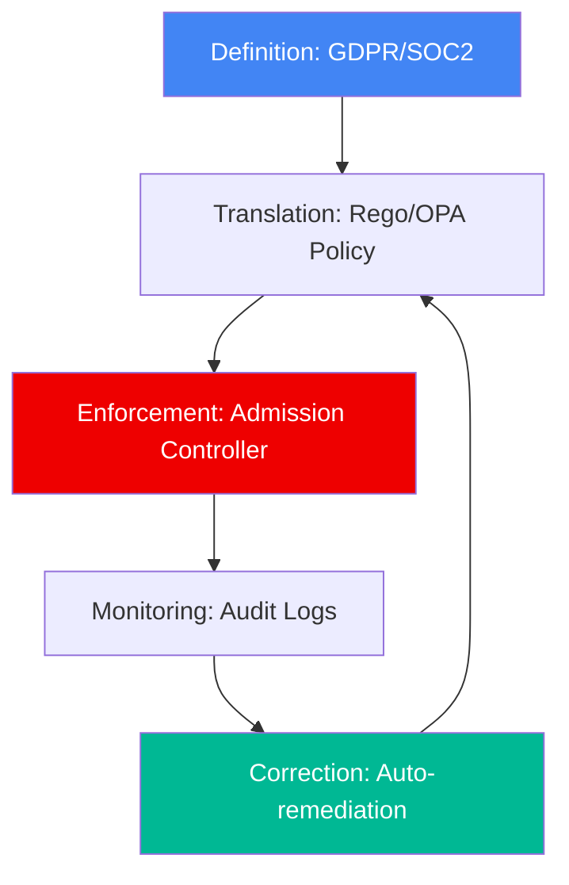

# 🛡️ Compliance as Code Foundations (Beginner)

> **"Compliance is not a point-in-time check, but a continuous state of being."**

## 📚 Overview

Compliance as Code (CaC) is the automation of auditing and managing regulatory requirements using software best practices. Instead of manual spreadsheets, we use declarative policies to ensure our infrastructure meets security standards.

## Core Concept: The Immutable Audit
**[REFERENCE: Policy Architecture](../../REFERENCE/Policy-Architecture-Ref.md)**

It's not enough to be secure; you must *prove* it.
- **Decoupling**: Business logic does *not* decide authorization. A separate Policy Engine does.
- **Deterministic**: The same input + same policy = same decision, forever.
- **Traceability**: Every decision (Allow/Deny) is logged as a JSON event, creating an unforgeable audit trail.

> See **[Policy-Architecture-Ref.md](../../REFERENCE/Policy-Architecture-Ref.md)** for the OPA/Rego architecture.

## 🎯 Learning Objectives

- ✅ Understand the difference between **Security** and **Compliance**.
- ✅ Learn about major frameworks (CIS, SOC2, HIPAA, GDPR).
- ✅ Perform manual security audits using checklists.
- ✅ Understand the concept of "Policy as Code".

---

## 🗺️ Curriculum Structure

| Part | Topic | Description |
| :--- | :--- | :--- |
| **[🟢 Part 1](./Part-01-Policy-Foundations/)** | **Policy** | Definitions, frameworks, and imperative vs. declarative. |
| **[🟡 Part 2](./Part-02-Security-Auditing/)** | **Auditing** | CIS Benchmarks and manual checklists. |

---

## 🏗️ Visual: Compliance Automation Lifecycle

## 📋 Professional Pattern: The "Policy-First" Design

Before building a single resource, define the guardrails. For example, "No S3 buckets can be public" should be a policy that is enforced before bucket creation, not a check done after a breach.

---

**Next Step**: Start with **[Part 1: Policy Foundations](./Part-01-Policy-Foundations/README.md)** 🚀
