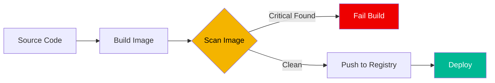

# 🐳 Container Security Basics (Beginner)

> **"Your container is only as safe as its base image."**

## 📚 Overview

Container security involves protecting the containerized applications from the build phase to the runtime phase. In this beginner module, we focus on the **Supply Chain**—ensuring the images we use are free from known vulnerabilities.

## 🎯 Learning Objectives

- ✅ Understand the anatomy of a Docker image.
- ✅ Identify common container security risks (Root users, Bloatware).
- ✅ Perform basic vulnerability scans on local images.
- ✅ Learn the importance of "Small & Secure" base images (Alpine, Distroless).

## 🗺️ Module Structure

1.  **[🟢 01-Image-Scanning-Fundamentals](./01-Image-Scanning-Fundamentals/)**
    - What is a CVE?
    - How scanners work.
2.  **[🟢 02-Manual-Docker-Audit](./02-Manual-Docker-Audit/)**
    - Auditing Dockerfiles for security anti-patterns.
    - Using `docker scan` (Snyk) or manual inspection.

---

## 🏗️ Visual: Container Vulnerability Pipeline

## 📋 Professional Pattern: Principle of Least Privilege
Always specify a non-root user in your `Dockerfile`. Running as root inside a container makes it trivial for an attacker to escalate privileges to the host system if the container is compromised.

---
**Next Step**: Start with [Image Scanning Fundamentals](./01-Image-Scanning-Fundamentals/) 🚀
