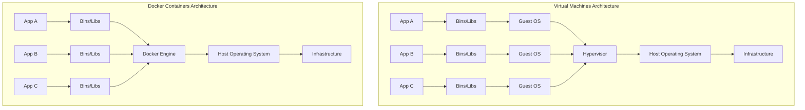
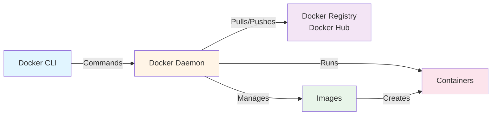
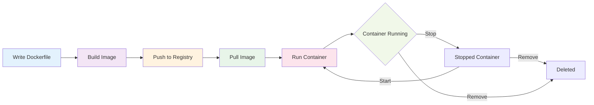

# Introduction to Docker and Containerization

## What is Containerization?

**Containerization** is a lightweight form of virtualization that packages an application and all its dependencies together in a standardized unit called a **container**. Unlike traditional virtual machines, containers share the host operating system's kernel, making them more efficient and faster to start.

### Why Containerization Matters

- **Consistency**: "It works on my machine" becomes "It works everywhere"
- **Isolation**: Applications run independently without conflicts
- **Efficiency**: Lightweight compared to virtual machines
- **Portability**: Run anywhere - development, testing, production
- **Scalability**: Easy to scale applications horizontally

## What is Docker?

**Docker** is the industry-standard platform for developing, shipping, and running containerized applications. It provides tools and a runtime environment to build, share, and run containers.

### Key Benefits of Docker

1. **Rapid Application Deployment**: Containers start in seconds
2. **Simplified Configuration**: No complex environment setup
3. **Developer Productivity**: Consistent environments for all team members
4. **Version Control**: Image versioning and rollback capabilities
5. **Resource Efficiency**: Multiple containers on a single host
6. **Microservices Ready**: Perfect for microservices architecture

## Docker vs Virtual Machines

Understanding the difference between containers and VMs is crucial:



### Comparison Table

| Feature | Virtual Machines | Docker Containers |
|---------|-----------------|-------------------|
| **Size** | Gigabytes | Megabytes |
| **Startup Time** | Minutes | Seconds |
| **Resource Usage** | High (full OS per VM) | Low (shared kernel) |
| **Isolation** | Complete isolation | Process-level isolation |
| **Portability** | Less portable | Highly portable |
| **Performance** | Overhead from hypervisor | Near-native performance |
| **Use Case** | Running different OS | Running applications |

> [!NOTE]
> Containers and VMs are not mutually exclusive. Many organizations run containers inside VMs for an additional layer of isolation and security.

## Docker Architecture

Docker uses a client-server architecture with several key components:



### Core Components

#### 1. Docker Client
- **Purpose**: User interface for Docker
- **Function**: Accepts commands from users and communicates with Docker daemon
- **Example**: `docker run`, `docker build`, `docker pull`

#### 2. Docker Daemon (dockerd)
- **Purpose**: The heart of Docker
- **Function**: Manages Docker objects (images, containers, networks, volumes)
- **Behavior**: Runs as a background service on the host machine
- **Communication**: Listens to Docker API requests

#### 3. Docker Images
- **Purpose**: Blueprint for containers
- **Structure**: Read-only templates with layers
- **Contains**: Application code, runtime, libraries, dependencies
- **Storage**: Stored in Docker Registry

#### 4. Docker Containers
- **Purpose**: Runnable instances of images
- **Behavior**: Isolated processes on the host machine
- **Lifecycle**: Can be started, stopped, moved, and deleted
- **State**: Running containers can be committed to create new images

#### 5. Docker Registry
- **Purpose**: Storage and distribution of images
- **Public**: Docker Hub (default registry)
- **Private**: Self-hosted registries for organizations
- **Function**: Push and pull images

## Installation Guide

### Linux (Ubuntu/Debian)

```bash
# Update package index
sudo apt-get update

# Install prerequisites
sudo apt-get install \
    ca-certificates \
    curl \
    gnupg \
    lsb-release

# Add Docker's official GPG key
sudo mkdir -p /etc/apt/keyrings
curl -fsSL https://download.docker.com/linux/ubuntu/gpg | \
    sudo gpg --dearmor -o /etc/apt/keyrings/docker.gpg

# Set up repository
echo \
  "deb [arch=$(dpkg --print-architecture) signed-by=/etc/apt/keyrings/docker.gpg] \
  https://download.docker.com/linux/ubuntu \
  $(lsb_release -cs) stable" | \
  sudo tee /etc/apt/sources.list.d/docker.list > /dev/null

# Install Docker Engine
sudo apt-get update
sudo apt-get install docker-ce docker-ce-cli containerd.io docker-buildx-plugin docker-compose-plugin

# Add user to docker group (optional, to run without sudo)
sudo usermod -aG docker $USER
```

### Linux (CentOS/RHEL)

```bash
# Remove old versions
sudo yum remove docker docker-common docker-selinux docker-engine

# Install required packages
sudo yum install -y yum-utils device-mapper-persistent-data lvm2

# Add Docker repository
sudo yum-config-manager --add-repo \
    https://download.docker.com/linux/centos/docker-ce.repo

# Install Docker
sudo yum install docker-ce docker-ce-cli containerd.io

# Start Docker
sudo systemctl start docker
sudo systemctl enable docker
```

### macOS

```bash
# Download Docker Desktop from:
# https://www.docker.com/products/docker-desktop

# Or using Homebrew
brew install --cask docker
```

### Windows

1. Download **Docker Desktop** from [docker.com](https://www.docker.com/products/docker-desktop)
2. Run the installer
3. Enable WSL 2 backend (recommended)
4. Restart your computer

### Verify Installation

```bash
# Check Docker version
docker --version

# Check Docker info
docker info

# Run test container
docker run hello-world
```

## Your First Container: Hello World

Let's run your first Docker container to verify everything works:

```bash
# Pull and run hello-world image
docker run hello-world
```

**What happens:**

1. Docker checks if `hello-world` image exists locally
2. If not found, it pulls from Docker Hub
3. Creates a container from the image
4. Runs the container
5. Container prints a message and exits

### Expected Output

```
Unable to find image 'hello-world:latest' locally
latest: Pulling from library/hello-world
2db29710123e: Pull complete
Digest: sha256:...
Status: Downloaded newer image for hello-world:latest

Hello from Docker!
This message shows that your installation appears to be working correctly.

To generate this message, Docker took the following steps:
 1. The Docker client contacted the Docker daemon.
 2. The Docker daemon pulled the "hello-world" image from the Docker Hub.
 3. The Docker daemon created a new container from that image.
 4. The Docker daemon streamed that output to the Docker client.
```

## Understanding Container Workflow



## A Practical Example: Running NGINX

Let's run a real web server:

```bash
# Run NGINX web server
docker run -d -p 8080:80 --name my-nginx nginx:latest
```

**Command breakdown:**
- `docker run`: Create and start a container
- `-d`: Detached mode (runs in background)
- `-p 8080:80`: Map port 8080 on host to port 80 in container
- `--name my-nginx`: Give the container a friendly name
- `nginx:latest`: Image name and tag

**Access the server:**
Open your browser and navigate to `http://localhost:8080`

**Manage the container:**

```bash
# View running containers
docker ps

# View logs
docker logs my-nginx

# Stop container
docker stop my-nginx

# Start container
docker start my-nginx

# Remove container
docker rm my-nginx
```

> [!TIP]
> Use `docker ps -a` to see all containers, including stopped ones.

## Common Use Cases

### 1. Development Environments
- Standardized development setup for teams
- Quick switching between project environments
- No dependency conflicts on local machine

### 2. Microservices
- Each service in its own container
- Independent scaling and deployment
- Technology stack flexibility

### 3. CI/CD Pipelines
- Consistent build and test environments
- Parallel testing in isolated containers
- Fast deployment workflows

### 4. Application Packaging
- Bundle applications with dependencies
- Simplified distribution
- Version management

### 5. Cloud Migration
- Container portability across cloud providers
- Easy transition from on-premises to cloud
- Hybrid cloud deployments

## Docker Ecosystem

Docker is part of a larger ecosystem:

- **Docker Desktop**: Desktop application for Mac and Windows
- **Docker Hub**: Public registry with millions of images
- **Docker Compose**: Tool for multi-container applications
- **Docker Swarm**: Native container orchestration
- **Kubernetes**: Advanced container orchestration (most popular)

## Best Practices for Beginners

1. **Keep Containers Single-Purpose**: One process per container
2. **Use Official Images**: Start with verified images from Docker Hub
3. **Tag Your Images**: Never rely on `latest` tag in production
4. **Clean Up Regularly**: Remove unused containers and images
5. **Read the Docs**: Official Docker documentation is excellent
6. **Practice**: The best way to learn is by doing

## Next Steps

Now that you understand Docker basics, proceed to:

1. [Images and Containers](../02-Images-and-Containers/README.md) - Deep dive into images and container management
2. [Dockerfile Basics](../03-Dockerfile-Basics/README.md) - Learn to build your own images

## Resources

- [Official Docker Documentation](https://docs.docker.com/)
- [Docker Hub](https://hub.docker.com/)
- [Docker Getting Started Tutorial](https://docs.docker.com/get-started/)
- [Play with Docker](https://labs.play-with-docker.com/) - Browser-based Docker playground
- [Docker Cheat Sheet](https://docs.docker.com/get-started/docker_cheatsheet.pdf)

## Troubleshooting

### Docker daemon is not running

```bash
# Linux
sudo systemctl start docker

# Check status
sudo systemctl status docker
```

### Permission denied

```bash
# Add user to docker group
sudo usermod -aG docker $USER

# Log out and back in, or run:
newgrp docker
```

### Cannot connect to Docker daemon

```bash
# Check if Docker service is running
sudo systemctl status docker

# Restart Docker
sudo systemctl restart docker
```

---

**Continue to:** [Images and Containers →](../02-Images-and-Containers/README.md)
