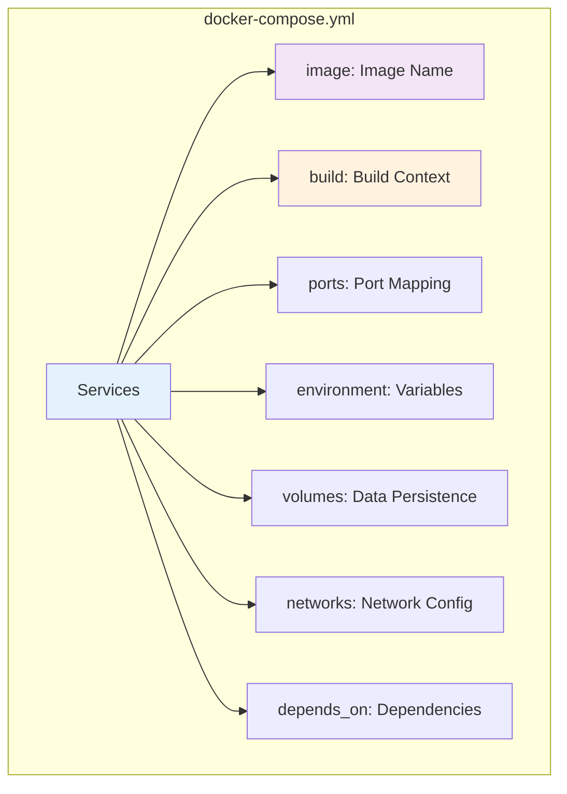
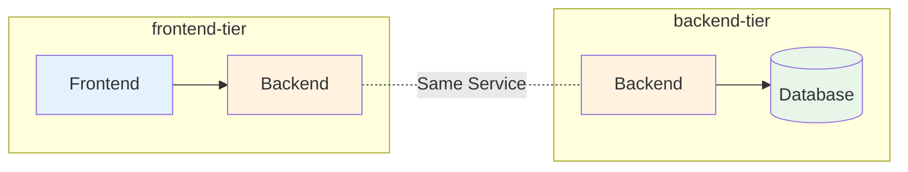

# Docker Compose Basics

## What is Docker Compose?

**Docker Compose** is a tool for defining and running multi-container Docker applications. Instead of managing containers individually with `docker run` commands, you define your entire application stack in a single YAML file.

### Why Use Docker Compose?

**Without Docker Compose:**
```bash
# Start database
docker network create myapp-network
docker run -d --name db --network myapp-network \
  -e POSTGRES_PASSWORD=secret postgres:15

# Start cache
docker run -d --name cache --network myapp-network redis:7

# Start backend
docker run -d --name api --network myapp-network \
  -e DB_HOST=db -e REDIS_HOST=cache \
  -p 3000:3000 my-api:latest

# Start frontend
docker run -d --name web --network myapp-network \
  -e API_URL=http://api:3000 \
  -p 80:80 my-frontend:latest
```

**With Docker Compose:**
```yaml
# docker-compose.yml
services:
  db:
    image: postgres:15
    environment:
      POSTGRES_PASSWORD: secret
      
  cache:
    image: redis:7
    
  api:
    image: my-api:latest
    ports:
      - "3000:3000"
    environment:
      DB_HOST: db
      REDIS_HOST: cache
    depends_on:
      - db
      - cache
      
  web:
    image: my-frontend:latest
    ports:
      - "80:80"
    environment:
      API_URL: http://api:3000
    depends_on:
      - api
```

```bash
# Start everything
docker compose up -d

# Stop everything
docker compose down
```

### Key Benefits

- ✅ **Single Configuration File**: One place for all services
- ✅ **Easy Commands**: Simple up/down commands
- ✅ **Automatic Networking**: Services can communicate by name
- ✅ **Environment Management**: Dev, test, prod configs
- ✅ **Volume Management**: Persistent data handling
- ✅ **Reproducible**: Same setup everywhere

## Installation

Docker Compose V2 comes bundled with Docker Desktop and recent Docker Engine versions.

```bash
# Check if installed
docker compose version

# V2 syntax (preferred)
docker compose up

# V1 syntax (legacy)
docker-compose up
```

> [!NOTE]
> This guide uses Docker Compose V2 syntax (`docker compose` not `docker-compose`).

## Basic Compose File Structure

```yaml
version: '3.8'  # Optional in V2, but good for compatibility

services:       # Define containers
  service-name:
    image: image:tag
    # or
    build: ./path
    
volumes:        # Define named volumes (optional)
  volume-name:

networks:       # Define custom networks (optional)
  network-name:
```

## Your First Docker Compose Application

### Example: WordPress with MySQL

**Create `docker-compose.yml`:**

```yaml
services:
  db:
    image: mysql:8.0
    volumes:
      - db-data:/var/lib/mysql
    environment:
      MYSQL_ROOT_PASSWORD: somewordpress
      MYSQL_DATABASE: wordpress
      MYSQL_USER: wordpress
      MYSQL_PASSWORD: wordpress
    
  wordpress:
    image: wordpress:latest
    ports:
      - "8080:80"
    environment:
      WORDPRESS_DB_HOST: db
      WORDPRESS_DB_USER: wordpress
      WORDPRESS_DB_PASSWORD: wordpress
      WORDPRESS_DB_NAME: wordpress
    depends_on:
      - db
    volumes:
      - wordpress-data:/var/www/html

volumes:
  db-data:
  wordpress-data:
```

**Run the application:**

```bash
# Start services
docker compose up -d

# View logs
docker compose logs -f

# List running services
docker compose ps

# Stop services
docker compose stop

# Stop and remove containers, networks
docker compose down

# Stop and remove everything including volumes
docker compose down -v
```

## Service Configuration



### Image vs Build

```yaml
services:
  # Use pre-built image from registry
  web:
    image: nginx:alpine
  
  # Build from Dockerfile
  api:
    build: ./api
    
  # Build with context and Dockerfile path
  app:
    build:
      context: ./app
      dockerfile: Dockerfile.prod
      args:
        VERSION: "1.0"
```

### Port Mapping

```yaml
services:
  web:
    image: nginx
    ports:
      # HOST:CONTAINER
      - "8080:80"          # Bind to all interfaces
      - "127.0.0.1:8443:443"  # Bind to localhost only
      - "3000-3005:3000-3005" # Port range
```

### Environment Variables

```yaml
services:
  app:
    image: my-app
    environment:
      # Key-value format
      NODE_ENV: production
      DATABASE_URL: postgresql://user:pass@db:5432/mydb
      
    # Or array format
    environment:
      - NODE_ENV=production
      - DATABASE_URL=postgresql://user:pass@db:5432/mydb
      
    # From .env file
    env_file:
      - .env
      - .env.local
```

### Volumes

```yaml
services:
  db:
    image: postgres:15
    volumes:
      # Named volume
      - db-data:/var/lib/postgresql/data
      
      # Bind mount
      - ./config:/etc/postgresql
      
      # Anonymous volume
      - /var/log/postgresql

volumes:
  db-data:  # Declare named volumes
```

### Depends On

```yaml
services:
  web:
    image: nginx
    depends_on:
      - api
      - cache
    
  api:
    image: my-api
    depends_on:
      db:
        condition: service_healthy
    
  db:
    image: postgres:15
    healthcheck:
      test: ["CMD", "pg_isready"]
      interval: 10s
      timeout: 5s
      retries: 5
    
  cache:
    image: redis:7
```

> [!IMPORTANT]
> `depends_on` only waits for containers to start, not for services to be ready. Use health checks for service readiness.

## Docker Compose Commands

### Starting and Stopping

```bash
# Start services in foreground
docker compose up

# Start in background (detached)
docker compose up -d

# Start specific services
docker compose up web db

# Rebuild images and start
docker compose up --build

# Force recreate containers
docker compose up --force-recreate

# Stop services (containers remain)
docker compose stop

# Stop specific service
docker compose stop web

# Start stopped services
docker compose start

# Restart services
docker compose restart

# Restart specific service
docker compose restart api
```

### Removing

```bash
# Stop and remove containers, networks
docker compose down

# Also remove volumes
docker compose down -v

# Also remove images
docker compose down --rmi all

# Remove stopped containers
docker compose rm
```

### Viewing

```bash
# List services
docker compose ps

# Show all containers
docker compose ps -a

# View logs
docker compose logs

# Follow logs (tail -f)
docker compose logs -f

# Logs for specific service
docker compose logs api

# Last 100 lines
docker compose logs --tail=100

# Show timestamps
docker compose logs -t
```

### Executing Commands

```bash
# Run command in running container
docker compose exec web sh

# Run command in service (creates new container)
docker compose run web python manage.py migrate

# Run without dependencies
docker compose run --no-deps web npm test

# One-off command
docker compose run --rm web sh
```

### Building

```bash
# Build images
docker compose build

# Build specific service
docker compose build api

# Build without cache
docker compose build --no-cache

# Build with arguments
docker compose build --build-arg VERSION=2.0
```

## Real-World Example: Full Stack Application

**Project structure:**
```
my-fullstack-app/
├── docker-compose.yml
├── .env
├── frontend/
│   ├── Dockerfile
│   ├── package.json
│   └── src/
├── backend/
│   ├── Dockerfile
│   ├── requirements.txt
│   └── app.py
└── nginx/
    └── nginx.conf
```

**docker-compose.yml:**

```yaml
services:
  # PostgreSQL Database
  db:
    image: postgres:15-alpine
    restart: always
    environment:
      POSTGRES_USER: ${DB_USER:-postgres}
      POSTGRES_PASSWORD: ${DB_PASSWORD}
      POSTGRES_DB: ${DB_NAME:-myapp}
    volumes:
      - postgres-data:/var/lib/postgresql/data
    healthcheck:
      test: ["CMD-SHELL", "pg_isready -U postgres"]
      interval: 10s
      timeout: 5s
      retries: 5
  
  # Redis Cache
  cache:
    image: redis:7-alpine
    restart: always
    command: redis-server --appendonly yes
    volumes:
      - redis-data:/data
  
  # Backend API
  backend:
    build:
      context: ./backend
      dockerfile: Dockerfile
    restart: always
    environment:
      DATABASE_URL: postgresql://${DB_USER}:${DB_PASSWORD}@db:5432/${DB_NAME}
      REDIS_URL: redis://cache:6379
      SECRET_KEY: ${SECRET_KEY}
    depends_on:
      db:
        condition: service_healthy
      cache:
        condition: service_started
    volumes:
      - ./backend:/app
      - backend-static:/app/static
  
  # Frontend
  frontend:
    build:
      context: ./frontend
      dockerfile: Dockerfile
    restart: always
    environment:
      REACT_APP_API_URL: http://localhost/api
    volumes:
      - ./frontend/src:/app/src
  
  # NGINX Reverse Proxy
  nginx:
    image: nginx:alpine
    restart: always
    ports:
      - "80:80"
      - "443:443"
    volumes:
      - ./nginx/nginx.conf:/etc/nginx/nginx.conf:ro
      - backend-static:/var/www/static:ro
    depends_on:
      - backend
      - frontend

volumes:
  postgres-data:
  redis-data:
  backend-static:
```

**.env file:**

```bash
# Database
DB_USER=myapp
DB_PASSWORD=secret123
DB_NAME=production_db

# Application
SECRET_KEY=your-secret-key-here
DEBUG=false
```

**Start the application:**

```bash
# Start all services
docker compose up -d

# View status
docker compose ps

# Scale frontend
docker compose up -d --scale frontend=3

# View logs
docker compose logs -f backend

# Execute migrations
docker compose exec backend python manage.py migrate

# Stop everything
docker compose down -v
```

## Networking in Compose

Docker Compose automatically creates a network for your app. Services can reach each other using service names.

```yaml
services:
  web:
    image: nginx
    # Can access 'api' by name: http://api:3000
    
  api:
    image: my-api
    # Can access 'db' by name: postgresql://db:5432/mydb
    
  db:
    image: postgres:15
```

### Custom Networks

```yaml
services:
  frontend:
    image: my-frontend
    networks:
      - frontend-tier
      
  backend:
    image: my-backend
    networks:
      - frontend-tier
      - backend-tier
      
  db:
    image: postgres:15
    networks:
      - backend-tier

networks:
  frontend-tier:
  backend-tier:
```



## Development Workflow

### Live Reload Setup

```yaml
services:
  frontend:
    build: ./frontend
    volumes:
      # Bind mount for live reload
      - ./frontend/src:/app/src
      # Named volume for node_modules
      - node_modules:/app/node_modules
    command: npm run dev
    
volumes:
  node_modules:
```

### Override for Development

**docker-compose.yml** (base):
```yaml
services:
  app:
    image: my-app:latest
    environment:
      NODE_ENV: production
```

**docker-compose.override.yml** (automatically loaded):
```yaml
services:
  app:
    build: .
    volumes:
      - ./src:/app/src
    environment:
      NODE_ENV: development
      DEBUG: "true"
```

**docker-compose.prod.yml** (production):
```yaml
services:
  app:
    image: my-app:1.0.0
    restart: always
```

```bash
# Development (loads docker-compose.yml + docker-compose.override.yml)
docker compose up

# Production
docker compose -f docker-compose.yml -f docker-compose.prod.yml up -d
```

## Troubleshooting

### View Service Status

```bash
# See all services
docker compose ps

# Detailed info
docker compose ps -a --format json
```

### Check Logs

```bash
# All services
docker compose logs

# Specific service with tail
docker compose logs -f --tail=100 api

# Multiple services
docker compose logs web api
```

### Network Issues

```bash
# Inspect networks
docker network ls
docker network inspect myapp_default

# Test connectivity
docker compose exec web ping api
docker compose exec web curl http://api:3000/health
```

### Rebuild Services

```bash
# Rebuild everything
docker compose build --no-cache

# Recreate containers
docker compose up -d --force-recreate

# Pull latest images
docker compose pull
docker compose up -d
```

## Best Practices

1 **Use `.env` Files**: Never commit secrets to version control
2. **Health Checks**: Define health checks for depends_on
3. **Named Volumes**: Use named volumes for important data
4. **Bind Mounts for Development**: Live reload during development
5. **Restart Policies**: Set appropriate restart policies
6. **Resource Limits**: Define CPU/memory limits in production
7. **Specific Image Tags**: Avoid `latest` tag
8. **Service Names**: Use descriptive, consistent names

## Quick Reference

```bash
# Lifecycle
docker compose up -d              # Start services
docker compose down               # Stop and remove
docker compose restart            # Restart services
docker compose stop               # Stop without removing

# Viewing
docker compose ps                 # List services
docker compose logs -f            # View logs
docker compose top                # Show processes

# Execution
docker compose exec SERVICE cmd   # Run in running container
docker compose run SERVICE cmd    # Create new container

# Building
docker compose build              # Build images
docker compose pull               # Pull images

# Cleanup
docker compose down -v            # Remove volumes too
docker compose rm                 # Remove stopped containers
```

## Next Steps

- Learn about [Service Configuration](../02-Service-Configuration/README.md)
- Explore [Advanced Compose Features](../../Intermediate/01-Advanced-Features/README.md)
- Understand [Networks and Volumes](../../Intermediate/02-Networks-Volumes/README.md)

## Resources

- [Docker Compose Documentation](https://docs.docker.com/compose/)
- [Compose File Reference](https://docs.docker.com/compose/compose-file/)
- [Compose CLI Reference](https://docs.docker.com/compose/reference/)
- [Environment Variables](https://docs.docker.com/compose/environment-variables/)

---

**[Next: Service Configuration →](../02-Service-Configuration/README.md)**
