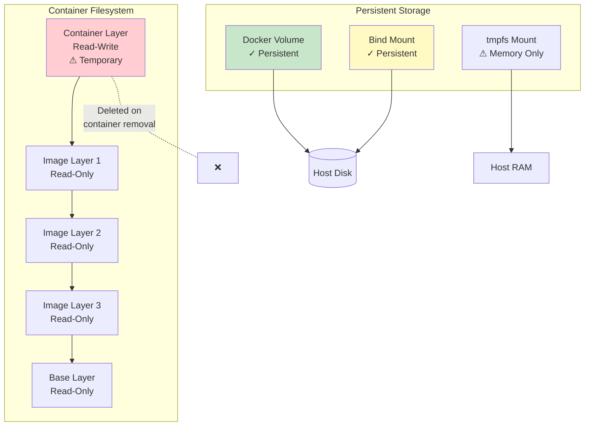
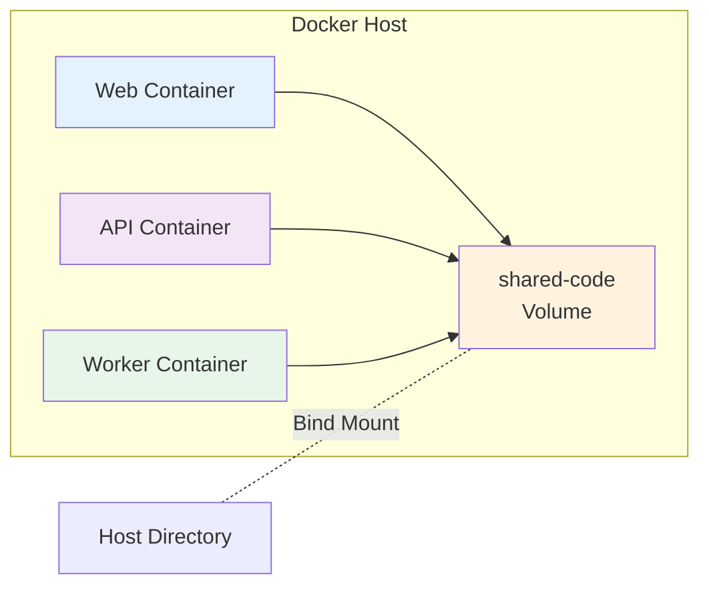

# Docker Volumes and Data Persistence

Containers are ephemeral by design - when removed, their data is lost. **Docker volumes** solve this problem by providing persistent storage that survives container lifecycle.

## Understanding Container Storage



### Storage Types Comparison

| Type | Location | Managed By | Use Case | Performance | Portability |
|------|----------|------------|----------|-------------|-------------|
| **Container Layer** | Container | Docker | Temporary data | Good | N/A |
| **Named Volume** | Docker area | Docker | Database data, persistent state | Best | High |
| **Bind Mount** | Anywhere on host | User | Development, config files | Good | Low |
| **tmpfs Mount** | Host RAM | Docker | Temporary cache, secrets | Fastest | N/A |

## Docker Volumes (Recommended)

Volumes are the preferred mechanism for persisting data. They're managed by Docker and isolated from the host filesystem.

### Creating Volumes

```bash
# Create a named volume
docker volume create my-data

# Create volume with driver options
docker volume create \
  --driver local \
  --opt type=nfs \
  --opt o=addr=192.168.1.100,rw \
  --opt device=:/path/to/dir \
  nfs-volume

# Create volume with labels
docker volume create \
  --label project=myapp \
  --label env=production \
  prod-data
```

### Using Volumes

```bash
# Run container with named volume
docker run -d \
  --name web \
  -v my-data:/app/data \
  nginx

# Alternative syntax (recommended)
docker run -d \
  --name web \
  --mount source=my-data,target=/app/data \
  nginx

# Anonymous volume (created automatically)
docker run -d -v /app/data nginx

# Multiple volumes
docker run -d \
  -v db-data:/var/lib/mysql \
  -v db-config:/etc/mysql \
  mysql:8.0
```

### Managing Volumes

```bash
# List volumes
docker volume ls

# Inspect volume
docker volume inspect my-data

# Find volume location on host
docker volume inspect -f '{{.Mountpoint}}' my-data

# Remove volume
docker volume rm my-data

# Remove all unused volumes
docker volume prune

# Remove volume with container
docker rm -v container-name
```

### Practical Example: MySQL with Persistent Data

```bash
# Create volume for database
docker volume create mysql-data

# Run MySQL with volume
docker run -d \
  --name mysql-db \
  -e MYSQL_ROOT_PASSWORD=secret \
  -e MYSQL_DATABASE=myapp \
  -v mysql-data:/var/lib/mysql \
  -p 3306:3306 \
  mysql:8.0

# Add data
docker exec -it mysql-db mysql -uroot -psecret -e \
  "USE myapp; CREATE TABLE users (id INT, name VARCHAR(50));"

# Stop and remove container
docker stop mysql-db
docker rm mysql-db

# Data still exists in volume
docker volume ls | grep mysql-data

# Start new container with same volume
docker run -d \
  --name mysql-db-new \
  -e MYSQL_ROOT_PASSWORD=secret \
  -v mysql-data:/var/lib/mysql \
  -p 3306:3306 \
  mysql:8.0

# Data is still there!
docker exec -it mysql-db-new mysql -uroot -psecret -e \
  "USE myapp; SHOW TABLES;"
```

## Bind Mounts

Bind mounts link a host filesystem path to a container path. Changes are reflected immediately in both directions.

### Using Bind Mounts

```bash
# Bind mount using -v
docker run -d \
  -v /path/on/host:/path/in/container \
  nginx

# Bind mount using --mount (more explicit)
docker run -d \
  --mount type=bind,source=/path/on/host,target=/path/in/container \
  nginx

# Read-only bind mount
docker run -d \
  -v /path/on/host:/path/in/container:ro \
  nginx

# Bind mount current directory
docker run -d \
  -v $(pwd):/app \
  my-app
```

### Development Workflow Example

```bash
# Project structure
# myapp/
# ├── src/
# │   └── index.js
# ├── package.json
# └── Dockerfile

# Run with bind mount for development
docker run -d \
  --name dev-app \
  -v $(pwd)/src:/app/src \
  -p 3000:3000 \
  node:18 \
  npm run dev

# Edit files on host → Changes reflected immediately in container
echo "console.log('Updated!');" >> src/index.js

# App auto-reloads with changes
```

### Bind Mount for Configuration

```bash
# Custom NGINX configuration
docker run -d \
  --name web \
  -v $(pwd)/nginx.conf:/etc/nginx/nginx.conf:ro \
  -v $(pwd)/html:/usr/share/nginx/html:ro \
  -p 80:80 \
  nginx
```

## tmpfs Mounts (Memory Storage)

tmpfs mounts store data in host memory only. Data is lost when container stops.

### Use Cases

- Sensitive data (passwords, keys) that shouldn't touch disk
- Temporary cache
- Session storage
- High-performance temporary storage

```bash
# tmpfs mount
docker run -d \
  --name app \
  --tmpfs /tmp:rw,size=100m,mode=1777 \
  my-app

# Using --mount syntax
docker run -d \
  --mount type=tmpfs,destination=/tmp,tmpfs-size=100m \
  my-app

# Store secrets in memory
docker run -d \
  --tmpfs /run/secrets:noexec,nosuid,size=64k \
  my-app
```

## Volume Drivers

Docker supports plugins for different storage backends:

```bash
# Local driver (default)
docker volume create --driver local my-vol

# NFS driver
docker volume create \
  --driver local \
  --opt type=nfs \
  --opt o=addr=nfs-server,rw \
  --opt device=:/path/to/data \
  nfs-vol

# Third-party drivers
# - AWS EBS
# - Azure Disk
# - GCP Persistent Disk
# - NetApp
# - And many more...
```

## Sharing Data Between Containers

### Pattern 1: Shared Volume

```bash
# Create shared volume
docker volume create shared-data

# Container 1 writes data
docker run -d \
  --name writer \
  -v shared-data:/data \
  alpine \
  sh -c "while true; do date >> /data/log.txt; sleep 1; done"

# Container 2 reads data
docker run -d \
  --name reader \
  -v shared-data:/data:ro \
  alpine \
  sh -c "tail -f /data/log.txt"

# View reader output
docker logs -f reader
```

### Pattern 2: Volumes From Another Container

```bash
# Data container pattern (legacy, but still useful)
docker create -v /data --name data-container alpine

# App containers use data from data-container
docker run -d --volumes-from data-container --name app1 my-app
docker run -d --volumes-from data-container --name app2 my-app
```

### Pattern 3: Multi-Container Development



## Backup and Restore

### Backup Volume Data

```bash
# Method 1: Using tar
docker run --rm \
  -v my-data:/data \
  -v $(pwd):/backup \
  alpine \
  tar czf /backup/my-data-backup.tar.gz -C /data .

# Method 2: Copy to host
docker run --rm \
  -v my-data:/data \
  -v $(pwd):/backup \
  alpine \
  sh -c "cp -r /data/* /backup/"
```

### Restore Volume Data

```bash
# Create new volume
docker volume create my-data-restored

# Restore from backup
docker run --rm \
  -v my-data-restored:/data \
  -v $(pwd):/backup \
  alpine \
  tar xzf /backup/my-data-backup.tar.gz -C /data
```

### Automated Backup Script

```bash
#!/bin/bash
# backup-docker-volumes.sh

VOLUME_NAME=$1
BACKUP_DIR="/backups"
TIMESTAMP=$(date +%Y%m%d_%H%M%S)

docker run --rm \
  -v ${VOLUME_NAME}:/data:ro \
  -v ${BACKUP_DIR}:/backup \
  alpine \
  tar czf /backup/${VOLUME_NAME}_${TIMESTAMP}.tar.gz -C /data .

echo "Backup created: ${VOLUME_NAME}_${TIMESTAMP}.tar.gz"
```

## Volume Migration

### Migrate Between Hosts

```bash
# On source host - export volume
docker run --rm \
  -v source-volume:/data \
  alpine \
  tar cz -C /data . > volume-data.tar.gz

# Transfer to new host
scp volume-data.tar.gz user@newhost:/tmp/

# On destination host - import volume
docker volume create destination-volume
cat /tmp/volume-data.tar.gz | \
  docker run --rm -i \
  -v destination-volume:/data \
  alpine \
  tar xz -C /data
```

### Copy Between Volumes

```bash
# Copy data from one volume to another
docker run --rm \
  -v source-vol:/source:ro \
  -v dest-vol:/dest \
  alpine \
  sh -c "cp -av /source/* /dest/"
```

## Advanced Volume Management

### Volume Permissions

```bash
# Set specific user ownership
docker run --rm \
  -v my-data:/data \
  alpine \
  chown -R 1000:1000 /data

# Run container as specific user
docker run -d \
  --user 1000:1000 \
  -v my-data:/app/data \
  my-app
```

### Read-Only Volumes

```bash
# Mount volume as read-only
docker run -d \
  -v config-data:/app/config:ro \
  my-app

# Application can't modify configuration
```

### Volume Labels

```bash
# Create volume with metadata
docker volume create \
  --label environment=production \
  --label backup=daily \
  --label retention=30days \
  prod-db-data

# Filter volumes by label
docker volume ls --filter label=environment=production

# Find volumes to backup
docker volume ls --filter label=backup=daily
```

## Monitoring Volume Usage

### Check Volume Size

```bash
# Using Docker inspect
docker volume inspect my-data

# Get actual disk usage
sudo du -sh $(docker volume inspect -f '{{.Mountpoint}}' my-data)

# All volumes size
sudo du -sh /var/lib/docker/volumes/*
```

### List Volumes by Size

```bash
#!/bin/bash
# list-volume-sizes.sh

for vol in $(docker volume ls -q); do
  size=$(sudo du -sh $(docker volume inspect -f '{{.Mountpoint}}' $vol) 2>/dev/null | awk '{print $1}')
  echo "$vol: $size"
done | sort -h -k2
```

## Troubleshooting

### Volume Not Persisting Data

```bash
# Check if volume is actually created
docker volume ls

# Inspect container mounts
docker inspect -f '{{json .Mounts}}' container-name | jq

# Verify volume path
docker inspect container-name | grep -A 10 Mounts
```

### Permission Issues

```bash
# Check file ownership in volume
docker run --rm -v my-data:/data alpine ls -la /data

# Fix permissions
docker run --rm -v my-data:/data alpine chown -R 1000:1000 /data

# Run container as root to fix
docker exec -u root container-name chown -R appuser:appuser /data
```

### Volume Is Full

```bash
# Check disk usage
df -h

# Check volume size
sudo du -sh /var/lib/docker/volumes/my-data

# Clean up old data
docker run --rm -v my-data:/data alpine \
  find /data -type f -mtime +30 -delete
```

### Can't Delete Volume

```bash
# Check which containers are using it
docker ps -a --filter volume=my-data

# Remove containers using the volume
docker rm -f $(docker ps -aq --filter volume=my-data)

# Now remove volume
docker volume rm my-data
```

## Best Practices

1. **Use Named Volumes for Databases**: Never use bind mounts for database storage in production
2. **Backup Regularly**: Automate volume backups for critical data
3. **Use Labels**: Organize volumes with metadata
4. **Avoid Anonymous Volumes**: Hard to manage and track
5. **Read-Only When Possible**: Mount configurations as read-only
6. **Set Ownership Correctly**: Match container user UID/GID
7. **Monitor Volume Size**: Set up alerts for disk usage
8. **Document Volume Purpose**: Use labels and naming conventions
9. **Clean Up Unused Volumes**: Regular `docker volume prune`
10. **Test Restore Process**: Ensure backups actually work

## Common Patterns

### Database with Backup

```bash
# Production database setup
docker run -d \
  --name postgres \
  -v postgres-data:/var/lib/postgresql/data \
  -v postgres-backups:/backups \
  -e POSTGRES_PASSWORD=secret \
  postgres:15

# Automated backupscript
docker exec postgres pg_dump -U postgres mydb > /backups/backup.sql
```

### Development Environment

```bash
# Development with live reload
docker run -d \
  --name dev-env \
  -v $(pwd)/src:/app/src:cached \
  -v node_modules:/app/node_modules \
  -p 3000:3000 \
  node:18
```

### Shared Configuration

```bash
# Shared config across multiple containers
docker volume create app-config

# Copy config to volume
docker run --rm \
  -v app-config:/config \
  -v $(pwd)/config:/source \
  alpine cp -r /source/* /config/

# Use in containers
docker run -d -v app-config:/app/config:ro app1
docker run -d -v app-config:/app/config:ro app2
```

## Volume Command Reference

```bash
# Create
docker volume create <name>                    # Create volume
docker volume create --label key=value <name>  # With labels

# List & Inspect
docker volume ls                               # List volumes
docker volume ls --filter label=env=prod       # Filter by label
docker volume inspect <name>                   # Detailed info

# Remove
docker volume rm <name>                        # Remove volume
docker volume prune                            # Remove unused
docker volume prune --filter label=temp=true   # Conditional prune

# Usage
-v volume-name:/path                           # Named volume
-v /host/path:/container/path                  # Bind mount
-v /container/path                             # Anonymous volume
--mount type=volume,src=vol,dst=/path          # Explicit syntax
```

## Next Steps

- Learn about [Multi-Stage Builds](../03-Multi-Stage-Builds/README.md)
- Explore [Docker Registry](../04-Docker-Registry/README.md)
- Combine with [Docker Compose](../../Docker-Compose/Beginner/01-Basics/README.md)

## Resources

- [Docker Volumes Documentation](https://docs.docker.com/storage/volumes/)
- [Bind Mounts](https://docs.docker.com/storage/bind-mounts/)
- [tmpfs Mounts](https://docs.docker.com/storage/tmpfs/)
- [Volume Drivers](https://docs.docker.com/engine/extend/plugins_volume/)

---

**[← Previous: Docker Networking](../01-Docker-Networking/README.md)** | **[Next: Multi-Stage Builds →](../03-Multi-Stage-Builds/README.md)**
