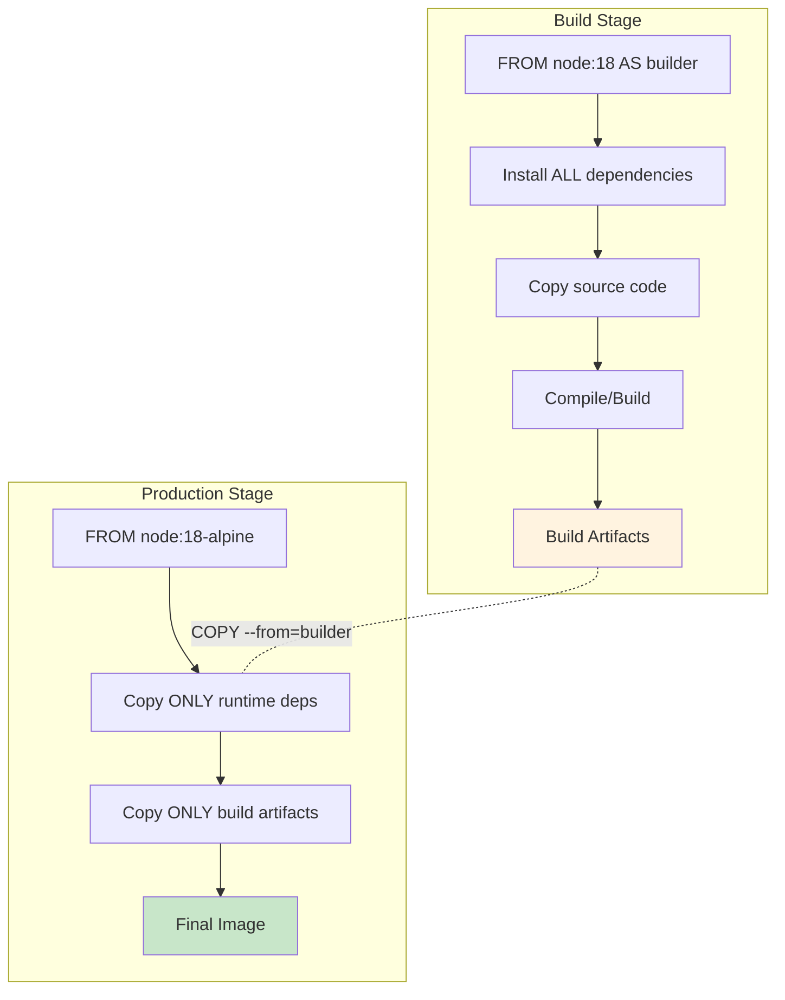

# Multi-Stage Docker Builds

Multi-stage builds allow you to use multiple `FROM` statements in your Dockerfile, enabling you to create smaller, more secure production images by separating build dependencies from runtime dependencies.

## Why Multi-Stage Builds?

### The Problem Without Multi-Stage Builds

```dockerfile
# Traditional single-stage build
FROM node:18

WORKDIR /app

# Install ALL dependencies (including build tools)
COPY package*.json ./
RUN npm install

# Copy source and build
COPY . .
RUN npm run build

# Runtime (includes build tools, source files, node_modules)
CMD ["node", "dist/index.js"]

# Result: Large image with unnecessary build artifacts
```

**Problems:**
- ❌ Large image size (includes build tools)
- ❌ Security risks (unnecessary packages)
- ❌ Slower deployment
- ❌ More attack surface

### The Solution: Multi-Stage Builds

```dockerfile
# Build stage
FROM node:18 AS builder
WORKDIR /app
COPY package*.json ./
RUN npm install
COPY . .
RUN npm run build

# Production stage
FROM node:18-alpine
WORKDIR /app
COPY --from=builder /app/dist ./dist
COPY --from=builder /app/node_modules ./node_modules
CMD ["node", "dist/index.js"]

# Result: Small, secure production image
```

**Benefits:**
- ✅ Smaller final image
- ✅ Faster transfers and deployments
- ✅ Better security
- ✅ Cleaner separation of concerns

## Multi-Stage Build Workflow



## Basic Multi-Stage Build Examples

### Example 1: Node.js Application

```dockerfile
# Stage 1: Build
FROM node:18 AS build
WORKDIR /app

# Copy package files
COPY package*.json ./

# Install ALL dependencies (including devDependencies)
RUN npm ci

# Copy source
COPY . .

# Build application
RUN npm run build

# Stage 2: Production
FROM node:18-alpine
WORKDIR /app

# Copy only production dependencies
COPY package*.json ./
RUN npm ci --only=production

# Copy built artifacts from build stage
COPY --from=build /app/dist ./dist

# Set user
RUN addgroup -g 1001 -S nodejs && \
    adduser -S nodejs -u 1001
USER nodejs

EXPOSE 3000
CMD ["node", "dist/index.js"]
```

**Size comparison:**
- Single stage: ~950MB
- Multi-stage: ~150MB

### Example 2: Go Application

```dockerfile
# Stage 1: Build
FROM golang:1.21-alpine AS builder

WORKDIR /app

# Copy go mod files
COPY go.mod go.sum ./
RUN go mod download

# Copy source
COPY . .

# Build binary
RUN CGO_ENABLED=0 GOOS=linux go build -a -installsuffix cgo -o main .

# Stage 2: Runtime
FROM alpine:latest

RUN apk --no-cache add ca-certificates

WORKDIR /root/

# Copy only the binary
COPY --from=builder /app/main .

EXPOSE 8080
CMD ["./main"]
```

**Size comparison:**
- With go:1.21: ~800MB
- Multi-stage with alpine: ~15MB

### Example 3: Python Application

```dockerfile
# Stage 1: Build
FROM python:3.11 AS builder

WORKDIR /app

# Install build dependencies
RUN apt-get update && apt-get install -y --no-install-recommends \
    gcc \
    && rm -rf /var/lib/apt/lists/*

# Install Python dependencies
COPY requirements.txt .
RUN pip install --user --no-cache-dir -r requirements.txt

# Stage 2: Runtime
FROM python:3.11-slim

WORKDIR /app

# Copy Python dependencies from builder
COPY --from=builder /root/.local /root/.local

# Copy application
COPY . .

# Make sure scripts in .local are usable
ENV PATH=/root/.local/bin:$PATH

EXPOSE 8000
CMD ["python", "app.py"]
```

### Example 4: Java Maven Application

```dockerfile
# Stage 1: Build
FROM maven:3.9-eclipse-temurin-17 AS build

WORKDIR /app

# Copy pom.xml and download dependencies (cached layer)
COPY pom.xml .
RUN mvn dependency:go-offline

# Copy source and build
COPY src ./src
RUN mvn package -DskipTests

# Stage 2: Runtime
FROM eclipse-temurin:17-jre-alpine

WORKDIR /app

# Copy only the JAR from build stage
COPY --from=build /app/target/*.jar app.jar

EXPOSE 8080
ENTRYPOINT ["java", "-jar", "app.jar"]
```

## Advanced Multi-Stage Patterns

### Pattern 1: Multiple Build Stages for Different Components

```dockerfile
# Stage 1: Build frontend
FROM node:18 AS frontend-build
WORKDIR /app/frontend
COPY frontend/package*.json ./
RUN npm ci
COPY frontend/ ./
RUN npm run build

# Stage 2: Build backend
FROM golang:1.21 AS backend-build
WORKDIR /app/backend
COPY backend/go.* ./
RUN go mod download
COPY backend/ ./
RUN CGO_ENABLED=0 go build -o server

# Stage 3: Final image
FROM alpine:latest
WORKDIR /app

# Copy frontend build
COPY --from=frontend-build /app/frontend/dist ./static

# Copy backend binary
COPY --from=backend-build /app/backend/server ./

EXPOSE 8080
CMD ["./server"]
```

### Pattern 2: Development vs Production Stages

```dockerfile
# Base stage
FROM node:18 AS base
WORKDIR /app
COPY package*.json ./

# Development stage
FROM base AS development
RUN npm install
COPY . .
CMD ["npm", "run", "dev"]

# Build stage
FROM base AS build
RUN npm ci
COPY . .
RUN npm run build

# Production stage
FROM node:18-alpine AS production
WORKDIR /app
COPY --from=build /app/dist ./dist
COPY --from=build /app/node_modules ./node_modules
CMD ["node", "dist/index.js"]
```

Build specific target:
```bash
# Development
docker build --target development -t myapp:dev .

# Production
docker build --target production -t myapp:prod .
# Or simply (production is last stage)
docker build -t myapp:prod .
```

### Pattern 3: Using External Images as Stages

```dockerfile
# Use pre-built image as a stage
FROM my-company/base-builder:latest AS builder
WORKDIR /app
COPY . .
RUN make build

# Final stage
FROM alpine:latest
COPY --from=builder /app/build/app ./app
CMD ["./app"]

# Can also copy from any image
FROM scratch
COPY --from=nginx:latest /etc/nginx/nginx.conf /nginx.conf
COPY --from=busybox:latest /bin/sh /bin/sh
```

### Pattern 4: Testing Stage

```dockerfile
# Base
FROM python:3.11 AS base
WORKDIR /app
COPY requirements.txt .
RUN pip install -r requirements.txt

# Test stage
FROM base AS test
COPY requirements-test.txt .
RUN pip install -r requirements-test.txt
COPY . .
RUN pytest

# Production (only built if tests pass)
FROM base AS production
COPY . .
CMD ["python", "app.py"]
```

## Build Arguments in Multi-Stage Builds

```dockerfile
# Define build arguments
ARG NODE_VERSION=18
ARG ALPINE_VERSION=3.18

# Use in FROM statements
FROM node:${NODE_VERSION} AS builder
WORKDIR /app
COPY package*.json ./
RUN npm ci
COPY . .
RUN npm run build

FROM alpine:${ALPINE_VERSION}
RUN apk add --no-cache nodejs npm
WORKDIR /app
COPY --from=builder /app/dist ./dist
CMD ["node", "dist/index.js"]
```

Build with custom arguments:
```bash
docker build \
  --build-arg NODE_VERSION=20 \
  --build-arg ALPINE_VERSION=3.19 \
  -t myapp .
```

## Optimization Techniques

### 1. Order Stages for Maximum Caching

```dockerfile
# ✅ Good: Frequently changing stages last
FROM node:18 AS deps
COPY package*.json ./
RUN npm ci

FROM node:18 AS build
COPY --from=deps /app/node_modules ./node_modules
COPY . .
RUN npm run build

FROM node:18-alpine
COPY --from=deps /app/node_modules ./node_modules
COPY --from=build /app/dist ./dist
```

### 2. Minimize Copied Files

```dockerfile
# ❌ Copies everything including source
COPY --from=builder /app /app

# ✅ Copy only what's needed
COPY --from=builder /app/dist ./dist
COPY --from=builder /app/package*.json ./
```

### 3. Use Specific Tags

```dockerfile
# ❌ Unpredictable
FROM node:latest AS builder

# ✅ Specific and reproducible
FROM node:18.17.0-alpine3.18 AS builder
```

### 4. Combine with .dockerignore

```
# .dockerignore
node_modules
npm-debug.log
.git
.env
*.md
tests/
.vscode/
```

## Real-World Examples

### React + Express Application

```dockerfile
# Stage 1: Build React frontend
FROM node:18-alpine AS frontend-build
WORKDIR /app/client
COPY client/package*.json ./
RUN npm ci
COPY client/ ./
RUN npm run build

# Stage 2: Prepare Express backend
FROM node:18-alpine AS backend-deps
WORKDIR /app
COPY server/package*.json ./
RUN npm ci --only=production

# Stage 3: Final image
FROM node:18-alpine
WORKDIR /app

# Copy backend dependencies
COPY --from=backend-deps /app/node_modules ./node_modules

# Copy backend code
COPY server/ ./

# Copy frontend build to be served by Express
COPY --from=frontend-build /app/client/build ./client/build

ENV NODE_ENV=production
EXPOSE 3000
CMD ["node", "index.js"]
```

### Rust Application

```dockerfile
# Build stage
FROM rust:1.75 AS builder
WORKDIR /app

# Cache dependencies
COPY Cargo.toml Cargo.lock ./
RUN mkdir src && \
    echo "fn main() {}" > src/main.rs && \
    cargo build --release && \
    rm -rf src

# Build actual application
COPY src ./src
RUN cargo build --release

# Runtime stage
FROM debian:bookworm-slim
RUN apt-get update && \
    apt-get install -y ca-certificates && \
    rm -rf /var/lib/apt/lists/*

COPY --from=builder /app/target/release/myapp /usr/local/bin/myapp

CMD ["myapp"]
```

### WordPress with Custom Theme

```dockerfile
# Build theme assets
FROM node:18-alpine AS theme-build
WORKDIR /theme
COPY wp-content/themes/mytheme/package*.json ./
RUN npm ci
COPY wp-content/themes/mytheme/ ./
RUN npm run build

# Final WordPress image
FROM wordpress:6.4-php8.2-apache
COPY --from=theme-build /theme/dist /var/www/html/wp-content/themes/mytheme
```

## Debugging Multi-Stage Builds

### Build and Inspect Specific Stage

```bash
# Build up to a specific stage
docker build --target builder -t myapp:builder .

# Run that stage interactively
docker run -it myapp:builder sh

# Inspect the stage
docker history myapp:builder
```

### View All Build Stages

```bash
# Build with plain output
docker build --progress=plain . 2>&1 | tee build.log

# See intermediate images
docker images -a
```

### Copy Files from Build Stage for Inspection

```dockerfile
# Add debugging stage
FROM builder AS debug
RUN ls -la /app && \
    cat /app/build/output.log
```

## Build Performance Tips

### 1. Use BuildKit
```bash
# Enable BuildKit (faster builds)
DOCKER_BUILDKIT=1 docker build -t myapp .
```

### 2. Parallel Stage Building
BuildKit builds independent stages in parallel automatically:

```dockerfile
# These build in parallel
FROM alpine AS stage1
RUN expensive-operation-1

FROM alpine AS stage2
RUN expensive-operation-2

# This waits for both
FROM alpine
COPY --from=stage1 /output1 ./
COPY --from=stage2 /output2 ./
```

### 3. Mount Caches

```dockerfile
# Cache package manager downloads
FROM node:18 AS builder
WORKDIR /app
COPY package*.json ./
RUN --mount=type=cache,target=/root/.npm \
    npm ci
```

## Common Mistakes to Avoid

### ❌ Mistake 1: Not Minimizing Final Stage

```dockerfile
# Bad: Copying entire build directory
COPY --from=builder /app /app

# Good: Copy only necessary files
COPY --from=builder /app/dist ./dist
COPY --from=builder /app/node_modules ./node_modules
```

### ❌ Mistake 2: Running as Root

```dockerfile
# Bad: Running as root
FROM alpine
COPY --from=builder /app/binary ./
CMD ["./binary"]

# Good: Create and use non-root user
FROM alpine
RUN addgroup -S appgroup && adduser -S appuser -G appgroup
USER appuser
COPY --from=builder /app/binary ./
CMD ["./binary"]
```

### ❌ Mistake 3: Not Using Specific Base Images

```dockerfile
# Bad: Generic base image in final stage
FROM ubuntu

# Good: Minimal specific image
FROM gcr.io/distroless/static-debian12
```

## Next Steps

- Explore [Docker Registry](../04-Docker-Registry/README.md) for image distribution
- Learn about [Docker Security](../../Advanced/01-Docker-Security/README.md)
- Combine with [Docker Compose](../../Docker-Compose/Beginner/01-Basics/README.md)

## Resources

- [Multi-stage Builds Documentation](https://docs.docker.com/build/building/multi-stage/)
- [BuildKit](https://docs.docker.com/build/buildkit/)
- [Dockerfile Best Practices](https://docs.docker.com/develop/develop-images/dockerfile_best-practices/)
- [Distroless Images](https://github.com/GoogleContainerTools/distroless)

---

**[← Previous: Docker Volumes](../02-Docker-Volumes/README.md)** | **[Next: Docker Registry →](../04-Docker-Registry/README.md)**
