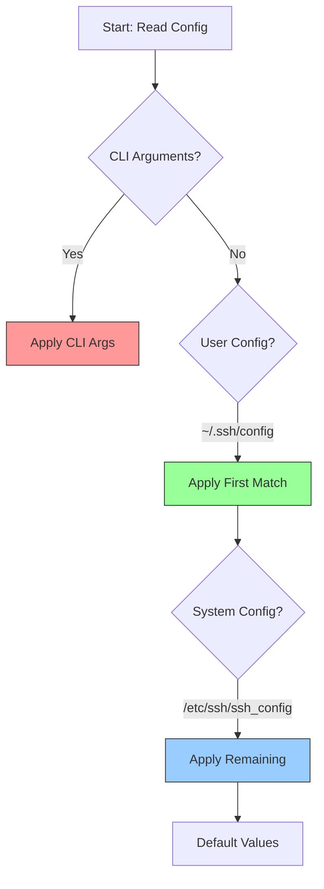

# SSH Configuration

Complete guide to SSH client and server configuration for optimal security and performance.

## SSH Server Configuration

### Main Configuration File
```bash
# Location: /etc/ssh/sshd_config

# Network settings
Port 2222
AddressFamily inet
ListenAddress 0.0.0.0
Protocol 2

# Authentication
PermitRootLogin no
PasswordAuthentication no
PubkeyAuthentication yes
AuthorizedKeysFile .ssh/authorized_keys
PermitEmptyPasswords no
ChallengeResponseAuthentication no

# Security settings
MaxAuthTries 3
MaxSessions 2
MaxStartups 10:30:100
LoginGraceTime 60
ClientAliveInterval 300
ClientAliveCountMax 2

# Disable unused features
X11Forwarding no
AllowTcpForwarding yes
GatewayPorts no
PermitTunnel no

# Logging
SyslogFacility AUTH
LogLevel INFO

# Subsystems
Subsystem sftp /usr/lib/openssh/sftp-server
```

### User and Group Restrictions
```bash
# Allow specific users only
AllowUsers deploy admin monitoring

# Allow specific groups
AllowGroups ssh-users administrators

# Deny specific users
DenyUsers guest test

# Match blocks for conditional configuration
Match User deploy
    AllowTcpForwarding yes
    X11Forwarding no
    ForceCommand /usr/local/bin/deploy-shell

Match Group developers
    AllowTcpForwarding yes
    PermitTunnel yes
    
Match Address 192.168.1.0/24
    PasswordAuthentication yes
    MaxAuthTries 6
```

### Advanced Server Options
```bash
# Compression
Compression delayed

# Keep alive settings
TCPKeepAlive yes
ClientAliveInterval 300
ClientAliveCountMax 2

# Performance tuning
MaxStartups 10:30:100
MaxSessions 10

# Security enhancements
StrictModes yes
IgnoreRhosts yes
HostbasedAuthentication no
PermitUserEnvironment no
AcceptEnv LANG LC_*

# Banner and MOTD
Banner /etc/ssh/banner
PrintMotd yes
PrintLastLog yes
```

## SSH Client Configuration

### Global Client Configuration
# Location: /etc/ssh/ssh_config

#### Configuration Precedence & "First Match Wins"
SSH uses a **First Match Wins** strategy for `Host` blocks. If multiple blocks match a hostname, the *first* one sets the parameters. This allows you to set specific defaults first, and general defaults last.



```bash
Host *
    Protocol 2
    ForwardAgent no
    ForwardX11 no
    PasswordAuthentication yes
    HostbasedAuthentication no
    GSSAPIAuthentication no
    GSSAPIDelegateCredentials no
    BatchMode no
    CheckHostIP yes
    AddressFamily any
    ConnectTimeout 30
    StrictHostKeyChecking ask
    IdentityFile ~/.ssh/id_rsa
    IdentityFile ~/.ssh/id_ed25519
    Port 22
    Cipher aes128-ctr,aes192-ctr,aes256-ctr
    MACs hmac-sha2-256,hmac-sha2-512
```

### User Client Configuration
```bash
# Location: ~/.ssh/config

# Production servers
Host prod-*
    User deploy
    Port 2222
    IdentityFile ~/.ssh/prod_key
    IdentitiesOnly yes
    StrictHostKeyChecking yes
    UserKnownHostsFile ~/.ssh/known_hosts_prod

# Development servers
Host dev-*
    User developer
    Port 22
    IdentityFile ~/.ssh/dev_key
    StrictHostKeyChecking no
    UserKnownHostsFile /dev/null

# Jump host configuration
Host jump
    HostName jump.example.com
    User admin
    Port 2222
    IdentityFile ~/.ssh/jump_key
    ControlMaster auto
    ControlPath ~/.ssh/control-%r@%h:%p
    ControlPersist 10m

# Servers behind jump host
Host internal-*
    ProxyJump jump
    User admin
    IdentityFile ~/.ssh/internal_key

# Specific server configurations
Host database-server
    HostName db.internal.example.com
    User dbadmin
    Port 3306
    LocalForward 3306 localhost:3306
    IdentityFile ~/.ssh/db_key

Host web-cluster
    HostName web*.example.com
    User webadmin
    IdentityFile ~/.ssh/web_key
    RequestTTY no
    RemoteCommand /opt/scripts/health-check.sh
```

### Connection Multiplexing
```bash
# Enable connection sharing
Host *
    ControlMaster auto
    ControlPath ~/.ssh/control-%r@%h:%p
    ControlPersist 10m

# Specific multiplexing configuration
Host production-cluster
    HostName prod*.example.com
    ControlMaster auto
    ControlPath ~/.ssh/control-prod-%r@%h:%p
    ControlPersist 1h
    ServerAliveInterval 60
    ServerAliveCountMax 3
```

## Security Configuration

### Cryptographic Settings
```bash
# Strong ciphers only
Ciphers chacha20-poly1305@openssh.com,aes256-gcm@openssh.com,aes128-gcm@openssh.com,aes256-ctr,aes192-ctr,aes128-ctr

# Strong MACs
MACs hmac-sha2-256-etm@openssh.com,hmac-sha2-512-etm@openssh.com,hmac-sha2-256,hmac-sha2-512

# Strong key exchange algorithms
KexAlgorithms curve25519-sha256@libssh.org,diffie-hellman-group16-sha512,diffie-hellman-group18-sha512,diffie-hellman-group14-sha256

# Host key algorithms
HostKeyAlgorithms ssh-ed25519,ssh-rsa,ecdsa-sha2-nistp256,ecdsa-sha2-nistp384,ecdsa-sha2-nistp521

# Public key algorithms
PubkeyAcceptedKeyTypes ssh-ed25519,ssh-rsa,ecdsa-sha2-nistp256,ecdsa-sha2-nistp384,ecdsa-sha2-nistp521
```

### Two-Factor Authentication
```bash
# Install Google Authenticator PAM module
sudo apt install libpam-google-authenticator  # Ubuntu/Debian
sudo yum install google-authenticator-libpam  # RHEL/CentOS

# Configure PAM
# /etc/pam.d/sshd
auth required pam_google_authenticator.so

# SSH configuration for 2FA
AuthenticationMethods publickey,keyboard-interactive
ChallengeResponseAuthentication yes
UsePAM yes

# Per-user 2FA setup
google-authenticator
```

### Certificate-Based Authentication
```bash
# Generate CA key
ssh-keygen -t ed25519 -f ssh_ca_key

# Sign user certificate
ssh-keygen -s ssh_ca_key -I user@example.com -n user -V +52w ~/.ssh/id_ed25519.pub

# Sign host certificate
ssh-keygen -s ssh_ca_key -I host.example.com -h -n host.example.com -V +52w /etc/ssh/ssh_host_ed25519_key.pub

# Server configuration for certificates
TrustedUserCAKeys /etc/ssh/trusted_user_ca_keys.pub
HostCertificate /etc/ssh/ssh_host_ed25519_key-cert.pub

# Client configuration for certificates
Host *.example.com
    CertificateFile ~/.ssh/id_ed25519-cert.pub
```

## Performance Optimization

### Connection Optimization
```bash
# Client-side optimization
Host *
    Compression yes
    CompressionLevel 6
    ServerAliveInterval 60
    ServerAliveCountMax 3
    TCPKeepAlive yes
    
# Connection multiplexing
Host production-*
    ControlMaster auto
    ControlPath ~/.ssh/control-%r@%h:%p
    ControlPersist 10m

# Disable DNS lookups (server-side)
UseDNS no

# Optimize authentication
GSSAPIAuthentication no
```

### Bandwidth Optimization
```bash
# Enable compression for slow connections
Host slow-connection
    Compression yes
    CompressionLevel 9

# Disable compression for fast connections
Host fast-connection
    Compression no

# Optimize cipher selection for performance
Host high-throughput
    Ciphers aes128-gcm@openssh.com,chacha20-poly1305@openssh.com
```

## Environment-Specific Configurations

### Development Environment
```bash
# ~/.ssh/config for development
Host dev-*
    User developer
    IdentityFile ~/.ssh/dev_key
    StrictHostKeyChecking no
    UserKnownHostsFile /dev/null
    LogLevel QUIET
    ForwardAgent yes
    
Host vagrant
    HostName 127.0.0.1
    Port 2222
    User vagrant
    IdentityFile ~/.vagrant.d/insecure_private_key
    StrictHostKeyChecking no
    UserKnownHostsFile /dev/null
```

### Production Environment
```bash
# ~/.ssh/config for production
Host prod-*
    User deploy
    Port 2222
    IdentityFile ~/.ssh/prod_key
    IdentitiesOnly yes
    StrictHostKeyChecking yes
    UserKnownHostsFile ~/.ssh/known_hosts_prod
    LogLevel INFO
    ForwardAgent no
    
# Bastion host configuration
Host bastion
    HostName bastion.prod.example.com
    User admin
    Port 2222
    IdentityFile ~/.ssh/bastion_key
    ControlMaster auto
    ControlPath ~/.ssh/control-bastion-%r@%h:%p
    ControlPersist 1h

# Production servers via bastion
Host prod-web-*
    ProxyJump bastion
    User webadmin
    IdentityFile ~/.ssh/web_key
    
Host prod-db-*
    ProxyJump bastion
    User dbadmin
    IdentityFile ~/.ssh/db_key
```

### Cloud Provider Configurations
```bash
# AWS EC2 instances
Host *.amazonaws.com
    User ec2-user
    IdentityFile ~/.ssh/aws_key.pem
    StrictHostKeyChecking no
    
Host i-*
    User ec2-user
    IdentityFile ~/.ssh/aws_key.pem
    ProxyCommand aws ssm start-session --target %h --document-name AWS-StartSSHSession --parameters 'portNumber=%p'

# Azure VMs
Host *.cloudapp.azure.com
    User azureuser
    IdentityFile ~/.ssh/azure_key
    
# Google Cloud instances
Host *.googleusercontent.com
    User gcp-user
    IdentityFile ~/.ssh/gcp_key
```

## Logging and Monitoring Configuration

### Enhanced Logging
```bash
# Server-side logging
LogLevel VERBOSE
SyslogFacility AUTH

# Client-side logging
Host *
    LogLevel INFO
    
Host debug-*
    LogLevel DEBUG3
```

### Audit Configuration
```bash
# Enable detailed logging
LogLevel VERBOSE

# Log all commands (server-side)
ForceCommand /usr/local/bin/ssh-audit-wrapper

# Session recording
Match User audit-user
    ForceCommand /usr/bin/script -f -q /var/log/ssh-sessions/session-$(date +%Y%m%d-%H%M%S)-${USER}.log
```

## Configuration Validation

### Test Configuration
```bash
# Test SSH server configuration
sudo sshd -t

# Test with specific config file
sudo sshd -t -f /etc/ssh/sshd_config.new

# Test client configuration
ssh -F ~/.ssh/config.new -T git@github.com

# Verbose connection testing
ssh -v user@host
ssh -vv user@host  # More verbose
ssh -vvv user@host # Maximum verbosity
```

### Configuration Backup
```bash
#!/bin/bash
# backup-ssh-config.sh

BACKUP_DIR="/backup/ssh-config"
DATE=$(date +%Y%m%d_%H%M%S)

mkdir -p $BACKUP_DIR

# Backup server configuration
sudo cp /etc/ssh/sshd_config $BACKUP_DIR/sshd_config_$DATE
sudo cp -r /etc/ssh/ssh_host_* $BACKUP_DIR/

# Backup client configuration
cp ~/.ssh/config $BACKUP_DIR/ssh_config_$DATE 2>/dev/null || true
cp /etc/ssh/ssh_config $BACKUP_DIR/ssh_config_global_$DATE

echo "SSH configuration backed up to $BACKUP_DIR"
```

This comprehensive configuration guide ensures secure and optimized SSH operations across all environments.