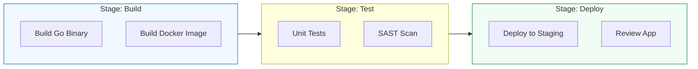

# 🏗️ GitLab CI: The All-in-One Powerhouse

> **"If GitHub Actions is an integrated tool, GitLab CI is an integrated universe. It doesn't just run your builds; it manages your registries, your security, and your environments in a single pane of glass."**

---

## 🧠 The Mental Model: The All-in-One Powerhouse

**The Junior Struggle**: Putting everything in one giant `.gitlab-ci.yml` file. They don't use the GitLab Container Registry, so they waste time pushing images to external tools, and they get confused by the difference between "Artifacts" and "Cache."

**The Engineer Solution**: Use **Pipeline Modularization**.

Think of GitLab CI like a **High-End Swiss Army Knife**:
1.  **The Blade (The YAML)**: Sharp, precise, and handles everything from Linting to Deployment.
2.  **The Built-ins (Registries)**: You don't need a separate backpack to carry your tools (Docker Images/Packages); the knife has a built-in compartment for them (GitLab Registry).
3.  **The Safety Gate (Environments)**: The knife has a lock (Environment Protections) that prevents it from closing on your fingers (deploying to production without approval).

---

### 🎨 Visual: The GitLab Pipeline Flow

---

## 🆚 Junior Way vs. Engineer Way

| Feature | The Junior Way (Problematic) | The Engineer Way (Production-ready) |
|:---|:---|:---|
| **Structure** | One 500-line YAML file | Using **Includes** to split logic |
| **Logic** | Repeated code for every job | Using **`extends`** and **`yaml anchors`** |
| **Artifacts** | Manually downloading binaries | Automated **Artifact** passing |
| **Registry** | External Docker Hub (Slower) | **Integrated GitLab Container Registry** |
| **Runners** | Public Shared Runners only | **Private Runners** (Pinned to internal network) |
| **Secrets** | Group-level variables (Too broad) | **Scoped Variables** (Staging vs. Prod) |

---

## 📦 Artifacts vs. Cache: The Clear Distinction

This is the #1 point of confusion for DevOps engineers.

1.  **Artifacts (The Product)**: Used to pass data **between different stages**. 
    *   *Example*: The Build stage creates a `.zip` file. The Deploy stage needs that *exact* file. 
    *   *Persistence*: Usually stored for days/weeks.

2.  **Cache (The Speed)**: Used to speed up the **same stage** in future runs. 
    *   *Example*: Downloading `node_modules`. Instead of downloading them every time, we cache them for the next time the pipeline runs. 
    *   *Persistence*: Can be cleared at any time without breaking the build.

---

## 🎤 Interview Preparation

### 🎯 Core Concepts
1. **Q: What is the purpose of the `.gitlab-ci.yml` file?**
   - *A: It is the single source of truth for the entire pipeline. It defines the stages, the jobs, the triggers, and the environments in a declarative YAML format.*

2. **Q: What are GitLab Runners?**
   - *A: These are the lightweight agents (written in Go) that actually execute the jobs. They can be installed on local servers, in the cloud, or even on a developer's laptop to run jobs locally for testing.*

3. **Q: How do "Stages" and "Jobs" interact in GitLab?**
   - *A: A **Stage** is a logical phase (e.g., Build, Test). A **Job** is a specific task within that stage. Jobs within the same stage run in parallel, while stages run sequentially.*

### 🚀 Advanced Questions
4. **Q: What are "Review Apps" in GitLab CI?**
   - *A: A powerful feature where GitLab spins up a temporary, live version of your application for every Merge Request. This allows stakeholders to see the changes in a real browser before the code is merged.*

5. **Q: How do you handle "Variables" securely for different environments?**
   - *A: Using **CI/CD Variables** in the project settings. We use "Protected Variables" for production keys (so they are only available on the main branch) and "Masked Variables" to ensure they never show up in the logs.*

---

## 📝 Knowledge Check

1. **How do you define a job that should only run on the 'main' branch?**
   - [ ] a) `on: branch main`
   - [x] b) `rules: - if: $CI_COMMIT_BRANCH == "main"`
   - [ ] c) `only: main_only`

2. **True/False: All jobs in the same stage run simultaneously by default.**
   - [x] **True**. This is why we use distinct stages for sequential flow.

3. **Which GitLab feature automatically builds and tests code with zero configuration?**
   - [x] **Auto DevOps**.

---

## 🎯 Next Steps
*   **[CHALLENGES](./CHALLENGES.md)**: Practice artifact passing and environments.
*   **[Artifact Registry Management](../../04-Artifact-Registry-Management/README.md)**: Storing and versioning binaries.
