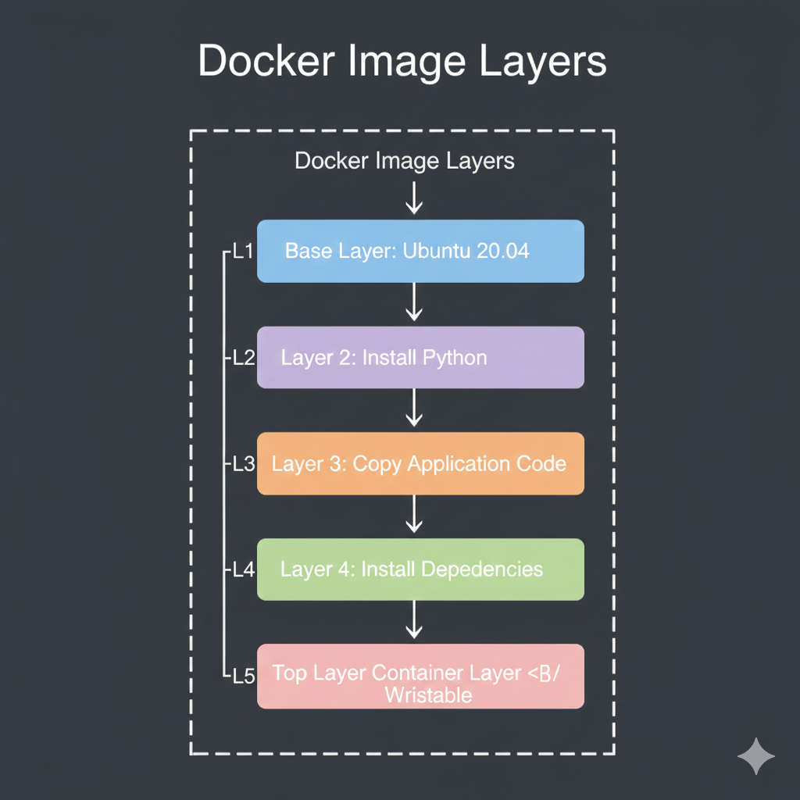
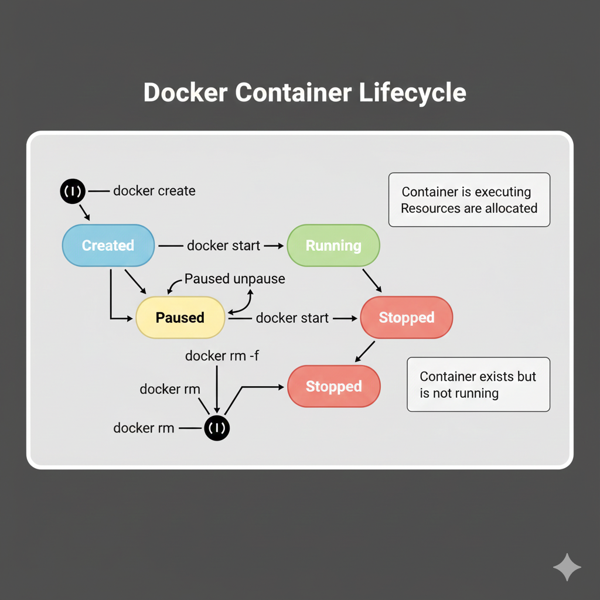

# Docker Images and Containers

---

## 🎯 Learning Objectives

- Manage Docker Image lifecycles (pull, tag, remove)
- Run, stop, and inspect containers
- Persist data using Docker Volumes
- Map ports between host and container
- Debug container issues using logs

## 📖 Understanding Docker Images

A **Docker image** is a lightweight, standalone, executable package that includes everything needed to run a piece of software: code, runtime, system tools, libraries, and settings.

### Key Characteristics

- **Read-only**: Images are immutable after creation
- **Layered**: Built in layers for efficiency
- **Reusable**: Can create multiple containers from one image
- **Versionable**: Tagged for version control
- **Portable**: Can be shared via registries

### Image Layers

Docker images are built in layers, and each layer represents a change or instruction:


**Benefits of Layering:**
- **Caching**: Unchanged layers are reused
- **Efficiency**: Share common layers between images
- **Fast Builds**: Only rebuild changed layers
- **Small Updates**: Only transfer modified layers

## Working with Images

### Pulling Images from Docker Hub

```bash
# Pull specific image
docker pull nginx

# Pull specific version (tag)
docker pull nginx:1.25

# Pull from specific registry
docker pull ubuntu:22.04
```

### Listing Images

```bash
# List all local images
docker images

# Alternative command
docker image ls

# Show all images including intermediate layers
docker images -a

# Filter images
docker images nginx
docker images "nginx:*"
```

### Image Information

```bash
# Inspect detailed information
docker inspect nginx

# View image history (layers)
docker history nginx

# Show image size
docker images --format "{{.Repository}}:{{.Tag}} - {{.Size}}"
```

### Removing Images

```bash
# Remove specific image
docker rmi nginx

# Remove by image ID
docker rmi <image-id>

# Force remove (even if containers exist)
docker rmi -f nginx

# Remove all unused images
docker image prune

# Remove all images
docker rmi $(docker images -q)
```

> [!WARNING]
> Be careful when removing images. Ensure no containers are using them, or use the `-f` flag to force removal.

### Tagging Images

```bash
# Tag an image
docker tag nginx:latest myrepo/nginx:v1.0

# Tag with multiple tags
docker tag ubuntu:22.04 myubuntu:latest
docker tag ubuntu:22.04 myubuntu:22.04

# Retag for private registry
docker tag myapp:latest registry.example.com/myapp:v1.0
```

## Understanding Containers

A **container** is a running instance of an image. While images are immutable blueprints, containers are the running processes.

### Container Lifecycle


### Creating and Running Containers

```bash
# Run a container (pull + create + start)
docker run nginx

# Run in detached mode (background)
docker run -d nginx

# Run with custom name
docker run -d --name web-server nginx

# Run with port mapping
docker run -d -p 8080:80 nginx

# Run with environment variables
docker run -d -e MYSQL_ROOT_PASSWORD=secret mysql

# Run interactively
docker run -it ubuntu bash

# Run with automatic cleanup
docker run --rm nginx
```

**Common Options:**
- `-d`: Detached mode (background)
- `-p`: Port mapping (host:container)
- `--name`: Custom container name
- `-e`: Set environment variables
- `-it`: Interactive terminal
- `--rm`: Remove container after exit
- `-v`: Mount volumes

### Managing Running Containers

```bash
# List running containers
docker ps

# List all containers (including stopped)
docker ps -a

# List only container IDs
docker ps -q

# Show resource usage
docker stats

# Show running processes in container
docker top <container-name>
```

### Container Operations

```bash
# Start a stopped container
docker start <container-name>

# Stop a running container
docker stop <container-name>

# Restart a container
docker restart <container-name>

# Pause a container (freeze process)
docker pause <container-name>

# Unpause a container
docker unpause <container-name>

# Kill a container (force stop)
docker kill <container-name>

# Remove a container
docker rm <container-name>

# Remove a running container (force)
docker rm -f <container-name>
```

### Interacting with Containers

```bash
# Execute command in running container
docker exec <container-name> ls /app

# Get interactive shell
docker exec -it <container-name> bash
# or for Alpine-based images
docker exec -it <container-name> sh

# View container logs
docker logs <container-name>

# Follow logs (real-time)
docker logs -f <container-name>

# Show last 100 lines
docker logs --tail 100 <container-name>

# Copy files from container to host
docker cp <container-name>:/path/in/container /path/on/host

# Copy files from host to container
docker cp /path/on/host <container-name>:/path/in/container
```

### Inspecting Containers

```bash
# Full container information (JSON)
docker inspect <container-name>

# Get specific information
docker inspect -f '{{.State.Status}}' <container-name>
docker inspect -f '{{.NetworkSettings.IPAddress}}' <container-name>

# View port mappings
docker port <container-name>

# Resource usage statistics
docker stats <container-name>
```

## Practical Examples

### Example 1: Running a Web Server

```bash
# Run NGINX web server
docker run -d \
  --name my-website \
  -p 8080:80 \
  nginx:latest

# Verify it's running
docker ps

# Check logs
docker logs my-website

# Access the server
curl http://localhost:8080

# Stop and remove
docker stop my-website
docker rm my-website
```

### Example 2: Interactive Container

```bash
# Start Ubuntu container interactively
docker run -it --name my-ubuntu ubuntu:22.04 bash

# Inside container, run commands:
apt-get update
apt-get install -y curl
curl --version
exit

# Restart the same container
docker start -i my-ubuntu

# Clean up
docker rm my-ubuntu
```

### Example 3: Running MySQL Database

```bash
# Run MySQL with persistent data
docker run -d \
  --name mysql-db \
  -e MYSQL_ROOT_PASSWORD=mypassword \
  -e MYSQL_DATABASE=myapp \
  -p 3306:3306 \
  -v mysql-data:/var/lib/mysql \
  mysql:8.0

# Connect to MySQL
docker exec -it mysql-db mysql -uroot -pmypassword

# View logs
docker logs mysql-db

# Stop and remove (data persists in volume)
docker stop mysql-db
docker rm mysql-db
```

### Example 4: Temporary Test Container

```bash
# Run and auto-remove after exit
docker run --rm -it python:3.11 python

# Inside Python interpreter:
>>> print("Hello from Docker!")
>>> exit()

# Container is automatically removed
```

## Docker Hub

**Docker Hub** is the world's largest container image registry. It hosts millions of images from the community.

### Searching for Images

```bash
# Search from command line
docker search nginx

# Search with filters
docker search --filter stars=100 nginx
docker search --filter is-official=true nginx
```

### Using Official Images

Official images are:
- ✅ Curated by Docker
- ✅ Well-documented
- ✅ Regularly updated
- ✅ Security scanned

Popular official images:
- `nginx` - Web server
- `mysql`, `postgres` - Databases
- `redis` - Caching
- `node`, `python`, `java` - Programming languages
- `ubuntu`, `alpine` - Base OS images

### Image Tags

Tags are used to version images:

```bash
# Latest version (default)
docker pull nginx:latest

# Specific version
docker pull nginx:1.25

# Specific variant
docker pull nginx:alpine

# Multiple tags can point to same image
docker pull python:3.11
docker pull python:3.11.7
```

> [!IMPORTANT]
> Never use `latest` tag in production. Always specify exact versions for reproducibility.

### Pulling from Private Registries

```bash
# Login to Docker Hub
docker login

# Login to private registry
docker login registry.example.com

# Pull private image
docker pull registry.example.com/myapp:v1.0

# Logout
docker logout
```

## Container Storage and Data

Containers have two types of storage:

### 1. Writable Layer (Temporary)

- Created when container starts
- Deleted when container is removed
- Not shared between containers
- Poor I/O performance

### 2. Volumes (Persistent)

```bash
# Create named volume
docker volume create my-data

# Run container with volume
docker run -d -v my-data:/data nginx

# List volumes
docker volume ls

# Inspect volume
docker volume inspect my-data

# Remove volume
docker volume rm my-data

# Remove unused volumes
docker volume prune
```

### Bind Mounts

```bash
# Mount host directory into container
docker run -d \
  -v /path/on/host:/path/in/container \
  nginx

# Mount current directory
docker run -d \
  -v $(pwd):/app \
  node:18
```

## Resource Management

### CPU Limits

```bash
# Limit to 0.5 CPUs
docker run -d --cpus="0.5" nginx

# Set CPU shares (relative weight)
docker run -d --cpu-shares=512 nginx
```

### Memory Limits

```bash
# Limit to 512MB
docker run -d -m 512m nginx

# Set memory + swap limit
docker run -d -m 512m --memory-swap=1g nginx
```

## Cleaning Up

### Remove Stopped Containers

```bash
# Remove all stopped containers
docker container prune

# Remove specific container
docker rm <container-name>

# Remove multiple containers
docker rm container1 container2 container3

# Remove all stopped containers (alternative)
docker rm $(docker ps -a -q -f status=exited)
```

### Complete Cleanup

```bash
# Remove all stopped containers
docker container prune

# Remove all unused images
docker image prune

# Remove all unused volumes
docker volume prune

# Remove all unused networks
docker network prune

# Remove everything unused
docker system prune

# Remove everything including volumes
docker system prune -a --volumes
```

> [!CAUTION]
> `docker system prune -a --volumes` will remove all unused containers, images, networks, and volumes. Make sure you have backups of important data!

## Best Practices

1. **Use Specific Tags**: Never rely on `latest` in production
2. **Name Your Containers**: Use `--name` for easier management
3. **Clean Up Regularly**: Remove unused containers and images
4. **Use Volumes for Data**: Don't store data in containers
5. **Check Resource Usage**: Monitor with `docker stats`
6. **Read Image Documentation**: Check Docker Hub for usage instructions
7. **Use Small Base Images**: Alpine variants are smaller
8. **One Process Per Container**: Follow the single responsibility principle

## Common Patterns

### Health Checks

```bash
docker run -d \
  --name web \
  --health-cmd="curl -f http://localhost/ || exit 1" \
  --health-interval=30s \
  --health-timeout=10s \
  --health-retries=3 \
  nginx
```

### Restart Policies

```bash
# Always restart
docker run -d --restart=always nginx

# Restart on failure
docker run -d --restart=on-failure nginx

# Restart unless stopped
docker run -d --restart=unless-stopped nginx
```

## Troubleshooting

### Container Won't Start

```bash
# Check logs
docker logs <container-name>

# Run in foreground to see errors
docker run nginx  # without -d

# Inspect container
docker inspect <container-name>
```

### Can't Connect to Container

```bash
# Check if container is running
docker ps

# Check port mappings
docker port <container-name>

# Get container IP
docker inspect -f '{{.NetworkSettings.IPAddress}}' <container-name>
```

### Container Using Too Much Resources

```bash
# Check resource usage
docker stats

# Limit resources
docker update --cpus="0.5" --memory="512m" <container-name>
```

## 🧪 Practical Labs

### Lab 1: Persistent Data Loss
**Scenario**: You restart your database container, and all the data is gone.
**Task**: persist the data.
**Solution**:
1.  **Cause**: Containers are ephemeral. Writes to the writable layer allow data loss.
2.  **Fix**: Use a Volume.
```bash
docker run -d -v my-db-data:/var/lib/mysql mysql
```

### Lab 2: Port Conflict
**Scenario**: You try to run a second web server but get `Bind for 0.0.0.0:80 failed: port is already allocated`.
**Task**: Run the second server alongside the first.
**Solution**:
1.  **Map to different host port**: Use `-p 8081:80` for the second container.

## 🧠 Knowledge Quiz

**1. What is the main difference between a Docker Image and a Docker Container?**
- A) Images are for Linux, Containers are for Windows
- B) An Image is a read-only template; a Container is a running instance of an image
- C) They are the same thing
- D) A Container is used to build an Image

**2. How do you map port 80 inside a container to port 8080 on your host machine?**
- A) `docker run -p 80:8080`
- B) `docker run -p 8080:80`
- C) `docker run --port 8080`
- D) `docker run -i 8080:80`

**3. Which command removes all unused containers, networks, and images (dangling)?**
- A) `docker system prune`
- B) `docker clean all`
- C) `docker rm -rf /`
- D) `docker system reset`

## 🔗 Next Steps

```bash
# Essential Commands Cheat Sheet
docker pull <image>                    # Download image
docker images                          # List images
docker run <image>                     # Create and start container
docker ps                              # List running containers
docker ps -a                           # List all containers
docker stop <container>                # Stop container
docker start <container>               # Start container
docker rm <container>                  # Remove container
docker rmi <image>                     # Remove image
docker logs <container>                # View logs
docker exec -it <container> bash       # Access container shell
docker inspect <container>             # Detailed info
docker stats                           # Resource usage
```

## Next Steps

Now that you understand images and containers, learn how to create your own:

→ Continue to [Dockerfile Basics](../03-Dockerfile-Basics/README.md)

## Resources

- [Docker Images Documentation](https://docs.docker.com/engine/reference/commandline/images/)
- [Docker Run Reference](https://docs.docker.com/engine/reference/run/)
- [Docker Hub](https://hub.docker.com/)
- [Best Practices for Images](https://docs.docker.com/develop/dev-best-practices/)

---

**[← Previous: Introduction](../01-Introduction/README.md)** | **[Next: Dockerfile Basics →](../03-Dockerfile-Basics/README.md)**