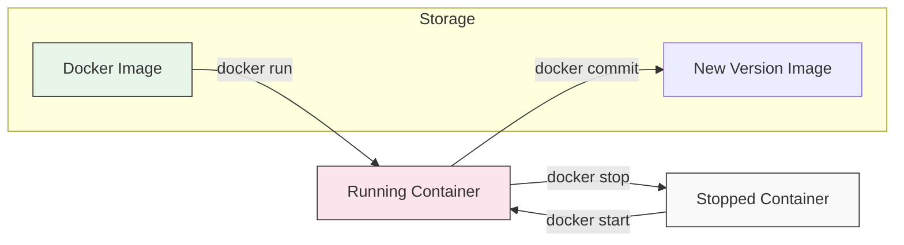

# 📦 Module 02: Images & Containers

> **"An image is your code's snapshot in time. A container is that snapshot coming to life."**



## 📚 Overview

If Docker is a kitchen, then an **Image** is the recipe book and a **Container** is the meal being cooked. In this module, we move from theory to practice, learning how to pull ready-made "recipes" from Docker Hub and start them as isolated "meals" on our system.

## 🎓 Learning Objectives

By the end of this module, you will:
- ✅ Master the **Image vs. Container** distinction.
- ✅ Understand **Layered File Systems** and caching.
- ✅ Command the **Lifecycle** (Run, Stop, Start, RM).
- ✅ Implement **Port Mapping** to access web apps.
- ✅ Use **Interactive Mode** to explore container internals.

---

## 🏗️ Images: The Read-Only Blueprints

A Docker Image is an immutable file that contains your application code, runtime, libraries, environment variables, and config files.


### The Power of Layers
Images are built in **Layers**. Every instruction in a Dockerfile adds a new layer.
- **Caching**: If you don't change the base layers, Docker reuses them, making builds near-instant.
- **Sharing**: If two images both use `Ubuntu` as a base, you only download that base once.

---

## 🏃 Containers: The Running Instances

A container is a lightweight, isolated process that runs an image. When you start a container, Docker adds a **thin writable layer** on top of the read-only image layers.


### Essential Command Toolkit

| Action | Command | DevOps Reality |
| :--- | :--- | :--- |
| **Pull** | `docker pull nginx` | Downloading the blueprint from the registry. |
| **Run** | `docker run -d nginx` | Starting a service in the background (**Detached**). |
| **Inspect** | `docker ps` | Checking which "Cattle" are currently healthy. |
| **Explore** | `docker exec -it <id> sh` | Opening a shell *inside* a running container. |
| **Destroy** | `docker rm -f <id>` | Terminating the container and its writable storage. |

---

## 🌐 Connecting the Dots: Port Mapping

Containers run in their own isolated network. To see a website running inside a container, you must "bridge" a port from your machine (Host) to the Container.

**Example**:
```bash
docker run -d -p 8080:80 --name my-web nginx
```
- **`-p 8080:80`**: Maps port `8080` on your laptop to port `80` inside Nginx.
- **`--name`**: Gives your container a friendly name instead of a random UUID.

---

## 🏆 Real-World DevOps Story: The Snowflake Container

**The Scenario**: A developer named Alex ran a database container. For 3 months, they manually logged into the container (`docker exec`) to update configurations and install plugins.
**The Crisis**: One morning, the host server rebooted. Because the container was ephemeral, all of Alex's manual changes were stored in the thin writable layer—which was destroyed on restart. 3 months of work vanished.
**The Fix**: Alex learned the "Immutable" rule. They moved all configurations into a **Dockerfile** and all data into a **Volume**. 
**The Lesson**: **Do not treat containers like servers.** If you find yourself manually changing things inside a running container, you are building a "Snowflake" that will eventually melt.

---

## 🚀 Professional Pattern: One Process, One Container

A common mistake for beginners is trying to run Nginx, Python, and MySQL all inside a single Docker container. This is an **Anti-Pattern**.

In a professional DevOps environment:
1.  **Isolation**: If the Database crashes, the Web Server should keep running.
2.  **Scaling**: If you have too many web users, you scale the *Web* container to 5 instances, not the whole stack.
3.  **Logs**: Docker is designed to track one primary process (PID 1). Multiple processes make debugging a nightmare.

**Rule**: 1 Container = 1 Service. Use **Docker Compose** (Module 04) to link them together.

---

## ❓ Interview Preparation (Images & Containers)

1. **Q: What happens to data stored in a container when it is stopped? What about when it's removed?**
   *A: When stopped, the data remains in the writable layer. When the container is **removed** (`rm`), that writable layer is deleted permanently. To persist data, you must use Volumes.*

2. **Q: What is 'Detached Mode' (`-d`) and why is it used?**
   *A: Detached mode runs the container in the background, freeing up your terminal. It is used for long-running services like web servers, databases, and monitoring tools.*

3. **Q: How can you differentiate between a 'Dangling' image and a 'Tagged' image?**
   *A: A dangling image has no name or tag (shows as `<none>:<none>`). This usually happens when you rebuild an image with the same name, and the old version becomes an orphan.*

4. **Q: Explain the command `docker exec -it <id> bash`.**
   *A: `exec` runs a new command in an existing container. `-i` (interactive) and `-t` (tty) allow you to interact with the container's shell (`bash`) as if you were logged into it.*

5. **Q: Why should you use specific tags like `python:3.9-slim` instead of `python:latest`?**
   *A: `-slim` results in a smaller, more secure image. Using a specific version (`3.9`) prevents 'Environment Drift' where `latest` might point to `3.10` tomorrow and break your code.*

---

## 📝 Knowledge Check

1. **Which command pulls an image from a registry without running it?**
   - [ ] a) `docker run`
   - [x] b) `docker pull`
   - [ ] c) `docker build`

2. **What does the `-p` flag do in `docker run -p 8080:80 nginx`?**
   - [ ] a) Sets a password for the container
   - [x] b) Maps port 8080 on the host to port 80 in the container
   - [ ] c) Limits the container to 80% CPU

3. **Which command shows ALL containers, including those that have crashed or stopped?**
   - [ ] a) `docker ps`
   - [x] b) `docker ps -a`
   - [ ] c) `docker ls`

4. **True or False: Docker Image layers are read-only.**
   - [x] True
   - [ ] False

5. **To enter a running container's shell, which command do you use?**
   - [ ] a) `docker attach`
   - [x] b) `docker exec -it <id> sh`
   - [ ] c) `docker run -it <image> sh`

---

## 🔗 Next Steps

The blueprints are clear. Now let's learn how to draw them.

Proceed to: **[Module 03: Dockerfile Basics](../03-Dockerfile-Basics/README.md)** →