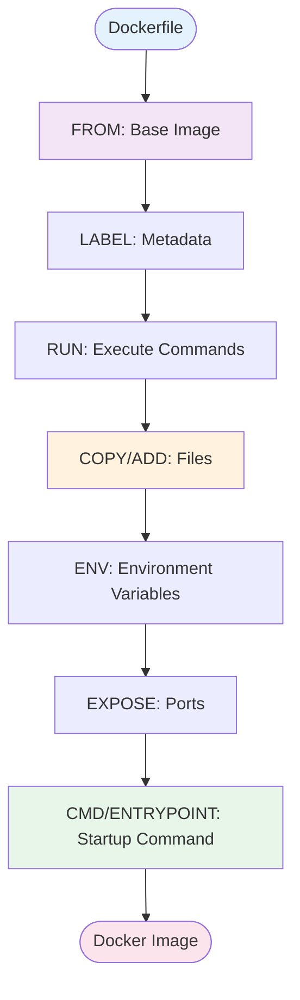
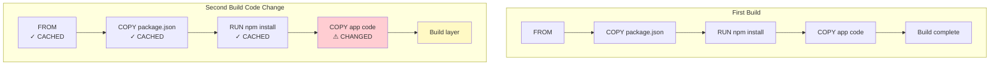

# Dockerfile Basics

## What is a Dockerfile?

A **Dockerfile** is a text file containing a series of instructions that Docker uses to automatically build an image. It's essentially a recipe for creating your custom Docker images.

### Key Benefits

- **Automation**: Repeatable, automated image builds
- **Version Control**: Track changes in your image build process
- **Documentation**: Self-documenting infrastructure
- **Consistency**: Same image every time you build
- **Portability**: Share your build process with others

## Dockerfile Structure

```dockerfile
# Comment
INSTRUCTION arguments
```



## Essential Dockerfile Instructions

### FROM - Base Image

**Every Dockerfile must start with FROM** (except multi-stage builds can have multiple FROM statements).

```dockerfile
# Use official image
FROM ubuntu:22.04

# Use specific version
FROM python:3.11-slim

# Use Alpine variant (smaller)
FROM node:18-alpine

# Start from scratch (empty base)
FROM scratch
```

> [!TIP]
> Use specific versions instead of `latest` for reproducible builds.

### RUN - Execute Commands

Executes commands during image build. Each RUN creates a new layer.

```dockerfile
# Single command
RUN apt-get update

# Multiple commands (bad practice - creates multiple layers)
RUN apt-get update
RUN apt-get install -y python3
RUN apt-get clean

# Multiple commands (best practice - single layer)
RUN apt-get update && \
    apt-get install -y python3 && \
    apt-get clean && \
    rm -rf /var/lib/apt/lists/*

# Using exec form
RUN ["apt-get", "install", "-y", "python3"]
```

### COPY and ADD - Adding Files

**COPY**: Simple file copying from host to image

```dockerfile
# Copy single file
COPY app.py /app/app.py

# Copy directory
COPY src/ /app/

# Copy multiple files
COPY package.json package-lock.json /app/

# Copy with wildcard
COPY *.py /app/

# Set ownership
COPY --chown=user:group app.py /app/
```

**ADD**: Like COPY but with extra features

```dockerfile
# Extract tar archives automatically
ADD app.tar.gz /app/

# Download from URL
ADD https://example.com/file.txt /app/

# Regular copy (prefer COPY for this)
ADD app.py /app/
```

> [!IMPORTANT]
> **Use COPY unless you specifically need ADD's features** (auto-extraction or URL download). COPY's behavior is more predictable.

### WORKDIR - Set Working Directory

Sets the working directory for subsequent instructions.

```dockerfile
# Set working directory
WORKDIR /app

# Creates directory if it doesn't exist
WORKDIR /app/src

# All subsequent COPY, RUN, CMD use this directory
COPY . .
RUN npm install
```

### ENV - Environment Variables

```dockerfile
# Set single variable
ENV NODE_ENV=production

# Set multiple variables
ENV APP_HOME=/app \
    APP_USER=appuser \
    APP_VERSION=1.0.0

# Use in subsequent instructions
ENV APP_DIR=/app
WORKDIR $APP_DIR
```

### EXPOSE - Document Ports

**Documenting** which ports the container listens on (doesn't actually publish them).

```dockerfile
# Single port
EXPOSE 80

# Multiple ports
EXPOSE 80 443

# With protocol
EXPOSE 8080/tcp
EXPOSE 53/udp
```

> [!NOTE]
> EXPOSE is documentation. You still need `-p` when running: `docker run -p 8080:80 myapp`

### CMD - Default Command

Provides defaults for executing container. **Only the last CMD is used.**

```dockerfile
# Exec form (recommended)
CMD ["python", "app.py"]

# Shell form
CMD python app.py

# As default parameters to ENTRYPOINT
CMD ["--debug"]
```

### ENTRYPOINT - Configure Container as Executable

```dockerfile
# Exec form (recommended)
ENTRYPOINT ["python", "app.py"]

# Shell form
ENTRYPOINT python app.py

# Combined with CMD
ENTRYPOINT ["python", "app.py"]
CMD ["--port", "8080"]
```

**Difference between CMD and ENTRYPOINT:**

```dockerfile
# CMD can be completely overridden
CMD ["app.py"]
# docker run myimage something.py → runs something.py

# ENTRYPOINT always runs, CMD provides defaults
ENTRYPOINT ["python"]
CMD ["app.py"]
# docker run myimage → runs python app.py
# docker run myimage test.py → runs python test.py
```

### ARG - Build Arguments

Variables only available during build (not in running container).

```dockerfile
# Define argument with default
ARG VERSION=1.0.0
ARG BUILD_DATE

# Use in Dockerfile
RUN echo "Building version $VERSION"

# Build with custom value
# docker build --build-arg VERSION=2.0.0 .
```

### LABEL - Metadata

```dockerfile
# Add metadata
LABEL maintainer="you@example.com"
LABEL version="1.0.0"
LABEL description="My awesome application"

# Multiple labels
LABEL version="1.0.0" \
      description="My app" \
      maintainer="you@example.com"
```

### USER - Set User

```dockerfile
# Create and switch to non-root user
RUN useradd -m appuser
USER appuser

# All subsequent RUN, CMD, ENTRYPOINT run as this user
```

### VOLUME - Mount Points

```dockerfile
# Declare volume mount point
VOLUME /data

# Multiple volumes
VOLUME ["/data", "/config"]
```

## Building Your First Dockerfile

### Example 1: Simple Python Application

**Project structure:**
```
myapp/
├── Dockerfile
├── app.py
└── requirements.txt
```

**app.py:**
```python
from flask import Flask
app = Flask(__name__)

@app.route('/')
def hello():
    return "Hello from Docker!"

if __name__ == '__main__':
    app.run(host='0.0.0.0', port=5000)
```

**requirements.txt:**
```
flask==2.3.0
```

**Dockerfile:**
```dockerfile
# Use official Python image
FROM python:3.11-slim

# Set working directory
WORKDIR /app

# Copy requirements first (for layer caching)
COPY requirements.txt .

# Install dependencies
RUN pip install --no-cache-dir -r requirements.txt

# Copy application code
COPY app.py .

# Expose port
EXPOSE 5000

# Set environment variable
ENV FLASK_APP=app.py

# Run application
CMD ["python", "app.py"]
```

**Build and run:**
```bash
# Build image
docker build -t my-python-app .

# Run container
docker run -d -p 5000:5000 --name myapp my-python-app

# Test
curl http://localhost:5000

# View logs
docker logs myapp

# Clean up
docker stop myapp
docker rm myapp
```

### Example 2: Node.js Application

**Dockerfile:**
```dockerfile
FROM node:18-alpine

# Set working directory
WORKDIR /app

# Copy package files
COPY package*.json ./

# Install dependencies
RUN npm ci --only=production

# Copy application code
COPY . .

# Expose port
EXPOSE 3000

# Create non-root user
RUN addgroup -g 1001 -S nodejs && \
    adduser -S nodejs -u 1001

# Change ownership
RUN chown -R nodejs:nodejs /app

# Switch to non-root user
USER nodejs

# Start application
CMD ["node", "server.js"]
```

### Example 3: Static Website with NGINX

**Dockerfile:**
```dockerfile
FROM nginx:alpine

# Remove default nginx website
RUN rm -rf /usr/share/nginx/html/*

# Copy static website files
COPY html/ /usr/share/nginx/html/

# Copy custom nginx config (optional)
COPY nginx.conf /etc/nginx/nginx.conf

# Expose port
EXPOSE 80

# nginx image already has CMD defined
# CMD ["nginx", "-g", "daemon off;"]
```

## Building Images

### Basic Build

```bash
# Build from Dockerfile in current directory
docker build .

# Build with tag
docker build -t myapp:v1.0 .

# Build with multiple tags
docker build -t myapp:v1.0 -t myapp:latest .

# Build from different Dockerfile
docker build -f Dockerfile.prod .

# Build from different context
docker build -t myapp /path/to/context
```

### Build Arguments

```bash
# Pass build arguments
docker build --build-arg VERSION=2.0 -t myapp .

# Multiple build args
docker build \
  --build-arg VERSION=2.0 \
  --build-arg BUILD_DATE=$(date +%Y-%m-%d) \
  -t myapp .
```

### Build Options

```bash
# No cache (rebuild all layers)
docker build --no-cache -t myapp .

# Pull latest base image
docker build --pull -t myapp .

# Build quietly
docker build -q -t myapp .

# Show build output
docker build --progress=plain -t myapp .
```

## Layer Caching

Docker caches layers to speed up builds. Understanding caching is crucial:



### Best Practices for Caching

```dockerfile
# ❌ Bad: Dependencies reinstalled on every code change
COPY . /app
RUN pip install -r requirements.txt

# ✅ Good: Dependencies cached unless requirements.txt changes
COPY requirements.txt /app/
RUN pip install -r requirements.txt
COPY . /app/
```

## Best Practices

### 1. Use Specific Base Images

```dockerfile
# ❌ Avoid
FROM ubuntu

# ✅ Better
FROM ubuntu:22.04

# ✅ Best
FROM python:3.11.5-slim-bullseye
```

### 2. Minimize Layers

```dockerfile
# ❌ Multiple layers
RUN apt-get update
RUN apt-get install -y package1
RUN apt-get install -y package2

# ✅ Single layer
RUN apt-get update && \
    apt-get install -y package1 package2 && \
    rm -rf /var/lib/apt/lists/*
```

### 3. Order Instructions by Change Frequency

```dockerfile
# ✅ Good order
FROM python:3.11-slim
WORKDIR /app
COPY requirements.txt .     # Changes less frequently
RUN pip install -r requirements.txt
COPY . .                    # Changes more frequently
CMD ["python", "app.py"]
```

### 4. Use .dockerignore

Create `.dockerignore` to exclude files from build context:

```
# .dockerignore
.git
.gitignore
node_modules
npm-debug.log
__pycache__
*.pyc
.env
.vscode
README.md
docker-compose*.yml
```

### 5. Don't Run as Root

```dockerfile
# Create and use non-root user
RUN useradd -m -u 1000 appuser
USER appuser
```

### 6. Use Multi-line Arguments

```dockerfile
# ✅ Readable
RUN apt-get update && apt-get install -y \
    package1 \
    package2 \
    package3 \
    && rm -rf /var/lib/apt/lists/*
```

### 7. Combine RUN Commands

```dockerfile
# ✅ Good
RUN apt-get update && \
    apt-get install -y curl && \
    curl -o file.txt https://example.com/file.txt && \
    apt-get remove -y curl && \
    apt-get autoremove -y && \
    rm -rf /var/lib/apt/lists/*
```

### 8. Clean Up in Same Layer

```dockerfile
# ✅ Cleanup in same RUN
RUN apt-get update && \
    apt-get install -y package && \
    rm -rf /var/lib/apt/lists/*

# ❌ Cleanup in different layer (doesn't reduce size)
RUN apt-get update
RUN apt-get install -y package
RUN rm -rf /var/lib/apt/lists/*
```

## Common Patterns

### Pattern 1: Development vs Production

```dockerfile
# Base stage
FROM node:18 AS base
WORKDIR /app
COPY package*.json ./

# Development stage
FROM base AS development
RUN npm install
COPY . .
CMD ["npm", "run", "dev"]

# Production stage
FROM base AS production
RUN npm ci --only=production
COPY . .
CMD ["npm", "start"]
```

Build specific stage:
```bash
# Development
docker build --target development -t myapp:dev .

# Production
docker build --target production -t myapp:prod .
```

### Pattern 2: Health Check

```dockerfile
FROM nginx:alpine

HEALTHCHECK --interval=30s --timeout=3s --start-period=5s --retries=3 \
  CMD wget --quiet --tries=1 --spider http://localhost/ || exit 1

COPY html/ /usr/share/nginx/html/
```

### Pattern 3: Entry Script

```dockerfile
FROM python:3.11-slim

COPY entrypoint.sh /entrypoint.sh
RUN chmod +x /entrypoint.sh

ENTRYPOINT ["/entrypoint.sh"]
CMD ["python", "app.py"]
```

**entrypoint.sh:**
```bash
#!/bin/bash
set -e

# Run migrations
python manage.py migrate

# Execute CMD
exec "$@"
```

## Debugging Dockerfiles

### View Build Process

```bash
# Verbose build output
docker build --progress=plain -t myapp .

# Show all build steps
docker build --no-cache --progress=plain -t myapp .
```

### Inspect Failed Builds

```bash
# Find the last successful layer
docker images -a

# Run container from intermediate layer
docker run -it <intermediate-image-id> sh
```

### Test Instructions Interactively

```bash
# Start with base image
docker run -it python:3.11-slim bash

# Test your RUN commands manually
apt-get update
apt-get install -y package
# etc...
```

## Real-World Examples

### Java Spring Boot Application

```dockerfile
FROM eclipse-temurin:17-jdk-alpine AS build
WORKDIR /app
COPY mvnw .
COPY .mvn .mvn
COPY pom.xml .
RUN ./mvnw dependency:go-offline
COPY src src
RUN ./mvnw package -DskipTests

FROM eclipse-temurin:17-jre-alpine
WORKDIR /app
COPY --from=build /app/target/*.jar app.jar
EXPOSE 8080
ENTRYPOINT ["java", "-jar", "app.jar"]
```

### Go Application

```dockerfile
FROM golang:1.21-alpine AS builder
WORKDIR /app
COPY go.mod go.sum ./
RUN go mod download
COPY . .
RUN CGO_ENABLED=0 GOOS=linux go build -o main .

FROM alpine:latest
RUN apk --no-cache add ca-certificates
WORKDIR /root/
COPY --from=builder /app/main .
EXPOSE 8080
CMD ["./main"]
```

## Troubleshooting

### Build Fails at RUN Command

```bash
# Check the command works in base image
docker run -it python:3.11-slim bash
# Test your command

# Build with no cache
docker build --no-cache -t myapp .
```

### Image Too Large

```bash
# Check image size
docker images myapp

# Inspect layers
docker history myapp

# Use smaller base image
FROM python:3.11-slim  # instead of python:3.11
FROM node:18-alpine    # instead of node:18

# Clean up in same RUN layer
RUN apt-get update && apt-get install -y package && \
    rm -rf /var/lib/apt/lists/*
```

### COPY Command Not Working

```bash
# Check build context
ls -la

# Verify .dockerignore isn't excluding files
cat .dockerignore

# Use correct relative paths
COPY ./src /app/src  # relative to build context
```

## Quick Reference

```dockerfile
# Dockerfile Template
FROM <base-image>:<tag>
LABEL maintainer="your@email.com"
WORKDIR /app
COPY requirements.txt .
RUN <install-dependencies>
COPY . .
EXPOSE <port>
USER <non-root-user>
CMD ["<command>", "<arg>"]
```

## Next Steps

You now understand Dockerfile basics! Next, explore:

- **Intermediate Level**: [Docker Networking](../../../../../../README.md)
- **Docker Compose**: [Docker Compose Basics](../../../../../../README.md)

## Resources

- [Dockerfile Reference](https://docs.docker.com/engine/reference/builder/)
- [Best Practices](https://docs.docker.com/develop/develop-images/dockerfile_best-practices/)
- [Multi-stage Builds](https://docs.docker.com/build/building/multi-stage/)
- [.dockerignore](https://docs.docker.com/engine/reference/builder/#dockerignore-file)

---

**[← Previous: Images and Containers](../02-Images-and-Containers/README.md)**
