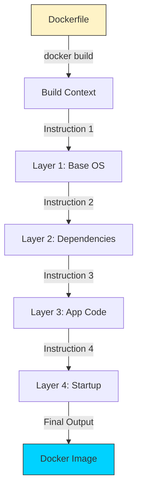

# 📜 Module 03: Dockerfile Basics

> **"If an image is a recipe, the Dockerfile is the chef's precise instructions. It describes exactly what goes into the kitchen and how it's prepared."**



## 📚 Overview

A **Dockerfile** is the "Source Code" of your infrastructure. Instead of manually installing libraries on a server, you write them into this text file. Docker then reads this file to build an image automatically. This ensures that everyone—from developers to the CI/CD pipeline—is using the **exact same** environment.

## 🎓 Learning Objectives

By the end of this module, you will:
- ✅ Master the Core Instructions (`FROM`, `RUN`, `COPY`, `CMD`).
- ✅ Understand **Layer Caching** and build optimization.
- ✅ Differentiate between **`CMD`** and **`ENTRYPOINT`**.
- ✅ Use **`.dockerignore`** to keep images clean and secure.
- ✅ Build a production-ready Python/Node.js image.

---

## 🧩 The Core Instructions

A Dockerfile follows a simple `INSTRUCTION argument` format.

| Instruction | Purpose                                                 | DevOps Tip                                                     |
| :---------- | :------------------------------------------------------ | :------------------------------------------------------------- |
| `FROM`      | Sets the base image (e.g., `ubuntu`, `python:3.9-slim`) | Always use specific versions, never `latest`.                  |
| `RUN`       | Executes commands during the build (installs software)  | Use `&& \` to combine commands and reduce layers.              |
| `COPY`      | Moves files from your laptop into the image             | Use `.dockerignore` to avoid copying `.git` or `node_modules`. |
| `WORKDIR`   | Sets the "Current Directory" for the app                | Avoid using absolute paths (like `/var/www/html`) repeatedly.  |
| `CMD`       | The default command that runs when a container starts   | There can only be **one** CMD per Dockerfile.                  |

---

## 🚀 Build Optimization: Harnessing the Cache

Docker is smart. It only rebuilds the layers that have changed. To speed up your builds, you should put the things that **change the least** at the top.

### The "COPY" Pattern
**Bad Practice**:
```dockerfile
COPY . .
RUN npm install
```
*Result: Every time you change 1 line of code, Docker has to re-download all your dependencies.*

**Best Practice**:
```dockerfile
COPY package.json .
RUN npm install
COPY . .
```
*Result: Docker caches the `npm install` layer. It only reruns if you change your `package.json` file.*

---

## 🏆 Real-World DevOps Story: The 2GB Hello World

**The Scenario**: An intern was tasked with Dockerizing a small Hello World app written in Go. They used `FROM ubuntu` as their base and installed all build tools inside the image.
**The Crisis**: The production image was **1.2 GB** for a program that only needed 10 MB. This made deployments slow and used up massive disk space in the cloud registry.
**The Fix**: A Senior DevOps engineer introduced **Multi-Stage Builds**. They used a heavy image for building the code, then copied only the final "binary" into a tiny `alpine` image.
**The Lesson**: **Base images matter.** By switching from `ubuntu` to `alpine`, the image size dropped to **15 MB**.

---

## 🚀 Professional Pattern: Non-Root Security

By default, Docker containers run as the **root** user. This is a massive security risk. If a hacker breaks into your app, they have full control over the container and potentially the host.

**Professional Standard**:
```dockerfile
# Create a system user
RUN addgroup -S appgroup && adduser -S appuser -G appgroup
# Set permissions
WORKDIR /app
COPY --chown=appuser:appgroup . .
# Switch to non-root
USER appuser
CMD ["./my-app"]
```

---

## ❓ Interview Preparation (Dockerfile)

1. **Q: What is the difference between `RUN`, `CMD`, and `ENTRYPOINT`?**
   *A: `RUN` happens during the build (it adds a layer). `CMD` is the default command when the container starts but can be overridden. `ENTRYPOINT` is the main command that is always executed, often used to turn a container into a CLI tool.*

2. **Q: Why should you combine multiple `RUN` commands with `&&`?**
   *A: Every `RUN` command creates a new layer. Combining them prevents the creation of unnecessary intermediate layers, keeping the final image smaller and more efficient.*

3. **Q: What does a `.dockerignore` file do and why is it important?**
   *A: It tells Docker which files/folders should NOT be sent to the build daemon. This speeds up builds and prevents sensitive data (like `.env` files or API keys) from being accidentally baked into the image.*

4. **Q: What is the 'Build Context'?**
   *A: It is the set of files that Docker has access to during the build. When you run `docker build .`, the `.` represents the build context (your current directory).*

5. **Q: Explain the benefit of 'slim' or 'alpine' base images.**
   *A: These images contain only the absolute minimum libraries needed to run the application, reducing the "Attack Surface" (security) and the download time (performance).*

---

## 📝 Knowledge Check

1. **Every Dockerfile (except rare cases) must start with which instruction?**
   - [ ] a) `START`
   - [x] b) `FROM`
   - [ ] c) `BASE`

2. **Which instruction is used to copy a local file into a specific image directory?**
   - [ ] a) `MOVE`
   - [x] b) `COPY`
   - [ ] c) `ADD` (Note: COPY is preferred for simple tasks)

3. **What happens if you have two `CMD` instructions in one Dockerfile?**
   - [ ] a) They both run in parallel
   - [ ] b) The first one takes priority
   - [x] c) Only the last one is executed

4. **Which instruction sets the default directory for all subsequent commands?**
   - [ ] a) `CD`
   - [ ] b) `DIR`
   - [x] c) `WORKDIR`

5. **Is `ARG` available inside the running container?**
   - [ ] Yes
   - [x] No (Only during the build process)

---

## 🔗 Next Steps

The Chef has a recipe. Now let's learn how to fix the kitchen when things go wrong.

Proceed to: **[Module 04: Troubleshooting & Debugging](../04-Debugging/README.md)** →
