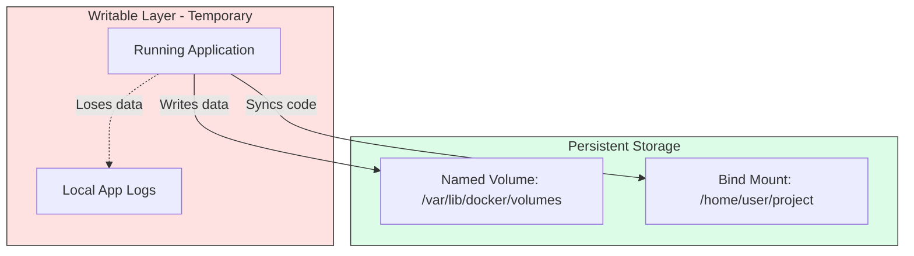

# 📦 Module 15: Docker Volumes & Persistence

> **"Data is the only thing in your infrastructure that cannot be recreated from a script. Your containers should be disposable, but your data must be indestructible."**



## 📚 Overview

Modern applications follow the **"12-Factor App"** principle of being stateless. This means a container should be able to die at any moment without losing important data. To achieve this, we use **Volumes**. This module goes beyond basic persistence into advanced volume drivers, backup strategies, and cross-host data sharing.

## 🎓 Learning Objectives

By the end of this module, you will:
- ✅ Master the **Union File System** (Storage Layers) concept.
- ✅ Differentiate between **Named, Anonymous, and Bind Mounts**.
- ✅ Use **`tmpfs`** for high-security, memory-only storage.
- ✅ Implement **Volume Drivers** for NFS and Cloud storage.
- ✅ Perform **Volume Surgery** (Backing up and Restoring raw data).

---

## 🏗️ The Storage Hierarchy

| Type | Best For | Technical Detail |
| :--- | :--- | :--- |
| **Named Volumes** | Databases (Postgres, Mongo) | High performance, managed by Docker, survives reboots. |
| **Bind Mounts** | Code & Configs | Maps directly to a folder on your laptop. |
| **tmpfs Mounts** | Secrets & Session Keys | Written only to RAM. Never touches the solid-state drive. |

---

## 🛠️ Advanced Volume Management

### 1. The Explicit Mount (Recommended)
While `-v` is common, the `--mount` flag is preferred in professional environments because it is more explicit.
```bash
docker run -d \
  --name web-server \
  --mount type=volume,source=my-data,target=/app/data,readonly \
  nginx
```

### 2. Network Storage (NFS)
Scaling across multiple servers? Use an NFS driver to share the same data between them.
```bash
docker volume create --driver local \
  --opt type=nfs \
  --opt o=addr=192.168.1.10,rw \
  --opt device=:/shared-folder \
  nfs-share
```

---

## 🏆 Real-World DevOps Story: The Ghost of the Deleted Container

**The Scenario**: A developer was using **Anonymous Volumes** (volumes created automatically by the `Dockerfile` without a name). They had 50 older versions of their app running on their machine.
**The Crisis**: Their laptop started running out of space. They ran a "cleanup script" they found online that deleted all unused containers.
**The Discovery**: Because the volumes were anonymous, Docker didn't know which one belonged to which version. The developer spent 3 hours trying to find which `1a2b3c4d...` folder contained their database files.
**The Fix**: They switched to **Named Volumes**. 
**The Lesson**: **If it doesn't have a name, you don't own it.** Always name your volumes for production and critical dev data.

---

## 🚀 Professional Pattern: The Snapshot Backup

How do you back up a Docker volume? You use a temporary "Sidecar" container to archive the data into a `.tar` file.

**The Script**:
```bash
docker run --rm \
  -v my-volume:/data:ro \
  -v $(pwd):/backup \
  alpine tar czf /backup/volume_backup.tar.gz -C /data .
```
*This patterns allows you to back up data while the app is still running (Read-Only).*

---

## ❓ Interview Preparation (Advanced Volumes)

1. **Q: What is the 'Union File System' (UnionFS)?**
   *A: It is the technology Docker uses to stack layers. The bottom layers are read-only (from the image), and the top layer is read-write (the container layer). Volumes bypass this system entirely to avoid the performance overhead of the copy-on-write process.*

2. **Q: How do you find the physical location of a volume on the host?**
   *A: Run `docker volume inspect <name>`. Look for the "Mountpoint" field. On Linux, it's typically `/var/lib/docker/volumes/<name>/_data`.*

3. **Q: What happens if you mount a non-empty host directory into a container folder that also has files?**
   *A: The host directory 'hides' the container files. The container will only see the files from the host while the mount is active. This is often used to override default configurations.*

4. **Q: Explain 'Propagated' mounts.**
   *A: This refers to whether sub-mounts inside a shared directory are visible to the container. It is configured using `bind-propagation` settings (like `shared`, `slave`, or `private`).*

5. **Q: Why would you use a 'tmpfs' mount for a database password?**
   *A: For security. If the server is physically stolen or the SSD is scanned later, no trace of the password exists on the disk because `tmpfs` only exists in volatile RAM.*

---

## 📝 Knowledge Check

1. **Which mount type is best for sharing source code from a laptop to a container?**
   - [ ] a) Named Volume
   - [x] b) Bind Mount
   - [ ] c) tmpfs

2. **What does the command `docker volume prune` do?**
   - [ ] a) Replaces old data with new data
   - [x] b) Deletes all volumes that are not connected to a running or stopped container
   - [ ] c) Compresses volumes to save space

3. **Where does a `tmpfs` mount store its data?**
   - [ ] a) On the SSD
   - [x] b) In the Host RAM
   - [ ] c) On an external Cloud bucket

4. **True or False: A volume can be mounted to multiple containers simultaneously.**
   - [x] True
   - [ ] False

5. **Which flag is used with `docker rm` to ensure the container's anonymous volumes are also deleted?**
   - [ ] a) `-f`
   - [x] b) `-v`
   - [ ] c) `--purge`

---

## 🔗 Next Steps

The data is safe and scalable. Now let's learn how to shrink our images to the absolute minimum size for production.

Proceed to: **[Module 16: Multi-Stage Builds](../03-Multi-Stage-Builds/README.md)** →
翻