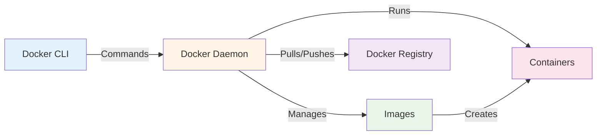
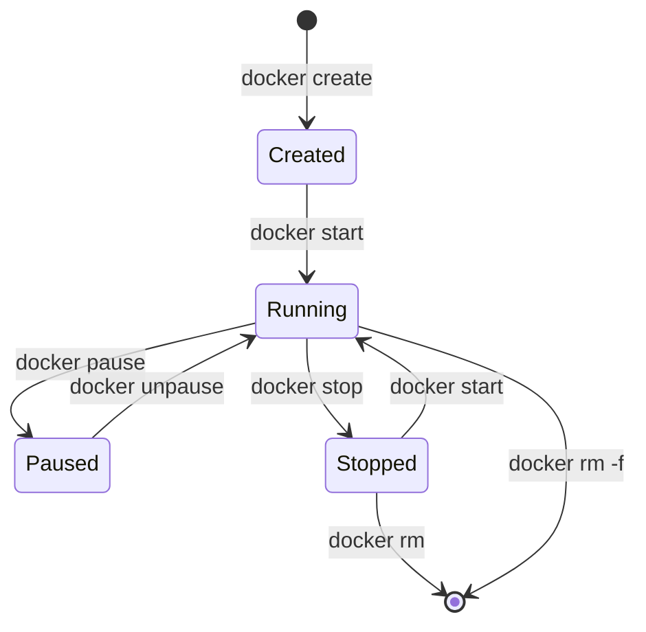

# Docker and Docker Compose - Comprehensive Guide

Welcome to the complete Docker and Docker Compose documentation! This guide covers everything from basic container concepts to advanced production patterns.

## 📚 Documentation Structure

The documentation is organized into progressive difficulty levels: **Beginner**, **Intermediate**, and **Advanced**.

### 🟢 Beginner Level

Perfect for those new to Docker and containerization.

#### Docker Fundamentals

| Topic | Description | Key Concepts |
| :--- | :--- | :--- |
| **[Introduction](01-Beginner/01-Introduction/README.md)** | What is Docker? Why containerization? | Architecture, Installation, First container |
| **[Images & Containers](01-Beginner/02-Images-and-Containers/README.md)** | Working with images and containers | Lifecycle, Commands, Docker Hub |
| **[Dockerfile Basics](01-Beginner/03-Dockerfile-Basics/README.md)** | Building custom images | Instructions, Best practices, Examples |
| **[Debugging](01-Beginner/04-Debugging/README.md)** | Troubleshooting and logs | Docker logs, Exec, Exit codes |

#### Docker Compose Fundamentals

| Topic | Description | Key Concepts |
| :--- | :--- | :--- |
| **[Compose Basics](04-Docker-Compose/Beginner/01-Basics/README.md)** | Multi-container applications | Services, Commands, Workflow |
| **[Data Persistence & Volumes](04-Docker-Compose/Beginner/02-Volumes/README.md)** | Storing data in Compose | Named volumes, Bind mounts, Anonymous |
| **[Database Storage](04-Docker-Compose/Beginner/03-Database-Storage/README.md)** | Persistence for PSQL, MySQL, etc | Data paths, Init scripts, Volumes |

### 🟡 Intermediate Level

For developers ready to deploy applications in production.

#### Advanced Docker Concepts

| Topic | Description | Key Concepts |
| :--- | :--- | :--- |
| **[Docker Networking](02-Intermediate/01-Docker-Networking/README.md)** | Container communication | Bridge, Host, Overlay networks |
| **[Docker Volumes](02-Intermediate/02-Docker-Volumes/README.md)** | Data persistence and management | Named volumes, Bind mounts, Backup |
| **[Multi-Stage Builds](02-Intermediate/03-Multi-Stage-Builds/README.md)** | Optimized production images | Image size, Security, Performance |
| **[Private Registry](02-Intermediate/04-Private-Registry/README.md)** | Image distribution and management | Docker Hub, Private registries, Tagging |
| **[Backup & Restore](02-Intermediate/05-Backup-Restore-Migration/README.md)** | Data management | Backup, Restore, Migration |
| **[NGINX & SSL](02-Intermediate/06-Nginx-SSL/README.md)** | Reverse Proxy & Let's Encrypt | NGINX, SSL/TLS, Certbot |

#### Advanced Docker Compose

| Topic | Description | Key Concepts |
| :--- | :--- | :--- |
| **[Advanced Features](04-Docker-Compose/Intermediate/01-Advanced-Features/README.md)** | Extends, profiles, overrides | Multi-environment configs |
| **[Networks & Volumes](04-Docker-Compose/Intermediate/02-Networks-Volumes/README.md)** | Complex networking and storage | Custom networks, Volume drivers |
| **[Secrets & Configs](04-Docker-Compose/Intermediate/03-Secrets-Configs/README.md)** | Secure configuration management | Secrets, External configs |

### 🔴 Advanced Level

Production-grade Docker knowledge for DevOps engineers.

#### Production Docker

| Topic | Description | Key Concepts |
| :--- | :--- | :--- |
| **[Docker Security](03-Advanced/01-Docker-Security/README.md)** | Securing containers and images | Best practices, Scanning, Hardening |
| **[Resource Management](03-Advanced/02-Resource-Management/README.md)** | CPU, memory, and resource limits | Constraints, Health checks, Monitoring |
| **[Production Considerations](03-Advanced/03-Production-Considerations/README.md)** | Running Docker in production | High availability, Logging, Troubleshooting |

#### Production Docker Compose

| Topic | Description | Key Concepts |
| :--- | :--- | :--- |
| **[Production Setup](04-Docker-Compose/Advanced/01-Production/README.md)** | Production configurations | Scaling, Resource limits, Restart policies |
| **[Orchestration](04-Docker-Compose/Advanced/02-Orchestration/README.md)** | Beyond Compose | Docker Swarm, Kubernetes migration |

## 🎯 Learning Paths

### Path 1: Developer Quickstart (1-2 days)

1. [Introduction](01-Beginner/01-Introduction/README.md) - Understand Docker basics
2. [Images & Containers](01-Beginner/02-Images-and-Containers/README.md) - Run and manage containers
3. [Dockerfile Basics](01-Beginner/03-Dockerfile-Basics/README.md) - Build custom images
4. [Compose Basics](04-Docker-Compose/Beginner/01-Basics/README.md) - Multi-container apps
5. [Database Storage](04-Docker-Compose/Beginner/03-Database-Storage/README.md) - DB Persistence
6. [Debugging](01-Beginner/04-Debugging/README.md) - Troubleshooting containers

**Goal**: Run containerized development environments

### Path 2: Production Deployment (1 week)

1. Complete Developer Quickstart
2. [Docker Networking](02-Intermediate/01-Docker-Networking/README.md) - Network your services
3. [Docker Volumes](02-Intermediate/02-Docker-Volumes/README.md) - Persist data properly
4. [Multi-Stage Builds](02-Intermediate/03-Multi-Stage-Builds/README.md) - Optimize images
5. [Docker Security](03-Advanced/01-Docker-Security/README.md) - Secure your containers
6. [Production Setup](04-Docker-Compose/Advanced/01-Production/README.md) - Deploy to production

**Goal**: Deploy secure, production-ready applications

### Path 3: DevOps Mastery (2-3 weeks)

Complete all documentation in order, including:

- All Beginner topics
- All Intermediate topics
- All Advanced topics
- Hands-on practice with each section

**Goal**: Master Docker for enterprise use

## 🔑 Key Concepts Overview

### Docker Architecture



### Container Lifecycle



## 📋 Quick Reference

### Essential Docker Commands

```bash
# Images
docker pull <image>              # Download image
docker build -t <name> .         # Build image
docker images                    # List images
docker rmi <image>               # Remove image

# Containers
docker run <image>               # Create & start container
docker ps                        # List running containers
docker stop <container>          # Stop container
docker rm <container>            # Remove container
docker logs <container>          # View logs
docker exec -it <container> sh   # Interactive shell

# Cleanup
docker system prune              # Remove unused resources
docker system prune -a --volumes # Remove everything unused
```

### Essential Docker Compose Commands

```bash
# Lifecycle
docker compose up -d             # Start services
docker compose down              # Stop & remove services
docker compose restart           # Restart services

# Management
docker compose ps                # List services
docker compose logs -f           # View logs
docker compose exec <svc> sh     # Run command in service
docker compose build             # Build images

# Cleanup
docker compose down -v           # Remove volumes too
```

## 🏆 Related Certifications

- **Docker Certified Associate (DCA)**: Validates skills in orchestration, image creation, installation, configuration, networking, and security.

---

## 📖 Additional Resources

- [Docker Official Documentation](https://docs.docker.com/)
- [Docker Hub](https://hub.docker.com/) - Public image registry
- [Play with Docker](https://labs.play-with-docker.com/) - Browser-based playground
- [Awesome Docker](https://github.com/veggiemonk/awesome-docker) - Curated list of resources
