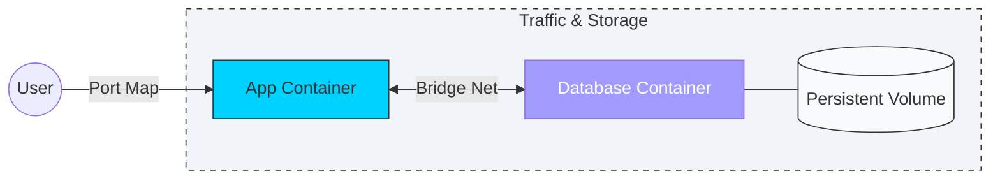

# 🌐 Module 01: Networking & Storage

> **"Containers are ephemeral. Data is forever. Networking is how they talk. Mastering these is the difference between a standalone script and a global system."**

## 📚 Overview

By default, Docker containers are "Islands"—isolated from the host and each other. While this is great for security, real-world applications need to talk to databases, store user uploads, and reach the public internet.

In this module, we transition from **Stateless** computing to **Stateful** systems. We learn how to manage the "Virtual Bridges" of Docker networking and the "External Hard Drives" of Docker Volumes.

## 🎯 Learning Objectives

- ✅ Implement **Service Discovery** using Docker's internal DNS.
- ✅ Protect sensitive data using **Volume Persistance**.
- ✅ Reduce image sizes by 90% using **Multi-Stage Builds**.
- ✅ Deploy a **Private Registry** to keep corporate IP secure.
- ✅ Configure **Nginx** as a secure gateway for containerized traffic.

## 🚀 Professional Pattern: Externalizing State

**The Golden Rule of Docker**: Never store data inside the container's writable layer.

In a professional environment, containers are **Disposable**. They can be killed and replaced at any second. If your database stores its data inside the container, that data vanishes when the container stops. Professional architects map every piece of persistent data (DB files, Logs, Uploads) to **Docker Volumes** or **Bind Mounts**.

## 🏆 Real-World DevOps Story: The 30-Day Data Loop

**The Scenario**: A startup launched a wiki for their employees using a Dockerized database. They ran it for 30 days without issues.
**The Crisis**: The server ran out of disk space. A junior engineer ran `docker system prune -a` to clean up. Because the database wasn't using a volume, all the company's internal documentation was stored in the container's ephemeral layer. It was deleted instantly.
**The Discovery**: They had no backups because they thought the "image" saved the data.
**The Fix**: They had to rebuild the wiki from scratch and immediately implemented **Named Volumes** with daily backups.
**The Lesson**: **If it's not in a volume, it doesn't exist.**

## 🗺️ Included Sub-Modules

1. **[01-Docker-Networking](./01-Docker-Networking/README.md)**: Connecting containers and DNS magic.
2. **[02-Docker-Volumes](./02-Docker-Volumes/README.md)**: Ensuring your data survives the "cull."
3. **[03-Multi-Stage-Builds](./03-Multi-Stage-Builds/README.md)**: Speeding up deployment with tiny images.
4. **[04-Private-Registry](./04-Private-Registry/README.md)**: Building your own "Docker Hub."
5. **[05-Backup-Restore-Migration](./05-Backup-Restore-Migration/README.md)**: Moving data between servers.
6. **[06-Nginx-SSL](./06-Nginx-SSL/README.md)**: The professional front door.

---

**Next Step**: Start with **[01-Docker-Networking](./01-Docker-Networking/README.md)** 🚀
