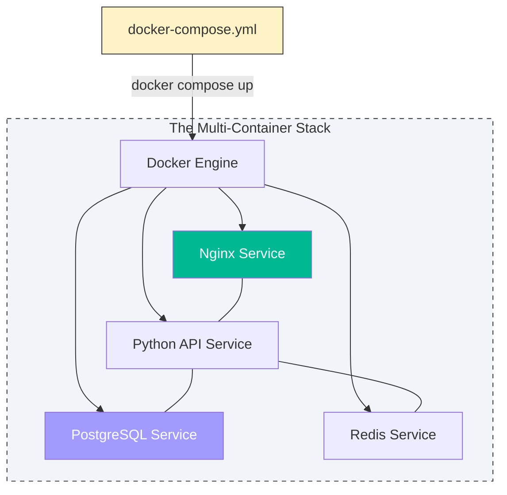

# 🐙 Module 02: Docker Compose

> **"If a Dockerfile is the blueprint for a single brick, Docker Compose is the architectural plan for the entire building."**

## 📚 Overview

Modern applications are rarely just one process. They are a collection of services working together. **Docker Compose** is the "Orchestrator for Developers." It allows you to define your entire stack—networks, volumes, and services—in a single, human-readable YAML file.

Instead of typing 10 `docker run` commands with 100 flags, you simply type `docker compose up`.

## 🎯 Learning Objectives

- ✅ Master the **YAML Syntax** of the `docker-compose.yml` file.
- ✅ Understand the difference between **Building** images and **Pulling** them in Compose.
- ✅ Implement **Inter-Service Communication** without hardcoding IP addresses.
- ✅ Use **Environment Variables** and `.env` files for configuration.
- ✅ Control service startup order using **`depends_on`**.

## 🚀 Professional Pattern: Declarative Infrastructure

In the old days, we wrote "Imperative" scripts: *"Step 1: Create network. Step 2: Run container A. Step 3: Wait 5 seconds..."* If Step 2 failed, the script broke and left a mess.

Docker Compose is **Declarative**. You define the **Desired State** (*"I want 1 Web container and 1 DB container connected on this network"*), and Docker handles the "how." If a container is already running and matches the definition, Compose leaves it alone. If it's missing, Compose starts it.

## 🏆 Real-World DevOps Story: The Onboarding Weekend

**The Scenario**: A new developer joined a fintech team. The legacy app had 5 services (Auth, SQL, Redis, Frontend, API).
**The Crisis**: On the legacy setup, it took the developer **3 days** to install all the correct versions of Postgres, Redis, and Node on their local Mac, only to find the app still wouldn't connect because of a network config error.
**The Discovery**: A Senior DevOps engineer spent 2 hours "Compose-ifying" the app.
**The Fix**: The next developer who joined ran one command: `docker compose up`. In **2 minutes**, the entire stack was running perfectly.
**The Lesson**: **If onboarding takes more than 10 minutes, you need Docker Compose.**

## 🗺️ Curriculum

### 🟢 Beginner

1. **[01-Basics](./Beginner/01-Basics/README.md)**: Service definitions and core commands (`up`, `down`, `ps`).
2. **[02-Volumes](./Beginner/02-Volumes/README.md)**: Mounting local code for real-time development.
3. **[03-Database-Storage](./Beginner/03-Database-Storage/README.md)**: Securely persisting DB data in Compose.

### 🟡 Intermediate

1. **[01-Advanced-Features](./Intermediate/01-Advanced-Features/README.md)**: Profiles, healthchecks, and resource limits.
2. **[02-Networks-Volumes](./Intermediate/02-Networks-Volumes/README.md)**: Customizing the communication layers.
3. **[03-Secrets-Configs](./Intermediate/03-Secrets-Configs/README.md)**: Handling passwords and configuration files cleanly.

### 🔴 Advanced

1. **[01-Production](./Advanced/01-Production/README.md)**: Moving from Compose to Cloud-ready configurations.
2. **[02-Orchestration](./Advanced/02-Orchestration/README.md)**: Scaling services and managing complex dependencies.

---

**Next Step**: Start with **[Beginner: Basics](./Beginner/01-Basics/README.md)** 🚀
