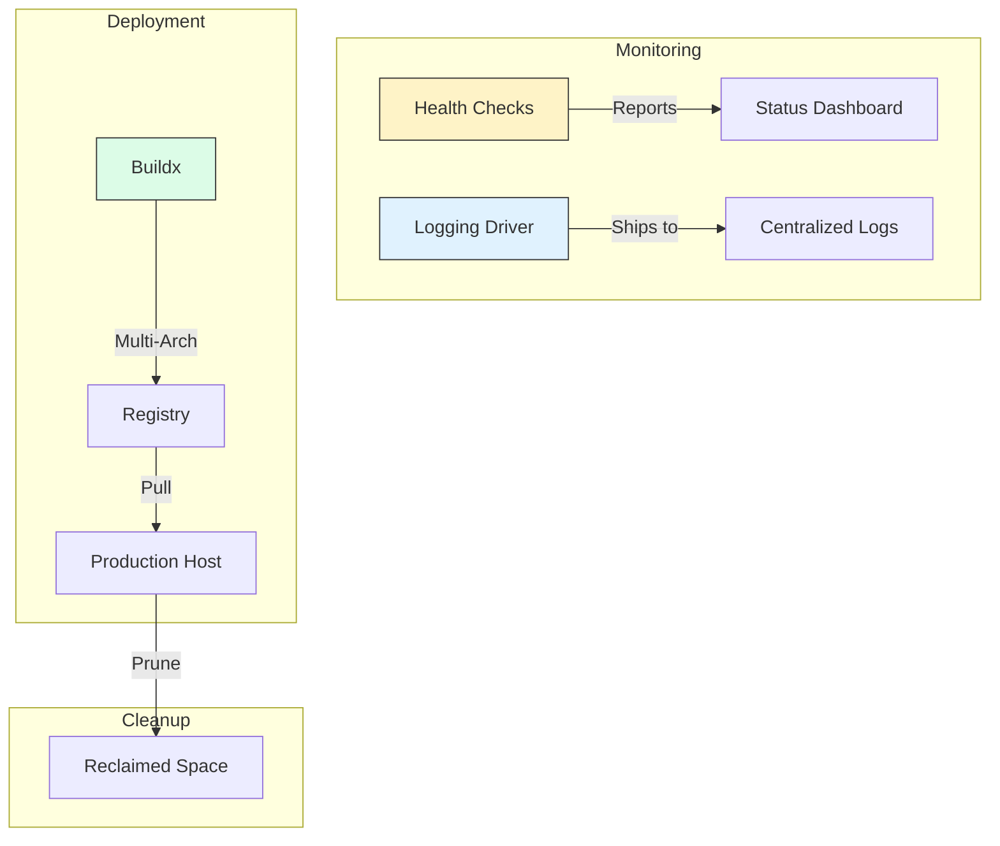

# 🏭 Module 14: Production Considerations

> **"Development is the laboratory. Production is the battlefield. In the lab, you care about features. On the battlefield, you care about observability, resilience, and survival."**



## 📚 Overview

Transitioning from "it works on my machine" to "it works for 10 million users" is the core of DevOps. In production, Docker requires a different philosophy. You cannot manually log in to check files; you need centralized logs. You cannot afford downtime; you need advanced health checks. You cannot run out of disk space; you need garbage collection strategies. This module covers the "Day 2" operations of a Docker professional.

## 🎓 Learning Objectives

By the end of this module, you will:
- ✅ Configure **Logging Drivers** to ship logs to centralized servers.
- ✅ Implement **Deep Health Checks** that verify database connectivity.
- ✅ Build **Multi-Architecture** images using **Docker Buildx**.
- ✅ Orchestrate **Near-Zero Downtime Updates** with Compose.
- ✅ Prevent disk outages with **Automated Garbage Collection**.

---

## 🏗️ Logging: Beyond the Terminal

The default `json-file` driver is dangerous. It stores logs as files on the host SSD. If your app is chatty, it will eventually fill the disk and crash the server.

**The Production Strategy**: Rotate logs or ship them to a dedicated server.
```yaml
services:
  app:
    image: my-app:prod
    logging:
      driver: "json-file"
      options:
        max-size: "10m" # Don't let a log file grow > 10MB
        max-file: "3"   # Keep only the last 3 files
```

---

## 🏥 Deep Health Checks

A container is not "healthy" just because the process is running—it's healthy when it can **serve requests**.

```yaml
services:
  api:
    image: my-api:prod
    healthcheck:
      test: ["CMD", "curl", "-f", "http://localhost:8080/ready"]
      interval: 30s
      timeout: 10s
      retries: 3
      start_period: 20s # Give the app 20s to boot before checking
```
*If this check fails 3 times, Docker Compose marks the container as 'unhealthy', and external load balancers can stop sending traffic to it.*

---

## 🌍 Multi-Arch Builds (Buildx)

The world is moving to **ARM64** (Apple M1/M2, AWS Graviton) because it's cheaper and faster. Your production images should support both Intel and ARM.

```bash
# Create a builder that can handle multiple architectures
docker buildx create --use
# Build and push one tag that works on both!
docker buildx build --platform linux/amd64,linux/arm64 -t myrepo/myapp:v1 --push .
```

---

## 🏆 Real-World DevOps Story: The Ghost of the Full SSD

**The Scenario**: A company ran a complex application with 20 microservices. Everything was perfect for 3 months.
**The Crisis**: Suddenly, at 4:00 AM on a Sunday, the entire system went offline. Developers couldn't even SSH into the server to check what happened.
**The Discovery**: The `json-file` logging driver had accumulated 200GB of logs. The SSD was at 100% capacity. When Linux hit 100% disk, it couldn't write temporary files, causing the Docker daemon and the SSH service to hang.
**The Fix**: They implemented a **Log Rotation Policy** and a nightly **`docker system prune`** cron job.
**The Lesson**: **Monitoring your disk is as important as monitoring your code.** Clean your house daily, or it will fall down.

---

## 🚀 Professional Pattern: Restart Policies

In production, if an app crashes, it should automatically try to come back.
- `on-failure`: Restart only if the app crashed (Exit code != 0).
- `unless-stopped`: Always restart unless a human manually stopped the container.

```yaml
services:
  db:
    image: postgres
    restart: unless-stopped
```

---

## ❓ Interview Preparation (Production Docker)

1. **Q: Why should you avoid the 'latest' tag in production?**
   *A: The 'latest' tag is a pointer that changes every time a new image is pushed. If your servers pull 'latest' at different times, they might end up running different versions of the code, making debugging a nightmare and deployments inconsistent. Always use specific version tags (e.g., v1.4.2).*

2. **Q: Explain 'Docker Buildx' and why it matters for cost savings.**
   *A: Buildx allows you to build images for different architectures. Since ARM-based instances (like AWS Graviton) are often 20-40% cheaper than Intel instances for the same performance, being able to build ARM-compatible images is a direct cost-saving for the company.*

3. **Q: What is the benefit of setting a 'start_period' in a health check?**
   *A: Some applications (like Java or large Node.js apps) take 30-60 seconds to fully initialize and connect to their database. Without a `start_period`, the health check would fail immediately during the boot process, causing Docker to repeatedly kill and restart the container before it ever had a chance to finish starting.*

4. **Q: How do you handle 'Log Aggregation' in a cluster of 100 Docker hosts?**
   *A: You use a logging driver like `gelf` (Graylog), `syslog`, or `fluentd`. These drivers send logs via the network to a central server (like ELK or Splunk) instead of writing them to the local disk, providing a single place to search and analyze logs from all 100 hosts.*

5. **Q: What is a 'Dangling' image and how do you fix it?**
   *A: A dangling image is a layer that is no longer associated with any tagged image (it usually shows up as `<none>:<none>` in `docker images`). They happen during builds. You fix them by running `docker image prune`.*

---

## 📝 Knowledge Check

1. **Which logging driver option prevents logs from filling up your entire hard drive?**
   - [ ] a) `limit-disk`
   - [x] b) `max-size`
   - [ ] c) `rotate-log`

2. **What happens to a container marked as 'unhealthy'?**
   - [ ] a) It is deleted automatically by Docker
   - [x] b) Orchestrators (like Compose or K8s) can use this status to stop routing traffic to it
   - [ ] c) It turns red in the `docker ps` output but continues running normally

3. **Which tool allows you to build a single image that works on both Intel and Mac (ARM) chips?**
   - [ ] a) `docker build`
   - [x] b) `docker buildx`
   - [ ] c) `docker multi-arch`

4. **True or False: `docker system prune` will delete your running production containers.**
   - [ ] True
   - [x] False (It only removes *stopped* containers and *unused* resources)

5. **Which restart policy is generally best for a critical Production Database?**
   - [ ] a) `no`
   - [ ] b) `always`
   - [x] c) `unless-stopped`

---

## 🔗 Next Steps

The Docker journey is complete. You are now ready to step into the massive world of Orchestration and Cluster Management.

Proceed to: **[Module 02: Real-World DevOps Projects](../02-Real-World-Projects/README.md)** →
