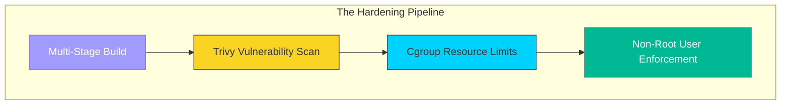

# 🛡️ Module 01: Security & Optimization

> **"A secure container is a minimal container. Every library you don't install is a door you don't have to lock."**

## 📚 Overview

In the previous parts, we focused on making things **Work**. In this module, we focus on making them **Production-Ready**.

Security in Docker is about "Layered Defense." We move from heavy, default images to "Distroless" and "Alpine" bases. We implement CPU/RAM guardrails to prevent a single memory leak from crashing a $100,000 cluster. We treat security as a lifestyle, not an afterthought.

## 🎯 Learning Objectives

- ✅ Implement **Vulnerability Scanning** in the local dev loop.
- ✅ Master **Linux Capabilities** to strip root powers from containers.
- ✅ Decouple application state to allow **Read-Only** filesystems.
- ✅ Prevent **OOM (Out of Memory)** crashes using resource limits.
- ✅ Standardize **Logging Drivers** for enterprise visibility.

## 🚀 Professional Pattern: The "Least Privilege" Principle

In a professional DevOps environment, we never give a process more power than it absolutely needs.

- **Non-Root**: We create a dedicated user inside the Dockerfile.
- **Read-Only**: We mount the app code as read-only so a hacker can't "deface" the site or install miners.
- **Cap-Drop**: We tell the Linux kernel to remove all "Superuser" powers from the container except the one needed to bind to a port.

## 🏆 Real-World DevOps Story: The Bitcoin Miner at Midnight

**The Scenario**: A company was running a Wordpress site in Docker. They used a generic image and ran it as root.
**The Crisis**: An unpatched plugin allowed an attacker to get a shell. Because the container was root, the attacker installed a sophisticated Bitcoin miner that hid its process name as `systemd-worker`.
**The Discovery**: The company only noticed when their cloud bill doubled. The hacker had also used the container's root access to probe the internal database and download the customer list.
**The Fix**: They rebuilt the stack using **Alpine Linux**, forced a **Non-Root** user, and used **Resource Limits** to ensure no container could ever take more than 20% CPU.
**The Lesson**: **If you run as root, you are inviting the world into your server.**

## 🗺️ Included Sub-Modules

1. **[01-Docker-Security](./01-Docker-Security/README.md)**: Hardening the boundary between app and host.
2. **[02-Resource-Management](./02-Resource-Management/README.md)**: Ensuring "Noisy Neighbors" don't crash the system.
3. **[03-Production-Considerations](./03-Production-Considerations/README.md)**: The final checklist for Go-Live.

---

**Next Step**: Start with **[01-Docker-Security](./01-Docker-Security/README.md)** 🚀
