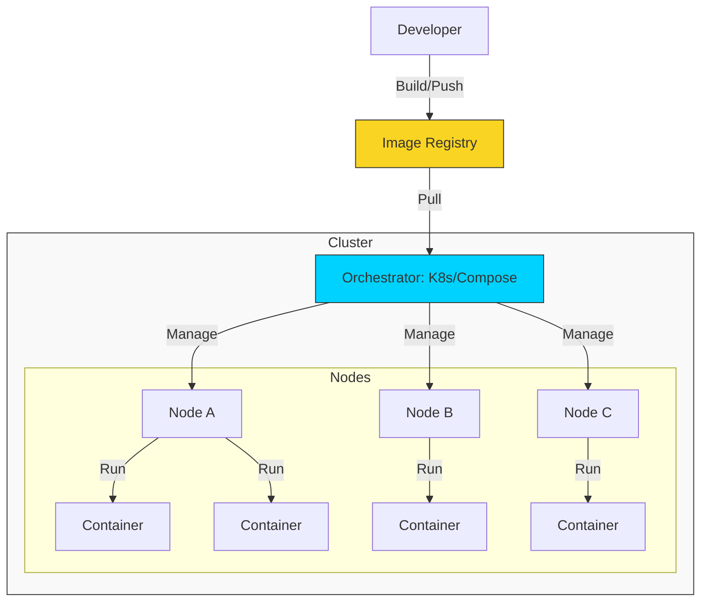

# 🎡 Container Orchestration: Scaling the Modern Stack

> **"Containerization is about packing the boxes. Orchestration is about managing the warehouse, the trucks, and the global delivery schedule."**

## 📚 Overview

In Phase 1 and 2, we learned how to write code and automate scripts. In Phase 3, we learn how to **Scale**. **Container Orchestration** is the technology that allows us to manage hundreds or thousands of containers as a single cohesive unit.

While **Docker** provides the engine to run a single container, orchestration tools like **Docker Compose** (for multi-container local apps) and **Kubernetes** (for production-grade clusters) handle the "Hard Parts": healing crashed containers, auto-scaling during traffic spikes, and managing zero-downtime updates.

## 🎓 Learning Objectives

- ✅ Understand the shift from **Virtual Machines** to **Containers**.
- ✅ Master **Docker Foundations** (Images, Layers, and Daemons).
- ✅ Build multi-tier applications using **Docker Compose**.
- ✅ Internalize the **"Cattle vs. Pets"** infrastructure philosophy.
- ✅ Implement **Persistence** and **Networking** in containerized environments.
- ✅ Introduction to **Kubernetes** architecture (Pods, Nodes, and Control Planes).

---

## 🏗️ Curriculum Structure

| # | module | Topic | Description |
| :--- | :--- | :--- | :--- |
| 01 | **[Docker Foundations](./Docker/01-Beginner/)** | The Engine | Images, Containers, and the Dockerfile. |
| 02 | **[Multi-Container Apps](./Docker/04-Docker-Compose/)** | The Orchestra | Managing microservices with Docker Compose. |
| 03 | **[Intermediate Patterns](./Docker/02-Intermediate/)** | The Network | Advanced Networking, Volumes, and Multi-Stage builds. |
| 04 | **[Production Security](./Docker/03-Advanced/)** | The Fortress | Securing images, scanning, and resource limits. |
| 05 | **[Kubernetes Intro](./README.md)** | The Conductor | (Coming Soon) The industry standard for cluster orchestration. |

---

## 🚀 Professional Pattern: "Cattle vs. Pets"

In the old world (Virtual Machines), servers were **"Pets"**. We gave them names, we nursed them back to health when they were sick, and it was a tragedy if one died.

In the container world, containers are **"Cattle"**.

- They are anonymous.
- They are numbered, not named.
- If one gets "sick" or crashes, we don't fix it—the orchestrator simply "recycles" it and starts a fresh one from the original image.

**DevOps Rule**: Never log into a running container to "fix" it. Fix the **Dockerfile**, rebuild the image, and redeploy.

---

## 💡 Stuck?

- Review the [Master README](./README.md) for concepts.
- Check the [Docker Documentation](./Docker/README.md) for more examples.
- Use `docker system prune` to clean up your workspace between challenges.

---

## 🏆 Real-World DevOps Story: The 3:00 AM Manual Scaler

**The Scenario**: Before orchestration, a popular e-commerce site ran on 4 large Virtual Machines. During a "Flash Sale," traffic spiked 10x.
**The Crisis**: The servers froze. A DevOps engineer had to manually provision 10 more VMs, wait 15 minutes for them to boot, manually install the app, and update the load balancer. By then, the sale was over and customers were gone.
**The Fix**: The team migrated to Docker and Kubernetes. Now, when traffic spikes, the orchestrator detects the high CPU and automatically spins up 50 containers in 20 seconds.
**The Lesson**: Human reaction time is too slow for modern scale. **Orchestration is the only way to sleep through a traffic spike.**

---

## ❓ Interview Preparation

1. **Q: What is the main difference between a Container and a Virtual Machine?**
   *A: A VM includes a full Operating System and hypervisor, making it heavy (GBs). A container shares the host's OS kernel and only carries the app and its dependencies, making it lightweight (MBs) and fast to start.*

2. **Q: Why do we need an Orchestrator if we already have Docker?**
   *A: Docker runs containers on one machine. An orchestrator manages containers across a "Cluster" of multiple machines, providing high availability, auto-scaling, and self-healing.*

3. **Q: What is a "Multi-Stage Build" and why is it used?**
   *A: It's a method of building images where you use one large image to compile your code (e.g., Maven/Rust) and then copy ONLY the final binary to a tiny production image (e.g., Alpine). This keeps production images small and secure.*

4. **Q: Explain the concept of "Self-Healing" in orchestration.**
   *A: If a container crashes or the underlying server fails, the orchestrator detects the failure and automatically starts a new instance elsewhere to maintain the "Desired State."*

5. **Q: What is a Docker Image "Layer"?**
   *A: Every command in a Dockerfile (like `RUN` or `COPY`) creates a layer. These layers are cached. If you only change one line of code, Docker only rebuilds the layers that changed, making builds extremely fast.*

---

## 📝 Knowledge Check

1. **What is the name of the file used to define multi-container applications?**

   - [ ] a) Dockerfile
   - [x] b) docker-compose.yml
   - [ ] c) config.json

2. **Which command is used to see the logs of a running container?**

   - [x] a) `docker logs`
   - [ ] b) `docker cat`
   - [ ] c) `docker tail`

3. **In the "Cattle vs. Pets" model, containers are considered...**

   - [ ] a) Pets
   - [x] b) Cattle
   - [ ] c) Neither

---

## 🔗 Next Steps

The warehouse is open. Let's start packing the boxes.

1. Proceed to: **[CHALLENGES.md](./CHALLENGES.md)** →
2. Start the first module: **[Docker Foundations](./Docker/01-Beginner/01-Introduction/README.md)** →
