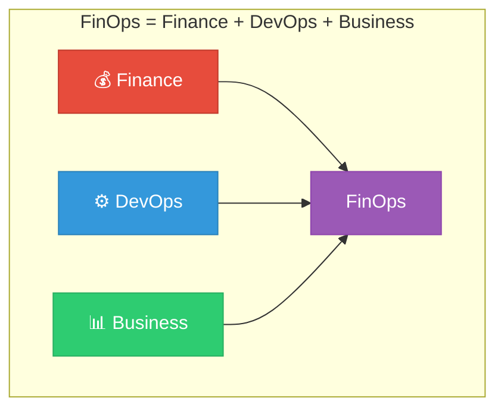
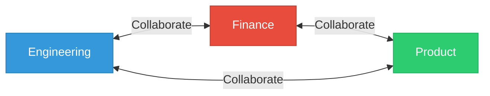
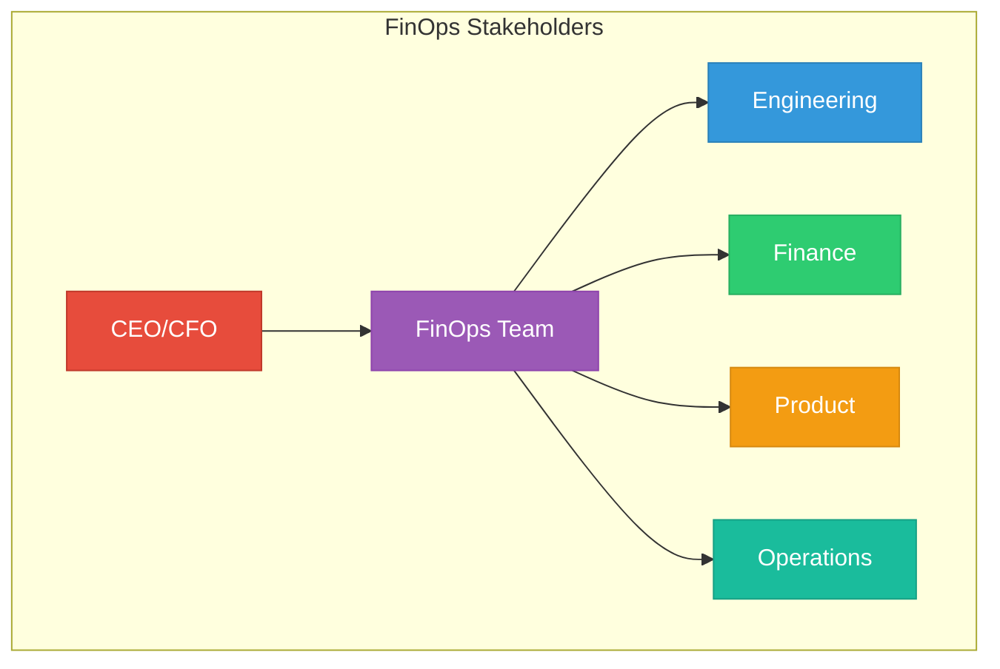

## Learning Objectives

By the end of this lesson, you will:
- Understand what FinOps is and why it exists
- Know the key principles of FinOps
- Identify the stakeholders involved in FinOps
- Recognize the FinOps maturity model

---

## What is FinOps?

**FinOps** (Financial Operations) is the practice of bringing financial accountability to the variable spend model of cloud computing. It combines:

- **Financial Management** - Budgeting, forecasting, reporting
- **Technology** - Cloud tools and automation
- **Business Operations** - Process and governance

---

## The Six Principles of FinOps

The FinOps Foundation defines six core principles:

### 1. Teams Need to Collaborate

| Stakeholder | Role in FinOps |
|-------------|----------------|
| **Engineering** | Optimize resources, implement savings |
| **Finance** | Budget management, forecasting |
| **Product** | Balance cost with business value |
| **Executive** | Strategic decisions, governance |

### 2. Everyone Takes Ownership
- Engineering teams own their cloud costs
- Decentralized decision-making
- Cost awareness at the team level

### 3. A Centralized Team Drives FinOps
A dedicated FinOps team provides:
- Best practices and standards
- Tools and training
- Cross-team coordination
- Executive reporting

### 4. Reports Should Be Accessible and Timely

| Requirement | Description |
|-------------|-------------|
| **Real-time** | Near real-time cost data |
| **Accurate** | Properly allocated costs |
| **Actionable** | Clear optimization opportunities |
| **Accessible** | Self-service dashboards |
### 5. Decisions Are Driven by Business Value
Cost optimization should consider:
- Revenue impact
- Customer experience
- Time to market
- Technical debt

### 6. Take Advantage of the Variable Cost Model
The cloud's pay-as-you-go model enables:
- Scale up when needed
- Scale down when not
- Only pay for what you use
- Experiment without large upfront investments

---
## FinOps Stakeholders

| Role | Responsibilities |
|------|------------------|
| **FinOps Practitioner** | Day-to-day FinOps activities, tooling, reporting |
| **Engineering Lead** | Technical implementation, optimization decisions |
| **Finance Analyst** | Budgets, forecasts, financial reporting |
| **Product Owner** | Feature prioritization with cost consideration |
| **Executive Sponsor** | Strategic direction, resource allocation |

---
## The FinOps Maturity Model
Organizations progress through three maturity stages:

### Crawl Stage
- Basic cost visibility
- Manual processes
- Limited tagging
- Reactive approach
### Walk Stage
- Automated reporting
- Consistent tagging strategy
- Showback to teams
- Proactive optimization
### Run Stage
- Real-time visibility
- Automated optimization
- Chargeback model
- FinOps culture embedded

| Capability       | Crawl            | Walk             | Run                   |
| ---------------- | ---------------- | ---------------- | --------------------- |
| **Visibility**   | Basic dashboards | Detailed reports | Real-time analytics   |
| **Tagging**      | Ad-hoc           | Standardized     | Enforced              |
| **Optimization** | Manual           | Scheduled        | Automated             |
| **Governance**   | Minimal          | Policies defined | Automated enforcement |

---
## Common FinOps Challenges

| Challenge | Solution |
|-----------|----------|
| Lack of executive support | Show ROI with quick wins |
| Siloed teams | Create cross-functional FinOps team |
| Poor tagging | Implement and enforce tagging strategy |
| Tool complexity | Start simple, scale as needed |
| Cultural resistance | Education and awareness programs |

---
## Getting Started with FinOps

### Step 1: Assess Current State
- Review current cloud spend
- Identify top spending areas
- Evaluate existing visibility

### Step 2: Build Your Team
- Identify FinOps champion
- Engage stakeholders from Finance, Engineering, Product
- Define roles and responsibilities

### Step 3: Start with Visibility
- Enable cost reporting tools
- Implement basic tagging
- Create initial dashboards

### Step 4: Quick Wins
- Identify obvious waste (unused resources)
- Right-size over-provisioned instances
- Turn off development resources after hours

---

## Hands-On Challenge

1. **Explore your cloud provider's cost dashboard**
   - AWS: Navigate to Cost Explorer
   - Azure: Open Cost Management + Billing
   - GCP: Access Cloud Billing Reports

2. **Identify your top 5 spending services**

3. **Look for any untagged resources**

---

## Key Takeaways

- ✅ FinOps brings financial accountability to cloud spending
- ✅ It requires collaboration between Finance, Engineering, and Business
- ✅ Organizations mature from Crawl → Walk → Run
- ✅ Start with visibility, then optimize, then automate

---

## Next Lesson

Continue to **[Lesson 02: Cloud Billing Basics](Lesson%2002-Cloud%20Billing%20Basics.md)** to learn how cloud providers charge for services.
