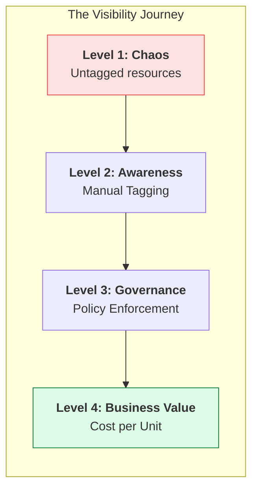
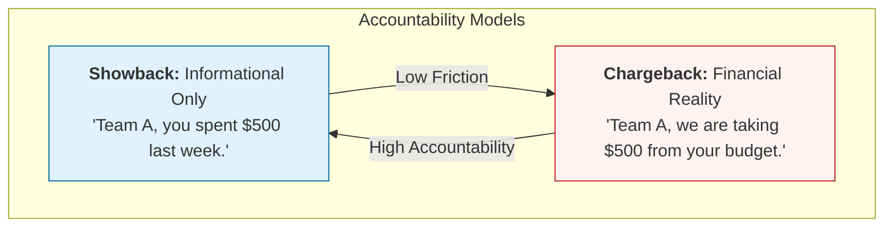

# 👁️ Module 03: Cost Visibility & Tagging

> **"You cannot manage what you cannot measure. Without tags, a cloud bill is just a list of random charges; with tags, it's a strategic map of your business operations."**



## 📚 Overview

Cost visibility is the ability to map cloud spend back to the teams, products, and business units that generated it. This is primarily achieved through **Tagging**. In this module, we move from simply seeing the total bill to deconstructing it into "Attributable Spend." You will learn how to design a tagging schema that survives scale and how to enforce it using technical guardrails.

## 🎓 Learning Objectives

By the end of this module, you will:
- ✅ Design a **Professional Tagging Schema** for enterprise scale.
- ✅ Master **Enforcement Strategies** (Policy-as-Code).
- ✅ Differentiate between **Showback and Chargeback** models.
- ✅ Find and audit **Untagged Resources** using the CLI.
- ✅ Build **Cost Allocation Reports** that stakeholders actually understand.

---

## 🏷️ The Global Tagging Standard

A "Good" tag is consistent, lowercase, and hyphenated. A "Bad" tag is inconsistent (e.g., `Environment` vs `env` vs `ENV`).

| Key          | Standard Value              | Description                                          |
| :----------- | :-------------------------- | :--------------------------------------------------- |
| `env`        | `prod`, `stag`, `dev`       | Critical for separating stable vs exploratory costs. |
| `team`       | `platform`, `billing`, `ui` | Who owns the technical resource?                     |
| `costcenter` | `cc-804`, `eng-ops`         | Which spreadsheet cell does this money come from?    |
| `project`    | `migration-v2`              | Useful for tracking one-off initiative costs.        |
| `owner`      | `john.doe`                  | The human to Slack when the resource is idle.        |

---

## 🛡️ Professional Pattern: Enforcement via IaC

Don't ask developers to tag resources—**force them**. Senior DevOps engineers use "Policy as Code" or Terraform modules to ensure every resource has the required labels before it even reaches the cloud.

**Example: Terraform Mandatory Tags**
```hcl
resource "aws_instance" "app" {
  ami           = "ami-12345678"
  instance_type = "t3.micro"

  tags = {
    env         = "prod"
    team        = "api"
    # If the next line is missing, the CI/CD pipeline fails
    costcenter  = "eng-800" 
  }
}
```

---

## 🏆 Real-World DevOps Story: The Ghost in the Data Warehouse

**The Scenario**: A large e-commerce company noticed their **BigQuery** (GCP) costs tripled in one month, jumping from $5,000 to $15,000. 
**The Crisis**: Because they had poor tagging on their data datasets, they couldn't tell if the increase was due to more customers or a rogue script.
**The Fix**: They implemented mandatory `project_id` and `user_id` labels on every query.
**The Discovery**: They found a "Ghost" script—a forgotten analytics job from a former intern that was running every hour, scanning 50TB of raw logs to look for information that was no longer used by anyone.
**The Lesson**: **Visibility is an investigative tool.** Without tags, you are trying to find a needle in a haystack while the haystack is on fire.

---

## 💰 Allocation Models: Showback vs Chargeback



---

## ❓ Interview Preparation (Visibility & Tagging)

1. **Q: What happens to costs that cannot be tagged? (e.g., Shared Support, Data Transfer)**
   *A: These are called 'Unallocated Costs' or 'Shared Costs.' They are usually handled using a Proportional Split (e.g., if Team A uses 60% of the direct resources, they are billed for 60% of the shared support cost).*

2. **Q: How do you handle 'Tagging Drift'—where resources exist but their tags are outdated?**
   *A: We use automated scanners (like AWS Config or custom Lambda scripts) that find resources with outdated or missing tags. We can then either auto-apply a 'Default' tag or send an automated alert to the resource owner to fix it.*

3. **Q: Is it better to have many tags or just a few?**
   *A: Fewer is better for the start. Follow the '80/20 Rule': 5-7 core tags usually provide 80% of the visibility you need. Over-tagging leads to human error and 'Data Noise'.*

4. **Q: How can you enforce tagging on legacy resources that weren't built with IaC?**
   *A: You can use 'Cloud Custodian' or similar tools to automatically stop or terminate any resource that doesn't meet the tagging compliance after a 24-hour grace period.*

5. **Q: Why should we use lowercase for tag keys?**
   *A: Tag keys are often case-sensitive. If one developer uses `Owner` and another uses `owner`, the billing tool will see them as two different categories, breaking your reports.*

---

## 📝 Knowledge Check

1. **Which tag is most important for mapping spend to an internal financial budget?**
   - [ ] a) `env`
   - [ ] b) `owner`
   - [x] c) `costcenter`

2. **What is the name of the model where costs are actually deducted from a team's budget?**
   - [ ] a) Showback
   - [x] b) Chargeback
   - [ ] c) Feedback

3. **True or False: Most cloud providers have a native tool to find unallocated costs.**
   - [x] True (e.g., AWS Cost Explorer)
   - [ ] False

4. **Which character is the standard separator for multi-word tag values?**
   - [ ] a) Underscore (`_`)
   - [x] b) Hyphen (`-`)
   - [ ] c) Space (` `)

5. **Where should tagging enforcement ideally happen?**
   - [ ] a) After the bill arrives
   - [ ] b) In the Finance spreadsheet
   - [x] c) In the CI/CD pipeline (IaC)

---

## 🔗 Next Steps

Visibility is set. Now let's learn how to draw a line in the sand and ensure we don't cross it using **Budgets**.

Proceed to: **[Module 04: Budgeting Basics](../04-Budgeting-Basics/Lesson 04-Budgeting Basics.md)** →
