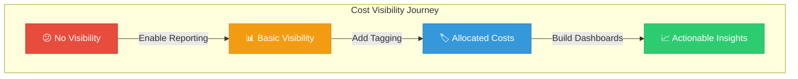
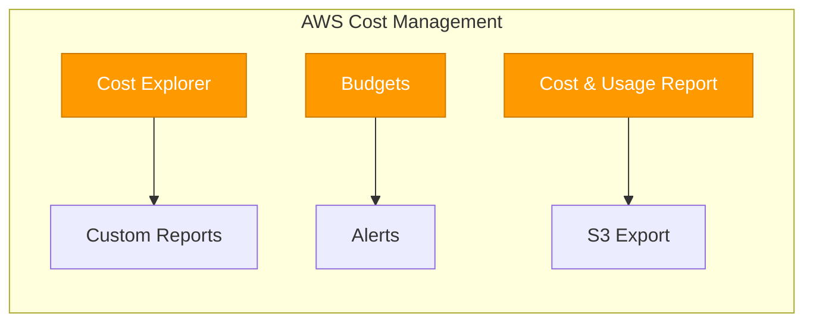
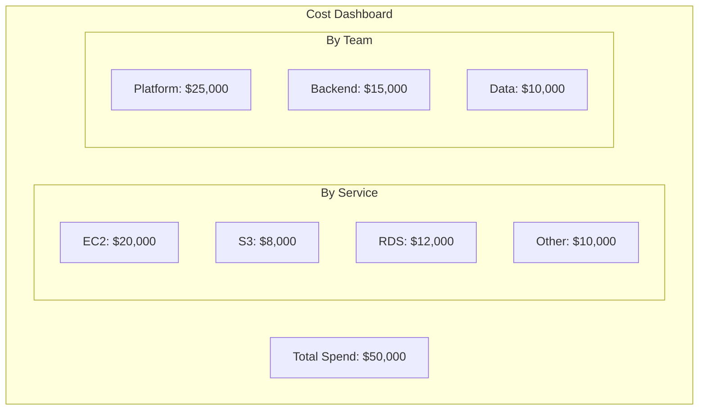
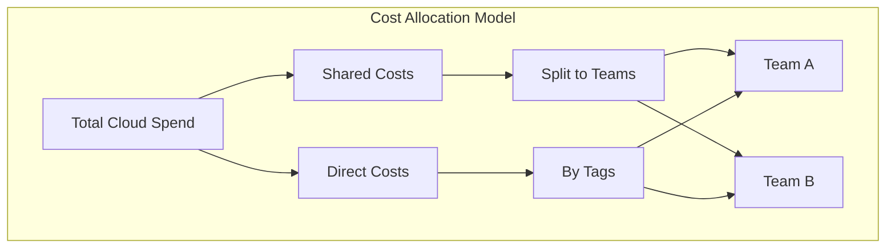

Lesson 03: Cost Visibility

## Learning Objectives
By the end of this lesson, you will:
- Understand why cost visibility is critical
- Implement effective tagging strategies
- Use cost allocation tools
- Create basic cost reports and dashboards

---
## Why Cost Visibility Matters
Without visibility, you can't:
- Know what you're spending
- Identify who's responsible
- Find optimization opportunities
- Forecast future costs



---

## Tagging: The Foundation of Cost Visibility
**Tags** are key-value pairs attached to cloud resources that enable cost tracking and allocation.
### Essential Tags

| Tag Key | Example Values | Purpose |
|---------|---------------|---------|
| `Environment` | prod, staging, dev | Separate production from non-production |
| `Team` | platform, backend, frontend | Allocate costs to teams |
| `Project` | project-alpha, website-v2 | Track project-specific costs |
| `Owner` | john.doe@company.com | Identify resource owners |
| `CostCenter` | CC-1234, engineering-ops | Map to financial systems |
| `Application` | api-gateway, user-service | Track application costs |
### Tagging Strategy Example
```yaml
# Example: EC2 Instance Tags
Tags:
  - Key: Environment
    Value: production
  - Key: Team
    Value: platform-engineering
  - Key: Project
    Value: customer-portal
  - Key: Owner
    Value: jane.smith@company.com
  - Key: CostCenter
    Value: CC-5678
  - Key: Application
    Value: api-gateway
```
### Tagging Best Practices

| Practice              | Description                                 |
| --------------------- | ------------------------------------------- |
| ✅ Standardize naming  | Use consistent formats (lowercase, hyphens) |
| ✅ Make tags mandatory | Enforce through policies                    |
| ✅ Keep it simple      | Start with 5-7 essential tags               |
| ✅ Automate tagging    | Use IaC and automation                      |
| ✅ Audit regularly     | Check for untagged resources                |

---

## Cloud Provider Cost Tools

### AWS Cost Tools


| Tool                    | Purpose              | Best For         |
| ----------------------- | -------------------- | ---------------- |
| **Cost Explorer**       | Visual cost analysis | Daily monitoring |
| **Budgets**             | Budget alerts        | Cost control     |
| **Cost & Usage Report** | Detailed export      | Deep analysis    |

### Azure Cost Tools

| Tool              | Purpose                      | Best For              |
| ----------------- | ---------------------------- | --------------------- |
| **Cost Analysis** | Visualize costs              | Day-to-day monitoring |
| **Budgets**       | Spending limits and alerts   | Cost control          |
| **Advisor**       | Optimization recommendations | Savings opportunities |

### GCP Cost Tools

| Tool                 | Purpose               | Best For          |
| -------------------- | --------------------- | ----------------- |
| **Billing Reports**  | Cost visualization    | Basic monitoring  |
| **Budgets & Alerts** | Budget management     | Cost control      |
| **BigQuery Export**  | Detailed billing data | Advanced analysis |

---
## Creating Cost Reports

### Basic Report Components
Every cost report should answer:
1. **How much are we spending?** - Total costs
2. **What are we spending on?** - By service
3. **Who is spending it?** - By team/owner
4. **Is it trending up or down?** - Over time
### Sample Dashboard Structure


### Cost Report Frequency

| Report Type | Frequency | Audience |
|-------------|-----------|----------|
| **Executive Summary** | Monthly | Leadership |
| **Team Breakdown** | Weekly | Team leads |
| **Anomaly Alerts** | Real-time | FinOps team |
| **Detailed Analysis** | Ad-hoc | Finance |

---
## Finding Untagged Resources

### AWS CLI Example
```bash
# Find untagged EC2 instances
aws ec2 describe-instances \
  --query 'Reservations[].Instances[?!Tags].[InstanceId]' \
  --output text

# Find instances missing specific tags
aws ec2 describe-instances \
  --query "Reservations[].Instances[?!contains(Tags[].Key, 'Environment')].[InstanceId]" \
  --output text
```
### Azure CLI Example
```bash
# Find resources without tags
az resource list --query "[?tags==null].{Name:name, Type:type}"
```
### GCP CLI Example
```bash
# List instances without labels
gcloud compute instances list \
  --filter="labels:*" \
  --format="table(name,zone)"
```

---

## Cost Allocation Reports

### Creating a Cost Allocation View:


### Allocation Methods

| Method | Description | When to Use |
|--------|-------------|-------------|
| **Direct** | Costs tagged to specific teams | Clear ownership |
| **Proportional** | Split by usage percentage | Shared resources |
| **Fixed** | Fixed percentage split | Arbitrary distribution |
| **Even Split** | Divide equally | No clear ownership |

---

## Hands-On Exercise

### Exercise 1: Create a Tagging Policy
Define 5-7 tags for your organization:

| Tag Key | Required? | Values | Purpose |
|---------|-----------|--------|---------|
| | | | |
| | | | |
| | | | |
### Exercise 2: Explore Cost Tools
1. Open your cloud provider's cost tool
2. Filter by a specific date range
3. Group costs by service
4. Identify your top 3 spending services
### Exercise 3: Find Untagged Resources
1. Use the CLI commands above to find untagged resources
2. Document how many untagged resources exist
3. Create a plan to tag them

---
## Key Takeaways
- ✅ Cost visibility requires consistent tagging
- ✅ Start with 5-7 essential tags
- ✅ Use native cloud cost tools first
- ✅ Regular reporting drives accountability
- ✅ Untagged resources are invisible costs

---
## Next Lesson
Continue to **[Lesson 04: Budgeting Basics](Lesson%2004-Budgeting%20Basics.md)** to learn how to set and manage cloud budgets.
