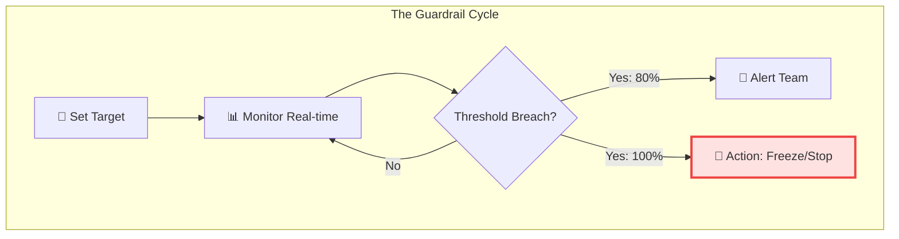

# 📉 Module 04: Budgeting Basics & Guardrails

> **"A budget is not a ceiling; it's a compass. In the cloud, a budget is your first line of defense against the 'Infinite Credit Card' phenomenon."**

## 📚 Overview

Cloud environments are theoretically infinite, which means your bill is also theoretically infinite. **Budgeting** is the practice of setting hard and soft limits on your cloud spend. In this module, we explore how to move from "Reactive" budgeting (checking the bill at the end of the month) to "Proactive" budgeting (automating alerts and actions before you overspend).

## 🎓 Learning Objectives

By the end of this module, you will:
- ✅ Create **Multi-Threshold Budgets** (Actual vs Forecasted).
- ✅ Implement **Anomaly Detection** to catch sudden spikes.
- ✅ Understand the difference between **Soft Alerts** and **Hard Enforcement**.
- ✅ Automate **Corrective Actions** (e.g., shutting down dev labs).
- ✅ Design a **Budget Escalation Matrix** for your organization.

---

## 🏗️ The Three Types of Guardrails

| Type              | Name          | Purpose                                                      |
| :---------------- | :------------ | :----------------------------------------------------------- |
| **Soft Alert**    | Information   | "Hey team, we've used 50% of the budget." No action taken.   |
| **Warning Alert** | Investigation | "80% reached. Stop starting new instances and review."       |
| **Hard Limit**    | Enforcement   | "100% reached. Automatically denying new resource requests." |

---

## 🚀 Professional Pattern: The Friday Night "Reaper"

Sandboxes and Development environments should not run 24/7. Senior DevOps engineers use **Automated Scheduling** to save up to 70% on non-production costs.

**The Pro Standard**:
- **Cron Job**: Mon-Fri, 9 AM - 6 PM.
- **Action**: Use a Lambda function or CloudWatch Event to `STOP` all EC2/RDS instances with the tag `env: dev` outside these hours.
- **Exceptions**: Allow a `override: true` tag for special overnight tests.

---

## 🏆 Real-World DevOps Story: The Friday Night Surprise

**The Scenario**: An engineer's AWS credentials were leaked on a public Slack channel. At 6 PM on a Friday, an attacker used the keys to launch 50 "High-GPU" instances for bitcoin mining in an obscure region (e.g., `me-central-1`).
**The Crisis**: Because the team was offline for the weekend, the miner would have run for 60 hours.
**The Fix**: Fortunately, the company had **Anomaly Detection** enabled. Within 15 minutes of the spike reaching $100, an automated alert triggered an **AWS Budget Action**.
**The Discovery**: The Budget Action was configured to "Attach a Deny-All policy to the IAM User" if an anomaly was detected. The user was locked out, and the instances were flagged for deletion.
**The Lesson**: **Speed of reaction is everything.** Machine-learning based anomaly detection sees what humans miss.

---

## 🛡️ Anomaly Detection: The Silent Watcher

Unlike a fixed budget (e.g., $1,000), **Anomaly Detection** looks for deviations from *normal* behavior.

- **Normal**: You spend $30 every Monday morning.
- **Anomaly**: You spend $300 this Monday morning. 
*Even if you are still way below your $10,000 monthly budget, Anomaly Detection will alert you immediately because the PATTERN has changed.*

---

## ❓ Interview Preparation (Budgeting & Control)

1. **Q: What is the difference between 'Actual' spend and 'Forecasted' spend alerts?**
   *A: 'Actual' spend alerts trigger when you have physically spent the money. 'Forecasted' spend uses machine learning to predict that, based on current usage, you WILL hit the 100% mark by the end of the month. Forecasted alerts are better for proactive management.*

2. **Q: How do you handle a budget breach in a mission-critical Production account?**
   *A: You NEVER kill production resources automatically. Instead, you escalate. Use a high-priority PagerDuty or Slack alert to inform the executive team. In production, we favor Availability over Cost; in Dev, we favor Cost over Availability.*

3. **Q: What is a 'Service Quota' and how does it relate to budgeting?**
   *A: Service Quotas are hard limits set by the cloud provider (e.g., 'You can only have 20 VPCs'). They acts as a 'Safety Valve'. Even if a script goes rogue, it will eventually hit a quota limit and stop creating resources, capping your potential loss.*

4. **Q: Can you automate a budget to shutdown resources in AWS?**
   *A: Yes, using 'AWS Budget Actions'. You can configure a budget to run a SSM Document, a Lambda function, or attach an IAM policy to prevent further spend once a threshold is reached.*

5. **Q: Why should 'Anomaly Detection' be enabled even if you have strict fixed budgets?**
   *A: Fixed budgets only tell you *when* you reach a total. Anomaly detection tells you *if something is weird.* You could have a $50,000 budget and a hacker spends $5,000 in one hour. You're still under budget, but you've been compromised. Anomaly detection catches the hack.*

---

## 📝 Knowledge Check

1. **Which alert type triggers before you've actually spent the money?**
   - [ ] a) Actual Spend Alert
   - [x] b) Forecasted Spend Alert
   - [ ] c) Historical Spend Alert

2. **What is the safest action to take on a Production budget breach?**
   - [ ] a) Auto-terminate all instances
   - [x] b) Send a high-priority Jira/PagerDuty alert to leadership
   - [ ] c) Delete the database

3. **True or False: Anomaly Detection requires manual threshold setting for every service.**
   - [ ] True
   - [x] False (It uses Machine Learning to learn your normal patterns automatically)

4. **Which cloud feature acts as a 'Safety Valve' to limit total resource count?**
   - [ ] a) IAM Policy
   - [x] b) Service Quotas / Limits
   - [ ] c) Cost Explorer

5. **What is the main benefit of the 'Nightly Reaper' pattern?**
   - [x] a) Saves up to 70% on development costs by stopping idle resources
   - [ ] b) Makes the application run faster
   - [ ] c) Backs up the data automatically

---

## 🔗 Next Steps

Congratulations! You've mastered the fundamentals of **FinOps**. From understanding the intersection of Finance and Engineering to setting automated guardrails, you are now ready to implement these practices in the real world.

Return to: **[The Master Hub: Container Orchestration](../../../../README.md)** →
