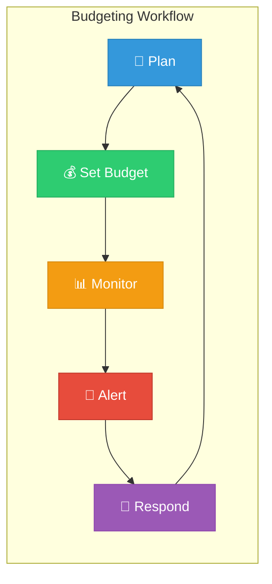
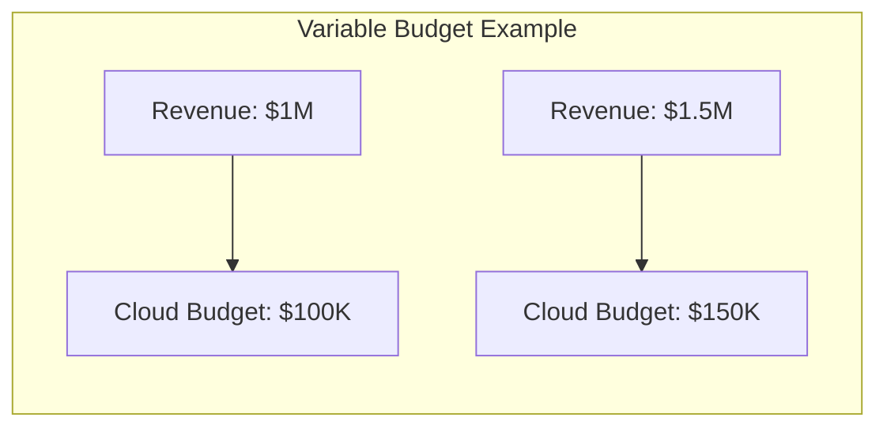
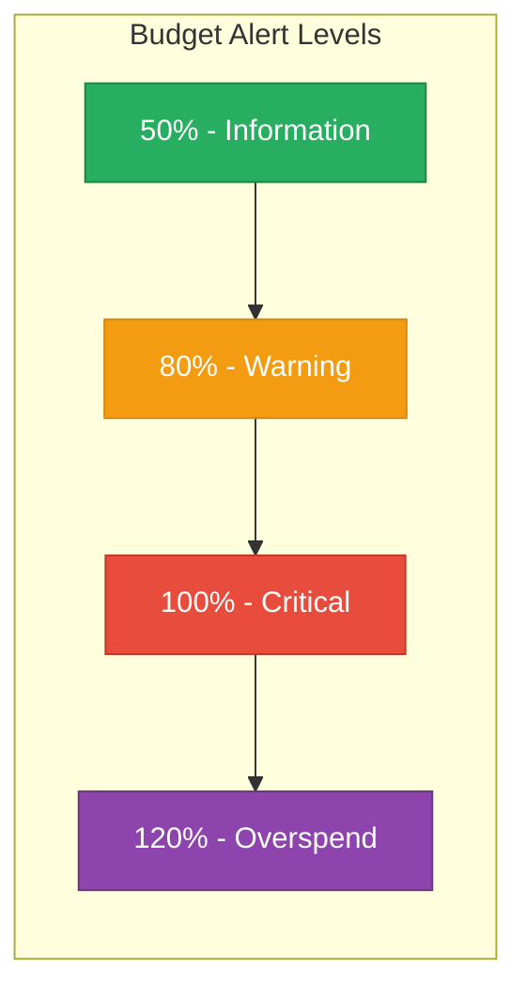

## Learning Objectives
By the end of this lesson, you will:
- Understand cloud budgeting concepts
- Create budgets with alerts
- Set up cost anomaly detection
- Implement basic cost controls

---
## Why Cloud Budgeting Matters
Cloud's pay-as-you-go model means costs can grow unexpectedly. Budgets help you:

- 🎯 Set spending targets
- 🚨 Get alerts before overspending
- 📊 Compare actual vs. planned
- 🔒 Prevent bill shock



---
## Types of Cloud Budgets

### 1. Fixed Budgets
A static amount for a period (monthly, quarterly, annual).

| Pros | Cons |
|------|------|
| Simple to set up | Doesn't account for growth |
| Easy to understand | May need frequent adjustments |
| Clear limits | Can block legitimate needs |

### 2. Variable Budgets
Adjusts based on business metrics (revenue, users, transactions).


| Pros | Cons |
|------|------|
| Scales with business | More complex to set up |
| Flexible | Requires metric tracking |
| Aligned with value | Harder to forecast |
### 3. Zero-Based Budgets
Start from zero and justify each expense every period.

| Pros | Cons |
|------|------|
| Forces cost review | Time-consuming |
| Eliminates waste | Requires detailed knowledge |
| Accurate allocation | May slow decision-making |

---
## Creating Budgets by Provider

### AWS Budgets
**Console Steps:**
1. Navigate to AWS Budgets
2. Click "Create budget"
<b>3. Select budget type</b>
<details>
<summary>Show Answer</summary>
Answer: Cost, Usage, Savings Plans, Reservations
</details>

4. Set budget amount and period
<b>5. Configure alert thresholds</b>
<details>
<summary>Show Answer</summary>
Answer: 50%, 80%, 100%
</details>

6. Add notification recipients

**AWS CLI Example:**
```bash
aws budgets create-budget \
  --account-id 123456789012 \
  --budget '{
    "BudgetName": "Monthly-Development",
    "BudgetLimit": {
      "Amount": "1000",
      "Unit": "USD"
    },
    "TimeUnit": "MONTHLY",
    "BudgetType": "COST"
  }' \
  --notifications-with-subscribers '[{
    "Notification": {
      "NotificationType": "ACTUAL",
      "ComparisonOperator": "GREATER_THAN",
      "Threshold": 80
    },
    "Subscribers": [{
      "SubscriptionType": "EMAIL",
      "Address": "team@example.com"
    }]
  }]'
```

### Azure Budgets
**Console Steps:**
1. Go to Cost Management + Billing
2. Select "Budgets"
3. Click "Add"
<b>4. Set scope</b>
<details>
<summary>Show Answer</summary>
Answer: subscription, resource group
</details>

5. Define budget amount and reset period
6. Configure alert conditions

**Azure CLI Example:**
```bash
az consumption budget create \
  --budget-name "Monthly-Development" \
  --amount 1000 \
  --category "Cost" \
  --time-grain "Monthly" \
  --start-date "2024-01-01" \
  --end-date "2024-12-31"
```

### GCP Budgets

**Console Steps:**
1. Go to Cloud Billing → Budgets & alerts
2. Click "Create budget"
3. Set scope and amount
<b>4. Configure alert thresholds</b>
<details>
<summary>Show Answer</summary>
Answer: %
</details>

5. Connect to Pub/Sub for automation

---
## Alert Thresholds
Set multiple alerts to catch overspending early:


| Threshold | Action | Who to Notify |
|-----------|--------|---------------|
| 50% | Review spending pace | Team lead |
| 80% | Investigate anomalies | FinOps team |
| 100% | Take corrective action | Management |
| 120% | Executive escalation | Finance + Execs |

---

## Cost Anomaly Detection
Anomaly detection automatically identifies unusual spending patterns.

### AWS Cost Anomaly Detection
```bash
# Create anomaly monitor
aws ce create-anomaly-monitor \
  --anomaly-monitor '{
    "MonitorName": "ServiceMonitor",
    "MonitorType": "DIMENSIONAL",
    "MonitorDimension": "SERVICE"
  }'

# Create anomaly subscription
aws ce create-anomaly-subscription \
  --anomaly-subscription '{
    "SubscriptionName": "DailyAlerts",
    "Threshold": 100,
    "Frequency": "DAILY",
    "MonitorArnList": ["arn:aws:ce::123456789012:anomalymonitor/abc123"],
    "Subscribers": [{"Type": "EMAIL", "Address": "finops@example.com"}]
  }'
```

### What Anomaly Detection Catches

| Anomaly Type | Example |
|--------------|---------|
| Sudden spike | EC2 costs jumped 300% overnight |
| Gradual increase | Storage costs growing 20% weekly |
| Unexpected service | New service appeared in billing |
| Data transfer surge | Egress costs 10x normal |

---
## Implementing Cost Controls

### Preventive Controls
Stop overspending before it happens:

| Control | Description | Example |
|---------|-------------|---------|
| **Quotas** | Hard limits on resources | Max 50 EC2 instances |
| **Approval workflows** | Require approval for expensive resources | Large instance types |
| **Sandbox limits** | Restrict development environments | $500/month cap |

### Detective Controls
Identify overspending quickly:

| Control | Description | Example |
|---------|-------------|---------|
| **Budget alerts** | Notify on threshold breach | Email at 80% |
| **Anomaly detection** | Find unusual patterns | ML-based detection |
| **Daily reports** | Regular cost summaries | Morning email |
### Corrective Controls
Respond to overspending:

| Control | Description | Example |
|---------|-------------|---------|
| **Auto shutdown** | Stop resources automatically | Dev environments after hours |
| **Right-sizing** | Resize over-provisioned resources | Downgrade instance types |
| **Resource cleanup** | Remove unused resources | Delete orphaned volumes |

---

## Budget Templates

### Development Environment Budget
```yaml
Budget:
  Name: Development Environment
  Amount: $5,000/month
  Scope: dev-account
  Alerts:
    - Threshold: 50%
      Action: Email team lead
    - Threshold: 80%
      Action: Email FinOps + trigger review
    - Threshold: 100%
      Action: Email management + freeze non-essential resources
```
### Production Environment Budget
```yaml
Budget:
  Name: Production Environment
  Amount: $50,000/month
  Scope: prod-account
  Alerts:
    - Threshold: 70%
      Action: Email FinOps team
    - Threshold: 90%
      Action: Email management + daily monitoring
    - Threshold: 100%
      Action: Executive escalation
  AnomalyDetection: Enabled
  AnomalyThreshold: $500 unexpected
```

---

## Hands-On Challenge

### Challenge 1: Create a Budget
1. Log into your cloud provider console
2. Create a budget with these settings:
   - Name: "Monthly-Lab-Budget"
   - Amount: $100
   - Period: Monthly
   - Alerts: 50%, 80%, 100%

### Challenge 2: Set Up Anomaly Detection
1. Enable anomaly detection for your account
2. Set threshold to $10 for lab environment
3. Configure email notifications

### Challenge 3: Create a Budget Report
Document:
- Total budget across all accounts
- Current spend vs. budget
- Forecast for end of month

---

## Key Takeaways

- ✅ Budgets prevent bill shock
- ✅ Set multiple alert thresholds (50%, 80%, 100%)
- ✅ Enable anomaly detection for early warning
- ✅ Combine preventive, detective, and corrective controls
- ✅ Review and adjust budgets regularly

---

## What's Next?

Congratulations! You've completed the **FinOps Beginner** level! 🎉

Continue your learning:
- 📘 **[Intermediate FinOps](../../../../README.md)** - Cost optimization strategies
- 📕 **[Advanced FinOps](../../../../README.md)** - Enterprise FinOps frameworks
