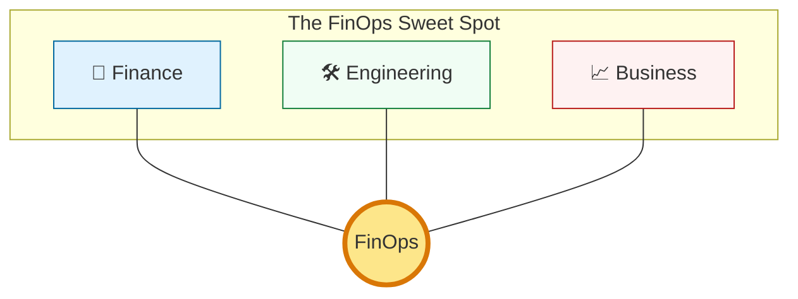
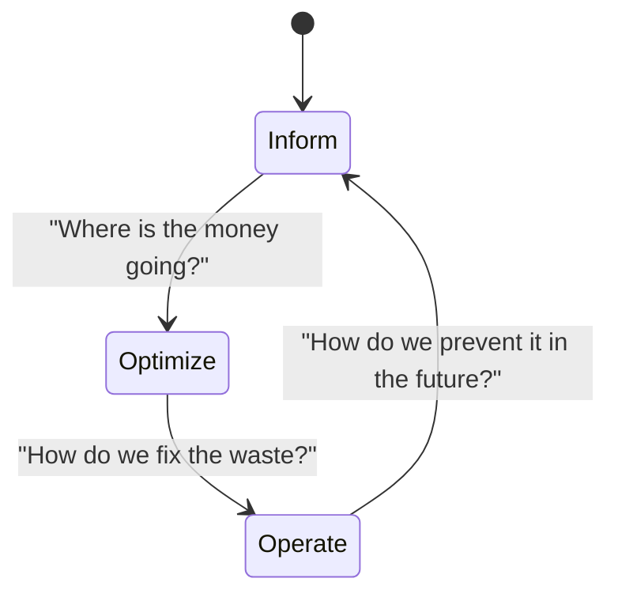

# 💰 Part 01: Introduction to FinOps

> **"In the data center, you paid for the box once. In the cloud, you pay for every second you forget the box is turned on. FinOps is the art of ensuring every cent spent in the cloud delivers a dollar of value."**

## 📚 Overview

**FinOps** (Financial Operations) is an evolving cloud financial management discipline and cultural practice that enables organizations to get maximum business value by helping engineering, finance, technology, and business teams to collaborate on data-driven spending decisions.

It is NOT just about saving money; it is about **making money** by optimizing the unit economics of the cloud.

## 💼 Career Impact: The "Cloud Economist"

As companies spend millions per month in the cloud, they no longer just need engineers who can "build"—they need engineers who can "rationalize."

- **Salary Boost**: FinOps-certified practitioners often see a 15-20% salary premium.
- **Strategic Influence**: You move from being a "cost center" to a "profit enabler," sitting in meetings with the CTO and CFO.
- **Market Demand**: Every Fortune 500 company is currently hiring for FinOps roles to tackle cloud waste.

## 🎓 Learning Objectives

By the end of this module, you will:

- ✅ Define FinOps and its role in modern DevOps environments.
- ✅ Understand the shift from **CapEx** (Fixed) to **OpEx** (Variable) spending.
- ✅ Master the six core **Principles of FinOps**.
- ✅ Identify key stakeholders and their unique responsibilities.
- ✅ Map the **Crawl, Walk, Run** maturity model to your organization.

---

## 🏗️ The Variable Cost Revolution

Traditional IT used **CapEx** (Capital Expenditure): You bought a server, and it sat in a rack for 5 years. In the cloud, we use **OpEx** (Operating Expenditure): You pay for usage by the millisecond.

| Feature | Data Center (CapEx) | Cloud (OpEx) |
| :--- | :--- | :--- |
| **Commitment** | Upfront (Large sum) | Zero (Pay-as-you-go) |
| **Scaling** | Hard (Order more hardware) | Instant (API call) |
| **Visibility** | Simple (One bill for hardware) | Complex (Millions of individual line items) |
| **Responsibility** | Procurement Team | **The Developer** (via code/CLI) |

---

## 🚀 The FinOps Lifecycle

FinOps is not a one-time event; it is a continuous loop consisting of three phases:

1. **Inform**: Mapping spend to teams, tags, and projects. (Visibility)
2. **Optimize**: Finding "Low-Hanging Fruit" like unused disks or over-sized servers. (Action)
3. **Operate**: Automating policies so the "Inform" and "Optimize" steps happen without human intervention. (Governance)

---

## 🏆 Real-World DevOps Story: The Over-Provisioned Sandbox

**The Scenario**: A startup's engineering team launched a "Sandbox" environment for testing a new feature. They used powerful GPU instances (p3.16xlarge) to ensure performance wasn't a bottleneck during development.
**The Crisis**: The developer forgot to shut down the cluster on Friday evening. By Monday morning, the instances had been running for 64 hours at a cost of $24/hour each. The 10-node cluster cost the company **$15,000** over one weekend.
**The Fix**: The FinOps team implemented a simple **"Nightly Reaper"** script that automatically shuts down any instance tagged as `env: sandbox` at 8:00 PM and on weekends.
**The Discovery**: They also realized that most developers only needed high-power GPUs for 15 minutes of testing, not 24 hours of idle time.
**The Lesson**: **Cloud spending is decentralized.** If you don't build automated guardrails, human error will eventually blow your budget.

---

## 🚀 Professional Pattern: The "Tag or Perish" Policy

The foundation of FinOps is **Tagging**. If a resource isn't tagged, you don't know who to charge for it.

**The Pro Standard**: Use an IAM Policy or AWS Service Control Policy (SCP) that **denies** the creation of any resource (EC2, S3, RDS) unless it includes mandatory tags:

- `Project`: Which app is this?
- `Owner`: Who is the human responsible?
- `CostCenter`: Which budget pays for this?

---

## ❓ Interview Preparation (FinOps Basics)

1. **Q: How would you explain FinOps to a CEO who only cares about the bottom line?**
   *A: FinOps isn't just a cost-cutting exercise; it's about transparency. It allows the business to see exactly how much profit we are making per customer by accurately mapping cloud costs to individual products, enabling better pricing and investment decisions.*

2. **Q: Why is FinOps considered a "Cultural Shift" rather than just a set of tools?**
   *A: Because in the cloud, engineers are now the "procurement department." A single line of Terraform code can spend $100,000. FinOps requires developers to take ownership of the financial impact of their technical decisions.*

3. **Q: What is the difference between "Showback" and "Chargeback"?**
   *A: 'Showback' is purely informational—you tell a team how much they spent. 'Chargeback' actually deducts the cloud costs from that specific department's internal budget, creating the highest level of accountability.*

4. **Q: Explain the 'Crawl, Walk, Run' maturity model.**
   *A: 'Crawl' is about getting basic visibility (seeing the bill). 'Walk' is about taking manual actions (right-sizing servers). 'Run' is about full automation (auto-scaling and real-time policy enforcement).*

5. **Q: What are 'Unit Economics' in the context of Cloud spend?**
   *A: It's measuring cost against a business metric. Instead of saying "Our AWS bill is $10k," you say "It costs us $0.05 in cloud resources to process one user transaction." This tells you if your infrastructure is becoming more or less efficient as you scale.*

---

## 📝 Knowledge Check

1. **What is the primary reason for the existence of FinOps?**
   - [ ] a) To move all servers back to the data center
   - [x] b) To manage the variable spend model of the cloud
   - [ ] c) To replace the DevOps team

2. **Which FinOps phase involves right-sizing over-provisioned instances?**
   - [ ] a) Inform
   - [x] b) Optimize
   - [ ] c) Operate

3. **In the 'Crawl, Walk, Run' model, what characterizes the 'Run' stage?**
   - [ ] a) Manual tagging of resources
   - [ ] b) Getting the first monthly bill
   - [x] c) Automated optimization and real-time governance

4. **True or False: FinOps is purely the responsibility of the Finance department.**
   - [ ] True
   - [x] False (It is a cross-functional collaboration)

5. **Which 'Tag' is critical for mapping spend back to a specific department?**
   - [ ] a) `Environment`
   - [ ] b) `Version`
   - [x] c) `CostCenter`

---

## 🔗 Next Steps

You've learned the *why* and the *who*. Now let's dive into the *how*: understanding the actual bills from AWS, Azure, and GCP.

Proceed to: **[Part 02: Cloud Billing Basics](../Part-02-Cloud-Billing-Basics/README.md)** →
