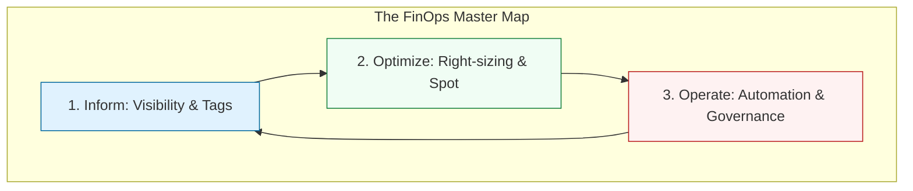

# 💰 Phase 3: FinOps Mastery (Cloud Financial Operations)

> **"In the cloud, every architectural decision is also a financial decision. Engineering without financial awareness is just expensive guessing."**

## 📚 Overview

Modern Cloud Engineering isn't just about building fast systems; it's about building **efficient** ones. **FinOps** is the cultural practice of bringing financial accountability to the variable spend model of the cloud. This module bridges the gap between the "Bill" and the "Infrastructure," teaching you how to treat every dollar as a resource to be optimized.

## 🎓 Curriculum Path

- [01. Introduction](./01-Introduction/Introduction to FinOps.md)
- [02. Billing Basics](./02-Cloud-Billing-Basics/Lesson 02-Cloud Billing Basics.md)
- [03. Cost Visibility](./03-Cost-Visibility/Lesson 03-Cost Visibility.md)
- [04. Budgeting](./04-Budgeting-Basics/Lesson 04-Budgeting Basics.md)

---

## 🏆 The FinOps Practitioner Profile

By completing these modules, you are moving from a standard "SysAdmin" to a "DevOps Financial Architect." You will be able to answer the most terrifying question in Silicon Valley: *"Why did our bill spike by $10,000 yesterday?"*

### Key Skills You Will Master:

- ✅ **Cost Allocation**: Mapping 100% of spend to specific business units.
- ✅ **Utilization Optimization**: Identifying "Ghost" resources and right-sizing them.
- ✅ **Economic Decision Making**: Choosing between Spot, On-Demand, and RIs.
- ✅ **Automated Governance**: Building the "Nightly Reaper" to kill waste.

---

## 🚀 Professional Pattern: The FinOps "Golden Circle"

Success in FinOps isn't about one big change; it's about a thousand tiny ones:

1.  **Monitor**: Real-time alerts.
2.  **Verify**: Tagging compliance.
3.  **Adjust**: Right-sizing.
4.  **Automate**: Repeat.

---

## 🔗 Next Steps

Once you have mastered the financial side of the cloud, it's time to explore the **Model Context Protocol (MCP)** to see how AI agents can help you manage these environments even more efficiently.

Proceed to: **[Phase 3: Model Context Protocol (MCP)](../../../README.md)** →
