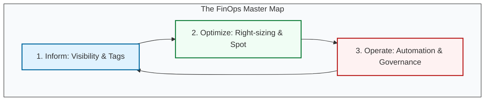

# 💰 Phase 3: FinOps Mastery (Cloud Financial Operations)

> **"In the cloud, every architectural decision is also a financial decision. Engineering without financial awareness is just expensive guessing."**

## 📚 Overview

Modern Cloud Engineering isn't just about building fast systems; it's about building **efficient** ones. **FinOps** is the cultural practice of bringing financial accountability to the variable spend model of the cloud. This module bridges the gap between the "Bill" and the "Infrastructure," teaching you how to treat every dollar as a resource to be optimized.

## Core Concept: The Variable Cost Model
**[REFERENCE: Cost Attribution & Chargeback](./REFERENCE/Cost-Attribution-Chargeback-Ref.md)**

Cloud fundamentally changed the economics of IT:
- **CapEx → OpEx**: No upfront hardware purchases. Pay-as-you-go.
- **Shared Responsibility**: A single EC2 instance might serve 3 teams. Who pays?
- **Unit Economics**: Measure cost per business metric (cost per user, cost per transaction), not just total spend.

> See **[Cost-Attribution-Chargeback-Ref.md](./REFERENCE/Cost-Attribution-Chargeback-Ref.md)** for tagging strategies and showback/chargeback models.

## Enterprise Governance & Optimization
**[REFERENCE: Cost Optimization Strategies](./REFERENCE/Cost-Optimization-Strategies-Ref.md)**

At scale, cost optimization is a continuous process:
- **Right-Sizing**: Monitor actual usage. If CPU < 20%, downsize the instance.
- **Waste Elimination**: Delete zombie resources (unattached EBS volumes, idle load balancers).
- **Commitment Discounts**: Use Reserved Instances/Savings Plans for baseline workload (30-70% discount).
- **Architectural Patterns**: Serverless for sporadic workloads, auto-scaling for variable traffic.

> See **[Cost-Optimization-Strategies-Ref.md](./REFERENCE/Cost-Optimization-Strategies-Ref.md)** for the 80/20 rule and the optimization funnel.

## 🎓 Curriculum Path

1. **[Part 01: Introduction](./Part-01-Introduction/README.md)**: The "Who, what, and why" of Cloud Financial Management.
2. **[Part 02: Billing Basics](./Part-02-Cloud-Billing-Basics/README.md)**: Compute, Storage, and the "Hidden Tax" of Egress.
3. **[Part 03: Cost Visibility](./Part-03-Cost-Visibility/README.md)**: Tagging, reporting, and mapping spend to business units.
4. **[Part 04: Budgeting](./Part-04-Budgeting-Basics/README.md)**: Setting guardrails and automating "The Reaper."

---

## 🏆 The FinOps Practitioner Profile

By completing these modules, you are moving from a standard "SysAdmin" to a "DevOps Financial Architect." You will be able to answer the most terrifying question in Silicon Valley: *"Why did our bill spike by $10,000 yesterday?"*

### Key Skills You Will Master

- ✅ **Cost Allocation**: Mapping 100% of spend to specific business units.
- ✅ **Utilization Optimization**: Identifying "Ghost" resources and right-sizing them.
- ✅ **Economic Decision Making**: Choosing between Spot, On-Demand, and RIs.
- ✅ **Automated Governance**: Building the "Nightly Reaper" to kill waste.

---

## 🚀 Professional Pattern: The "Unit Economics" Mindset

In the legacy world, we looked at "The Total Bill." In the FinOps world, we look at **"Unit Cost"**.

- **Bad Metric**: "Our AWS bill is $50,000/month."
- **Good Metric**: "It costs us **$0.02** in cloud resources to process one user login."

**Why this matters**: If your bill goes from $50k to $100k, that might be a *good* thing if your users grew 10x, because your "Unit Cost" actually dropped.

---

## 🚀 Professional Pattern: The FinOps "Golden Circle"

Success in FinOps isn't about one big change; it's about a thousand tiny ones:

1. **Monitor**: Real-time alerts.
2. **Verify**: Tagging compliance.
3. **Adjust**: Right-sizing.
4. **Automate**: Repeat.

---

## 🏆 Real-World DevOps Story: The Million Dollar Load Balancer

**The Scenario**: A major streaming service noticed their monthly bill for "Internal Data Transfer" was slowly creeping up, eventually hitting $80,000/month.
**The Discovery**: An engineer had configured a cross-region load balancer to handle traffic. Every time a user in New York requested a video, the request was being routed to a server in California, then back to the user.
**The Fix**: They implemented a "Region-Aware" routing policy using Route 53.
**The Lesson**: **Efficiency is an engineering problem.** By changing 10 lines of configuration, they saved the company nearly $1 Million per year.

---

## ❓ Interview Preparation (FinOps Hub)

1. **Q: If a developer says 'I don't care about the bill, I just house-scale everything for safety,' how do you respond?**
   *A: Explain that unmanaged scale is a risk to the company's runway. Over-provisioning isn't 'safety'; it's 'waste.' In DevOps, we use Auto-Scaling to provide safety only when traffic requires it, ensuring we are good stewards of the company's capital.*

2. **Q: What are the 'Three Pillars' of FinOps?**
   *A: Inform (Visibility), Optimize (Efficiency), and Operate (Automation/Culture).*

---

## 📝 Knowledge Check

1. **Which FinOps phase focuses on "mapping spend to specific teams"?**
   - [x] a) Inform
   - [ ] b) Optimize
   - [ ] c) Operate

2. **What is the name of the practice where internal teams pay for their own cloud usage?**
   - [ ] a) Showback
   - [x] b) Chargeback
   - [ ] c) Cash-back

---

## 🔗 Next Steps

The financial blueprint is ready. Let's start with the foundations.

1. Proceed to: **[Part 01: Introduction](./Part-01-Introduction/README.md)** →
2. Return to: **[01-Phase-3 Hub](../README.md)** →
