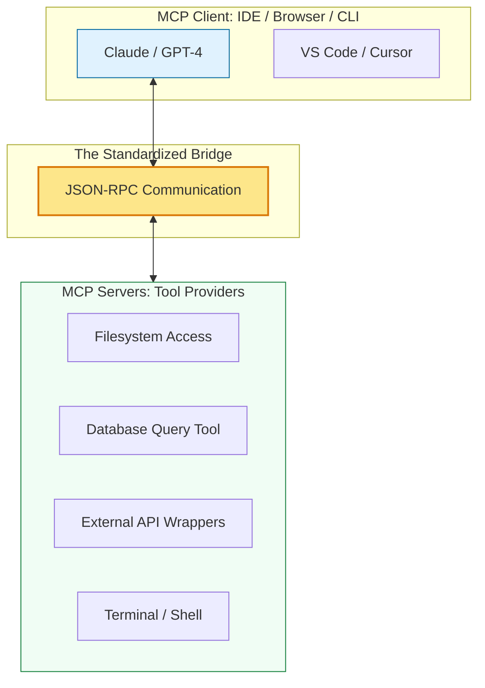

# 🤖 Model Context Protocol (MCP) Mastery

> **"If an AI model is the brain, MCP is the central nervous system. It connects the intelligence of the LLM to the physical tools and data of your local machine and enterprise infrastructure."**



## 📚 Overview

The **Model Context Protocol (MCP)** is an open-source standard that enables AI models to interact with data and tools in a secure, standardized way. Before MCP, every AI tool had to build its own custom "connectors" for databases, filesystems, and APIs. MCP provides a universal "plug-and-play" architecture, allowing any AI (the Client) to safely use any technical resource (the Server).

## 🎓 Learning Objectives

By the end of this module, you will:

- ✅ Define the **Client-Server Architecture** of MCP.
- ✅ Understand the three primitives: **Resources, Tools, and Prompts**.
- ✅ Configure a local MCP server to grant an AI access to your filesystem.
- ✅ Identify security risks and **Sandboxing** best practices.
- ✅ Build a custom MCP server to automate DevOps workflows.

---

## 🏗️ The Three Primitives of MCP

| Primitive | Purpose | Analogy |
| :--- | :--- | :--- |
| **Resources** | Static or dynamic data (Read-only) | A book in a library. |
| **Tools** | Executable functions (Read/Write/Action) | A hammer or a calculator. |
| **Prompts** | Pre-defined templates for the AI | A standardized order form. |

---

## 🛠️ The Local Lab: Filesystem Integration

The most common use case for MCP is giving an AI agent (like the one you are talking to now) the ability to see and edit your code.

```bash
# Example: Starting an MCP Filesystem server
npx @modelcontextprotocol/server-filesystem /path/to/my/project
```

*Once started, the AI doesn't just "guess" what's in your files; it uses the server to fetch the exact content.*

---

## 🏆 Real-World DevOps Story: The "I Forgot How This Works" Incident

**The Scenario**: A Senior DevOps engineer was on-call at 3 AM for a database system they hadn't touched in 12 months. The system was throwing a cryptic `Error 1402`.
**The Crisis**: The manual was 200 pages long, and the engineer couldn't remember the exact SQL commands to check the healthy status of the replication lag.
**The Fix**: The engineer used an IDE connected to an **MCP Database Server**. They simply told the AI: *"Analyze the replication lag and fix any stuck threads."*
**The Discovery**: The AI used the MCP Tool to query the DB, identified a deadlocked transaction, and executed the `KILL` command immediately.
**The Lesson**: **MCP turns AI into a co-pilot with hands.** It moves the model from "Passive Advisor" to "Active Operator."

---

## 🚀 Professional Pattern: The Read-Only Buffer

Never give an AI "Full Administrative" access to your production database via MCP.

**The Pro Standard**:

1. Create a **Read-Only** database user specifically for the MCP Server.
2. Require **Human-in-the-loop** confirmation for any "Tool" that performs a `DELETE` or `UPDATE` action.
3. Audit all MCP logs to see exactly what queries the model is running.

---

## ❓ Interview Preparation (MCP Fundamentals)

1. **Q: Why is MCP better than just copy-pasting code into a chat window?**
    *A: Scale and Context. An LLM has a limited 'Context Window.' You can't paste a 10,000-file repository. MCP allows the model to surgically 'fetch' only the files or data points it needs, when it needs them, reducing errors and saving token costs.*

2. **Q: Explain the security model of MCP.**
    *A: MCP follows a 'Local-First' and 'Permission-Based' model. The AI (Client) can only see the Tools and Resources that you explicitly expose via the MCP Server. If you don't list a directory in the server config, the AI has no way of knowing it exists.*

3. **Q: What is a 'Transport' in MCP?**
    *A: Transport is the underlying communication layer. Most local MCP setups use **stdio** (Standard Input/Output), while remote integrations might use **SSE** (Server-Sent Events) or WebSockets.*

4. **Q: How does MCP solve the 'Hallucination' problem?**
    *A: By providing 'Grounding.' Instead of the AI hallucinating what might be in your database or a file, it uses a Tool to see the real data. If the Tool returns an error, the AI knows the facts have changed.*

5. **Q: Can one MCP Client connect to multiple MCP Servers?**
    *A: Yes! A single AI agent (the Client) can simultaneously talk to a Filesystem Server, a GitHub Server, and a Google Search Server, combining data from all three to solve a single problem.*

---

## 📝 Knowledge Check

1. **In the MCP architecture, what is the 'Client'?**
    - [ ] a) The Database
    - [x] b) The AI application/interface (like VS Code or Claude Desktop)
    - [ ] c) The JSON-RPC protocol

2. **Which primitive is used for actions that change data or perform tasks?**
    - [ ] a) Resources
    - [x] b) Tools
    - [ ] c) Prompts

3. **Which transport protocol is typically used for local MCP servers running in the terminal?**
    - [ ] a) HTTP/3
    - [x] b) stdio
    - [ ] c) Bluetooth

4. **True or False: An AI can access any file on your computer once you enable MCP.**
    - [ ] True
    - [x] False (It can only access what the MCP Server explicitly exposes)

5. **What is 'Grounding' in the context of AI and MCP?**
    - [x] a) Providing real-world data to the model to prevent hallucinations
    - [ ] b) Cutting off the AI's internet access
    - [ ] c) Encrypting the model's weights

---

## 🔗 Next Steps

The bridge is built. Now let's explore how these technologies intersect with decentralized infrastructure and nodes.

Proceed to: **[Module 04: Blockchain DevOps Fundamentals](../04-Blockchain/README.md)** →
