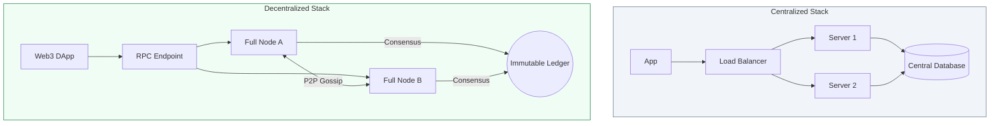

# ⛓️ Blockchain DevOps Fundamentals

> **"In traditional DevOps, we manage servers for a company. In Blockchain DevOps, we manage nodes for a protocol. The machine is the same, but the mission is decentralized."**

## 📚 Overview

**Blockchain DevOps** is the intersection of traditional infrastructure management and decentralized protocols. While the tools (Docker, Kubernetes, Prometheus) remain the same, the **philosophy** shifts. You aren't just keeping a service online; you are participating in a global consensus network where uptime, data integrity, and peer-to-peer connectivity are the highest priorities.

## 🎓 Learning Objectives

By the end of this module, you will:

- ✅ Distinguish between **Full, Light, and Archive Nodes**.
- ✅ Understand **Consensus Mechanisms** (Proof of Work vs. Proof of Stake) from a resource perspective.
- ✅ Manage **P2P Networking** (Gossip protocols and Firewall discovery).
- ✅ Implement **Zero-Downtime Node Upgrades** (Hard Forks vs. Soft Forks).
- ✅ Integrate **Web3 RPC Endpoints** into traditional CI/CD pipelines.

---

## 🏗️ The Node Spectrum

| Node Type | Resource Usage | Best For | Technical Detail |
| :--- | :--- | :--- | :--- |
| **Full Node** | High (Disk/RAM) | Production Apps | Validates all transactions and blocks. |
| **Light Node** | Very Low | Mobile Wallets | Only downloads block headers. |
| **Archive Node** | Extreme (Terabytes) | Data Analytics | Stores the entire history of every state change. |

---

## 🚀 Professional Pattern: The RPC Provider Strategy

Don't run your own nodes unless you have to. Senior DevOps engineers use a "Hybrid" approach to balance cost and control.

**The Strategy**:
- **Primary**: Use a managed provider (Infura, Alchemy, QuickNode) for 99% of read traffic.
- **Failover**: Run a dedicated **Self-Hosted Node** for sensitive transactions and as a backup if the provider goes down.

---

## 🏆 Real-World DevOps Story: The Ghost of the 2TB Sync

**The Scenario**: A DeFi start-up tried to run their own Ethereum Archive node on a standard AWS `m5.xlarge` instance with 500GB of storage.
**The Crisis**: The node started "Syncing" but never finished. After three days, the storage was 100% full, the node crashed, and the application went offline. The team didn't realize that an Archive node requires specialized **NVMe SSDs** and nearly 12TB of space.
**The Fix**: A DevOps Engineer moved the metadata to high-speed storage and switched to a **Snap-Sync Full Node** instead of an Archive node.
**The Discovery**: They realized that 90% of their app's needs could be met with a standard Full Node, saving them $2,000/month in storage costs.
**The Lesson**: **Hardware specs in Blockchain are non-negotiable.** If your disk is too slow, you will never catch up to the current block.

---

## 🛡️ The "Hard Fork" Deployment

In traditional DevOps, you deploy when *you* are ready. In Blockchain, if there is a **Hard Fork**, you MUST upgrade your node before a specific block number or your node will "split" from the network and become useless.

---

## ❓ Interview Preparation (Blockchain DevOps)

1. **Q: What is a 'Gossip Protocol' in blockchain networking?**
    *A: It is a peer-to-peer communication method where a node shares new information (like a transaction or a block) with its immediate neighbors, who then pass it to their neighbors. It is the 'nervous system' of a decentralized network.*

2. **Q: Why are SSDs mandatory for running an Ethereum Full Node?**
    *A: Blockchain nodes perform a massive number of 'Random Read/Write' operations to verify state transitions. Traditional HDDs are too slow to keep up with the global network's speed, causing the node to fall behind (desync).*

3. **Q: What is the difference between a Hard Fork and a Soft Fork?**
    *A: A Hard Fork is a non-backward compatible upgrade; all nodes must upgrade or they will be on a different network. A Soft Fork is backward compatible; older nodes can still function, even if they don't support new features.*

4. **Q: How do you monitor the 'Health' of a blockchain node?**
    *A: Beyond CPU/RAM, the most critical metrics are 'Sync Progress' (how far behind the latest block the node is) and 'Peer Count' (how many other nodes it's talking to).*

5. **Q: Explain 'Inbound vs Outbound' peer discovery.**
    *A: Outbound peers are nodes your server reaches out to. Inbound peers are nodes that find your server. For a healthy network, you must ensure your firewall (Port 30303 for ETH) is open to allow other nodes to find and sync from you.*

---

## 📝 Knowledge Check

1. **Which disk type is essential for a blockchain node to stay in sync?**
    - [ ] a) HDD
    - [ ] b) Magnetic Tape
    - [x] c) NVMe SSD

2. **What does a 'Full Node' do that a 'Light Node' does not?**
    - [ ] a) Provides a pretty UI
    - [x] b) Validates every transaction on the network
    - [ ] c) Stores only the last 10 blocks

3. **In Web3 infrastructure, what does 'RPC' stand for?**
    - [ ] a) Radical Price Change
    - [x] b) Remote Procedure Call
    - [ ] c) Random Protocol Consensus

4. **True or False: If a node falls 1,000 blocks behind, it is considered 'desynced' and may not return valid data.**
    - [x] True
    - [ ] False

5. **What is the common Port used for Ethereum P2P communication?**
    - [ ] a) 80
    - [ ] b) 443
    - [x] c) 30303

---

## 🔗 Next Steps

**Congratulations!** You have completed the **Phase 3: Beginner Foundations** for Container Orchestration, FinOps, MCP, and Blockchain.

Now, it's time to level up and see how these tools are used in multi-cloud and complex enterprise environments.

Proceed to the: **[Phase 4: Intermediate Level](../../../README.md)** →
