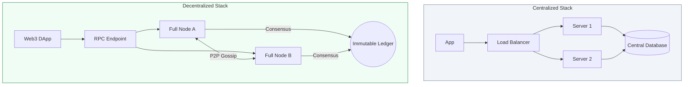

# ⛓️ Phase 3: Blockchain DevOps Fundamentals
> **"In traditional DevOps, we manage servers for a company. In Blockchain DevOps, we manage nodes for a protocol. The machine is the same, but the mission is decentralized."**

---

## 🧠 The Mental Model: The Shared Global Ledger

**The Newbie Struggle**: "I've used databases (SQL/NoSQL) before. Why do I need a 'Blockchain'? It just seems like a slow, expensive database that everyone can see."

**The Engineer Solution**: You realize that a blockchain isn't for *storing data*; it's for **Storing Truth**. In a traditional system, if the company goes bankrupt or the database is deleted, the data is gone. In a blockchain, the data is immortal as long as one node is still running.

Think of it as a **Global Shared Excel Sheet**:
- **Traditional DB**: The boss owns the Excel file on their laptop. If they close it or delete a row, you can't stop them.
- **Blockchain**: Everyone in the world has an identical copy of the Excel file. Every time a new row is added (A transaction), everyone must agree it's valid. Once it's added, it's written in "Digital Ink" and can never be erased.

---

## 📋 Blockchain Node Summary
| Node Type | Analogy | Why we use it | Hardware Requirement |
| :--- | :--- | :--- | :--- |
| **Light Node** | The **Receipt Reader** | Fast verification of transactions. | Low (Laptop/Phone) |
| **Full Node** | The **Security Guard** | Stores the recent state and validates all blocks. | Medium (SSD + 16GB RAM) |
| **Archive Node**| The **Historian** | Stores every transaction since day 1 (the Genesis). | High (Multi-TB NVMe) |
| **Validator** | The **Judge** | Participates in consensus and writes new blocks. | High (Max Uptime + Stake) |

---

## 🛠️ Centralized vs. Decentralized Stack

---

## 🚀 Why does a DevOps Engineer care?
> [!IMPORTANT]
> **Anti-Fragility**: In Web3, your "Deployment" isn't a single server; it's a participant in a global network. As a DevOps engineer, you ensure that your company's connections to the blockchain are never severed. If your node falls out of "Sync," your transactions fail, and you lose money (Slashing/Missed opportunities).

---

## 📚 Overview
**Blockchain DevOps** is the intersection of traditional infrastructure management and decentralized protocols. While the tools (Docker, Kubernetes, Prometheus) remain the same, the **philosophy** shifts. You aren't just keeping a service online; you are participating in a global consensus network where uptime, data integrity, and peer-to-peer connectivity are the highest priorities.

---

## Core Concept: The Decentralized State Machine
**[REFERENCE: Blockchain Node Architecture](./REFERENCE/Blockchain-Node-Architecture-Ref.md)**

A blockchain is a **replicated state machine** with no central authority:
- **State**: The current account balances, smart contract storage, etc.
- **Transactions**: State transitions (Alice sends 1 ETH to Bob).
- **Consensus**: The mechanism that ensures all nodes agree on the same state (PoW, PoS, BFT).
- **P2P Gossip**: How transactions propagate across the network (exponential spread).

---

## Enterprise Governance & Operations
**[REFERENCE: Blockchain Infrastructure & Operations](./REFERENCE/Blockchain-Infrastructure-Operations-Ref.md)**

Running production blockchain infrastructure requires extreme discipline:
- **Hardware**: NVMe SSDs are mandatory (>10k IOPS). HDDs cannot keep up with state updates.
- **High Availability**: Run multiple geographically distributed nodes behind a load balancer.
- **Monitoring**: Track sync status, peer count, disk I/O, and memory. Alert if node falls >100 blocks behind.
- **Disaster Recovery**: Backup validator keys daily. NEVER run two validators with same keys (slashing risk).

---

## 🎓 Curriculum Path
1. **[Part 01: Architecture & Node Types](./Part-01-Architecture-and-Node-Types/README.md)**: The "Who, what, and why" of decentralized infrastructure.
2. **[Part 02: Infrastructure & Resources](./Part-02-Infrastructure-and-Resources/README.md)**: Disk I/O, RAM, and the geometry of P2P networking.
3. **[Part 03: Decentralized Operations](./Part-03-Decentralized-Operations/README.md)**: consensus mechanisms and the RPC management strategy.
4. **[Part 04: Maintenance & Governance](./Part-04-Maintenance-and-Governance/README.md)**: Hard forks, zero-downtime upgrades, and monitoring.

---

## 🏆 The "Blockchain Engineer" Profile
By completing this track, you are moving from a standard "SysAdmin" to a **Web3 Infrastructure Architect**. You will be able to manage the systems that power the decentralized web.

---

## 🚀 Professional Pattern: The "Hybrid RPC" Strategy
In Web3, reliability is achieved by combining managed power with local control.
- **Bad Practice**: Relying 100% on a single managed provider (Infura/Alchemy). If they go down, your app is dead.
- **Pro Standard**: Use a managed provider for the bulk of traffic, but maintain a **self-hosted Full Node** as a local failover.

**Why this matters**: In a decentralized world, owning your own node is the only way to achieve true "Self-Sovereignty" and guaranteed availability during global outages.

---

## 🏆 Real-World DevOps Story: The Million Dollar Disk Lag
**The Scenario**: A DeFi project tried to save money by running an Ethereum node on standard network storage (GP2 volumes).
**The Discovery**: As the network traffic spiked, the disk couldn't keep up with the state updates. The node fell 1,000 blocks behind and started returning stale price data.
**The Fix**: The team upgraded to **Local NVMe SSDs**, increasing IOPS by 10x.
**The Lesson**: **Hardware is your consensus.** If your disk is slow, you aren't just late; you are functionally disconnected from reality.

---

## ❓ Interview Preparation
1. **Q: How would you explain Blockchain DevOps to a traditional SysAdmin?**
   *A: It's the move from 'Company-First' to 'Protocol-First'. We use the same tools (K8s, Docker), but our goal isn't just to serve an app; it's to maintain the health and connectivity of a global peer-to-peer ledger.*

2. **Q: What is 'Gossip' in a P2P context?**
   *A: It is how nodes share information. When your node hears about a new transaction, it 'gossips' it to 8-10 neighbors, who tell their neighbors, until the whole world knows in seconds.*

---

## 📝 Knowledge Check
1. **Which disk technology is required for Ethereum Full Nodes?**
   - [ ] a) HDD
   - [x] b) NVMe SSD
   - [ ] c) Cloud Object Storage (S3)

2. **What is a 'Hard Fork'?**
   - [x] a) A non-backward compatible network upgrade
   - [ ] b) A software bug that duplicates data
   - [ ] c) A way to reboot a server

---

## 🔗 Next Steps
The ledger is waiting. Let's start with the architecture.
1. Proceed to: **[Part 01: Architecture & Node Types](./Part-01-Architecture-and-Node-Types/README.md)** →
2. Return to: **[Phase 3 Hub](../README.md)** →
