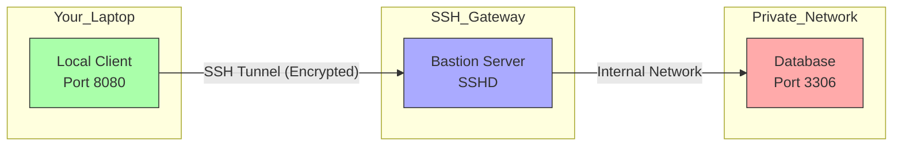
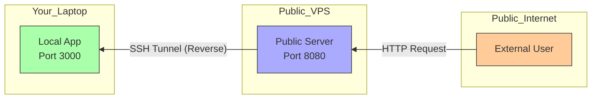
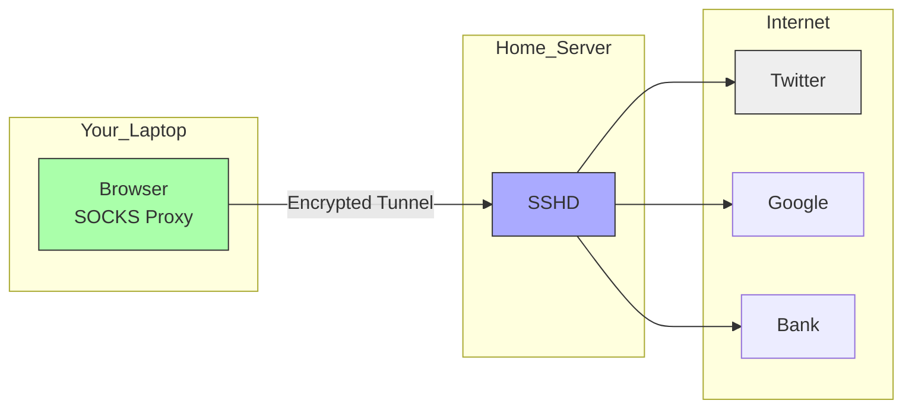

# SSH Tunneling and Port Forwarding

Advanced SSH tunneling techniques for secure network access and service exposure.

## Port Forwarding Types

### Local Port Forwarding

Forward local port to remote service through SSH tunnel.

**Scenario**: You are on your laptop and need to access a database (MySQL on port 3306) on a private server that only accepts connections from the "Bastion" host.



#### Basic Local Forwarding
```bash
# Forward local port 8080 to remote port 80
ssh -L 8080:localhost:80 user@remote-host

# Forward to different host through SSH server
ssh -L 8080:internal-server:80 user@jump-host

# Bind to specific interface
ssh -L 192.168.1.10:8080:localhost:80 user@remote-host

# Multiple port forwards
ssh -L 8080:localhost:80 -L 3306:db-server:3306 user@remote-host
```

#### Persistent Local Forwarding
```bash
# Background process
ssh -f -N -L 8080:localhost:80 user@remote-host

# With keep-alive
ssh -f -N -o ServerAliveInterval=60 -L 8080:localhost:80 user@remote-host

# Auto-reconnect script
#!/bin/bash
while true; do
    ssh -o ServerAliveInterval=60 -o ServerAliveCountMax=3 \
        -L 8080:localhost:80 user@remote-host
    echo "Connection lost, reconnecting in 5 seconds..."
    sleep 5
done
```

### Remote Port Forwarding

Forward remote port to local service through SSH tunnel.

**Scenario**: You are developing a webhook handler on your local laptop (no public IP), and you need to let an external service (like Stripe/GitHub) call your local API.



#### Basic Remote Forwarding
```bash
# Forward remote port 8080 to local port 80
ssh -R 8080:localhost:80 user@remote-host

# Forward to different local host
ssh -R 8080:192.168.1.100:80 user@remote-host

# Bind to all interfaces on remote
ssh -R 0.0.0.0:8080:localhost:80 user@remote-host
```

#### Reverse SSH Tunnel
```bash
# Client behind NAT connects out
ssh -R 2222:localhost:22 user@public-server

# From public server, connect back
ssh -p 2222 client-user@localhost

# Persistent reverse tunnel
#!/bin/bash
# reverse-tunnel.sh
while true; do
    ssh -o ServerAliveInterval=60 -o ExitOnForwardFailure=yes \
        -R 2222:localhost:22 user@public-server
    sleep 10
done
```

### Dynamic Port Forwarding (SOCKS Proxy)

Create SOCKS proxy for dynamic port forwarding.

**Scenario**: You are in a coffee shop with insecure WiFi. You want to route *all* your browser traffic through your secure home server to avoid sniffing.



#### SOCKS Proxy Setup
```bash
# Create SOCKS proxy on port 1080
ssh -D 1080 user@remote-host

# Bind to specific interface
ssh -D 192.168.1.10:1080 user@remote-host

# Background SOCKS proxy
ssh -f -N -D 1080 user@remote-host
```

#### Browser Configuration
```bash
# Firefox proxy settings
network.proxy.type = 1
network.proxy.socks = 127.0.0.1
network.proxy.socks_port = 1080
network.proxy.socks_version = 5

# Chrome with SOCKS proxy
google-chrome --proxy-server="socks5://127.0.0.1:1080"

# curl with SOCKS proxy
curl --socks5 127.0.0.1:1080 http://example.com
```

## Advanced Tunneling

### Multi-Hop Tunneling

#### ProxyJump Configuration
```bash
# ~/.ssh/config
Host target-server
    HostName 10.0.1.100
    ProxyJump jump1.example.com,jump2.example.com
    User admin

# Command line multi-hop
ssh -J jump1.example.com,jump2.example.com admin@10.0.1.100
```

#### Nested Tunnels
```bash
# First tunnel: local -> jump1
ssh -L 2222:jump2.internal:22 user@jump1.example.com

# Second tunnel: through first tunnel
ssh -p 2222 -L 3333:target.internal:22 user@localhost

# Final connection
ssh -p 3333 user@localhost
```

### VPN-like Tunneling

#### TUN/TAP Tunneling
```bash
# Server configuration (/etc/ssh/sshd_config)
PermitTunnel yes

# Create TUN tunnel
ssh -o Tunnel=point-to-point -w 0:0 user@remote-host

# Configure tunnel interfaces
# Local side
sudo ip addr add 10.0.0.1/30 dev tun0
sudo ip link set tun0 up

# Remote side
sudo ip addr add 10.0.0.2/30 dev tun0
sudo ip link set tun0 up

# Add routes
sudo ip route add 192.168.1.0/24 via 10.0.0.2
```

## Tunnel Management

### Automated Tunnel Scripts

#### Tunnel Manager Script
```bash
#!/bin/bash
# tunnel-manager.sh

TUNNEL_CONFIG="/etc/ssh/tunnels.conf"
PID_DIR="/var/run/ssh-tunnels"

mkdir -p "$PID_DIR"

start_tunnel() {
    local name="$1"
    local config="$2"
    local pid_file="$PID_DIR/$name.pid"
    
    if [[ -f "$pid_file" ]] && kill -0 "$(cat "$pid_file")" 2>/dev/null; then
        echo "Tunnel $name already running"
        return 1
    fi
    
    echo "Starting tunnel: $name"
    ssh $config &
    echo $! > "$pid_file"
}

stop_tunnel() {
    local name="$1"
    local pid_file="$PID_DIR/$name.pid"
    
    if [[ -f "$pid_file" ]]; then
        local pid=$(cat "$pid_file")
        if kill -0 "$pid" 2>/dev/null; then
            kill "$pid"
            rm "$pid_file"
            echo "Stopped tunnel: $name"
        else
            rm "$pid_file"
            echo "Tunnel $name was not running"
        fi
    else
        echo "Tunnel $name not found"
    fi
}

case "$1" in
    start)
        while IFS='=' read -r name config; do
            [[ "$name" =~ ^#.*$ ]] && continue
            start_tunnel "$name" "$config"
        done < "$TUNNEL_CONFIG"
        ;;
    stop)
        for pid_file in "$PID_DIR"/*.pid; do
            [[ -f "$pid_file" ]] || continue
            name=$(basename "$pid_file" .pid)
            stop_tunnel "$name"
        done
        ;;
    status)
        for pid_file in "$PID_DIR"/*.pid; do
            [[ -f "$pid_file" ]] || continue
            name=$(basename "$pid_file" .pid)
            pid=$(cat "$pid_file")
            if kill -0 "$pid" 2>/dev/null; then
                echo "✓ $name (PID: $pid)"
            else
                echo "✗ $name (dead)"
                rm "$pid_file"
            fi
        done
        ;;
    *)
        echo "Usage: $0 {start|stop|status}"
        exit 1
        ;;
esac
```

### Health Monitoring

#### Tunnel Health Check
```bash
#!/bin/bash
# tunnel-health.sh

check_local_forward() {
    local port="$1"
    local name="$2"
    
    if nc -z localhost "$port" 2>/dev/null; then
        echo "✓ $name (port $port) - OK"
        return 0
    else
        echo "✗ $name (port $port) - FAILED"
        return 1
    fi
}

check_socks_proxy() {
    local port="$1"
    local name="$2"
    
    if curl -s --socks5 "127.0.0.1:$port" --max-time 5 http://httpbin.org/ip >/dev/null; then
        echo "✓ $name SOCKS proxy (port $port) - OK"
        return 0
    else
        echo "✗ $name SOCKS proxy (port $port) - FAILED"
        return 1
    fi
}

# Check tunnels
check_local_forward 8080 "Web Tunnel"
check_local_forward 3306 "Database Tunnel"
check_socks_proxy 1080 "SOCKS Proxy"
```

## Use Cases and Examples

### Database Access

#### Secure Database Tunneling
```bash
# MySQL tunnel
ssh -L 3306:mysql-server:3306 user@jump-host

# Connect to MySQL through tunnel
mysql -h 127.0.0.1 -P 3306 -u dbuser -p

# PostgreSQL tunnel
ssh -L 5432:postgres-server:5432 user@jump-host

# Connect to PostgreSQL
psql -h 127.0.0.1 -p 5432 -U dbuser -d mydb
```

### Web Development

#### Development Server Access
```bash
# Forward remote development server
ssh -L 3000:localhost:3000 user@dev-server

# Access at http://localhost:3000

# Multiple development services
ssh -L 3000:localhost:3000 \
    -L 3001:localhost:3001 \
    -L 5432:localhost:5432 \
    user@dev-server
```

This comprehensive SSH tunneling guide provides secure network access and service exposure capabilities for complex network environments.