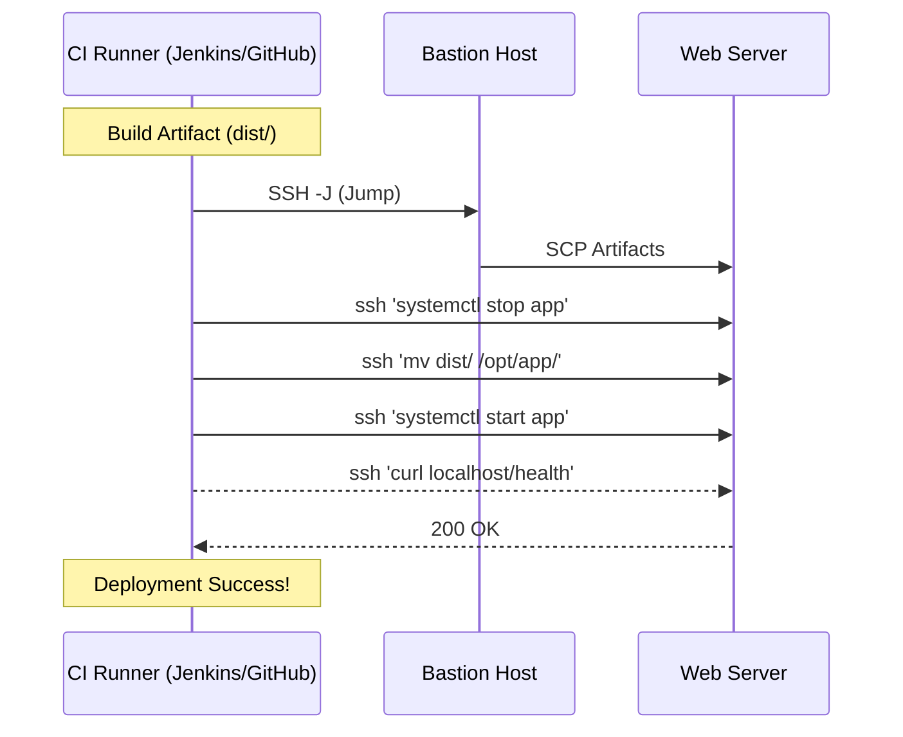

# SSH Automation

Advanced SSH automation techniques for DevOps workflows, deployment pipelines, and infrastructure management.

## Automated SSH Operations

### Batch Operations

#### Multi-Server Command Execution
```bash
#!/bin/bash
# multi-ssh.sh

SERVERS_FILE="servers.txt"
COMMAND="$1"
SSH_USER="admin"
SSH_KEY="~/.ssh/automation_key"

if [[ -z "$COMMAND" ]]; then
    echo "Usage: $0 '<command>'"
    echo "Example: $0 'uptime'"
    exit 1
fi

# Parallel execution function
execute_on_server() {
    local server="$1"
    local cmd="$2"
    
    echo "=== $server ==="
    ssh -i "$SSH_KEY" -o ConnectTimeout=10 -o StrictHostKeyChecking=no \
        "$SSH_USER@$server" "$cmd" 2>&1
    echo
}

# Export function for parallel execution
export -f execute_on_server
export SSH_KEY SSH_USER

# Execute command on all servers in parallel
parallel -j 10 execute_on_server {} "$COMMAND" :::: "$SERVERS_FILE"
```

#### Server Inventory Management
```bash
#!/bin/bash
# server-inventory.sh

INVENTORY_FILE="inventory.json"

# Generate server inventory
generate_inventory() {
    local servers_file="$1"
    
    echo "{"
    echo '  "servers": ['
    
    local first=true
    while IFS= read -r server; do
        [[ "$server" =~ ^#.*$ ]] && continue
        [[ -z "$server" ]] && continue
        
        if [[ "$first" == true ]]; then
            first=false
        else
            echo ","
        fi
        
        echo -n "    {"
        echo -n '"hostname": "'$server'", '
        
        # Get server info
        local info=$(ssh -o ConnectTimeout=5 -o StrictHostKeyChecking=no admin@"$server" \
            'echo "\"os\": \"$(lsb_release -d | cut -f2)\", \"kernel\": \"$(uname -r)\", \"uptime\": \"$(uptime -p)\""' 2>/dev/null)
        
        if [[ -n "$info" ]]; then
            echo -n "$info"
        else
            echo -n '"status": "unreachable"'
        fi
        echo -n "}"
    done < "$servers_file"
    
    echo
    echo "  ]"
    echo "}"
}

# Update inventory
generate_inventory "servers.txt" > "$INVENTORY_FILE"
echo "Inventory updated: $INVENTORY_FILE"
```

### Deployment Automation

### Deployment Automation

Automating deployments via SSH is a foundational DevOps pattern.

#### Typical Workflow



#### Application Deployment Script
Below is a robust script that handles multi-server deployment with health checks.

````carousel

<!-- slide -->
```bash
#!/bin/bash
# simplified-deploy.sh

# 1. Define Target Servers
SERVERS=("10.0.1.10" "10.0.1.11")

# 2. Iterate and Deploy
for ip in "${SERVERS[@]}"; do
    echo "Deploying to $ip"
    
    # Copy new code
    scp -r ./dist user@$ip:/var/www/html/
    
    # Restart Service
    ssh user@$ip "sudo systemctl restart nginx"
done
```
````

### Advanced Deployment Script
For production, you need error handling, rollbacks, and health checks.

```bash
#!/bin/bash
# deploy-app.sh

APP_NAME="myapp"
APP_VERSION="$1"
DEPLOY_ENV="$2"
ROLLBACK_VERSION=""

# Configuration
case "$DEPLOY_ENV" in
    "production")
        SERVERS=("prod1.example.com" "prod2.example.com" "prod3.example.com")
        DEPLOY_USER="deploy"
        APP_PATH="/opt/$APP_NAME"
        ;;
    "staging")
        SERVERS=("staging.example.com")
        DEPLOY_USER="deploy"
        APP_PATH="/opt/$APP_NAME"
        ;;
    *)
        echo "Usage: $0 <version> <environment>"
        echo "Environments: production, staging"
        exit 1
        ;;
esac

# Pre-deployment checks
pre_deploy_check() {
    local server="$1"
    
    echo "Pre-deployment check on $server..."
    
    # Check server connectivity
    if ! ssh -o ConnectTimeout=10 "$DEPLOY_USER@$server" exit; then
        echo "✗ Cannot connect to $server"
        return 1
    fi
    
    # Check disk space
    local disk_usage=$(ssh "$DEPLOY_USER@$server" "df $APP_PATH | tail -1 | awk '{print \$5}' | sed 's/%//'")
    if [[ "$disk_usage" -gt 80 ]]; then
        echo "✗ Disk usage too high on $server: ${disk_usage}%"
        return 1
    fi
    
    # Check if application is running
    if ssh "$DEPLOY_USER@$server" "systemctl is-active $APP_NAME" | grep -q "active"; then
        ROLLBACK_VERSION=$(ssh "$DEPLOY_USER@$server" "readlink $APP_PATH/current | xargs basename")
        echo "✓ Current version: $ROLLBACK_VERSION"
    fi
    
    echo "✓ Pre-deployment check passed for $server"
    return 0
}

# Deploy to single server
deploy_to_server() {
    local server="$1"
    local version="$2"
    
    echo "Deploying $APP_NAME v$version to $server..."
    
    # Create deployment directory
    ssh "$DEPLOY_USER@$server" "mkdir -p $APP_PATH/releases/$version"
    
    # Upload application files
    rsync -avz --delete -e ssh "./dist/" "$DEPLOY_USER@$server:$APP_PATH/releases/$version/"
    
    # Update configuration
    scp "config/$DEPLOY_ENV.conf" "$DEPLOY_USER@$server:$APP_PATH/releases/$version/config.conf"
    
    # Create symlink
    ssh "$DEPLOY_USER@$server" "ln -sfn $APP_PATH/releases/$version $APP_PATH/current"
    
    # Restart application
    ssh "$DEPLOY_USER@$server" "sudo systemctl restart $APP_NAME"
    
    # Health check
    sleep 5
    if ssh "$DEPLOY_USER@$server" "curl -f http://localhost:8080/health" &>/dev/null; then
        echo "✓ Deployment successful on $server"
        return 0
    else
        echo "✗ Health check failed on $server"
        return 1
    fi
}

# Rollback function
rollback_server() {
    local server="$1"
    
    if [[ -n "$ROLLBACK_VERSION" ]]; then
        echo "Rolling back $server to version $ROLLBACK_VERSION..."
        ssh "$DEPLOY_USER@$server" "ln -sfn $APP_PATH/releases/$ROLLBACK_VERSION $APP_PATH/current"
        ssh "$DEPLOY_USER@$server" "sudo systemctl restart $APP_NAME"
    fi
}

# Main deployment process
main() {
    if [[ -z "$APP_VERSION" ]]; then
        echo "Usage: $0 <version> <environment>"
        exit 1
    fi
    
    echo "Starting deployment of $APP_NAME v$APP_VERSION to $DEPLOY_ENV"
    
    # Pre-deployment checks
    for server in "${SERVERS[@]}"; do
        if ! pre_deploy_check "$server"; then
            echo "Pre-deployment check failed. Aborting."
            exit 1
        fi
    done
    
    # Deploy to all servers
    local failed_servers=()
    for server in "${SERVERS[@]}"; do
        if ! deploy_to_server "$server" "$APP_VERSION"; then
            failed_servers+=("$server")
        fi
    done
    
    # Handle failures
    if [[ ${#failed_servers[@]} -gt 0 ]]; then
        echo "Deployment failed on: ${failed_servers[*]}"
        
        # Rollback failed servers
        for server in "${failed_servers[@]}"; do
            rollback_server "$server"
        done
        
        exit 1
    fi
    
    echo "✓ Deployment completed successfully"
    
    # Cleanup old releases (keep last 5)
    for server in "${SERVERS[@]}"; do
        ssh "$DEPLOY_USER@$server" "cd $APP_PATH/releases && ls -t | tail -n +6 | xargs rm -rf"
    done
}

main "$@"
```

### Configuration Management

#### SSH Configuration Deployment
```bash
#!/bin/bash
# deploy-ssh-config.sh

CONFIG_REPO="/etc/ssh-configs"
SERVERS_FILE="$CONFIG_REPO/servers.txt"
BACKUP_DIR="/tmp/ssh-backup-$(date +%Y%m%d-%H%M%S)"

# Backup existing configurations
backup_configs() {
    echo "Backing up existing SSH configurations..."
    mkdir -p "$BACKUP_DIR"
    
    while IFS= read -r server; do
        [[ "$server" =~ ^#.*$ ]] && continue
        [[ -z "$server" ]] && continue
        
        echo "Backing up $server..."
        scp -r "root@$server:/etc/ssh/" "$BACKUP_DIR/$server/" 2>/dev/null || {
            echo "Warning: Could not backup $server"
        }
    done < "$SERVERS_FILE"
}

# Deploy SSH configuration
deploy_ssh_config() {
    local server="$1"
    local config_type="$2"
    
    echo "Deploying SSH config to $server ($config_type)..."
    
    # Copy configuration files
    scp "$CONFIG_REPO/sshd_config.$config_type" "root@$server:/etc/ssh/sshd_config"
    scp "$CONFIG_REPO/ssh_config.$config_type" "root@$server:/etc/ssh/ssh_config"
    
    # Copy host keys if they don't exist
    for key_type in rsa ed25519 ecdsa; do
        if ! ssh "root@$server" "test -f /etc/ssh/ssh_host_${key_type}_key"; then
            scp "$CONFIG_REPO/host_keys/ssh_host_${key_type}_key*" "root@$server:/etc/ssh/"
        fi
    done
    
    # Set proper permissions
    ssh "root@$server" "chmod 600 /etc/ssh/ssh_host_*_key"
    ssh "root@$server" "chmod 644 /etc/ssh/ssh_host_*_key.pub"
    ssh "root@$server" "chmod 644 /etc/ssh/sshd_config /etc/ssh/ssh_config"
    
    # Test configuration
    if ssh "root@$server" "sshd -t"; then
        echo "✓ Configuration valid on $server"
        
        # Restart SSH service
        ssh "root@$server" "systemctl restart sshd"
        echo "✓ SSH service restarted on $server"
    else
        echo "✗ Invalid configuration on $server"
        return 1
    fi
}

# Main function
main() {
    local config_type="${1:-default}"
    
    if [[ ! -f "$CONFIG_REPO/sshd_config.$config_type" ]]; then
        echo "Configuration type '$config_type' not found"
        exit 1
    fi
    
    # Backup existing configurations
    backup_configs
    
    # Deploy to all servers
    while IFS= read -r server; do
        [[ "$server" =~ ^#.*$ ]] && continue
        [[ -z "$server" ]] && continue
        
        deploy_ssh_config "$server" "$config_type"
    done < "$SERVERS_FILE"
    
    echo "SSH configuration deployment completed"
    echo "Backup location: $BACKUP_DIR"
}

main "$@"
```

## Infrastructure as Code

### Terraform SSH Integration

#### SSH Key Management with Terraform
```hcl
# ssh-keys.tf

# Generate SSH key pair
resource "tls_private_key" "ssh_key" {
  algorithm = "ED25519"
}

# Save private key locally
resource "local_file" "private_key" {
  content  = tls_private_key.ssh_key.private_key_openssh
  filename = "${path.module}/keys/id_ed25519"
  file_permission = "0600"
}

# Save public key locally
resource "local_file" "public_key" {
  content  = tls_private_key.ssh_key.public_key_openssh
  filename = "${path.module}/keys/id_ed25519.pub"
  file_permission = "0644"
}

# AWS Key Pair
resource "aws_key_pair" "deployer" {
  key_name   = "deployer-key"
  public_key = tls_private_key.ssh_key.public_key_openssh
}

# EC2 Instance with SSH access
resource "aws_instance" "web" {
  ami           = "ami-0c55b159cbfafe1d0"
  instance_type = "t3.micro"
  key_name      = aws_key_pair.deployer.key_name
  
  vpc_security_group_ids = [aws_security_group.ssh.id]
  
  # Configure SSH access
  provisioner "remote-exec" {
    inline = [
      "sudo useradd -m -s /bin/bash deploy",
      "sudo mkdir -p /home/deploy/.ssh",
      "echo '${tls_private_key.ssh_key.public_key_openssh}' | sudo tee /home/deploy/.ssh/authorized_keys",
      "sudo chown -R deploy:deploy /home/deploy/.ssh",
      "sudo chmod 700 /home/deploy/.ssh",
      "sudo chmod 600 /home/deploy/.ssh/authorized_keys"
    ]
    
    connection {
      type        = "ssh"
      user        = "ec2-user"
      private_key = tls_private_key.ssh_key.private_key_openssh
      host        = self.public_ip
    }
  }
}

# Security Group for SSH
resource "aws_security_group" "ssh" {
  name_prefix = "ssh-access"
  
  ingress {
    from_port   = 22
    to_port     = 22
    protocol    = "tcp"
    cidr_blocks = ["10.0.0.0/8"]  # Restrict to internal network
  }
  
  egress {
    from_port   = 0
    to_port     = 0
    protocol    = "-1"
    cidr_blocks = ["0.0.0.0/0"]
  }
}
```

### Ansible SSH Automation

#### Dynamic Inventory with SSH
```yaml
# ansible-ssh-setup.yml
---
- name: Configure SSH access for servers
  hosts: all
  become: yes
  vars:
    ssh_users:
      - name: deploy
        key: "{{ lookup('file', 'keys/deploy.pub') }}"
      - name: monitoring
        key: "{{ lookup('file', 'keys/monitoring.pub') }}"
  
  tasks:
    - name: Create SSH users
      user:
        name: "{{ item.name }}"
        shell: /bin/bash
        create_home: yes
        groups: sudo
      loop: "{{ ssh_users }}"
    
    - name: Create .ssh directory
      file:
        path: "/home/{{ item.name }}/.ssh"
        state: directory
        owner: "{{ item.name }}"
        group: "{{ item.name }}"
        mode: '0700'
      loop: "{{ ssh_users }}"
    
    - name: Add SSH public keys
      authorized_key:
        user: "{{ item.name }}"
        key: "{{ item.key }}"
        state: present
      loop: "{{ ssh_users }}"
    
    - name: Configure sudo access
      lineinfile:
        path: /etc/sudoers.d/ssh-users
        line: "{{ item.name }} ALL=(ALL) NOPASSWD:ALL"
        create: yes
        mode: '0440'
      loop: "{{ ssh_users }}"
```

## CI/CD Integration

### Jenkins SSH Integration

#### Jenkins Pipeline with SSH
```groovy
// Jenkinsfile
pipeline {
    agent any
    
    environment {
        SSH_KEY = credentials('deployment-ssh-key')
        DEPLOY_SERVERS = 'prod1.example.com,prod2.example.com'
    }
    
    stages {
        stage('Build') {
            steps {
                sh 'make build'
                archiveArtifacts artifacts: 'dist/**', fingerprint: true
            }
        }
        
        stage('Deploy') {
            steps {
                script {
                    def servers = env.DEPLOY_SERVERS.split(',')
                    
                    parallel servers.collectEntries { server ->
                        ["Deploy to ${server}": {
                            sshagent([env.SSH_KEY]) {
                                sh """
                                    # Copy application files
                                    rsync -avz --delete dist/ deploy@${server}:/opt/app/
                                    
                                    # Restart application
                                    ssh deploy@${server} 'sudo systemctl restart myapp'
                                    
                                    # Health check
                                    ssh deploy@${server} 'curl -f http://localhost:8080/health'
                                """
                            }
                        }]
                    }
                }
            }
        }
    }
    
    post {
        failure {
            script {
                // Rollback on failure
                def servers = env.DEPLOY_SERVERS.split(',')
                servers.each { server ->
                    sshagent([env.SSH_KEY]) {
                        sh "ssh deploy@${server} '/opt/scripts/rollback.sh'"
                    }
                }
            }
        }
    }
}
```

### GitHub Actions SSH Deployment

#### SSH Deployment Workflow
```yaml
# .github/workflows/deploy.yml
name: Deploy Application

on:
  push:
    branches: [main]

jobs:
  deploy:
    runs-on: ubuntu-latest
    
    steps:
    - uses: actions/checkout@v3
    
    - name: Setup SSH
      uses: webfactory/ssh-agent@v0.7.0
      with:
        ssh-private-key: ${{ secrets.SSH_PRIVATE_KEY }}
    
    - name: Add known hosts
      run: |
        mkdir -p ~/.ssh
        echo "${{ secrets.KNOWN_HOSTS }}" >> ~/.ssh/known_hosts
    
    - name: Build application
      run: |
        npm install
        npm run build
    
    - name: Deploy to servers
      run: |
        servers=("prod1.example.com" "prod2.example.com")
        
        for server in "${servers[@]}"; do
          echo "Deploying to $server..."
          
          # Copy files
          rsync -avz --delete dist/ deploy@$server:/opt/app/
          
          # Restart service
          ssh deploy@$server 'sudo systemctl restart myapp'
          
          # Health check
          if ssh deploy@$server 'curl -f http://localhost:8080/health'; then
            echo "✓ Deployment successful on $server"
          else
            echo "✗ Deployment failed on $server"
            exit 1
          fi
        done
```

## Monitoring and Alerting

### SSH Connection Monitoring
```bash
#!/bin/bash
# ssh-monitor.sh

ALERT_EMAIL="admin@example.com"
SERVERS_FILE="/etc/monitoring/servers.txt"
LOG_FILE="/var/log/ssh-monitor.log"

check_ssh_connectivity() {
    local server="$1"
    local timeout=10
    
    if timeout "$timeout" ssh -o BatchMode=yes -o ConnectTimeout="$timeout" \
       monitoring@"$server" exit 2>/dev/null; then
        echo "$(date): ✓ $server - SSH OK" >> "$LOG_FILE"
        return 0
    else
        echo "$(date): ✗ $server - SSH FAILED" >> "$LOG_FILE"
        return 1
    fi
}

# Monitor all servers
failed_servers=()
while IFS= read -r server; do
    [[ "$server" =~ ^#.*$ ]] && continue
    [[ -z "$server" ]] && continue
    
    if ! check_ssh_connectivity "$server"; then
        failed_servers+=("$server")
    fi
done < "$SERVERS_FILE"

# Send alerts for failed servers
if [[ ${#failed_servers[@]} -gt 0 ]]; then
    {
        echo "SSH connectivity alert!"
        echo "Failed servers: ${failed_servers[*]}"
        echo "Time: $(date)"
    } | mail -s "SSH Connectivity Alert" "$ALERT_EMAIL"
fi
```

This comprehensive SSH automation guide provides enterprise-grade automation capabilities for deployment, configuration management, and infrastructure operations.