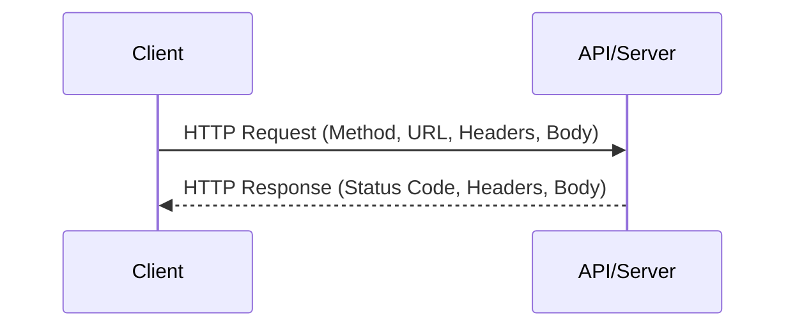

# API Basics: Fundamentals for DevOps

An **API (Application Programming Interface)** is a set of rules that allow one software application to talk to another. In DevOps, nearly everything is an API call—from triggering a Jenkins build to spinning up an AWS EC2 instance.

---

## 1. What is an API?

Think of an API as a **waiter** in a restaurant. 
- You (the **Client**) are at the table.
- The kitchen (the **Server**) prepares the food.
- The waiter (the **API**) takes your order, tells the kitchen what to do, and brings the food back to you.

### Why DevOps Engineers Care:
Everything we automate involves APIs. Infrastructure as Code (Terraform), CI/CD pipelines, and Cloud Providers all expose APIs for automation.

---

## 2. HTTP: The Language of the Web

Most modern APIs use **HTTP (Hypertext Transfer Protocol)**.

### Request vs. Response


### Common HTTP Methods (Verbs)
| Method | Action | Example |
| :--- | :--- | :--- |
| **GET** | Retrieve data | Get user profile info |
| **POST** | Create data | Create a new user account |
| **PUT/PATCH** | Update data | Change a user's password |
| **DELETE** | Remove data | Delete a user account |

---

## 3. API Response: Status Codes

The server tells the client how the request went using a 3-digit number.

| Code | Meaning | Key Categories |
| :--- | :--- | :--- |
| **200 OK** | Success! | **2xx** = Success |
| **201 Created** | New resource created | **2xx** = Success |
| **400 Bad Request** | Client error (invalid syntax) | **4xx** = Client Error |
| **401 Unauthorized**| No valid credentials | **4xx** = Client Error |
| **403 Forbidden** | Credentials provided, but no access | **4xx** = Client Error |
| **404 Not Found** | URL does not exist | **4xx** = Client Error |
| **500 Server Error**| Something broke on the server | **5xx** = Server Error |
| **503 Unavailable**| Server is overloaded/down | **5xx** = Server Error |

---

## 4. Data Formats: JSON vs. XML

### JSON (JavaScript Object Notation)
The standard for modern APIs. Easy for humans to read and machines to parse.
```json
{
  "user": "Alice",
  "id": 123,
  "roles": ["Dev", "DevOps"]
}
```

### XML (Extensible Markup Language)
Older, more verbose. Still used in legacy enterprise systems.
```xml
<user>
  <name>Alice</name>
  <id>123</id>
</user>
```

---

## 5. Tools of the Trade

1.  **cURL**: CLI tool for making requests.
    ```bash
    curl -X GET https://api.github.com/users/octocat
    ```
2.  **Postman**: GUI application for testing and documenting APIs.
3.  **Insomnia**: A lightweight alternative to Postman.

---

## Real-World Scenarios

### Scenario 1: Troubleshooting a CI Failure
**Context**: A Jenkins job fails while trying to upload an artifact to Nexus.
**Observation**: The logs show `HTTP 401 Unauthorized`.
**Fix**: The DevOps engineer realizes the API token used in the Jenkins credentials has expired. Regenerating the token fixes the issue.

### Scenario 2: Rate Limiting
**Context**: A script that pulls AWS resource data starts failing.
**Observation**: The response code is `429 Too Many Requests`.
**Fix**: Add an "Exponential Backoff" (retrying after a short delay) to the script to respect the API's limits.

---

## Interview Questions (Beginner)

1. **What does REST stand for?**
   - Representational State Transfer.
2. **What is the difference between POST and PUT?**
   - Typically, POST is for creating new resources, while PUT is for replacing/updating an existing resource.
3. **What is a "Header" in an API request?**
   - Metadata passed with the request, such as `Content-Type: application/json` or authentication tokens.
4. **What does a 5xx series status code indicate?**
   - A server-side error.
5. **Why is JSON preferred over XML in modern APIs?**
   - Smaller size (bandwidth efficient) and easier to parse with JavaScript.

---

## Knowledge Quiz

1. **Which HTTP method is used to retrieve data?**
   - A) POST
   - B) GET
   - C) DELETE
   - D) PATCH

2. **A status code of 404 means:**
   - A) Success
   - B) Internal Server Error
   - C) Permission Denied
   - D) Not Found

3. **Which file format is primarily used by modern REST APIs?**
   - A) CSV
   - B) JSON
   - C) TXT
   - D) PDF

4. **Which tool is a command-line utility for making API requests?**
   - A) Postman
   - B) Docker
   - C) cURL
   - D) Nginx

5. **A 201 status code confirms:**
   - A) The request was received
   - B) A resource was successfully created
   - C) The server is down
   - D) Bad request syntax

<details>
<summary><b>View Answers</b></summary>
1: B, 2: D, 3: B, 4: C, 5: B
</details>
