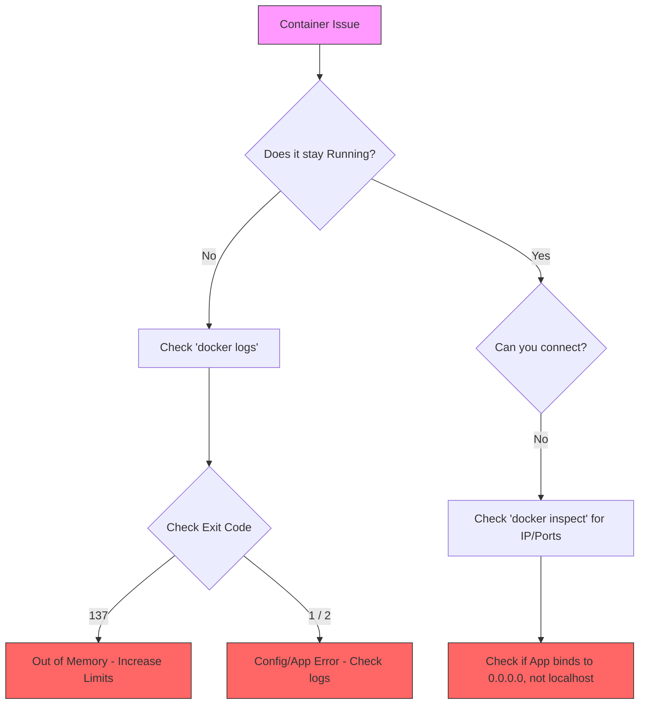

# Docker Debugging & Troubleshooting

Debugging is one of the most essential skills when working with Docker. When a container fails to start, crashes, or behaves unexpectedly, you need a systematic approach to find the root cause.

## 1. Essential Debugging Commands

The "Big Four" commands for inspecting what's happening inside or around your containers:

| Command | Usage | What it tells you |
| :--- | :--- | :--- |
| `docker logs <container>` | `docker logs -f my-app` | Shows stdout/stderr from the main process. |
| `docker inspect <id>` | `docker inspect my-app` | Detailed JSON metadata (IP, mounts, env, config). |
| `docker top <id>` | `docker top my-app` | Lists running processes inside the container. |
| `docker stats` | `docker stats` | Live resource usage (CPU, Memory, I/O). |

---

## 2. Interactive Debugging

Sometimes logs aren't enough, and you need to "step inside" to look around.

### `docker exec` (Best for running containers)
Run a shell inside an already running container.
```bash
docker exec -it <container_name> sh
# or bash if available
docker exec -it <container_name> bash
```

### `docker run --rm -it` (Best for containers that won't start)
If a container crashes immediately, try starting it with an interactive shell as the entrypoint to bypass the failing app.
```bash
docker run --rm -it --entrypoint sh <image_name>
```

---

## 3. The Role of `DEBUG` Environment Variables

Many official and popular images include built-in debugging modes that can be toggled using environment variables.

### Common Examples:
- **Node.js**: `DEBUG=express:*` or `DEBUG=*` (uses the `debug` package).
- **Python (Flask)**: `FLASK_DEBUG=1`.
- **Nginx**: Set the log level in the config or use the `nginx-debug` binary.
- **Spring Boot**: `DEBUG=true` or `--debug`.

### How to set them in Docker Compose:
```yaml
services:
  api:
    image: my-node-app
    environment:
      - DEBUG=myapp:*
      - NODE_ENV=development
```

---

## 4. Docker Compose Debugging

Compose provides higher-level tools for multi-container troubleshooting.

- **Follow all logs**: `docker compose logs -f` (colored by service).
- **Service Status**: `docker compose ps` (shows which service exited and with what code).
- **Container Events**: `docker compose events` (real-time stream of Docker actions).

---

## 5. Troubleshooting Flowchart

Use this logic when a container fails:



---

## 6. Common Error Codes

| Code | Meaning | Typical Fix |
| :--- | :--- | :--- |
| **0** | Success | Container finished its task. |
| **1** | Application Crash | Check logs for stack traces. |
| **127** | Command Not Found | Fix the `CMD` or `ENTRYPOINT` path. |
| **137** | Terminated (SIGKILL) | Usually **OOM (Out of Memory)**. Increase memory limits. |
| **139** | Segmentation Fault | Memory access error in native code. |

---

## 7. Best Practices for Debuggable Containers

1. **Log to Stdout/Stderr**: Don't log to files inside the container; let Docker handle the logs.
2. **Use Healthchecks**: Let Compose know when a service is truly "ready", not just "started".
3. **Include basic tools**: If using Alpine, keep `curl`, `netstat`, or `iproute2` available for network debugging.
4. **Keep images small**: Production images should be thin, but development overrides can add debug tools.

---

## 8. Real-Life Scenarios

### Scenario 1: "It works on my machine, but fails in CI."
*   **Problem**: A developer's container runs perfectly on their local machine, but exits with an error as soon as it starts in the Jenkins CI/CD pipeline.
*   **Debugging Steps**:
    1.  **Check `docker logs`**: This is the first step. The logs will almost always contain the error message or stack trace that reveals the root cause.
    2.  **Check Environment Variables**: The CI environment might be missing a critical environment variable (`-e`) that the application needs to start (e.g., `DATABASE_URL`, `API_KEY`). Use `docker inspect` on a running container (if possible) or check the CI script.
    3.  **Resource Limits**: The CI runner may have stricter memory or CPU limits. An exit code of `137` suggests the container was killed due to low memory (OOMKilled).
    4.  **Entrypoint Issues**: The CI environment might be calling the container with a different command or entrypoint.

### Scenario 2: Container is in a Restart Loop
*   **Problem**: You run `docker ps` and see a container is constantly restarting (its "STATUS" shows "Restarting (1) X seconds ago").
*   **Debugging Steps**:
    1.  **View Logs with Timestamps**: Use `docker logs --timestamps <container_id>`. The restart loop is happening because the main process inside the container is crashing. The logs will show the error right before it crashes.
    2.  **Check for Dependency Issues**: Often, an application will crash if it can't connect to a required dependency, like a database that isn't ready yet. Implement healthchecks or a startup script to wait for dependencies.
    3.  **Inspect the Exit Code**: Use `docker inspect <container_id>` and look for the `ExitCode` under `State`. This code can give you a clue (e.g., `1` for a general app error, `127` for command not found).

### Scenario 3: Application Can't Connect to the Database
*   **Problem**: A `web-app` container fails to connect to its `db` container, with errors like "connection refused" or "host not found."
*   **Debugging Steps**:
    1.  **Verify Network**: Use `docker network inspect <network_name>` to ensure both containers are attached to the same custom bridge network.
    2.  **Test Connectivity from Inside**: Get a shell inside the `web-app` container: `docker exec -it web-app sh`.
    3.  **Use `ping` or `nc`**: From inside the container, try to reach the database: `ping db`. If `ping` isn't available, use `nc -zv db 5432` (for PostgreSQL) to test the port connection. If this fails, you have a network-level issue. If it succeeds, the issue is likely with application credentials or configuration.

---

## 9. Common Interview Questions

1.  **Q: What is the very first command you run when a container is misbehaving or fails to start?**
    *   **A:** `docker logs <container_name_or_id>`. It provides the standard output and error streams from the container's main process, which is the fastest way to see application-level errors.

2.  **Q: How do you get an interactive shell inside a container that is already running?**
    *   **A:** `docker exec -it <container_name> sh` (or `bash` if the image has it). The `-i` flag keeps STDIN open (interactive), and `-t` allocates a pseudo-TTY (the terminal).

3.  **Q: What if a container exits immediately and you can't use `docker exec`? How can you debug it?**
    *   **A:** You can override the image's default command or entrypoint to start a shell instead. This allows you to poke around the container's filesystem and test things manually. The command is: `docker run --rm -it --entrypoint sh <image_name>`.

4.  **Q: Your container just exited with code `137`. What does that typically signify?**
    *   **A:** Exit code `137` indicates the container was killed by the host operating system. The most common reason is that it exceeded its allocated memory limit, triggering the OOM (Out of Memory) Killer.

5.  **Q: How can you view all the environment variables that a container was started with?**
    *   **A:** Use `docker inspect <container_name>` and look for the `Env` section in the JSON output. This is crucial for debugging configuration issues.

6.  **Q: An application inside a container is configured to listen on `localhost:8080` or `127.0.0.1:8080`. Why can't you access it from the host, even with a correct port mapping (`-p 8080:8080`)?**
    *   **A:** Inside a container, `localhost` refers to the container itself, not the Docker host. To make a service accessible from outside the container, it must be configured to listen on `0.0.0.0`, which means it will accept connections from any network interface.

---

## 10. Comprehensive Knowledge Quiz

1.  **Which command shows the logs of a container?** (a) `docker show logs`, (b) `docker logs`, (c) `docker tail`, (d) `docker stdout`
2.  **What flag do you add to `docker logs` to follow the log output in real-time?** (a) `-r`, (b) `-f`, (c) `-l`, (d) `-t`
3.  **How do you get an interactive shell in a running container named `api`?** (a) `docker attach api`, (b) `docker run api sh`, (c) `docker exec -it api sh`, (d) `docker shell api`
4.  **Which command provides detailed, low-level information about a container in JSON format?** (a) `docker info`, (b) `docker inspect`, (c) `docker details`, (d) `docker json`
5.  **What command shows the running processes inside a container?** (a) `docker ps`, (b) `docker top`, (c) `docker proc`, (d) `docker exec ps`
6.  **A container exits with code `137`. What is the most likely cause?** (a) Command not found, (b) Application error, (c) Out of Memory, (d) Segmentation fault
7.  **A container exits with code `127`. What is the most likely cause?** (a) Command in `CMD`/`ENTRYPOINT` not found, (b) General error, (c) Permission denied, (d) Success
8.  **How do you override the default entrypoint of an image to start a shell for debugging?** (a) `docker run --cmd sh`, (b) `docker run --debug`, (c) `docker run --entrypoint sh`, (d) `docker run --shell`
9.  **Which command shows a live stream of CPU and Memory usage for containers?** (a) `docker monitor`, (b) `docker top`, (c) `docker stats`, (d) `docker usage`
10. **True or False: `docker logs` only shows `stdout`.** (a) True, (b) False
11. **To debug a networking issue, which tool can you use inside an Alpine container to test connectivity to `google.com` on port 443?** (a) `telnet`, (b) `netcat` (nc), (c) `connect`, (d) `nmap`
12. **How can you view just the IP address of a container?** (a) `docker ip <container>`, (b) `docker inspect -f '{{.NetworkSettings.IPAddress}}' <container>`, (c) `docker network ls`, (d) `docker exec ip a`
13. **What does the `--rm` flag do in `docker run`?** (a) Restarts the container, (b) Runs in monitor mode, (c) Automatically removes the container when it exits, (d) Mounts a read-only volume
14. **In Docker Compose, what command shows the aggregated logs for all services?** (a) `docker compose logs`, (b) `docker compose attach`, (c) `docker compose status`, (d) `docker compose all-logs`
15. **What does `docker compose ps` show?** (a) Running processes, (b) Port mappings, (c) Status of services in the Compose project, (d) Public IP addresses
16. **A Node.js app isn't showing verbose logs. What environment variable might you set?** (a) `LOG_LEVEL=verbose`, (b) `NODE_VERBOSE=true`, (c) `DEBUG=*`, (d) `NODE_ENV=debug`
17. **A Python Flask app is not in debug mode. What environment variable could enable it?** (a) `PYTHON_DEBUG=1`, (b) `FLASK_DEBUG=1`, (c) `DEBUG=ON`, (d) `FLASK_ENV=debug`
18. **Your container can't connect to an external service. What is a primary network-related aspect to check?** (a) If the container is on an `--internal` network, (b) The container's MAC address, (c) The host's firewall, (d) The container's CPU usage
19. **You inspect a container and see it has no IP address. What network driver is it most likely using?** (a) `bridge`, (b) `host`, (c) `overlay`, (d) `none`
20. **How do you see the last 20 lines of a container's log?** (a) `docker logs --lines 20`, (b) `docker logs --tail 20`, (c) `docker logs --last 20`, (d) `docker logs -n 20`
21. **What command shows a real-time stream of events from the Docker daemon, such as a container starting or stopping?** (a) `docker stream`, (b) `docker events`, (c) `docker daemon-logs`, (d) `docker timeline`
22. **In `docker inspect`, where would you find the container's port mappings?** (a) `HostConfig.PortBindings`, (b) `NetworkSettings.Ports`, (c) `Config.ExposedPorts`, (d) Both A and B
23. **If `docker exec -it my-app bash` fails with "executable file not found", but `sh` works, what does this imply?** (a) The container is broken, (b) The `bash` shell is not installed in the image, (c) The user has no permission for `bash`, (d) The container is paused
24. **How do you pause all processes within a running container without stopping it?** (a) `docker hold`, (b) `docker suspend`, (c) `docker freeze`, (d) `docker pause`
25. **What is the key difference between `docker stop` and `docker kill`?** (a) `stop` is for services, `kill` is for containers, (b) `stop` sends a graceful shutdown signal (SIGTERM), while `kill` sends an immediate termination signal (SIGKILL), (c) `stop` deletes the container, `kill` does not, (d) There is no difference.

---

### Quiz Answer Key
1. b
2. b
3. c
4. b
5. b
6. c
7. a
8. c
9. c
10. b (It shows both stdout and stderr)
11. b
12. b
13. c
14. a
15. c
16. c
17. b
18. a
19. d
20. b
21. b
22. d
23. b
24. d
25. b

---

**[Back to Home](../../README.md)**
