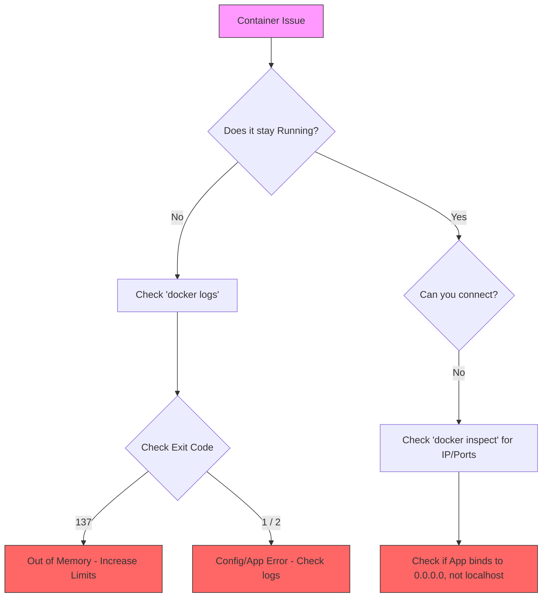

# Docker Debugging & Troubleshooting

Debugging is one of the most essential skills when working with Docker. When a container fails to start, crashes, or behaves unexpectedly, you need a systematic approach to find the root cause.

## 1. Essential Debugging Commands

The "Big Four" commands for inspecting what's happening inside or around your containers:

| Command | Usage | What it tells you |
| :--- | :--- | :--- |
| `docker logs <container>` | `docker logs -f my-app` | Shows stdout/stderr from the main process. |
| `docker inspect <id>` | `docker inspect my-app` | Detailed JSON metadata (IP, mounts, env, config). |
| `docker top <id>` | `docker top my-app` | Lists running processes inside the container. |
| `docker stats` | `docker stats` | Live resource usage (CPU, Memory, I/O). |

---

## 2. Interactive Debugging

Sometimes logs aren't enough, and you need to "step inside" to look around.

### `docker exec` (Best for running containers)
Run a shell inside an already running container.
```bash
docker exec -it <container_name> sh
# or bash if available
docker exec -it <container_name> bash
```

### `docker run --rm -it` (Best for containers that won't start)
If a container crashes immediately, try starting it with an interactive shell as the entrypoint to bypass the failing app.
```bash
docker run --rm -it --entrypoint sh <image_name>
```

---

## 3. The Role of `DEBUG` Environment Variables

Many official and popular images include built-in debugging modes that can be toggled using environment variables.

### Common Examples:
- **Node.js**: `DEBUG=express:*` or `DEBUG=*` (uses the `debug` package).
- **Python (Flask)**: `FLASK_DEBUG=1`.
- **Nginx**: Set the log level in the config or use the `nginx-debug` binary.
- **Spring Boot**: `DEBUG=true` or `--debug`.

### How to set them in Docker Compose:
```yaml
services:
  api:
    image: my-node-app
    environment:
      - DEBUG=myapp:*
      - NODE_ENV=development
```

---

## 4. Docker Compose Debugging

Compose provides higher-level tools for multi-container troubleshooting.

- **Follow all logs**: `docker compose logs -f` (colored by service).
- **Service Status**: `docker compose ps` (shows which service exited and with what code).
- **Container Events**: `docker compose events` (real-time stream of Docker actions).

---

## 5. Troubleshooting Flowchart

Use this logic when a container fails:



---

## 6. Common Error Codes

| Code | Meaning | Typical Fix |
| :--- | :--- | :--- |
| **0** | Success | Container finished its task. |
| **1** | Application Crash | Check logs for stack traces. |
| **127** | Command Not Found | Fix the `CMD` or `ENTRYPOINT` path. |
| **137** | Terminated (SIGKILL) | Usually **OOM (Out of Memory)**. Increase memory limits. |
| **139** | Segmentation Fault | Memory access error in native code. |

---

## 7. Best Practices for Debuggable Containers

1. **Log to Stdout/Stderr**: Don't log to files inside the container; let Docker handle the logs.
2. **Use Healthchecks**: Let Compose know when a service is truly "ready", not just "started".
3. **Include basic tools**: If using Alpine, keep `curl`, `netstat`, or `iproute2` available for network debugging.
4. **Keep images small**: Production images should be thin, but development overrides can add debug tools.

---

**[Back to Home](../../README.md)**
