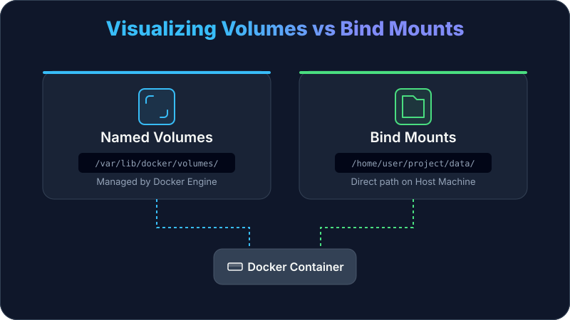
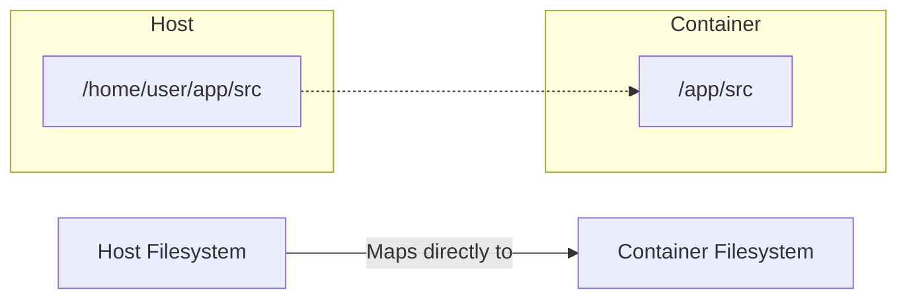

# Docker Compose Volumes

## What are Volumes in Docker Compose?

**Volumes** are the preferred mechanism for persisting data generated by and used by Docker containers. While containers are ephemeral (their data is lost when they are removed), volumes allow you to store data outside the container's lifecycle.

In **Docker Compose**, volumes are defined in the `volumes` section of your YAML file, making it easy to share storage between multiple services or keep database files safe even if the database container is recreated.

### Why Use Volumes?
- ✅ **Data Persistence**: Keep data (like DB files) safe after `docker compose down`.
- ✅ **Data Sharing**: Share a specific directory between multiple containers.
- ✅ **Host-Container Sync**: Mirror scripts or code from your computer into the container (Bind Mounts).
- ✅ **Performance**: Volumes are more efficient than writing into the container's writable layer.

---

## Volume Types

Docker Compose primarily works with three types of storage:

| Type | Description | Best For |
| :--- | :--- | :--- |
| **Named Volumes** | Managed by Docker. Stored in a specific location in the Docker area. | Databases, persistent app data. |
| **Bind Mounts** | Maps a folder on your **Host machine** to the container. | Source code, config files, live reload. |
| **Anonymous Volumes** | Managed by Docker but no names/handles. Hard to reuse. | Temporary data, caching. |

### Visualizing Volumes vs. Bind Mounts



---

## Deep Dive: Bind Mounts

A **Bind Mount** is a high-performance way to map a specific file or directory on your **Host machine** (your laptop or server) directly into a container. Unlike Named Volumes, which Docker manages in its own internal storage, Bind Mounts rely on your host's filesystem structure.

### How it Works
When you use a bind mount, the file or directory is referenced by its **absolute path** or a **relative path** on the host machine.



### Key Characteristics
- **Direct Access**: Changes made on the host are reflected in the container instantly, and vice versa.
- **User Managed**: You are responsible for creating the directory on the host and managing its permissions.
- **Non-Portable**: Since host paths differ between Windows, Mac, and Linux, bind mounts can make your `docker-compose.yml` less portable if using absolute paths.

### Common Use Cases

#### 1. Development (Live Reload)
The most common use case. By mounting your source code, your development server inside the container can "watch" for changes and reload the app without a rebuild.
```yaml
volumes:
  - ./src:/app/src
```

#### 2. Configuration Files
Injecting specific configuration files (like `nginx.conf` or `php.ini`) into a container without creating a custom image.
```yaml
volumes:
  - ./config/nginx.conf:/etc/nginx/nginx.conf:ro
```

#### 3. Log Access
Mapping container logs to a host folder so you can inspect them with your local tools (VS Code, tail, etc.).
```yaml
volumes:
  - ./logs:/var/log/myapp
```

### Path Syntax: Absolute vs Relative
Docker Compose supports both:
- **Relative**: `./data:/container/path` (Relative to the `docker-compose.yml` file).
- **Absolute**: `/home/user/project/data:/container/path`.

> [!TIP]
> **Always prefer relative paths** in Docker Compose to ensure your project works on different machines.

### Important: Permissions & Security
By default, bind mounts are **Read-Write**. This means a container can delete or modify files on your host machine.

- **Read-Only Mode**: Use `:ro` to prevent the container from changing host files.
  ```yaml
  volumes:
    - ./config:/etc/app/config:ro
  ```
- **Security Risk**: Never mount sensitive host directories like `/`, `/etc`, or `/var/run/docker.sock` unless you absolutely know what you are doing. A compromised container could gain full control over your host system.

---

## Syntax and Configuration

### 1. Basic Named Volume
Named volumes must be declared at the top-level `volumes` block.

```yaml
services:
  db:
    image: postgres:15
    volumes:
      - db_data:/var/lib/postgresql/data

volumes:
  db_data:  # Declaration is required
```

### 2. Bind Mount (Relative Path)
Bind mounts do **not** need to be declared in the top-level `volumes` block.

```yaml
services:
  web:
    image: nginx
    volumes:
      - ./nginx.conf:/etc/nginx/nginx.conf:ro  # :ro means Read-Only
```

### 3. Long Syntax (Recommended for Clarity)
The "long" syntax is more verbose but easier to read and allows for more options.

```yaml
services:
  app:
    image: my-app
    volumes:
      - type: volume
        source: my-data
        target: /app/data
        read_only: false
      - type: bind
        source: ./logs
        target: /var/log/app

volumes:
  my-data:
```

---

## Real-Life Scenarios

### Scenario A: Database Persistence
When running a database like MySQL or MongoDB, you **must** use a named volume. Without it, every time you run `docker compose down`, all your users, tables, and data will be permanently deleted.

```yaml
services:
  db:
    image: mysql:8
    volumes:
      - mysql_storage:/var/lib/mysql
volumes:
  mysql_storage:
```

### Scenario B: Development Live-Reload
In development, you want your container to see code changes instantly without rebuilding the image. You use a **Bind Mount** to "mirror" your source folder.

```yaml
services:
  frontend:
    build: .
    volumes:
      - ./src:/app/src  # Changes in /src on host appear in /app/src in container
    command: npm run start
```

---

## 🧠 Quiz: Test Your Knowledge

**Q1: What happens to a Named Volume when you run `docker compose down`?**
*   A) It is deleted automatically.
*   B) It persists and can be reused.
*   C) It is cleared but the name remains.
> [!NOTE]
> **Answer: B.** Volumes persist until you explicitly delete them using `docker compose down -v` or `docker volume rm`.

**Q2: Which type of volume is best for sharing code from your laptop to a container?**
*   A) Named Volume
*   B) Anonymous Volume
*   C) Bind Mount
> [!NOTE]
> **Answer: C.** Bind mounts allow you to map direct paths from your host machine.

**Q3: How do you mount a volume as Read-Only?**
*   A) `- source:target:read`
*   B) `- source:target:ro`
*   C) `- source:target:disabled`
> [!NOTE]
> **Answer: B.** Adding `:ro` to the end of the short syntax makes it Read-Only for the container.

**Q4: Where do Named Volumes live by default on Linux?**
*   A) `/home/user/volumes`
*   B) `/var/lib/docker/volumes`
*   C) Inside the project folder.
> [!NOTE]
> **Answer: B.** Docker manages named volumes in its own internal storage area.

**Q5: Can multiple services use the same Named Volume simultaneously?**
*   A) Yes, this is a common way to share data.
*   B) No, Docker locks the volume for one service.
*   C) Only if they are in the same network.
> [!NOTE]
> **Answer: A.** Multiple containers can mount the same volume, which is useful for things like log aggregators or shared assets.

---

## Resources
- [Docker Documentation: Volumes](https://docs.docker.com/storage/volumes/)
- [Compose File Reference: Volumes](https://docs.docker.com/compose/compose-file/07-volumes/)
- [Bind Mounts vs Volumes](https://docs.docker.com/storage/bind-mounts/)

---

**[Next: Networking basics →](../03-Networking/README.md)**
