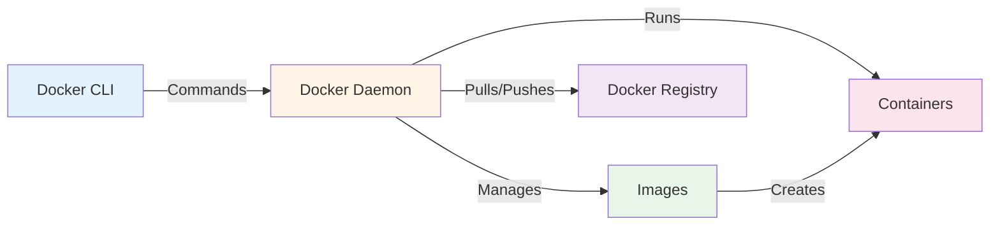
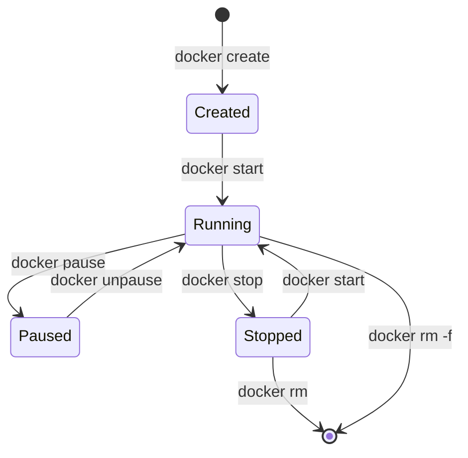
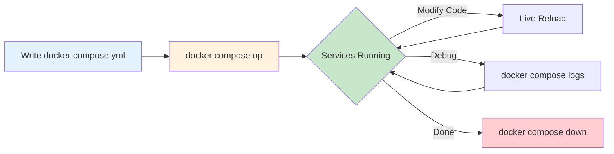

# Docker and Docker Compose - Comprehensive Guide

Welcome to the complete Docker and Docker Compose documentation! This guide covers everything from basic container concepts to advanced production patterns.

## 🚀 Quick Start

### Install Docker

```bash
# Ubuntu/Debian
curl -fsSL https://get.docker.com -o get-docker.sh
sudo sh get-docker.sh

# Verify installation
docker --version
docker compose version
```

### Your First Container

```bash
# Run a test container
docker run hello-world

# Run a web server
docker run -d -p 8080:80 nginx
# Visit http://localhost:8080
```

### Your First Compose Application

Create `docker-compose.yml`:
```yaml
services:
  web:
    image: nginx:alpine
    ports:
      - "8080:80"
```

```bash
docker compose up -d
```

## 📚 Documentation Structure

The documentation is organized into progressive difficulty levels: **Beginner**, **Intermediate**, and **Advanced**.

### 🟢 Beginner Level

Perfect for those new to Docker and containerization.

#### Docker Fundamentals

| Topic | Description | Key Concepts |
|-------|-------------|--------------|
| **[Introduction](Beginner/01-Introduction/README.md)** | What is Docker? Why containerization? | Architecture, Installation, First container |
| **[Images & Containers](Beginner/02-Images-and-Containers/README.md)** | Working with images and containers | Lifecycle, Commands, Docker Hub |
| **[Dockerfile Basics](Beginner/03-Dockerfile-Basics/README.md)** | Building custom images | Instructions, Best practices, Examples |

#### Docker Compose Fundamentals

| Topic | Description | Key Concepts |
|-------|-------------|--------------|
| **[Compose Basics](Docker-Compose/Beginner/01-Basics/README.md)** | Multi-container applications | Services, Commands, Workflow |
| **[Service Configuration](Docker-Compose/Beginner/02-Service-Configuration/README.md)** | Defining and configuring services | Ports, Environment, Dependencies |

### 🟡 Intermediate Level

For developers ready to deploy applications in production.

#### Advanced Docker Concepts

| Topic | Description | Key Concepts |
|-------|-------------|--------------|
| **[Docker Networking](Intermediate/01-Docker-Networking/README.md)** | Container communication | Bridge, Host, Overlay networks |
| **[Docker Volumes](Intermediate/02-Docker-Volumes/README.md)** | Data persistence and management | Named volumes, Bind mounts, Backup |
| **[Multi-Stage Builds](Intermediate/03-Multi-Stage-Builds/README.md)** | Optimized production images | Image size, Security, Performance |
| **[Docker Registry](Intermediate/04-Docker-Registry/README.md)** | Image distribution and management | Docker Hub, Private registries, Tagging |

#### Advanced Docker Compose

| Topic | Description | Key Concepts |
|-------|-------------|--------------|
| **[Advanced Features](Docker-Compose/Intermediate/01-Advanced-Features/README.md)** | Extends, profiles, overrides | Multi-environment configs |
| **[Networks & Volumes](Docker-Compose/Intermediate/02-Networks-Volumes/README.md)** | Complex networking and storage | Custom networks, Volume drivers |
| **[Secrets & Configs](Docker-Compose/Intermediate/03-Secrets-Configs/README.md)** | Secure configuration management | Secrets, External configs |

### 🔴 Advanced Level

Production-grade Docker knowledge for DevOps engineers.

#### Production Docker

| Topic | Description | Key Concepts |
|-------|-------------|--------------|
| **[Docker Security](Advanced/01-Docker-Security/README.md)** | Securing containers and images | Best practices, Scanning, Hardening |
| **[Resource Management](Advanced/02-Resource-Management/README.md)** | CPU, memory, and resource limits | Constraints, Health checks, Monitoring |
| **[Production Considerations](Advanced/03-Production-Considerations/README.md)** | Running Docker in production | High availability, Logging, Troubleshooting |

#### Production Docker Compose

| Topic | Description | Key Concepts |
|-------|-------------|--------------|
| **[Production Setup](Docker-Compose/Advanced/01-Production/README.md)** | Production configurations | Scaling, Resource limits, Restart policies |
| **[Orchestration](Docker-Compose/Advanced/02-Orchestration/README.md)** | Beyond Compose | Docker Swarm, Kubernetes migration |

## 🎯 Learning Paths

### Path 1: Developer Quickstart (1-2 days)

1. [Introduction](Beginner/01-Introduction/README.md) - Understand Docker basics
2. [Images & Containers](Beginner/02-Images-and-Containers/README.md) - Run and manage containers
3. [Dockerfile Basics](Beginner/03-Dockerfile-Basics/README.md) - Build custom images
4. [Compose Basics](Docker-Compose/Beginner/01-Basics/README.md) - Multi-container apps

**Goal**: Run containerized development environments

### Path 2: Production Deployment (1 week)

1. Complete Developer Quickstart
2. [Docker Networking](Intermediate/01-Docker-Networking/README.md) - Network your services
3. [Docker Volumes](Intermediate/02-Docker-Volumes/README.md) - Persist data properly
4. [Multi-Stage Builds](Intermediate/03-Multi-Stage-Builds/README.md) - Optimize images
5. [Docker Security](Advanced/01-Docker-Security/README.md) - Secure your containers
6. [Production Setup](Docker-Compose/Advanced/01-Production/README.md) - Deploy to production

**Goal**: Deploy secure, production-ready applications

### Path 3: DevOps Mastery (2-3 weeks)

Complete all documentation in order, including:
- All Beginner topics
- All Intermediate topics
- All Advanced topics
- Hands-on practice with each section

**Goal**: Master Docker for enterprise use

## 🔑 Key Concepts Overview

### Docker Architecture



### Container Lifecycle



### Docker Compose Workflow



## 🛠️ Common Use Cases

### Development Environment

```yaml
# docker-compose.yml
services:
  app:
    build: .
    volumes:
      - ./src:/app/src  # Live reload
    environment:
      - NODE_ENV=development
  
  db:
    image: postgres:15
    volumes:
      - postgres-data:/var/lib/postgresql/data

volumes:
  postgres-data:
```

### Production Deployment

```dockerfile
# Multi-stage build
FROM node:18 AS builder
WORKDIR /app
COPY package*.json ./
RUN npm ci
COPY . .
RUN npm run build

FROM node:18-alpine
WORKDIR /app
COPY --from=builder /app/dist ./dist
RUN addgroup -g 1001 nodejs && adduser -S nodejs -u 1001
USER nodejs
CMD ["node", "dist/index.js"]
```

### Microservices Architecture

```yaml
services:
  api-gateway:
    build: ./gateway
    ports:
      - "80:80"
    
  user-service:
    build: ./services/users
    
  order-service:
    build: ./services/orders
    
  db:
    image: postgres:15
    
  cache:
    image: redis:7
```

## 📋 Quick Reference

### Essential Docker Commands

```bash
# Images
docker pull <image>              # Download image
docker build -t <name> .         # Build image
docker images                    # List images
docker rmi <image>               # Remove image

# Containers
docker run <image>               # Create & start container
docker ps                        # List running containers
docker stop <container>          # Stop container
docker rm <container>            # Remove container
docker logs <container>          # View logs
docker exec -it <container> sh   # Interactive shell

# Cleanup
docker system prune              # Remove unused resources
docker system prune -a --volumes # Remove everything unused
```

### Essential Docker Compose Commands

```bash
# Lifecycle
docker compose up -d             # Start services
docker compose down              # Stop & remove services
docker compose restart           # Restart services

# Management
docker compose ps                # List services
docker compose logs -f           # View logs
docker compose exec <svc> sh     # Run command in service
docker compose build             # Build images

# Cleanup
docker compose down -v           # Remove volumes too
```

## 🎓 Hands-On Exercises

### Exercise 1: Your First Container

```bash
# Run nginx web server
docker run -d --name my-web -p 8080:80 nginx

# View logs
docker logs my-web

# Stop and remove
docker stop my-web
docker rm my-web
```

### Exercise 2: Build Custom Image

Create `Dockerfile`:
```dockerfile
FROM alpine:latest
RUN apk add --no-cache curl
CMD ["sh"]
```

```bash
docker build -t my-alpine .
docker run -it my-alpine
```

### Exercise 3: Multi-Container App

Create `docker-compose.yml`:
```yaml
services:
  web:
    image: nginx
    ports:
      - "8080:80"
  
  db:
    image: postgres:15
    environment:
      POSTGRES_PASSWORD: secret
```

```bash
docker compose up -d
docker compose ps
docker compose logs
docker compose down
```

## 🔍 Troubleshooting

### Container Won't Start

```bash
# Check logs
docker logs <container>

# Docker Foundations

Containers have revolutionized how we build, ship, and run applications. Docker is the leading platform for containerization, providing environment consistency from a developer's laptop to production servers.

---

## 🎯 Learning Objectives

- Understand the difference between Virtual Machines and Containers
- Master the Docker CLI for managing images and containers
- Build custom images using Dockerfiles
- Orchestrate multiple containers with Docker Compose
- Implement container security best practices

## 🛠️ Essential Docker Commands

### 📦 Image Management
*When to use: Pulling, listing, and removing container images.*

```bash
# Search for an image on Docker Hub
docker search nginx

# Pull an image
docker pull python:3.9-slim

# List all local images
docker images

# Remove an unused image
docker rmi <image_id>
```

### 🚀 Container Lifecycle
*When to use: Running, stopping, and inspecting active containers.*

```bash
# Run a container in detached mode with port mapping
docker run -d -p 8080:80 --name my-web nginx

# List running containers
docker ps

# List ALL containers (including stopped ones)
docker ps -a

# Execute a command inside a running container
docker exec -it my-web bash

# View container logs
docker logs -f my-web
```

---

## 💡 Docker Best Practices

- **Use Small Base Images**: Prefer `alpine` or `slim` versions to reduce attack surface and build times.
- **One Process Per Container**: Keep containers micro and focused.
- **Leverage Build Cache**: Order your Dockerfile instructions from least to most frequent changes (e.g., install dependencies before copying source code).
- **Never Run as Root**: Use the `USER` instruction in your Dockerfile to run applications with non-privileged users.
- **Use .dockerignore**: Prevent bulky or sensitive files (like `.git` or `.env`) from being sent to the Docker daemon.

---

## 🧠 Training & Assessment

### Knowledge Quiz

**1. What is the main difference between a Docker Image and a Docker Container?**
- A) Images are for Linux, Containers are for Windows
- B) An Image is a read-only template; a Container is a running instance of an image
- C) They are the same thing
- D) A Container is used to build an Image

**2. Which Dockerfile instruction defines the command that runs when the container starts?**
- A) `RUN`
- B) `FROM`
- C) `CMD`
- D) `COPY`

**3. How do you map port 80 inside a container to port 8080 on your host machine?**
- A) `docker run -p 80:8080`
- B) `docker run -p 8080:80`
- C) `docker run --port 8080`
- D) `docker run -i 8080:80`

---

### Real-World Troubleshooting Scenarios

#### Scenario 1: The "Zipping" Image
**Problem:** Your Docker image is 2GB in size, making deployments slow and expensive.
**Investigation:**
1.  **Analyze Layers:** Use `docker history <image_id>` to see which layer is adding the most weight.
2.  **Check Base Image:** You are using `FROM ubuntu:latest` and installing many unnecessary tools.
**Solution:** Switch to `FROM python:3.9-slim` and use multi-stage builds to only include the final compiled artifacts in the production image.

#### Scenario 2: Persistent Data Loss
**Problem:** You restart your database container, and all the data is gone.
**Investigation:**
1.  **Cause:** Containers are ephemeral. Any data written inside the container's writable layer is lost when the container is deleted.
**Solution:** Use **Docker Volumes** to persist data outside the container lifecycle.
```bash
docker run -d -v my-db-data:/var/lib/mysql mysql
```

---

## ✅ Knowledge Check
- [ ] Install Docker on Linux/Mac/Windows
- [ ] Understand the Docker Engine architecture
- [ ] Write a production-ready Dockerfile
- [ ] Use `docker-compose` for multi-container apps
- [ ] Clean up system resources (`docker system prune`)

## 🔗 Next Steps
- **[Kubernetes Foundations](../../2-Intermediate/01-Kubernetes/)** - Scale your containers.
- **[CI/CD with Docker](../../2-Intermediate/05-CI-CD/)** - Automate container builds.
- **[Advanced Networking](../../2-Intermediate/09-Observability-Foundations/)** - Monitor container traffic.

---
*Shipping code in containers is the first step to cloud-native mastery.*

# Run in foreground to see errors
docker run <image>

# Inspect configuration
docker inspect <container>
```

### Network Issues

```bash
# List networks
docker network ls

# Inspect network
docker network inspect <network>

# Test connectivity
docker exec <container> ping <other-container>
```

### Disk Space Issues

```bash
# Check disk usage
docker system df

# Clean up
docker system prune -a --volumes
```

## 📖 Additional Resources

- [Docker Official Documentation](https://docs.docker.com/)
- [Docker Hub](https://hub.docker.com/) - Public image registry
- [Play with Docker](https://labs.play-with-docker.com/) - Browser-based playground
- [Awesome Docker](https://github.com/veggiemonk/awesome-docker) - Curated list of resources

## 🤝 Best Practices Summary

1. **Use specific image tags**, not `latest`
2. **Run containers as non-root** users
3. **Use multi-stage builds** to minimize image size
4. **Scan images** for vulnerabilities
5. **Use `.dockerignore`** to exclude unnecessary files
6. **Set resource limits** in production
7. **Implement health checks** for reliability
8. **Use named volumes** for data persistence
9. **Keep images small** - prefer Alpine variants
10. **Document with labels** and README files

---

**Next Step**: Learn how to manage Java dependencies and build artifacts in [Maven Basics](../07-Maven/README.md).

**Questions?** Check the specific topic documentation above or refer to the [Docker Official Documentation](https://docs.docker.com/).
