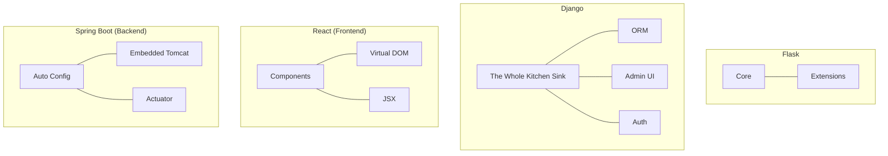

Welcome to the **Web Design** module. In modern DevOps, understanding how applications are built is as important as knowing how to deploy them.
## Overview
Web frameworks simplify development by providing tools for routing, database interaction, and security. We focus on the two most popular Python frameworks:

| Framework                                 | Type             | Best For                                              |
| ----------------------------------------- | ---------------- | ----------------------------------------------------- |
| **[Flask](./Flask/README.md)**            | Micro-framework  | Simple APIs, Microservices, Lightweight tools         |
| **[Django](./Django/README.md)**          | Full-stack       | Large applications, E-commerce, Content management    |
| **[React](./React/README.md)**            | Frontend Library | Single Page Applications (SPA), Interactive UIs       |
| **[Spring Boot](./SpringBoot/README.md)** | Java Enterprise  | Microservices, High-Performance Backends, Large Scale |

---

## Learning Path

1. **[Environment Setup](./Environment-Setup.md)**: Master Python Virtual Environments (`venv`) and dependency management. **(Start Here)**
2. **The Basics**: Understand how HTTP works (Requests, Responses).
2. **Framework Choice**: Decide based on project complexity.
3. **Application Logic**: Writing routes and handling data.
4. **DevOps Integration**: Dockerizing and deploying to production.

---

## Comparison: Flask vs Django

---

## Resources
- [Flask Official Site](https://flask.palletsprojects.com/)
- [Django Project Site](https://www.djangoproject.com/)
- [React Official Site](https://react.dev/)
- [Spring Boot Official Site](https://spring.io/projects/spring-boot)

---

**[← Back to Beginner Roadmap](DevOps%20Foundations.md)**
