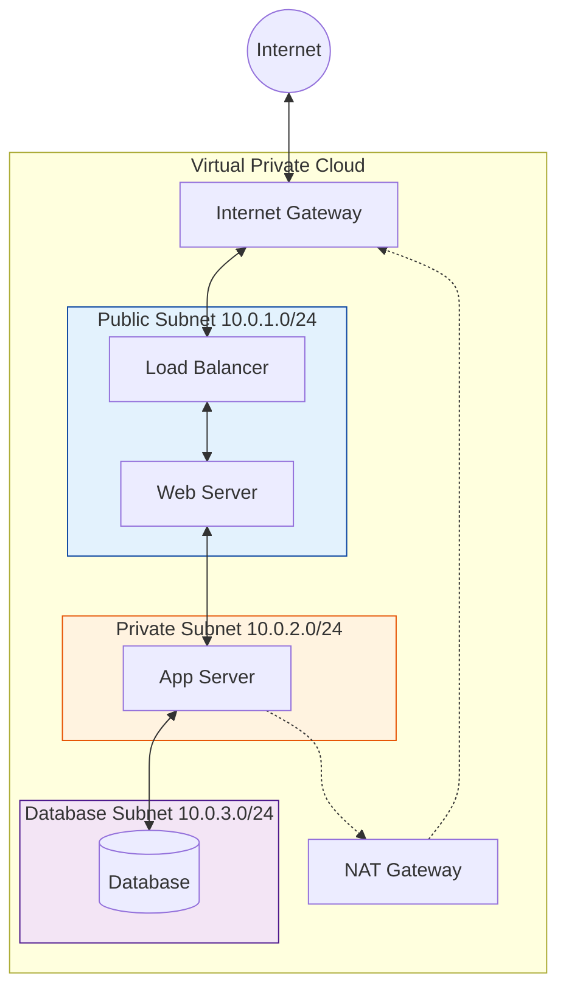

# Cloud Networking

Comprehensive guide to cloud networking concepts, architectures, and implementation across cloud platforms.

## Networking Fundamentals

### Virtual Private Cloud (VPC)
```yaml
Core Concepts:
  - Isolated network environment
  - IP address ranges (CIDR blocks)
  - Subnets for segmentation
  - Route tables for traffic control
  - Internet and NAT gateways
  - Security groups and NACLs

Benefits:
  - Network isolation
  - Scalable architecture
  - Security control
  - Hybrid connectivity
```

### Subnets and Availability Zones
```bash
# Public Subnet (Internet accessible)
CIDR: 10.0.1.0/24
Route: 0.0.0.0/0 -> Internet Gateway

# Private Subnet (Internal only)
CIDR: 10.0.2.0/24
Route: 0.0.0.0/0 -> NAT Gateway

# Database Subnet (Isolated)
CIDR: 10.0.3.0/24
Route: Local traffic only
```

### VPC Architecture


## Cloud Provider Networking

### AWS Networking
**[➡️ Start Here: AWS Networking Deep Dive (VPC, Security, Troubleshooting)](./aws-networking-deep-dive.md)**

```yaml
VPC Components:
  - Internet Gateway (IGW)
  - NAT Gateway/Instance
  - Virtual Private Gateway (VGW)
  - Transit Gateway
  - VPC Peering
  - PrivateLink
  - Direct Connect

Security:
  - Security Groups (stateful)
  - Network ACLs (stateless)
  - AWS WAF
  - Shield (DDoS protection)
```

### Azure Networking
```yaml
Virtual Network Components:
  - Virtual Network (VNet)
  - Subnets
  - Network Security Groups (NSG)
  - Application Security Groups (ASG)
  - Azure Firewall
  - VPN Gateway
  - ExpressRoute
  - Virtual Network Peering

Load Balancing:
  - Azure Load Balancer
  - Application Gateway
  - Traffic Manager
  - Front Door
```

### Google Cloud Networking
```yaml
VPC Components:
  - Virtual Private Cloud
  - Subnets (regional)
  - Firewall rules
  - Cloud NAT
  - Cloud VPN
  - Cloud Interconnect
  - VPC Peering
  - Shared VPC

Global Infrastructure:
  - Global load balancing
  - Anycast IP addresses
  - Edge locations
  - Premium vs Standard tier
```

## Network Security

### Security Groups and Firewalls
```bash
# AWS Security Group
aws ec2 create-security-group \
  --group-name web-sg \
  --description "Web server security group"

aws ec2 authorize-security-group-ingress \
  --group-id sg-12345678 \
  --protocol tcp \
  --port 80 \
  --cidr 0.0.0.0/0

# Azure NSG Rule
az network nsg rule create \
  --resource-group myRG \
  --nsg-name web-nsg \
  --name allow-http \
  --protocol tcp \
  --priority 100 \
  --destination-port-range 80 \
  --access allow

# GCP Firewall Rule
gcloud compute firewall-rules create allow-http \
  --allow tcp:80 \
  --source-ranges 0.0.0.0/0 \
  --target-tags web-server
```

### Network Segmentation
```yaml
Three-Tier Architecture:
  Web Tier:
    - Public subnets
    - Load balancers
    - Web servers
  
  Application Tier:
    - Private subnets
    - Application servers
    - Auto scaling groups
  
  Database Tier:
    - Private subnets
    - Database servers
    - Backup systems
```

## Hybrid Connectivity

### VPN Connections
```bash
# AWS Site-to-Site VPN
aws ec2 create-vpn-connection \
  --type ipsec.1 \
  --customer-gateway-id cgw-12345678 \
  --vpn-gateway-id vgw-12345678

# Azure VPN Gateway
az network vnet-gateway create \
  --resource-group myRG \
  --name myVPNGateway \
  --public-ip-address myGatewayIP \
  --vnet myVNet \
  --gateway-type Vpn \
  --sku VpnGw1

# GCP VPN Tunnel
gcloud compute vpn-tunnels create tunnel1 \
  --peer-address 203.0.113.12 \
  --shared-secret mysharedsecret \
  --target-vpn-gateway myvpngateway
```

### Direct Connections
```yaml
AWS Direct Connect:
  - Dedicated network connection
  - Consistent network performance
  - Reduced bandwidth costs
  - Private connectivity

Azure ExpressRoute:
  - Private connection to Azure
  - Predictable performance
  - Built-in redundancy
  - Global connectivity

GCP Cloud Interconnect:
  - Dedicated connections
  - Partner interconnect
  - Carrier peering
  - Direct peering
```

## Load Balancing and CDN

### Global Load Balancing
```yaml
AWS CloudFront + ALB:
  - Global edge locations
  - SSL termination
  - Caching strategies
  - Origin failover

Azure Front Door:
  - Global load balancing
  - SSL offloading
  - Web Application Firewall
  - URL-based routing

GCP Cloud Load Balancing:
  - Anycast IP addresses
  - Global backend services
  - Health checking
  - Traffic splitting
```

### Content Delivery Networks
```bash
# AWS CloudFront Distribution
aws cloudfront create-distribution \
  --distribution-config file://distribution-config.json

# Azure CDN Profile
az cdn profile create \
  --resource-group myRG \
  --name myCDNProfile \
  --sku Standard_Microsoft

# GCP Cloud CDN
gcloud compute backend-services update mybackend \
  --enable-cdn \
  --cache-mode CACHE_ALL_STATIC
```

## Network Monitoring

### Traffic Analysis
```yaml
AWS VPC Flow Logs:
  - Network traffic monitoring
  - Security analysis
  - Troubleshooting
  - Compliance auditing

Azure Network Watcher:
  - Connection monitoring
  - Packet capture
  - Flow logs
  - Topology visualization

GCP VPC Flow Logs:
  - Network monitoring
  - Security analysis
  - Performance optimization
  - Cost analysis
```

### Performance Monitoring
```bash
# Network latency testing
ping -c 10 target-host
traceroute target-host
mtr target-host

# Bandwidth testing
iperf3 -c target-host -t 60
speedtest-cli

# DNS resolution testing
nslookup domain.com
dig domain.com
```

This comprehensive guide covers cloud networking fundamentals, security, and implementation across major cloud platforms.

## Real World Scenarios

### Scenario 1: Startup Scaling with VPC Peering
**Context:** A startup undergoes a merger and needs to connect their AWS environment with the acquired company's AWS environment securely.
**Solution:**
- **VPC Peering:** Establish a direct network connection between the two VPCs using private IP addresses.
- **Route Table Updates:** Update route tables in both VPCs to allow traffic to the peer's CIDR block.
- **Security Groups:** Update inbound allow rules to accept traffic only from the peer's specific subnets.
**Benefit:** Secure, low-latency, and cost-effective connectivity without utilizing the public internet or complex VPNs.

### Scenario 2: Regulatory Compliance for Hybrid Cloud
**Context:** A bank must keep core transaction data on-premises (mainframe) but wants to use cloud for mobile banking frontend.
**Solution:**
- **Direct Connect / ExpressRoute:** Provision a dedicated physical line (10Gbps) between the on-prem data center and the cloud region.
- **Transit Gateway:** Use a Transit Gateway to route traffic from multiple cloud VPCs back to the on-prem connection.
**Benefit:** Guarantees bandwidth, reduces network jitter, and satisfies "private circuit" regulatory requirements versus a VPN over internet.

---

## Interview Questions

### Basic Level
1.  **What is a CIDR block and why is it important in cloud networking?**
    -   Classless Inter-Domain Routing (CIDR) defines the IP address range for a VPC or subnet (e.g., 10.0.0.0/16). It determines how many IP addresses are available for resources.
2.  **Explain the difference between a Public and a Private Subnet.**
    -   A Public Subnet has a route to an Internet Gateway (can talk to the internet directly). A Private Subnet does not; it often uses a NAT Gateway to initiate outbound requests but cannot receive inbound internet traffic.
3.  **What is a Security Group?**
    -   A virtual stateful firewall that controls inbound and outbound traffic for an EC2 instance or network interface.
4.  **How does a Load Balancer improve availability?**
    -   It distributes incoming traffic across multiple healthy instances. If one instance fails, the LB stops routing traffic to it, ensuring users don't face errors.
5.  **What is a VPN?**
    -   Virtual Private Network. It encrypts traffic running over the public internet to create a secure tunnel between two networks (e.g., On-Prem to Cloud).

### Intermediate Level
6.  **Direct Connect vs. Site-to-Site VPN: When to use which?**
    -   **VPN:** Fast to set up, cheap, uses internet (variable latency). Good for backups or small offices.
    -   **Direct Connect:** Long lead time, expensive, dedicated physical fiber (consistent latency, high bandwidth). Necessary for massive data transfer or strict compliance.
7.  **What is the purpose of a NAT Gateway?**
    -   Allows instances in a private subnet to connect to the internet (e.g., for OS updates) but prevents the internet from initiating a connection to those instances.
8.  **Explain "VPC Peering" limitations.**
    -   It's non-transitive (A connected to B, and B to C, does NOT mean A connects to C). CIDR blocks cannot overlap.
9.  **Stateless vs. Stateful Firewalls (NACL vs. Security Group).**
    -   **Security Group:** Stateful. If you allow inbound request, the outbound reply is automatically allowed.
    -   **NACL:** Stateless. You must explicitly allow both inbound and outbound traffic rules.
10. **What is "DNS Resolution"?**
    -   Translating human-readable domain names (www.google.com) into IP addresses (142.250.x.x) so computers can connect.

### Advanced Level
11. **How does a Content Delivery Network (CDN) work with a VPC?**
    -   The CDN pushes content to edge locations globally. It doesn't sit *inside* the VPC but caches content from an Origin (S3 or Load Balancer) that sits in the VPC.
12. **Describe the "Hub and Spoke" network topology in cloud.**
    -   A central "Hub" VPC handles common services (logging, firewall inspection, transit gateway). Multiple "Spoke" VPCs (app, dev, prod) connect only to the Hub effectively isolating environment while sharing shared services.
13. **What is a "Transit Gateway"?**
    -   A network transit hub that connects VPCs and on-premises networks. It solves the complexity of mesh VPC peering by acting as a central router.
14. **How do you troubleshoot network connectivity issues in a cloud environment?**
    -   Check Security Groups (inbound/outbound), NACLs, Route Tables (is there a route to IGW?), and finally VPC Flow Logs to see rejected packets.
15. **What is "Anycast IP" in the context of Google Cloud Load Balancing?**
    -   A single global IP address is advertised from multiple locations worldwide. Traffic routes to the nearest physical location naturally via BGP, simplifying global DNS management.

---

## Quiz: Basic Networking

<details>
<summary><b>1. A /24 CIDR block provides approximately how many usable IP addresses?</b></summary>
A) 65,000<br>
B) 251-256 (Depending on provider reserved IPs)<br>
C) 1,000<br>
D) 10<br>
<br>
<b>Answer: B) 251-256 (Depending on provider reserved IPs)</b>
</details>

<details>
<summary><b>2. Which component allows a Private Subnet to access the internet for updates?</b></summary>
A) Internet Gateway<br>
B) VPC Peering<br>
C) NAT Gateway<br>
D) Switch<br>
<br>
<b>Answer: C) NAT Gateway</b>
</details>

<details>
<summary><b>3. Security Groups are _____ , meaning return traffic is automatically allowed.</b></summary>
A) Stateless<br>
B) Stateful<br>
C) Angry<br>
D) Open<br>
<br>
<b>Answer: B) Stateful</b>
</details>

<details>
<summary><b>4. Which is a characteristic of Direct Connect / ExpressRoute?</b></summary>
A) Uses public internet<br>
B) Unpredictable latency<br>
C) Private, dedicated physical connection<br>
D) Free of charge<br>
<br>
<b>Answer: C) Private, dedicated physical connection</b>
</details>

<details>
<summary><b>5. VPC Peering connections are transitive by default. (True/False)</b></summary>
A) True<br>
B) False<br>
<br>
<b>Answer: B) False</b>
</details>

<details>
<summary><b>6. What is the primary function of a Route Table?</b></summary>
A) To block hackers<br>
B) To determine where network traffic is directed<br>
C) To store database records<br>
D) To balance load<br>
<br>
<b>Answer: B) To determine where network traffic is directed</b>
</details>

<details>
<summary><b>7. Which service blocks specific IP addresses at the subnet level?</b></summary>
A) Security Group<br>
B) Network ACL (NACL)<br>
C) IAM Policy<br>
D) CloudTrail<br>
<br>
<b>Answer: B) Network ACL (NACL)</b>
</details>

<details>
<summary><b>8. A bastion host (jump box) is typically placed in which subnet?</b></summary>
A) Private Subnet<br>
B) Database Subnet<br>
C) Public Subnet<br>
D) No Subnet<br>
<br>
<b>Answer: C) Public Subnet</b>
</details>

<details>
<summary><b>9. To distribute traffic across multiple EC2 instances, you should use:</b></summary>
A) Auto Scaling Group<br>
B) Load Balancer<br>
C) SNS<br>
D) CloudWatch<br>
<br>
<b>Answer: B) Load Balancer</b>
</details>

<details>
<summary><b>10. Which protocol is ping based on?</b></summary>
A) TCP<br>
B) UDP<br>
C) ICMP<br>
D) HTTP<br>
<br>
<b>Answer: C) ICMP</b>
</details>

<details>
<summary><b>11. What is the default route (0.0.0.0/0) usually pointed to for internet access?</b></summary>
A) Local<br>
B) Internet Gateway (IGW)<br>
C) Another Instance<br>
D) Loopback<br>
<br>
<b>Answer: B) Internet Gateway (IGW)</b>
</details>

<details>
<summary><b>12. You have overlapping CIDR blocks. Can you set up VPC peering?</b></summary>
A) Yes, easily<br>
B) Yes, with a proxy<br>
C) No, overlapping CIDRs generally prevent peering<br>
D) Only on Tuesdays<br>
<br>
<b>Answer: C) No, overlapping CIDRs generally prevent peering</b>
</details>

<details>
<summary><b>13. Which DNS record type maps a domain name to an IPv4 address?</b></summary>
A) A Record<br>
B) CNAME<br>
C) MX Record<br>
D) AAAA Record<br>
<br>
<b>Answer: A) A Record</b>
</details>

<details>
<summary><b>14. In a "Hub and Spoke" model, the Hub VPC contains:</b></summary>
A) Only databases<br>
B) Shared services (Firewalls, VPN termination)<br>
C) Nothing<br>
D) All production data<br>
<br>
<b>Answer: B) Shared services (Firewalls, VPN termination)</b>
</details>

<details>
<summary><b>15. Why use Private Subnets for Databases?</b></summary>
A) It makes them faster<br>
B) Security isolation; so they are not directly accessible from the internet<br>
C) It's cheaper<br>
D) Databases don't run in public subnets<br>
<br>
<b>Answer: B) Security isolation; so they are not directly accessible from the internet</b>
</details>

<details>
<summary><b>16. What is the scope of a VPC?</b></summary>
A) Global<br>
B) Regional<br>
C) Availability Zone<br>
D) Rack<br>
<br>
<b>Answer: B) Regional</b>
</details>

<details>
<summary><b>17. What allows you to view rejected traffic packets in a VPC?</b></summary>
A) VPC Flow Logs<br>
B) CloudTrail<br>
C) IAM Logs<br>
D) System Logs<br>
<br>
<b>Answer: A) VPC Flow Logs</b>
</details>

<details>
<summary><b>18. Transit Gateway is used to:</b></summary>
A) Connect a single VPC to internet<br>
B) Simplify connectivity between many VPCs and on-prem networks (Hub-style interconnection)<br>
C) Store data<br>
D) Secure files<br>
<br>
<b>Answer: B) Simplify connectivity between many VPCs and on-prem networks (Hub-style interconnection)</b>
</details>

<details>
<summary><b>19. Which command traces the path of a network packet?</b></summary>
A) ping<br>
B) traceroute / tracert<br>
C) telnet<br>
D) nslookup<br>
<br>
<b>Answer: B) traceroute / tracert</b>
</details>

<details>
<summary><b>20. Does a Security Group deny traffic by default?</b></summary>
A) Yes (Implicit Deny)<br>
B) No (Implicit Allow)<br>
<br>
<b>Answer: A) Yes (Implicit Deny)</b>
</details>

<details>
<summary><b>21. Ephemeral ports are:</b></summary>
A) Permanent ports<br>
B) Temporary ports used for the client-side of a connection<br>
C) Only for UDP<br>
D) Blocked by default<br>
<br>
<b>Answer: B) Temporary ports used for the client-side of a connection</b>
</details>