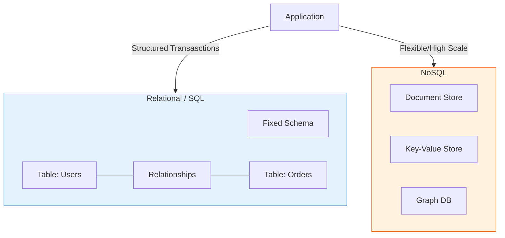

# Database Fundamentals

Welcome to the Database Fundamentals section! This directory contains foundational knowledge about databases in cloud computing, specifically focusing on AWS database services.

## Overview

Databases are essential components of modern applications, providing structured data storage, retrieval, and management capabilities. This section will guide you through the basics of database concepts and introduce you to AWS's managed database services.

## Learning Path

### 1. Database Basics
Start here to understand fundamental database concepts:
- [Database Concepts](Database%20Concepts%20and%20Fundamentals.md) - Core database principles
- [Relational vs NoSQL](01-Database-Basics/relational-vs-nosql.md) - Understanding different database types
- [Choosing Database Type](Choosing%20the%20Right%20Database%20Type.md) - Decision-making guide

### 2. RDS Basics
Learn about Amazon Relational Database Service:
- [RDS Introduction](02-RDS-Basics/rds-introduction.md) - What is RDS and why use it
- [RDS Getting Started](02-RDS-Basics/rds-getting-started.md) - Create your first RDS instance
- [RDS Backups & Snapshots](02-RDS-Basics/rds-backups-snapshots.md) - Data protection basics

### 3. DynamoDB Basics
Introduction to AWS's NoSQL database service:
- [DynamoDB Introduction](03-DynamoDB-Basics/dynamodb-introduction.md) - NoSQL with DynamoDB
- [DynamoDB Tables & Items](03-DynamoDB-Basics/dynamodb-tables-items.md) - Core concepts
- [DynamoDB Getting Started](03-DynamoDB-Basics/dynamodb-getting-started.md) - Hands-on guide

## Prerequisites

- Basic understanding of cloud computing concepts
- AWS account (free tier is sufficient)
- Familiarity with AWS Console
- Basic understanding of command line interface (optional)

## What You'll Learn

By completing this section, you will:
- ✅ Understand fundamental database concepts
- ✅ Know when to use relational vs NoSQL databases
- ✅ Be able to create and manage RDS instances
- ✅ Understand DynamoDB tables and items
- ✅ Perform basic database operations via AWS Console and CLI
- ✅ Implement basic backup and recovery strategies

## Next Steps

After mastering these fundamentals, progress to:
- **Intermediate Level**: [Database Services](../../Intermediate-Level/09-Database-Services/README.md) for advanced RDS features, DynamoDB design patterns, Aurora, and ElastiCache
- **Advanced Level**: [Database Enterprise](../../Advanced-Level/10-Database-Enterprise/README.md) for multi-region deployments, performance optimization, and enterprise security

## Additional Resources

- [AWS Database Services Overview](https://aws.amazon.com/products/databases/)
- [AWS Free Tier](https://aws.amazon.com/free/) - Practice without cost
- [AWS Documentation](https://docs.aws.amazon.com/)
- [AWS Well-Architected Framework - Database Pillar](https://aws.amazon.com/architecture/well-architected/)

---

**Ready to start?** Begin with [Database Concepts](Database%20Concepts%20and%20Fundamentals.md)!

## Database Architecture

## Real World Scenarios

### Scenario 1: E-Commerce Catalog Scaling
**Context:** An online retailer's product catalog has grown to millions of items with diverse attributes (some have sizes/colors, others have technical specs). The rigid SQL schema is hard to update.
**Solution:**
- **NoSQL (DynamoDB/MongoDB):** Migrate the product catalog to a Document store.
- **Flexible Schema:** New products can have arbitrary attributes without altering the table structure.
- **Read Performance:** High-speed reads for browsing products using key-value or secondary indexes.
**Benefit:** faster innovation cycles and ability to handle "Black Friday" traffic spikes due to NoSQL horizontal scaling.

### Scenario 2: Banking Transaction System
**Context:** A bank needs to record transfers between accounts. Absolute data integrity is required (money must not vanish).
**Solution:**
- **Relational (RDS/Aurora):** Use a SQL database with ACID compliance.
- **Transactions:** Wrap the "Debit Sender" and "Credit Receiver" operations in a single transaction. If one fails, both roll back.
- **Constraints:** Foreign keys ensure that transactions are only linked to valid accounts.
**Benefit:** Guarantees strong consistency and financial accuracy.

---

## Interview Questions

### Basic Level
1.  **What is the difference between SQL and NoSQL?**
    -   **SQL (Relational):** Structured data, predefined schema, valid relationships (tables, rows), scales vertically. Good for complex queries/transactions.
    -   **NoSQL (Non-Relational):** Flexible schema, various models (document, key-value), scales horizontally. Good for rapid changes, massive data, and simple query patterns.
2.  **What does ACID stand for?**
    -   **Atomicity:** All or nothing.
    -   **Consistency:** Database remains in a valid state.
    -   **Isolation:** Transactions don't interfere with each other.
    -   **Durability:** Saved data stays saved.
3.  **What is a Primary Key?**
    -   A unique identifier for a record (row) in a table. It cannot be null.

### Intermediate Level
4.  **Explain "Read Replicas" vs "Multi-AZ" in AWS RDS.**
    -   **Read Replicas:** Async copies of the DB to offload read traffic (performance).
    -   **Multi-AZ:** Sync copy in another zone for failover (High Availability). NOT for performance boosting.
5.  **What is "Sharding"?**
    -   Splitting a large dataset across multiple servers (shards) horizontally. Common in NoSQL to achieve unlimited scale. hard to do in SQL.
6.  **Comparison of DynamoDB vs RDS?**
    -   **DynamoDB:** Serverless NoSQL, single-digit ms latency, scales to zero or infinity, pays per request/capacity.
    -   **RDS:** Managed SQL (Postgres/MySQL), runs on servers (instances), pays per hour + storage.
7.  **What is a "Foreign Key"?**
    -   A field in one table that links to the Primary Key of another table, enforcing referential integrity.
8.  **Define "indexes" in a database.**
    -   Data structures (like a B-Tree) that improve the speed of data retrieval operations on a table at the cost of additional writes and storage space.

### Advanced Level
9.  **What is the CAP Theorem?**
    -   In a distributed system, you can only pick 2 out of 3: **Consistency** (every read receives the most recent write), **Availability** (every request receives a response), **Partition Tolerance** (system continues despite network message drops).
10. **Explain "Eventual Consistency".**
    -   A consistency model where, given enough time, all updates will propagate through the system and all replicas will be consistent. (CP vs AP systems).
11. **What is "Normalization" vs "Denormalization"?**
    -   **Normalization:** Organizing data to reduce redundancy (splitting tables). Good for write efficiency and integrity.
    -   **Denormalization:** Combining tables to reduce joins. Good for read performance, often used in NoSQL or Data Warehousing.
12. **How does Amazon Aurora differ from standard RDS?**
    -   Aurora separate compute from storage. The storage layer is shared across 3 AZs with 6 copies of data. It allows faster replication, auto-scaling storage, and faster failover than standard RDS.
13. **What is an "In-Memory" database (e.g., Redis/ElastiCache) used for?**
    -   Caching frequently accessed data to provide microsecond latency, relieving load on the main disk-based database (RDS/DynamoDB).

---

## Quiz: Database Fundamentals

<b>1. Which database type is best for complex relationships and transactions (e.g., ERP systems)?</b>

A) NoSQL 
B) Relational (SQL) 
C) Flat File 
D) Excel 
 
<b>Answer: B) Relational (SQL)</b>

<b>2. Scaling a database by adding more power (CPU/RAM) to a single server is called:</b>

A) Horizontal Scaling 
B) Vertical Scaling 
C) Diagonal Scaling 
D) Sharding 
 
<b>Answer: B) Vertical Scaling</b>

<b>3. DynamoDB is an example of which type of database?</b>

A) Relational 
B) Key-Value / Document (NoSQL) 
C) Graph 
D) In-Memory 
 
<b>Answer: B) Key-Value / Document (NoSQL)</b>

<b>4. In RDS Multi-AZ, the standby instance is primarily used for:</b>

A) Serving read traffic 
B) High Availability (Failover) 
C) Analytics 
D) Backups only 
 
<b>Answer: B) High Availability (Failover)</b>

<b>5. Which property ensures that a transaction is "all or nothing"?</b>

A) Atomicity 
B) Consistency 
C) Isolation 
D) Durability 
 
<b>Answer: A) Atomicity</b>

<b>6. Which service provides a managed Redis or Memcached environment?</b>

A) RDS 
B) DynamoDB 
C) ElastiCache 
D) Redshift 
 
<b>Answer: C) ElastiCache</b>

<b>7. "SQL" stands for:</b>

A) Strong Query Language 
B) Structured Query Language 
C) Simple Question Language 
D) Server Query Log 
 
<b>Answer: B) Structured Query Language</b>

<b>8. A "Join" operation is a key feature of:</b>

A) Key-Value Stores 
B) Relational Databases 
C) Object Storage 
D) DNS 
 
<b>Answer: B) Relational Databases</b>

<b>9. Which AWS service is a data warehouse solution (OLAP)?</b>

A) RDS 
B) DynamoDB 
C) Redshift 
D) Neptune 
 
<b>Answer: C) Redshift</b>

<b>10. In the CAP theorem, "P" stands for:</b>

A) Performance 
B) Partition Tolerance 
C) Persistence 
D) Privacy 
 
<b>Answer: B) Partition Tolerance</b>

<b>11. What is the main benefit of "Read Replicas"?</b>

A) Automatic Failover 
B) Reduced Write Latency 
C) Improved Read Performance (Offloading) 
D) Strong Consistency 
 
<b>Answer: C) Improved Read Performance (Offloading)</b>

<b>12. MongoDB is a popular examples of a:</b>

A) Relational DB 
B) Document Store 
C) Graph DB 
D) Time Series DB 
 
<b>Answer: B) Document Store</b>

<b>13. Amazon Aurora is compatible with which two database engines?</b>

A) Oracle and SQL Server 
B) MySQL and PostgreSQL 
C) MongoDB and Cassandra 
D) Redis and Memcached 
 
<b>Answer: B) MySQL and PostgreSQL</b>

<b>14. Which statement adds data to a SQL table?</b>

A) SELECT 
B) INSERT 
C) UPDATE 
D) DELETE 
 
<b>Answer: B) INSERT</b>

<b>15. Data "Durability" refers to:</b>

A) Speed of access 
B) Data not disappearing over time 
C) Uptime of the server 
D) Encryption strength 
 
<b>Answer: B) Data not disappearing over time</b>

<b>16. Which strategy is most effective for handling un-predictable, massive traffic spikes for a simple lookup app?</b>

A) RDS with auto-scaling storage 
B) Provisioned DynamoDB 
C) DynamoDB On-Demand 
D) EC2 with SQLite 
 
<b>Answer: C) DynamoDB On-Demand</b>

<b>17. "Columns" in a NoSQL Document store are typically referred to as:</b>

A) Attributes / Fields 
B) Tables 
C) Relations 
D) Shards 
 
<b>Answer: A) Attributes / Fields</b>

<b>18. Graph databases (like Amazon Neptune) are optimized for:</b>

A) Financial transactions 
B) Analyzing complex relationships (social networks, fraud detection) 
C) Video storage 
D) Key-Value lookups 
 
<b>Answer: B) Analyzing complex relationships (social networks, fraud detection)</b>

<b>19. Database Migration Service (DMS) helps you:</b>

A) Migrate databases to AWS with minimal downtime 
B) Design database schemas 
C) Write SQL queries 
D) Install Oracle on your laptop 
 
<b>Answer: A) Migrate databases to AWS with minimal downtime</b>

<b>20. Which command modifies the structure of an existing table (e.g., adding a column)?</b>

A) UPDATE TABLE 
B) ALTER TABLE 
C) CHANGE TABLE 
D) MODIFY TABLE 
 
<b>Answer: B) ALTER TABLE</b>

<b>21. "OLTP" stands for:</b>

A) Online Text Processing 
B) Online Transaction Processing 
C) Offline Table Protocol 
D) One Time Loading Process 
 
<b>Answer: B) Online Transaction Processing</b>

