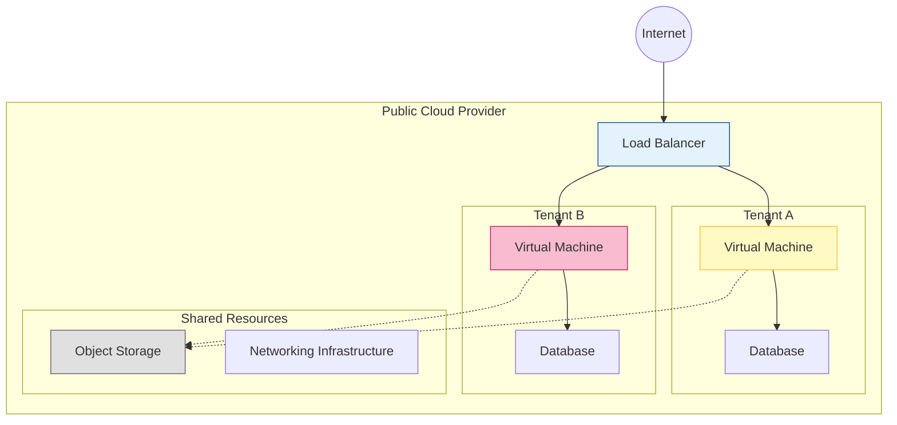
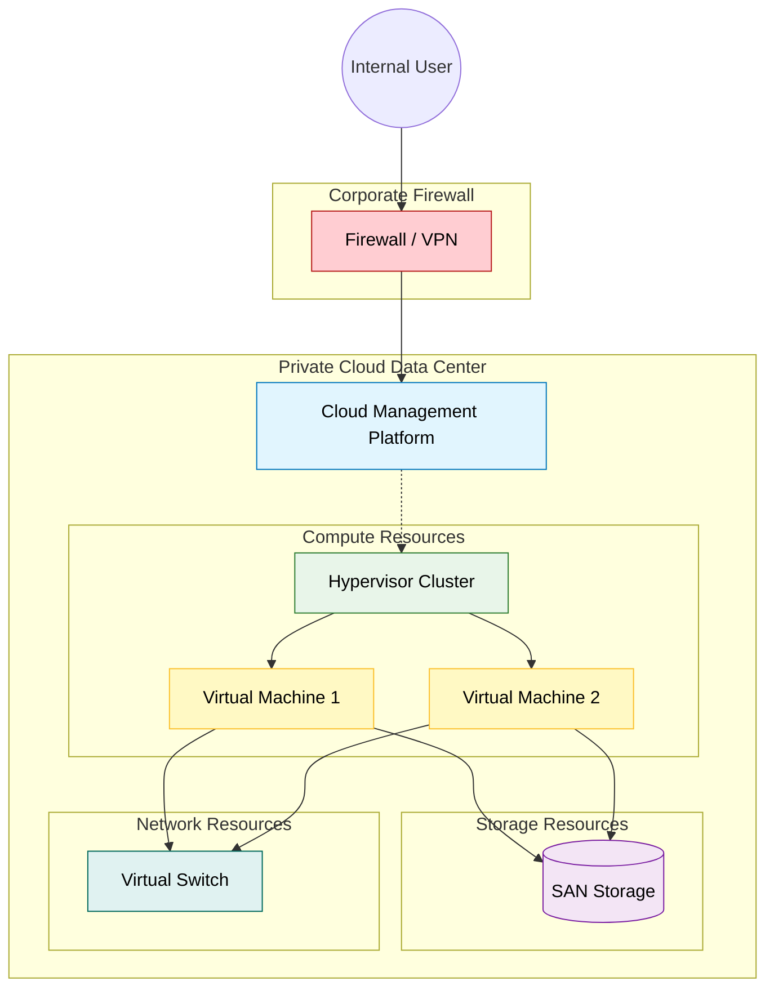
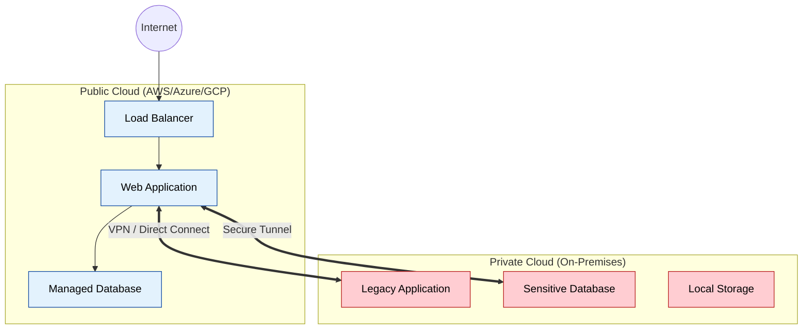
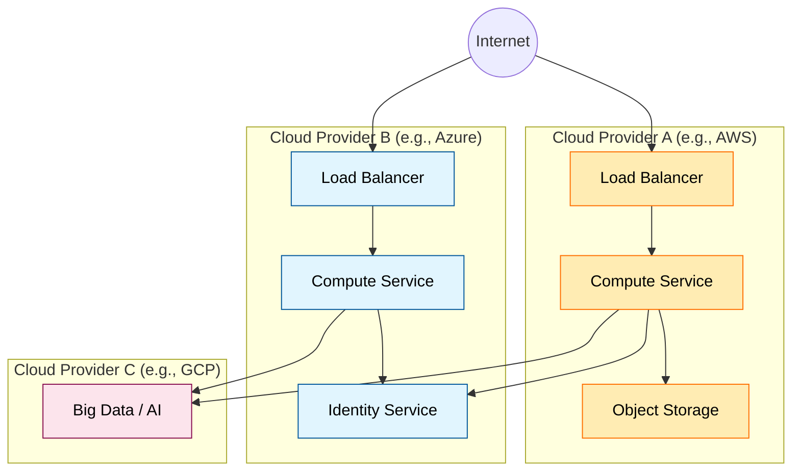
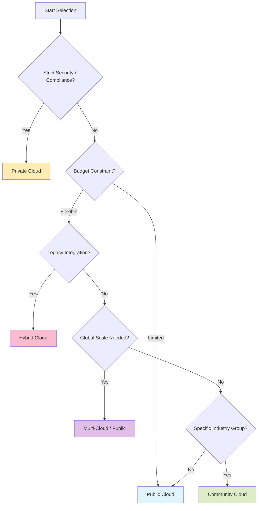

# Cloud Deployment Models

Complete guide to cloud deployment models, their characteristics, use cases, and implementation strategies.

## Overview

Cloud deployment models define how cloud infrastructure is provisioned, managed, and accessed. Each model offers different levels of control, security, and cost-effectiveness.

## Public Cloud

### Characteristics
```bash
# Owned and operated by third-party cloud service providers
# Resources shared among multiple organizations
# Accessed over the public internet
# No upfront capital investment required

Examples:
- Amazon Web Services (AWS)
- Microsoft Azure
- Google Cloud Platform (GCP)
- IBM Cloud
- Oracle Cloud
```

### Architecture


### Advantages
```bash
# Cost Efficiency
- No upfront capital investment
- Pay-as-you-use pricing
- Economies of scale
- Reduced operational costs

# Scalability
- Virtually unlimited resources
- Rapid scaling capabilities
- Global availability
- Elastic resource allocation

# Maintenance
- Provider manages infrastructure
- Automatic updates and patches
- 24/7 monitoring and support
- High availability guarantees
```

### Disadvantages
```bash
# Security Concerns
- Shared infrastructure
- Limited control over security
- Data sovereignty issues
- Compliance challenges

# Performance
- Network latency
- Bandwidth limitations
- Resource contention
- Variable performance

# Vendor Lock-in
- Proprietary technologies
- Migration complexity
- Dependency on provider
- Limited customization
```

### Use Cases
```bash
# Ideal For:
- Startups and small businesses
- Development and testing environments
- Web applications and websites
- Backup and disaster recovery
- Seasonal workloads
- Proof of concepts

# Examples:
- E-commerce websites
- Mobile app backends
- Data analytics platforms
- Content delivery networks
- Software development platforms
```

### Implementation Example
```bash
# AWS Public Cloud Deployment
# Launch EC2 instance
aws ec2 run-instances \
    --image-id ami-0abcdef1234567890 \
    --count 1 \
    --instance-type t3.micro \
    --key-name MyKeyPair \
    --security-group-ids sg-903004f8 \
    --subnet-id subnet-6e7f829e

# Create S3 bucket
aws s3 mb s3://my-public-cloud-bucket

# Deploy application
aws ecs create-service \
    --cluster my-cluster \
    --service-name my-service \
    --task-definition my-task:1 \
    --desired-count 2
```

## Private Cloud

### Characteristics
```bash
# Dedicated to a single organization
# Can be hosted on-premises or by third party
# Enhanced security and control
# Customizable infrastructure

Types:
- On-premises private cloud
- Hosted private cloud
- Virtual private cloud (VPC)
```

### Architecture


### Advantages
```bash
# Security and Control
- Dedicated resources
- Enhanced security measures
- Compliance adherence
- Custom security policies

# Performance
- Predictable performance
- No resource contention
- Optimized for specific workloads
- Low latency access

# Customization
- Tailored infrastructure
- Custom configurations
- Specific hardware requirements
- Proprietary applications
```

### Disadvantages
```bash
# Cost
- High upfront investment
- Ongoing maintenance costs
- Skilled personnel required
- Infrastructure depreciation

# Scalability
- Limited by physical resources
- Capacity planning challenges
- Slower scaling process
- Resource utilization inefficiencies

# Management
- Complex administration
- Maintenance responsibilities
- Update and patch management
- Disaster recovery planning
```

### Use Cases
```bash
# Ideal For:
- Large enterprises
- Government organizations
- Financial institutions
- Healthcare providers
- Organizations with strict compliance requirements

# Examples:
- Banking systems
- Healthcare records management
- Government data processing
- Research and development
- Mission-critical applications
```

### Implementation Technologies
```bash
# VMware vSphere
# Create datacenter
New-Datacenter -Name "Private-DC" -Location (Get-Folder -NoRecursion)

# Deploy virtual machines
New-VM -Name "WebServer01" -Template "Windows2019-Template" \
    -Datastore "SAN-Storage" -ResourcePool "Production"

# OpenStack Private Cloud
# Create project
openstack project create --description "Development Project" dev-project

# Launch instance
openstack server create --flavor m1.small --image ubuntu-20.04 \
    --network private-net --security-group default web-server

# Kubernetes Private Cloud
# Deploy cluster
kubeadm init --pod-network-cidr=10.244.0.0/16
kubectl apply -f https://raw.githubusercontent.com/coreos/flannel/master/Documentation/kube-flannel.yml
```

## Hybrid Cloud

### Characteristics
```bash
# Combination of public and private clouds
# Workload portability between environments
# Unified management and orchestration
# Optimized resource utilization

Components:
- Public cloud services
- Private cloud infrastructure
- Hybrid connectivity
- Management tools
```

### Architecture


### Advantages
```bash
# Flexibility
- Best of both worlds
- Workload optimization
- Cost-effective scaling
- Technology choice freedom

# Security
- Sensitive data on-premises
- Compliance control
- Risk mitigation
- Gradual cloud adoption

# Performance
- Optimized placement
- Reduced latency
- Improved reliability
- Load distribution
```

### Disadvantages
```bash
# Complexity
- Multiple environments to manage
- Integration challenges
- Skill requirements
- Coordination overhead

# Security
- Multiple attack surfaces
- Data transfer risks
- Consistent policy enforcement
- Identity management complexity

# Cost
- Management overhead
- Integration costs
- Connectivity expenses
- Licensing complexity
```

### Use Cases
```bash
# Cloud Bursting
- Handle peak loads in public cloud
- Keep baseline capacity private
- Seasonal demand management
- Cost optimization

# Data Sovereignty
- Keep sensitive data on-premises
- Process non-sensitive data in public cloud
- Comply with regulations
- Risk management

# Disaster Recovery
- Primary systems on-premises
- Backup and recovery in cloud
- Business continuity
- Cost-effective DR solution

# Application Modernization
- Gradual migration to cloud
- Legacy system integration
- Phased transformation
- Risk mitigation
```

### Implementation Example
```bash
# AWS Hybrid Cloud with Direct Connect
# Create VPC
aws ec2 create-vpc --cidr-block 10.0.0.0/16

# Create Direct Connect gateway
aws directconnect create-direct-connect-gateway \
    --name "HybridCloudGateway"

# Azure Hybrid Cloud with ExpressRoute
# Create virtual network
az network vnet create \
    --resource-group HybridRG \
    --name HybridVNet \
    --address-prefix 10.1.0.0/16

# Create ExpressRoute circuit
az network express-route create \
    --resource-group HybridRG \
    --name HybridExpressRoute \
    --peering-location "Silicon Valley" \
    --bandwidth 1000 \
    --provider "Equinix"

# Google Cloud Hybrid with Cloud Interconnect
# Create VPC network
gcloud compute networks create hybrid-network --subnet-mode custom

# Create interconnect attachment
gcloud compute interconnects attachments dedicated create hybrid-attachment \
    --region us-central1 \
    --interconnect projects/PROJECT_ID/global/interconnects/INTERCONNECT_NAME
```

## Multi-Cloud

### Characteristics
```bash
# Multiple public cloud providers
# Avoid vendor lock-in
# Best-of-breed services
# Geographic distribution

Strategy Types:
- Multi-cloud by design
- Multi-cloud by acquisition
- Multi-cloud by accident
- Multi-cloud for compliance
```

### Architecture


### Advantages
```bash
# Vendor Independence
- Avoid lock-in
- Negotiation leverage
- Technology choice
- Risk mitigation

# Best-of-Breed Services
- Specialized capabilities
- Innovation access
- Performance optimization
- Cost optimization

# Resilience
- Provider redundancy
- Geographic distribution
- Disaster recovery
- Business continuity
```

### Disadvantages
```bash
# Complexity
- Multiple platforms to manage
- Different APIs and tools
- Skill requirements
- Integration challenges

# Cost
- Management overhead
- Data transfer costs
- Multiple contracts
- Training expenses

# Security
- Consistent policies
- Multiple attack surfaces
- Identity management
- Compliance complexity
```

### Use Cases
```bash
# Geographic Requirements
- Data residency compliance
- Local presence needs
- Performance optimization
- Regulatory requirements

# Service Specialization
- AWS for compute and storage
- Azure for enterprise integration
- GCP for data analytics and AI
- Specialized SaaS providers

# Risk Management
- Provider diversification
- Avoid single points of failure
- Business continuity
- Competitive advantage
```

### Implementation Tools
```bash
# Terraform Multi-Cloud
# AWS Provider
provider "aws" {
  region = "us-west-2"
}

# Azure Provider
provider "azurerm" {
  features {}
}

# GCP Provider
provider "google" {
  project = "my-project-id"
  region  = "us-central1"
}

# Kubernetes Multi-Cloud
# Cluster Federation
kubectl create -f - <<EOF
apiVersion: v1
kind: ConfigMap
metadata:
  name: multicloud-config
data:
  aws-cluster: "arn:aws:eks:us-west-2:123456789012:cluster/prod-cluster"
  azure-cluster: "https://prod-cluster-dns-12345678.hcp.westus2.azmk8s.io:443"
  gcp-cluster: "gke_project-id_us-central1-a_prod-cluster"
EOF

# Istio Service Mesh Multi-Cloud
istioctl install --set values.pilot.env.EXTERNAL_ISTIOD=true
kubectl apply -f multicluster-setup.yaml
```

## Community Cloud

### Characteristics
```bash
# Shared by organizations with common interests
# Industry-specific requirements
# Collaborative infrastructure
# Shared costs and governance

Examples:
- Government community clouds
- Healthcare consortiums
- Financial services clouds
- Research collaborations
```

### Architecture
```mermaid
graph TB
    subgraph "Participating Organizations"
        Org1[Organization A<br/>(e.g., Hospital 1)]
        Org2[Organization B<br/>(e.g., Hospital 2)]
        Org3[Organization C<br/>(e.g., Research Lab)]
    end

    subgraph "Community Cloud"
        IAM[Community Identity & Access]
        
        subgraph "Shared Resources"
            App[Shared Application]
            Data[Shared Data Lake]
        end
        
        subgraph "Governance"
            Policy[Compliance Policy]
            Audit[Audit Logs]
        end
    end

    Org1 --> IAM
    Org2 --> IAM
    Org3 --> IAM
    
    IAM --> App
    IAM --> Data
    
    App -.-> Policy
    Data -.-> Audit

    style Org1 fill:#e1f5fe,stroke:#0277bd,color:#000000
    style Org2 fill:#e1f5fe,stroke:#0277bd,color:#000000
    style Org3 fill:#e1f5fe,stroke:#0277bd,color:#000000
    
    style IAM fill:#fff9c4,stroke:#fbc02d,color:#000000
    
    style App fill:#e8f5e9,stroke:#2e7d32,color:#000000
    style Data fill:#e8f5e9,stroke:#2e7d32,color:#000000
    
    style Policy fill:#f3e5f5,stroke:#7b1fa2,color:#000000
    style Audit fill:#f3e5f5,stroke:#7b1fa2,color:#000000
```

### Advantages
```bash
# Cost Sharing
- Reduced individual costs
- Shared infrastructure investment
- Economies of scale
- Collaborative purchasing power

# Compliance
- Industry-specific standards
- Shared compliance burden
- Regulatory alignment
- Best practice sharing

# Collaboration
- Knowledge sharing
- Resource pooling
- Joint innovation
- Community support
```

### Disadvantages
```bash
# Governance
- Complex decision making
- Conflicting requirements
- Coordination challenges
- Shared responsibility

# Security
- Multiple stakeholders
- Varied security needs
- Trust requirements
- Access control complexity

# Flexibility
- Limited customization
- Consensus requirements
- Change management
- Exit complexity
```

### Use Cases
```bash
# Government Clouds
- FedRAMP compliance
- Shared services
- Inter-agency collaboration
- Cost optimization

# Healthcare Consortiums
- HIPAA compliance
- Medical research
- Patient data sharing
- Clinical trials

# Financial Services
- Regulatory compliance
- Risk management
- Fraud detection
- Market data sharing

# Research Communities
- Scientific computing
- Data sharing
- Collaborative research
- Resource optimization
```

## Deployment Model Selection

### Decision Framework
```bash
# Factors to Consider
1. Security Requirements
   - Data sensitivity
   - Compliance needs
   - Control requirements
   - Risk tolerance

2. Cost Considerations
   - Capital investment
   - Operational expenses
   - Total cost of ownership
   - Budget constraints

3. Performance Needs
   - Latency requirements
   - Throughput demands
   - Availability needs
   - Scalability requirements

4. Technical Requirements
   - Integration needs
   - Customization requirements
   - Legacy system support
   - Skill availability

5. Business Factors
   - Time to market
   - Competitive advantage
   - Strategic alignment
   - Growth plans
```

### Selection Matrix


### Migration Strategies
```bash
# Lift and Shift (Rehosting)
- Minimal changes to applications
- Quick migration
- Limited cloud benefits
- Good starting point

# Replatforming
- Minor optimizations
- Cloud-native services
- Improved performance
- Moderate effort

# Refactoring (Rearchitecting)
- Significant code changes
- Cloud-native design
- Maximum benefits
- High effort and risk

# Repurchasing
- Move to SaaS solutions
- Reduce maintenance
- Feature limitations
- Vendor dependency

# Retaining
- Keep on-premises
- Legacy systems
- Compliance requirements
- End-of-life planning

# Retiring
- Decommission applications
- Reduce complexity
- Cost savings
- Risk reduction
```

## Best Practices

### Planning and Strategy
```bash
# Cloud Strategy Development
1. Define business objectives
2. Assess current state
3. Identify target architecture
4. Develop migration roadmap
5. Establish governance framework
6. Plan for change management

# Risk Assessment
- Security risks
- Compliance risks
- Operational risks
- Financial risks
- Technical risks
```

### Implementation Guidelines
```bash
# Start Small
- Pilot projects
- Non-critical workloads
- Learning opportunities
- Proof of concept

# Security First
- Identity and access management
- Data encryption
- Network security
- Monitoring and logging
- Incident response

# Cost Management
- Resource tagging
- Budget controls
- Cost monitoring
- Right-sizing
- Reserved capacity

# Operational Excellence
- Automation
- Monitoring
- Documentation
- Training
- Continuous improvement
```

### Governance Framework
```bash
# Cloud Governance Components
1. Policies and Standards
   - Security policies
   - Compliance requirements
   - Operational procedures
   - Cost management rules

2. Roles and Responsibilities
   - Cloud center of excellence
   - Security team
   - Operations team
   - Business stakeholders

3. Processes and Procedures
   - Change management
   - Incident response
   - Capacity planning
   - Cost optimization

4. Tools and Automation
   - Policy enforcement
   - Monitoring and alerting
   - Cost management
   - Security scanning
```

This comprehensive guide covers all major cloud deployment models, helping organizations choose the right approach based on their specific requirements, constraints, and objectives.

## Real World Scenarios

### Scenario 1: Healthcare Data Compliance
**Context:** A hospital needs to store patient records (HIPAA compliance) but wants to run analytics on non-sensitive data cheaply.
**Solution:**
- **Hybrid Cloud:**
  - Keep sensitive patient database in a **Private Cloud** (On-Premises).
  - Anonymize data and send it to a **Public Cloud** (e.g., Azure/AWS) for machine learning analysis.
**Benefit:** Meets legal requirements while leveraging public cloud innovation and cost savings for analytics.

### Scenario 2: Global E-Commerce Launch
**Context:** An online retailer is launching worldwide and needs low latency everywhere.
**Solution:**
- **Public Cloud (Multi-Region):**
  - Deploy web servers in AWS regions: US, Europe, Asia.
  - Use a Global Load Balancer to route users to the nearest data center.
  - Content Delivery Network (CDN) for static images.
**Benefit:** Fast user experience globally without building physical data centers in every continent.

### Scenario 3: Multi-Cloud Redundancy
**Context:** A financial trading platform requires 100% uptime and cannot rely on a single service provider.
**Solution:**
- **Multi-Cloud Strategy:**
  - Active-Active deployment across **AWS** and **GCP**.
  - Real-time data replication between AWS RDS and Google Cloud SQL.
  - DNS traffic management limits traffic to the fastest (or available) provider.
**Benefit:** Eliminates single-vendor failure risk. If AWS goes down, GCP handles 100% of the traffic seamlessly.

---

## Interview Questions

### Basic Level
1. **What defines a Public Cloud?**
   - Resources (servers, storage) are owned by a third-party provider and shared among multiple tenants over the internet.
2. **What is a Private Cloud?**
   - Cloud infrastructure provisioned for exclusive use by a single organization. Can be on-premises or hosted.
3. **Give one example of a Community Cloud.**
   - A cloud shared by several banks to process secure financial transactions (shared compliance standards).

### Intermediate Level
4. **What is "Cloud Bursting"?**
   - An application runs in a private cloud and "bursts" into a public cloud when demand surges, paying only for the extra compute.
5. **Why might a company choose Hybrid Cloud over Public Cloud?**
   - To keep sensitive data on-premises (security/compliance) while using public cloud for scalability or testing.
6. **What is Vendor Lock-in?**
   - Difficulty in moving from one cloud provider to another due to dependency on proprietary tools/APIs.

### Advanced Level
7. **Explain the "Multi-Cloud" strategy.**
   - Using services from two or more public cloud providers (e.g., AWS + Azure) to avoid lock-in or leverage best-of-breed features (e.g., Google for AI, AWS for compute).
8. **What are the challenges of a Multi-Cloud environment?**
   - Complexity in management, security consistency, data transfer costs, and need for diverse skill sets.
9. **How does a Virtual Private Cloud (VPC) differ from a Private Cloud?**
   - VPC is a logically isolated section *within* a public cloud. A Private Cloud is dedicated infrastructure (physical isolation or dedicated hardware).
10. **What is "Data Sovereignty"?**
    - The concept that data is subject to the laws of the country in which it is physically located. Important for deployment model selection.
11. **Why is a "Community Cloud" more cost-effective than a Private Cloud?**
    - Costs are shared among several organizations with similar requirements, rather than one organization bearing the entire capital expenditure.
12. **In a Hybrid Cloud, what is "Cloud Bursting" and what triggers it?**
    - It's an automated configuration where an application runs on a private cloud until it reaches 100% capacity (limit threshold), then "bursts" or scales out to a public cloud to handle the excess traffic.
13. **What is the main security risk of Multi-Tenant Public Clouds?**
    - Data leakage or side-channel attacks where a malicious tenant on the same physical server might attempt to access data from another tenant (though hypervisors are very secure today).
14. **Describe a situation where "Data Sovereignty" forces a company to use a Private Cloud.**
    - If a country's law states that citizens' tax records cannot leave the country, and no major Public Cloud provider has a data center within that country's borders.
15. **What is the role of a "Direct Connect" or "ExpressRoute" in Hybrid Cloud?**
    - It provides a dedicated, private network connection between an on-premises data center and the cloud provider, bypassing the public internet for better security and consistent performance.

---

## Quiz: Deployment Models

<details>
<summary><b>1. Which deployment model offers the highest level of control and security?</b></summary>
A) Public Cloud<br>
B) Private Cloud<br>
C) Hybrid Cloud<br>
D) Community Cloud<br>
<br>
<b>Answer: B) Private Cloud</b>
</details>

<details>
<summary><b>2. AWS, Azure, and Google Cloud are examples of:</b></summary>
A) Private Cloud<br>
B) Public Cloud<br>
C) Community Cloud<br>
D) Personal Cloud<br>
<br>
<b>Answer: B) Public Cloud</b>
</details>

<details>
<summary><b>3. A startup wants to launch an app with zero upfront infrastructure cost. Which model is best?</b></summary>
A) Private Cloud<br>
B) Hybrid Cloud<br>
C) Public Cloud<br>
D) Bare Metal<br>
<br>
<b>Answer: C) Public Cloud</b>
</details>

<details>
<summary><b>4. Providing cloud services to a specific group of organizations with shared concerns (e.g., banks) is:</b></summary>
A) Public Cloud<br>
B) Private Cloud<br>
C) Community Cloud<br>
D) Hybrid Cloud<br>
<br>
<b>Answer: C) Community Cloud</b>
</details>

<details>
<summary><b>5. Which model involves connecting on-premises infrastructure with a public cloud?</b></summary>
A) Multi-Cloud<br>
B) Hybrid Cloud<br>
C) Community Cloud<br>
D) Private Cloud<br>
<br>
<b>Answer: B) Hybrid Cloud</b>
</details>

<details>
<summary><b>6. What is a primary disadvantage of Private Cloud?</b></summary>
A) Low Security<br>
B) High Upfront Cost (CapEx)<br>
C) No Control<br>
D) Slow Performance<br>
<br>
<b>Answer: B) High Upfront Cost (CapEx)</b>
</details>

<details>
<summary><b>7. Using AWS for storage and Azure for AI services simultaneously is an example of:</b></summary>
A) Hybrid Cloud<br>
B) Multi-Cloud<br>
C) Community Cloud<br>
D) Private Cloud<br>
<br>
<b>Answer: B) Multi-Cloud</b>
</details>

<details>
<summary><b>8. In a Public Cloud, hardware maintenance is the responsibility of:</b></summary>
A) The Customer<br>
B) The Cloud Provider<br>
C) The ISP<br>
D) No one<br>
<br>
<b>Answer: B) The Cloud Provider</b>
</details>

<details>
<summary><b>9. Creating an isolated network within AWS (VPC) is considered:</b></summary>
A) Private Cloud<br>
B) Public Cloud resource with private isolation<br>
C) Community Cloud<br>
D) Hybrid Cloud<br>
<br>
<b>Answer: B) Public Cloud resource with private isolation</b>
</details>

<details>
<summary><b>10. Which is a key benefit of Hybrid Cloud?</b></summary>
A) Simplicity<br>
B) Flexibility to move workloads<br>
C) Zero Cost<br>
D) No Internet required<br>
<br>
<b>Answer: B) Flexibility to move workloads</b>
</details>

<details>
<summary><b>11. "Cloud Bursting" allows you to:</b></summary>
A) Destroy the cloud<br>
B) Scale from private to public cloud during peak demand<br>
C) Switch providers daily<br>
D) Run offline<br>
<br>
<b>Answer: B) Scale from private to public cloud during peak demand</b>
</details>

<details>
<summary><b>12. Which model typically has the "Pay-as-you-go" pricing structure?</b></summary>
A) On-Premises<br>
B) Public Cloud<br>
C) Hosted Private Cloud (usually fixed)<br>
D) Managed Private Cloud<br>
<br>
<b>Answer: B) Public Cloud</b>
</details>

<details>
<summary><b>13. Who manages the security OF the cloud in a Public Cloud model?</b></summary>
A) Customer<br>
B) Provider<br>
C) Government<br>
D) Hacker<br>
<br>
<b>Answer: B) Provider</b>
</details>

<details>
<summary><b>14. Which factor often drives the decision to use Multi-Cloud?</b></summary>
A) Avoiding Vendor Lock-in<br>
B) It's cheaper<br>
C) It's simpler<br>
D) Less security needed<br>
<br>
<b>Answer: A) Avoiding Vendor Lock-in</b>
</details>

<details>
<summary><b>15. Compliance with strict data residency laws often favors which model?</b></summary>
A) Public Cloud (Global)<br>
B) Private Cloud / Local Data Centers<br>
C) Internet<br>
D) CDN<br>
<br>
<b>Answer: B) Private Cloud / Local Data Centers</b>
</details>

<details>
<summary><b>16. What is the biggest challenge of Hybrid Cloud?</b></summary>
A) Lack of features<br>
B) Complexity of management and connectivity<br>
C) Too cheap<br>
D) Too fast<br>
<br>
<b>Answer: B) Complexity of management and connectivity</b>
</details>

<details>
<summary><b>17. Which organization type typically uses Community Cloud?</b></summary>
A) Solo developer<br>
B) Retail competitor<br>
C) Government agencies or Healthcare consortiums<br>
D) Gaming company<br>
<br>
<b>Answer: C) Government agencies or Healthcare consortiums</b>
</details>

<details>
<summary><b>18. Can you run a Private Cloud on Public Cloud infrastructure?</b></summary>
A) No, never<br>
B) Yes, using Virtual Private Cloud (VPC) or Dedicated Hosts<br>
C) Only in Antarctica<br>
D) Yes, but it becomes Public<br>
<br>
<b>Answer: B) Yes, using Virtual Private Cloud (VPC) or Dedicated Hosts</b>
</details>

<details>
<summary><b>19. Which cloud model requires the most customer involvement in maintenance?</b></summary>
A) SaaS<br>
B) PaaS<br>
C) Public IaaS<br>
D) On-Premises / Private Cloud<br>
<br>
<b>Answer: D) On-Premises / Private Cloud</b>
</details>

<details>
<summary><b>20. "Economies of scale" is a primary advantage of:</b></summary>
A) Private Cloud<br>
B) Public Cloud<br>
C) Community Cloud<br>
D) Personal Cloud<br>
<br>
<b>Answer: B) Public Cloud</b>
</details>

<details>
<summary><b>21. Which model supports "Data Sovereignty" most effectively when no public region exists locally?</b></summary>
A) Public Cloud<br>
B) Private Cloud (On-Premises)<br>
C) Internet<br>
D) SaaS<br>
<br>
<b>Answer: B) Private Cloud (On-Premises)</b>
</details>

<details>
<summary><b>22. What is the main complexity introduced by Multi-Cloud?</b></summary>
A) It's too fast<br>
B) Management overhead and interconnectivity skills<br>
C) Limited storage<br>
D) Only supports Linux<br>
<br>
<b>Answer: B) Management overhead and interconnectivity skills</b>
</details>

<details>
<summary><b>23. "Cloud Bursting" is a feature primarily associated with:</b></summary>
A) Private Cloud<br>
B) Community Cloud<br>
C) Hybrid Cloud<br>
D) Bare Metal<br>
<br>
<b>Answer: C) Hybrid Cloud</b>
</details>

<details>
<summary><b>24. A group of hospitals sharing a cloud for medical research is an example of:</b></summary>
A) Public Cloud<br>
B) Private Cloud<br>
C) Community Cloud<br>
D) Personal Cloud<br>
<br>
<b>Answer: C) Community Cloud</b>
</details>

<details>
<summary><b>25. Which deployment model has the highest risk of "Vendor Lock-in"?</b></summary>
A) Multi-Cloud<br>
B) Public Cloud (Single Provider with proprietary services)<br>
C) OpenStack Private Cloud<br>
D) Hybrid Cloud<br>
<br>
<b>Answer: B) Public Cloud (Single Provider with proprietary services)</b>
</details>