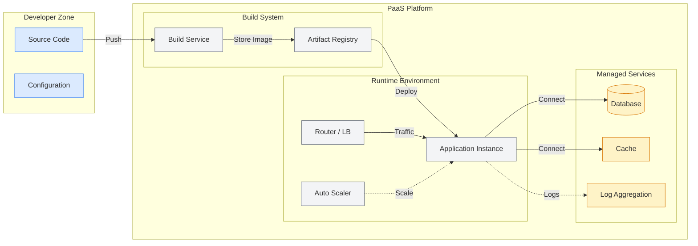
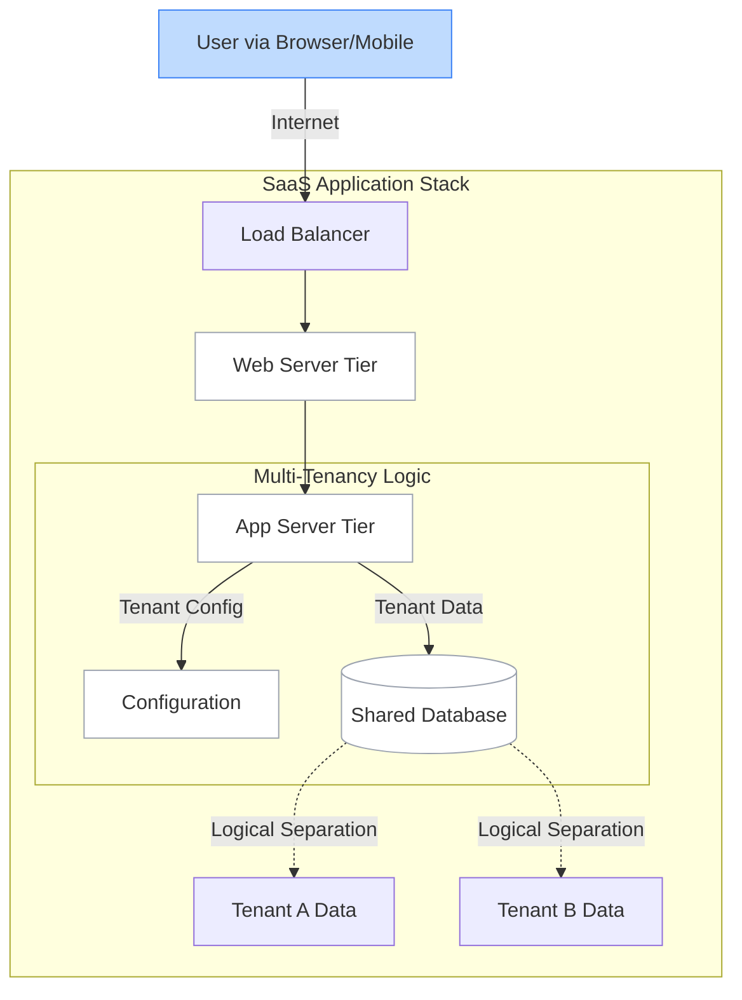
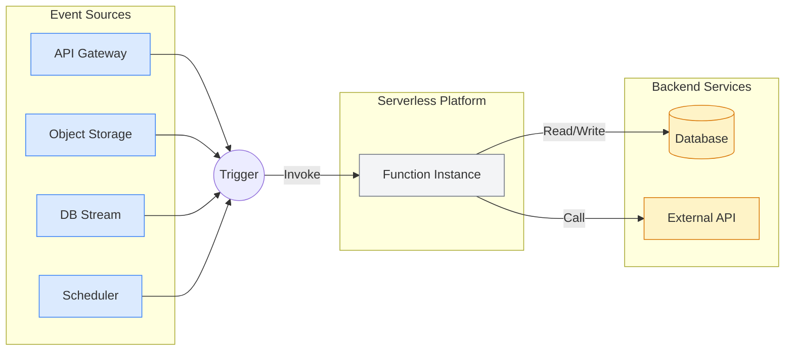
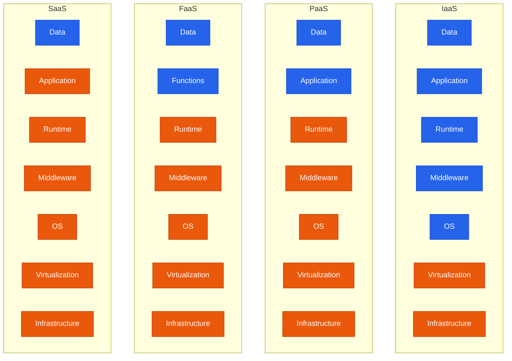

# Cloud Service Models

Complete guide to cloud service models (IaaS, PaaS, SaaS), their characteristics, use cases, and implementation strategies.

## Overview

Cloud service models define the level of control, flexibility, and management responsibility between cloud providers and customers. Each model offers different abstractions of computing resources.

## Infrastructure as a Service (IaaS)

### Definition
```bash
# Provides virtualized computing resources over the internet
# Fundamental building blocks of cloud computing
# Maximum control and flexibility
# Customer manages: OS, middleware, runtime, data, applications
# Provider manages: Virtualization, servers, storage, networking
```

### Architecture


### Key Components

#### Compute Services
```bash
# Virtual Machines
AWS EC2:
aws ec2 run-instances \
    --image-id ami-0abcdef1234567890 \
    --count 1 \
    --instance-type t3.medium \
    --key-name MyKeyPair \
    --security-group-ids sg-903004f8

Azure Virtual Machines:
az vm create \
    --resource-group myResourceGroup \
    --name myVM \
    --image UbuntuLTS \
    --admin-username azureuser \
    --generate-ssh-keys

Google Compute Engine:
gcloud compute instances create my-instance \
    --zone=us-central1-a \
    --machine-type=e2-medium \
    --image-family=ubuntu-2004-lts \
    --image-project=ubuntu-os-cloud
```

#### Storage Services
```bash
# Block Storage
AWS EBS:
aws ec2 create-volume \
    --size 100 \
    --volume-type gp3 \
    --availability-zone us-west-2a

# Object Storage
AWS S3:
aws s3 mb s3://my-iaas-bucket
aws s3 cp file.txt s3://my-iaas-bucket/

# File Storage
AWS EFS:
aws efs create-file-system \
    --creation-token myToken \
    --performance-mode generalPurpose
```

#### Networking Services
```bash
# Virtual Private Cloud
AWS VPC:
aws ec2 create-vpc --cidr-block 10.0.0.0/16

# Load Balancers
AWS ALB:
aws elbv2 create-load-balancer \
    --name my-load-balancer \
    --subnets subnet-12345678 subnet-87654321 \
    --security-groups sg-12345678

# Content Delivery Network
AWS CloudFront:
aws cloudfront create-distribution \
    --distribution-config file://distribution-config.json
```

### Advantages
```bash
# Cost Efficiency
- No upfront hardware investment
- Pay-as-you-use pricing
- Reduced operational costs
- Economies of scale

# Scalability
- Rapid resource provisioning
- Elastic scaling capabilities
- Global availability
- On-demand capacity

# Flexibility
- Choice of operating systems
- Custom configurations
- Full administrative control
- Technology stack freedom

# Reliability
- High availability infrastructure
- Disaster recovery capabilities
- Redundancy and failover
- SLA guarantees
```

### Disadvantages
```bash
# Management Overhead
- OS maintenance and patching
- Security configuration
- Backup and recovery
- Monitoring and troubleshooting

# Security Responsibility
- OS-level security
- Application security
- Data protection
- Access control management

# Complexity
- Infrastructure design
- Network configuration
- Performance optimization
- Cost management
```

### Use Cases
```bash
# Development and Testing
- Rapid environment provisioning
- Cost-effective testing
- Isolated development environments
- CI/CD infrastructure

# Web Applications
- Scalable web hosting
- Database servers
- Application servers
- Content delivery

# Big Data and Analytics
- Data processing clusters
- Machine learning workloads
- Data warehousing
- Analytics platforms

# Disaster Recovery
- Backup infrastructure
- Failover environments
- Business continuity
- Data replication
```

### Major IaaS Providers
```bash
# Amazon Web Services (AWS)
Services: EC2, S3, VPC, RDS, Lambda
Strengths: Market leader, extensive services, global presence
Use Cases: Enterprise applications, startups, government

# Microsoft Azure
Services: Virtual Machines, Blob Storage, Virtual Network
Strengths: Enterprise integration, hybrid cloud, Microsoft ecosystem
Use Cases: Enterprise Windows environments, hybrid deployments

# Google Cloud Platform (GCP)
Services: Compute Engine, Cloud Storage, VPC
Strengths: Data analytics, machine learning, container services
Use Cases: Data-driven applications, modern architectures

# IBM Cloud
Services: Virtual Servers, Object Storage, VPC
Strengths: Enterprise focus, AI/ML capabilities, hybrid cloud
Use Cases: Enterprise workloads, AI applications

# Oracle Cloud Infrastructure (OCI)
Services: Compute, Block Storage, Virtual Cloud Network
Strengths: Database workloads, high performance, enterprise features
Use Cases: Oracle database migrations, enterprise applications
```

## Platform as a Service (PaaS)

### Definition
```bash
# Provides platform and environment for developers
# Abstracts infrastructure management
# Focus on application development
# Customer manages: Data, applications
# Provider manages: Runtime, middleware, OS, virtualization, servers, storage, networking
```

### Architecture


### Key Components

#### Application Platforms
```bash
# AWS Elastic Beanstalk
# Deploy Java application
eb init my-app --platform java-8
eb create production-env
eb deploy

# Azure App Service
# Deploy .NET application
az webapp create \
    --resource-group myResourceGroup \
    --plan myAppServicePlan \
    --name myWebApp \
    --runtime "DOTNETCORE|3.1"

# Google App Engine
# Deploy Python application
gcloud app deploy app.yaml
gcloud app browse
```

#### Database Services
```bash
# Managed Databases
AWS RDS:
aws rds create-db-instance \
    --db-instance-identifier mydb \
    --db-instance-class db.t3.micro \
    --engine mysql \
    --master-username admin \
    --master-user-password mypassword

Azure SQL Database:
az sql db create \
    --resource-group myResourceGroup \
    --server myserver \
    --name mydatabase \
    --service-objective Basic

Google Cloud SQL:
gcloud sql instances create myinstance \
    --database-version=MYSQL_8_0 \
    --tier=db-f1-micro \
    --region=us-central1
```

#### Development Tools
```bash
# CI/CD Pipelines
AWS CodePipeline:
aws codepipeline create-pipeline \
    --cli-input-json file://pipeline.json

Azure DevOps:
az pipelines create \
    --name MyPipeline \
    --repository https://github.com/myorg/myrepo \
    --branch main

Google Cloud Build:
gcloud builds submit \
    --config cloudbuild.yaml \
    --source .
```

#### Container Platforms
```bash
# Kubernetes Services
AWS EKS:
eksctl create cluster \
    --name my-cluster \
    --region us-west-2 \
    --nodegroup-name standard-workers \
    --node-type t3.medium \
    --nodes 3

Azure AKS:
az aks create \
    --resource-group myResourceGroup \
    --name myAKSCluster \
    --node-count 1 \
    --enable-addons monitoring

Google GKE:
gcloud container clusters create my-cluster \
    --zone us-central1-a \
    --num-nodes 3
```

### Advantages
```bash
# Faster Development
- Pre-configured environments
- Built-in development tools
- Automated deployment
- Reduced setup time

# Cost Efficiency
- No infrastructure management
- Pay for platform usage
- Reduced operational overhead
- Automatic scaling

# Focus on Code
- Abstract infrastructure complexity
- Built-in services integration
- Standardized environments
- Best practices enforcement

# Scalability
- Automatic scaling
- Load balancing
- Performance optimization
- Global distribution
```

### Disadvantages
```bash
# Limited Control
- Platform constraints
- Runtime limitations
- Configuration restrictions
- Vendor lock-in

# Customization Limits
- Predefined environments
- Limited OS access
- Restricted configurations
- Standard frameworks only

# Dependency
- Platform availability
- Vendor roadmap
- Migration complexity
- Service limitations
```

### Use Cases
```bash
# Web Application Development
- Rapid prototyping
- Startup applications
- E-commerce platforms
- Content management systems

# API Development
- RESTful services
- Microservices architecture
- Integration platforms
- Mobile backends

# Data Processing
- ETL pipelines
- Real-time analytics
- Data transformation
- Batch processing

# DevOps and CI/CD
- Continuous integration
- Automated testing
- Deployment pipelines
- Release management
```

### Major PaaS Providers
```bash
# Heroku
Strengths: Developer-friendly, easy deployment, add-on ecosystem
Languages: Ruby, Node.js, Python, Java, PHP, Go, Scala, Clojure
Use Cases: Startups, rapid prototyping, simple web applications

# AWS Elastic Beanstalk
Strengths: AWS integration, multiple platforms, auto-scaling
Languages: Java, .NET, PHP, Node.js, Python, Ruby, Go
Use Cases: AWS-centric applications, enterprise deployments

# Google App Engine
Strengths: Automatic scaling, integrated services, serverless
Languages: Python, Java, Node.js, PHP, Ruby, Go, .NET
Use Cases: Scalable web applications, Google ecosystem integration

# Microsoft Azure App Service
Strengths: Enterprise integration, multiple frameworks, DevOps tools
Languages: .NET, Java, Ruby, Node.js, PHP, Python
Use Cases: Enterprise applications, Microsoft ecosystem

# Red Hat OpenShift
Strengths: Kubernetes-based, enterprise features, hybrid cloud
Languages: Multiple via containers
Use Cases: Enterprise container platforms, hybrid deployments
```

## Software as a Service (SaaS)

### Definition
```bash
# Complete software applications delivered over the internet
# No installation or maintenance required
# Multi-tenant architecture
# Customer manages: Data (limited)
# Provider manages: Applications, data, runtime, middleware, OS, virtualization, servers, storage, networking
```

### Architecture


### Key Characteristics

#### Multi-Tenancy
```bash
# Shared Infrastructure
- Single application instance
- Multiple customers (tenants)
- Isolated data and configurations
- Shared resources and costs

# Tenant Isolation
- Data segregation
- Security boundaries
- Performance isolation
- Customization per tenant
```

#### Subscription Model
```bash
# Pricing Models
- Per user per month
- Tiered feature access
- Usage-based billing
- Freemium models

# Examples:
Office 365: $5-22/user/month
Salesforce: $25-300/user/month
Slack: $6.67-12.50/user/month
Zoom: $14.99-19.99/user/month
```

#### Automatic Updates
```bash
# Continuous Delivery
- Regular feature updates
- Security patches
- Bug fixes
- No user intervention required

# Version Management
- Single version for all users
- Backward compatibility
- Gradual rollouts
- Feature flags
```

### Categories of SaaS

#### Productivity and Collaboration
```bash
# Office Suites
Microsoft Office 365:
- Word, Excel, PowerPoint online
- Teams collaboration
- OneDrive storage
- Exchange email

Google Workspace:
- Docs, Sheets, Slides
- Gmail and Calendar
- Drive storage
- Meet video conferencing

# Project Management
Atlassian Jira:
- Issue tracking
- Agile project management
- Workflow automation
- Reporting and analytics

Asana:
- Task management
- Team collaboration
- Project tracking
- Timeline views
```

#### Customer Relationship Management (CRM)
```bash
# Salesforce
Features:
- Lead and opportunity management
- Sales forecasting
- Customer service
- Marketing automation
- Analytics and reporting

# HubSpot
Features:
- Contact management
- Email marketing
- Sales pipeline
- Customer support
- Website analytics

# Microsoft Dynamics 365
Features:
- Sales automation
- Customer service
- Field service
- Marketing
- Business intelligence
```

#### Enterprise Resource Planning (ERP)
```bash
# SAP SuccessFactors
Modules:
- Human resources
- Payroll management
- Performance management
- Learning management
- Analytics

# NetSuite
Modules:
- Financial management
- Inventory management
- Order management
- CRM
- E-commerce

# Workday
Modules:
- Human capital management
- Financial management
- Planning and analytics
- Student information system
```

#### Communication and Collaboration
```bash
# Slack
Features:
- Team messaging
- File sharing
- Video calls
- App integrations
- Workflow automation

# Zoom
Features:
- Video conferencing
- Webinars
- Phone system
- Chat messaging
- Room solutions

# Microsoft Teams
Features:
- Chat and collaboration
- Video meetings
- File sharing
- App integration
- Phone system
```

### Advantages
```bash
# Ease of Use
- No installation required
- Web browser access
- Immediate availability
- User-friendly interfaces

# Cost Effectiveness
- No upfront software costs
- Predictable subscription fees
- Reduced IT overhead
- Automatic updates included

# Accessibility
- Access from anywhere
- Multi-device support
- Mobile applications
- Offline capabilities

# Scalability
- Easy user addition/removal
- Automatic capacity scaling
- Global availability
- Performance optimization

# Maintenance-Free
- No software updates
- Automatic backups
- Security management
- Infrastructure maintenance
```

### Disadvantages
```bash
# Limited Customization
- Standardized features
- Limited configuration options
- Vendor-controlled roadmap
- One-size-fits-all approach

# Data Security Concerns
- Data stored externally
- Shared infrastructure
- Compliance challenges
- Limited control over security

# Internet Dependency
- Requires internet connection
- Performance depends on bandwidth
- Offline limitations
- Connectivity issues impact access

# Vendor Lock-in
- Data portability challenges
- Integration dependencies
- Migration complexity
- Switching costs

# Ongoing Costs
- Continuous subscription fees
- Cost accumulation over time
- Feature tier limitations
- User-based pricing scaling
```

### Use Cases
```bash
# Small and Medium Businesses
- Limited IT resources
- Cost-sensitive operations
- Standard business processes
- Rapid deployment needs

# Remote and Distributed Teams
- Global collaboration
- Mobile workforce
- Flexible access requirements
- Communication needs

# Startups
- Minimal upfront investment
- Rapid scaling requirements
- Focus on core business
- Proven solutions

# Enterprise Departments
- Specific functional needs
- Quick deployment
- Standardized processes
- Integration with existing systems
```

### Integration Patterns
```bash
# API Integration
# Salesforce REST API
curl -H "Authorization: Bearer ACCESS_TOKEN" \
     -H "Content-Type: application/json" \
     -X GET https://instance.salesforce.com/services/data/v52.0/sobjects/Account

# Webhook Integration
# Slack Webhook
curl -X POST -H 'Content-type: application/json' \
     --data '{"text":"Hello, World!"}' \
     YOUR_WEBHOOK_URL

# Single Sign-On (SSO)
# SAML Configuration
<saml:Assertion>
  <saml:Subject>
    <saml:NameID Format="urn:oasis:names:tc:SAML:1.1:nameid-format:emailAddress">
      user@company.com
    </saml:NameID>
  </saml:Subject>
</saml:Assertion>

# OAuth 2.0 Integration
# Google Workspace OAuth
curl -d "client_id=CLIENT_ID" \
     -d "client_secret=CLIENT_SECRET" \
     -d "refresh_token=REFRESH_TOKEN" \
     -d "grant_type=refresh_token" \
     https://oauth2.googleapis.com/token
```

## Function as a Service (FaaS) / Serverless

### Definition
```bash
# Event-driven compute service
# No server management required
# Pay-per-execution model
# Automatic scaling
# Stateless functions
```

### Architecture


### Key Features
```bash
# AWS Lambda Example
import json

def lambda_handler(event, context):
    # Process the event
    name = event.get('name', 'World')
    
    return {
        'statusCode': 200,
        'body': json.dumps(f'Hello {name}!')
    }

# Azure Functions Example
import azure.functions as func

def main(req: func.HttpRequest) -> func.HttpResponse:
    name = req.params.get('name')
    if not name:
        name = 'World'
    
    return func.HttpResponse(f"Hello {name}!")

# Google Cloud Functions Example
def hello_world(request):
    name = request.args.get('name', 'World')
    return f'Hello {name}!'
```

### Use Cases
```bash
# Event Processing
- File uploads
- Database changes
- Message queue processing
- IoT data processing

# API Backends
- RESTful APIs
- GraphQL resolvers
- Webhook handlers
- Authentication services

# Data Processing
- Image/video processing
- ETL operations
- Real-time analytics
- Log processing

# Automation
- Scheduled tasks
- Infrastructure automation
- Notification systems
- Workflow orchestration
```

## Service Model Comparison

### Responsibility Matrix


### Selection Criteria
```bash
# Choose IaaS When:
- Maximum control required
- Custom OS configurations needed
- Legacy application migration
- Specific compliance requirements
- Existing infrastructure expertise

# Choose PaaS When:
- Focus on application development
- Rapid deployment required
- Standard development frameworks
- Team lacks infrastructure expertise
- Cost-effective scaling needed

# Choose SaaS When:
- Standard business processes
- Minimal customization required
- Quick implementation needed
- Limited IT resources
- Proven solution exists

# Choose FaaS When:
- Event-driven processing
- Microservices architecture
- Variable or unpredictable workloads
- Cost optimization for sporadic usage
- Rapid prototyping and development
```

### Cost Comparison
```bash
# IaaS Costs
- Compute instances: $0.05-2.00/hour
- Storage: $0.02-0.25/GB/month
- Network: $0.01-0.12/GB transfer
- Management overhead: High

# PaaS Costs
- Application hosting: $0.10-1.00/hour
- Database services: $0.15-3.00/hour
- Additional services: Variable
- Management overhead: Medium

# SaaS Costs
- User licenses: $5-100/user/month
- Feature tiers: Variable pricing
- Storage/usage: Often included
- Management overhead: Low

# FaaS Costs
- Execution time: $0.0000002/100ms
- Requests: $0.20/1M requests
- Memory allocation: $0.0000166/GB-second
- Management overhead: Minimal
```

## Best Practices

### Service Model Selection
```bash
# Assessment Framework
1. Business Requirements
   - Time to market
   - Customization needs
   - Integration requirements
   - Compliance needs

2. Technical Considerations
   - Performance requirements
   - Scalability needs
   - Security requirements
   - Existing infrastructure

3. Organizational Factors
   - Team skills and expertise
   - Budget constraints
   - Risk tolerance
   - Strategic direction

4. Operational Requirements
   - Maintenance capabilities
   - Support needs
   - Monitoring requirements
   - Disaster recovery
```

### Implementation Strategy
```bash
# Phased Approach
Phase 1: Assessment and Planning
- Current state analysis
- Requirements gathering
- Service model evaluation
- Pilot project selection

Phase 2: Pilot Implementation
- Small-scale deployment
- Proof of concept
- Performance testing
- User feedback collection

Phase 3: Gradual Migration
- Incremental rollout
- Risk mitigation
- Training and adoption
- Process optimization

Phase 4: Full Deployment
- Complete migration
- Optimization and tuning
- Monitoring and management
- Continuous improvement
```

### Security Considerations
```bash
# Shared Responsibility Model
IaaS Security:
- Customer: OS, applications, data, network configuration
- Provider: Physical security, hypervisor, network infrastructure

PaaS Security:
- Customer: Applications, data, user access
- Provider: Platform security, runtime, middleware, OS

SaaS Security:
- Customer: User access, data classification
- Provider: Application security, infrastructure, platform

FaaS Security:
- Customer: Function code, IAM policies
- Provider: Runtime security, infrastructure, platform
```

### Monitoring and Management
```bash
# Key Metrics by Service Model
IaaS Monitoring:
- CPU, memory, disk utilization
- Network performance
- Security events
- Cost optimization

PaaS Monitoring:
- Application performance
- Database performance
- Platform health
- Development metrics

SaaS Monitoring:
- User adoption
- Feature utilization
- Performance metrics
- Support tickets

FaaS Monitoring:
- Function execution time
- Error rates
- Invocation count
- Cost per execution
```

This comprehensive guide covers all major cloud service models, helping organizations understand the differences, benefits, and appropriate use cases for each model to make informed decisions about their cloud strategy.

## Real World Scenarios

### Scenario 1: Developer Productivity
**Context:** A development team wants to build a new Java web app but doesn't want to manage OS patches, load balancers, or server scaling.
**Solution:**
- **PaaS (Platform as a Service):** Use AWS Elastic Beanstalk or Azure App Service.
- Developers simply upload the JAR file.
- The platform handles capacity provisioning, load balancing, and auto-scaling.
**Benefit:** 50% faster time-to-market compared to managing raw EC2 instances (IaaS).

### Scenario 2: Legacy Migration requiring Control
**Context:** A bank has a legacy mainframe application that requires specific OS kernel modifications and strict network isolation.
**Solution:**
- **IaaS (Infrastructure as a Service):** Use EC2 Dedicated Hosts.
- Full control over the OS and network stack.
- Can install custom agents and modify kernel parameters.
**Benefit:** Maintains compliance and technical requirements that SaaS or PaaS cannot support.

### Scenario 3: Hybrid Strategy for Cost Optimization
**Context:** A media company needs to process large video files. They have steady predictable load but occasional massive spikes.
**Solution:**
- **Hybrid Strategy:** 
- Use **Reserved EC2 Instances (IaaS)** for the steady baseline load (cheaper).
- Use **AWS Lambda (FaaS)** to handle the spikes in transcoding jobs.
**Benefit:** Optimizes cost by committing to baseline capacity while retaining the ability to scale infinitely for bursts without paying for idle servers.

---

## Interview Questions

### Basic Level
1. **Define IaaS, PaaS, and SaaS in simple terms.**
   - IaaS: Renting the hardware/VMs (you manage OS+Apps).
   - PaaS: Renting the platform (you manage Code/Data).
   - SaaS: Renting the software (you just use it).
2. **Give an example of SaaS.**
   - Gmail, Salesforce, Dropbox, Office 365.
3. **In which service model does the customer manage the Operating System?**
   - IaaS (Infrastructure as a Service).

### Intermediate Level
4. **When would you choose FaaS (Serverless) over PaaS?**
   - For sporadic, event-driven workloads where you want to pay ONLY when the code runs (zero idle cost) and don't need persistent server processes.
5. **What is the main advantage of PaaS for developers?**
   - Focus on writing code rather than managing infrastructure maintenance, patching, and scaling.
6. **Who is responsible for data security in SaaS?**
   - The Customer (managing user access and data classification), although the Provider secures the underlying platform and application code.

### Advanced Level
7. **Explain the "Pizza as a Service" analogy.**
   - **Made at Home (On-Prem):** You do everything (dough, toppings, oven, table).
   - **Take & Bake (IaaS):** You rent the kitchen/tools, but bring ingredients.
   - **Delivery (PaaS):** You buy the pizza, but set the table.
   - **Dining Out (SaaS):** Everything is done for you.
8. **What are the limitations of FaaS?**
   - Cold start latency, execution time limits (e.g., 15 mins on Lambda), and stateless nature (cannot store session data in memory).
9. **How does "Vendor Lock-in" vary across service models?**
   - Lowest in IaaS (can migrate VMs relatively easily). Highest in SaaS (hard to export proprietary data formats) and FaaS (code coupled to vendor triggers/APIs).
10. **What is Kubernetes in the context of service models?**
    - It's a container orchestrator. Managed K8s (EKS/AKS) is often considered a blend of IaaS and PaaS (sometimes called CaaS - Container as a Service).
11. **Why is SaaS generally considered the most secure against "user-error" vulnerabilities?**
    - Because the vendor manages almost everything (OS, patching, application security), leaving less room for the customer to misconfigure servers or firewalls compared to IaaS.
12. **In an IaaS model, if the underlying physical server fails, whose responsibility is it to restore the VM?**
    - The Cloud Provider is responsible for the physical hardware, but they usually provide a new host. The Customer is responsible for their HA configuration (e.g., auto-scaling) to handle the reboot/failover.
13. **Describe a scenario where FaaS is NOT a good fit.**
    - Long-running processes (e.g., a 2-hour data crunching job), applications requiring persistent WebSocket connections, or legacy apps with complex stateful dependencies.
14. **What is "Shadow IT" and which service model contributes to it most?**
    - Unauthorized use of software/devices by employees. SaaS contributes most because it's so easy for users to sign up for tools (DropBox, Trello) without IT approval.
15. **How does resource pooling differ between IaaS and SaaS?**
    - In IaaS, you might share physical hardware but have isolated VMs. In SaaS, you often share the same application instance and database (multi-tenancy) with logical separation.

---

## Quiz: Service Models

<details>
<summary><b>1. Microsoft Azure Virtual Machines is an example of:</b></summary>
A) SaaS<br>
B) PaaS<br>
C) IaaS<br>
D) FaaS<br>
<br>
<b>Answer: C) IaaS</b>
</details>

<details>
<summary><b>2. In which model does the vendor manage the Runtime, Middleware, and OS, but NOT the Application?</b></summary>
A) IaaS<br>
B) PaaS<br>
C) SaaS<br>
D) On-Premises<br>
<br>
<b>Answer: B) PaaS</b>
</details>

<details>
<summary><b>3. Google Drive / Dropbox are examples of:</b></summary>
A) IaaS<br>
B) PaaS<br>
C) SaaS<br>
D) Database<br>
<br>
<b>Answer: C) SaaS</b>
</details>

<details>
<summary><b>4. Which model allows a user to deploy code without managing ANY servers?</b></summary>
A) IaaS<br>
B) FaaS (Serverless)<br>
C) On-Premises<br>
D) Hybrid<br>
<br>
<b>Answer: B) FaaS (Serverless)</b>
</details>

<details>
<summary><b>5. AWS RDS (Relational Database Service) is primarily considered:</b></summary>
A) IaaS (because it's a server)<br>
B) PaaS (because AWS manages the OS/Patching)<br>
C) SaaS<br>
D) FaaS<br>
<br>
<b>Answer: B) PaaS</b>
</details>

<details>
<summary><b>6. Which has the highest level of customer management responsibility?</b></summary>
A) SaaS<br>
B) PaaS<br>
C) IaaS<br>
D) On-Premises<br>
<br>
<b>Answer: D) On-Premises</b>
</details>

<details>
<summary><b>7. "Pay-per-execution" is a pricing model most associated with:</b></summary>
A) IaaS<br>
B) SaaS<br>
C) FaaS<br>
D) PaaS<br>
<br>
<b>Answer: C) FaaS</b>
</details>

<details>
<summary><b>8. In the Shared Responsibility Model, who patches the OS in IaaS?</b></summary>
A) The Cloud Provider<br>
B) The Customer<br>
C) The Internet<br>
D) It happens automatically<br>
<br>
<b>Answer: B) The Customer</b>
</details>

<details>
<summary><b>9. Which is a disadvantage of SaaS?</b></summary>
A) High maintenance<br>
B) High upfront cost<br>
C) Limited customization<br>
D) Requires hardware purchase<br>
<br>
<b>Answer: C) Limited customization</b>
</details>

<details>
<summary><b>10. If you need to install a custom kernel module, which model MUST you use?</b></summary>
A) PaaS<br>
B) SaaS<br>
C) IaaS<br>
D) FaaS<br>
<br>
<b>Answer: C) IaaS</b>
</details>

<details>
<summary><b>11. What does the "S" in SaaS stand for?</b></summary>
A) System<br>
B) Storage<br>
C) Software<br>
D) Security<br>
<br>
<b>Answer: C) Software</b>
</details>

<details>
<summary><b>12. Why choose PaaS?</b></summary>
A) To build a data center<br>
B) To focus on application code and speed up development<br>
C) To manage network switches<br>
D) To avoid paying for cloud<br>
<br>
<b>Answer: B) To focus on application code and speed up development</b>
</details>

<details>
<summary><b>13. Salesforce is the classic example of:</b></summary>
A) IaaS<br>
B) PaaS<br>
C) SaaS<br>
D) FaaS<br>
<br>
<b>Answer: C) SaaS</b>
</details>

<details>
<summary><b>14. AWS Lambda is:</b></summary>
A) IaaS<br>
B) PaaS<br>
C) SaaS<br>
D) FaaS<br>
<br>
<b>Answer: D) FaaS</b>
</details>

<details>
<summary><b>15. Which model has the highest risk of "Cold Start" latency?</b></summary>
A) IaaS<br>
B) PaaS<br>
C) FaaS<br>
D) SaaS<br>
<br>
<b>Answer: C) FaaS</b>
</details>

<details>
<summary><b>16. In IaaS, "Scalability" refers to:</b></summary>
A) Editing code faster<br>
B) Adding more VMs (Scale Out) or bigger VMs (Scale Up)<br>
C) Buying more software licenses<br>
D) Reducing costs<br>
<br>
<b>Answer: B) Adding more VMs (Scale Out) or bigger VMs (Scale Up)</b>
</details>

<details>
<summary><b>17. Which requires the least technical expertise to use?</b></summary>
A) IaaS<br>
B) PaaS<br>
C) FaaS<br>
D) SaaS<br>
<br>
<b>Answer: D) SaaS</b>
</details>

<details>
<summary><b>18. Google App Engine is an example of:</b></summary>
A) IaaS<br>
B) PaaS<br>
C) SaaS<br>
D) Hardware<br>
<br>
<b>Answer: B) PaaS</b>
</details>

<details>
<summary><b>19. Moving from IaaS to PaaS usually results in:</b></summary>
A) More control, higher cost<br>
B) Less control, less management overhead<br>
C) More hardware management<br>
D) Slower deployment<br>
<br>
<b>Answer: B) Less control, less management overhead</b>
</details>

<details>
<summary><b>20. Which layer is managed by the provider in ALL cloud models (IaaS, PaaS, SaaS, FaaS)?</b></summary>
A) Data<br>
B) Application<br>
C) Physical Infrastructure (Hardware/Facilities)<br>
D) Operating System<br>
<br>
<b>Answer: C) Physical Infrastructure (Hardware/Facilities)</b>
</details>

<details>
<summary><b>21. Which model typically uses a "Multi-Tenant" architecture at the application level?</b></summary>
A) IaaS<br>
B) PaaS<br>
C) FaaS<br>
D) SaaS<br>
<br>
<b>Answer: D) SaaS</b>
</details>

<details>
<summary><b>22. You want to run a legacy Windows app that requires registry tweaks. You should use:</b></summary>
A) SaaS<br>
B) PaaS<br>
C) IaaS<br>
D) FaaS<br>
<br>
<b>Answer: C) IaaS</b>
</details>

<details>
<summary><b>23. Which service model has the MOST vendor lock-in regarding data portability?</b></summary>
A) IaaS<br>
B) PaaS<br>
C) SaaS<br>
D) Bare Metal<br>
<br>
<b>Answer: C) SaaS</b>
</details>

<details>
<summary><b>24. Who is responsible for securing the code in a PaaS model?</b></summary>
A) The Provider<br>
B) The Customer<br>
C) The Government<br>
D) No one<br>
<br>
<b>Answer: B) The Customer</b>
</details>

<details>
<summary><b>25. "Focus on business logic, ignore the server" best describes:</b></summary>
A) IaaS<br>
B) Virtualization<br>
C) FaaS (Serverless)<br>
D) On-Premises<br>
<br>
<b>Answer: C) FaaS (Serverless)</b>
</details>