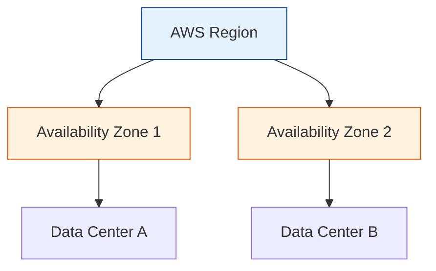

# AWS Introduction & CLI

A standardized starting point for AWS. This module consolidates core concepts and CLI setup.

## Overview
- **Fundamentals:** Understanding Regions, Availability Zones, and the Global Infrastructure.
- **CLI:** Automating AWS interactions from your terminal.

## Core Concepts

## Real World Scenarios
### Scenario: Automated Nightly Reports
**Context:** You manually login to the console every night to download billing CSVs.
**Solution:**
- **AWS CLI:** Write a simple bash script using `aws ce get-cost-and-usage`.
- **Cron Job:** Schedule it to run at 2 AM.
**Benefit:** Saves time and eliminates human error.

## Quiz

<b>1. What is an AWS Region?</b>

A) A single data center 
B) A physical location around the world where AWS clusters data centers 
C) A rack of servers 
D) A country 
 
<b>Answer: B) A physical location around the world where AWS clusters data centers</b>

<b>2. How many Availability Zones are normally in a Region?</b>

A) Always 1 
B) Minimum 2 (with exceptions), usually 3+ 
C) 100 
D) 0 
 
<b>Answer: B) Minimum 2 (with exceptions), usually 3+</b>

<b>3. Which command configures your AWS CLI credentials?</b>

A) aws login 
B) aws configure 
C) aws init 
D) aws setup 
 
<b>Answer: B) aws configure</b>

<b>4. Credentials for the CLI consist of:</b>

A) Username and Password 
B) Access Key ID and Secret Access Key 
C) Email and PIN 
D) Fingerprint 
 
<b>Answer: B) Access Key ID and Secret Access Key</b>

<b>5. Which output format is default for AWS CLI?</b>

A) Table 
B) JSON 
C) Text 
D) YAML 
 
<b>Answer: B) JSON</b>

<b>6. Can you use the CLI to delete production databases?</b>

A) No, only Console can do that 
B) Yes, if permissions allow (Dangerous!) 
 
<b>Answer: B) Yes, if permissions allow (Dangerous!)</b>

<b>7. What is "Edge Location"?</b>

A) A CLI tool 
B) A site that CloudFront uses to cache copies of content closer to users 
C) A backup server 
D) A deprecated feature 
 
<b>Answer: B) A site that CloudFront uses to cache copies of content closer to users</b>

<b>8. AWS CLI is built on which language SDK?</b>

A) Java 
B) Python (Boto3) 
C) C++ 
D) Ruby 
 
<b>Answer: B) Python (Boto3)</b>

<b>9. Which file stores your credentials locally?</b>

A) ~/.aws/credentials 
B) ~/.ssh/id_rsa 
C) Documents/passwords.txt 
D) Windows Registry 
 
<b>Answer: A) ~/.aws/credentials</b>

<b>10. To list S3 buckets via CLI:</b>

A) aws s3 ls 
B) aws s3 list-buckets 
C) aws s3 show 
D) aws list s3 
 
<b>Answer: A) aws s3 ls</b>

<b>11. What is ARN?</b>

A) AWS Resource Name (Unique Identifier) 
B) A random number 
C) Access Role Network 
D) Amazon Route Network 
 
<b>Answer: A) AWS Resource Name (Unique Identifier)</b>

<b>12. Global Infrastructure includes:</b>

A) Regions, AZs, Edge Locations 
B) Only US-East-1 
C) Office buildings 
D) Employees 
 
<b>Answer: A) Regions, AZs, Edge Locations</b>

<b>13. Which command updates the CLI to the latest version?</b>

A) aws update 
B) Depends on OS (e.g., pip install --upgrade awscli) 
C) aws self-update 
D) It updates automatically 
 
<b>Answer: B) Depends on OS (e.g., pip install --upgrade awscli)</b>

<b>14. "Dry Run" flag allows you to:</b>

A) Execute a command without actually making changes (simulate permission check) 
B) Run faster 
C) Run slowly 
D) Delete everything 
 
<b>Answer: A) Execute a command without actually making changes (simulate permission check)</b>

<b>15. Why use Profiles in CLI?</b>

A) To manage multiple AWS accounts (e.g., --profile prod) 
B) To look cool 
C) It's mandatory 
D) It saves disk space 
 
<b>Answer: A) To manage multiple AWS accounts (e.g., --profile prod)</b>

<b>16. How do you get help for a specific command?</b>

A) aws help 
B) aws ec2 help 
C) aws s3 cp help 
D) All of the above 
 
<b>Answer: D) All of the above</b>

<b>17. Can you run CLI in a Docker container?</b>

A) Yes 
B) No 
 
<b>Answer: A) Yes</b>

<b>18. Pagination in CLI outputs:</b>

A) Automatically handles large lists by showing a "NextToken" 
B) Is not supported 
C) Crashes the terminal 
D) Only prints first 10 items 
 
<b>Answer: A) Automatically handles large lists by showing a "NextToken"</b>

<b>19. Query parameter (`--query`) allows you to:</b>

A) Filter the client-side output using JSONPath 
B) Change the API call 
C) Hack AWS 
D) Increase speed 
 
<b>Answer: A) Filter the client-side output using JSONPath</b>

<b>20. Which partition is standard for most users?</b>

A) aws 
B) aws-cn (China) 
C) aws-us-gov (GovCloud) 
D) invalid 
 
<b>Answer: A) aws</b>

<b>21. Does CLI support Auto-Completion?</b>

A) Yes, if configured in shell (e.g., .bashrc) 
B) No 
 
<b>Answer: A) Yes, if configured in shell (e.g., .bashrc)</b>

