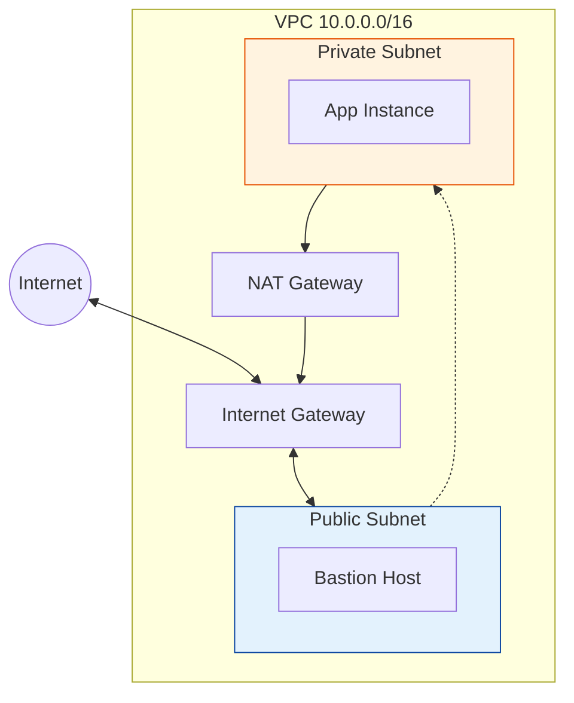

# AWS Networking (VPC)

Virtual Private Cloud (VPC) is your isolated network in the AWS cloud. This module explores specific AWS implementation details.

## AWS VPC Architecture

## Real World Scenarios
### Scenario: Secure Backend
**Context:** Your database must NOT be accessible from the internet, but needs updates from S3.
**Solution:**
- **VPC Endpoint (Gateway Type):** Create an S3 Gateway Endpoint in the VPC.
- **Route Table:** Add route to S3 Endpoint.
**Benefit:** Traffic to S3 stays within the AWS network, faster and more secure than NAT Gateway.

## Quiz

<b>1. A VPC is scoped to:</b>

A) Region 
B) AZ 
C) Global 
D) Server 
 
<b>Answer: A) Region</b>

<b>2. How many Internet Gateways can you attach to one VPC?</b>

A) 1 
B) 2 
C) 5 
D) Unlimited 
 
<b>Answer: A) 1</b>

<b>3. The default maximum VPCs per region per account is:</b>

A) 1 
B) 5 
C) 100 
D) 10 
 
<b>Answer: B) 5</b>

<b>4. A Subnet is scoped to:</b>

A) Region 
B) Availability Zone (AZ) 
C) VPC 
D) Global 
 
<b>Answer: B) Availability Zone (AZ)</b>

<b>5. Which IP address is reserved by AWS in every subnet for the Router?</b>

A) .1 
B) .255 
C) .0 
D) .2 
 
<b>Answer: A) .1</b>

<b>6. Can a subnet span multiple AZs?</b>

A) Yes 
B) No 
 
<b>Answer: B) No</b>

<b>7. Security Groups act at the:</b>

A) Subnet level 
B) Instance (ENI) level 
C) VPC level 
D) Region level 
 
<b>Answer: B) Instance (ENI) level</b>

<b>8. Network ACLs (NACLs) act at the:</b>

A) Subnet level 
B) Instance level 
C) Account level 
D) Internet level 
 
<b>Answer: A) Subnet level</b>

<b>9. VPC Flow Logs captures:</b>

A) Packet content (payload) 
B) IP traffic metadata (source, dest, port, action) 
C) Database queries 
D) User clicks 
 
<b>Answer: B) IP traffic metadata (source, dest, port, action)</b>

<b>10. To peer two VPCs in different regions, you use:</b>

A) Inter-Region VPC Peering 
B) VPN 
C) It's impossible 
D) Email 
 
<b>Answer: A) Inter-Region VPC Peering</b>

<b>11. What is an Elastic IP (EIP)?</b>

A) A static public IPv4 address 
B) A dynamic IP 
C) A private IP 
D) An IPv6 address 
 
<b>Answer: A) A static public IPv4 address</b>

<b>12. Are you charged for an unattached Elastic IP?</b>

A) Yes 
B) No 
 
<b>Answer: A) Yes (to discourage hoarding)</b>

<b>13. Which gateway allows IPv6 traffic out to the internet?</b>

A) NAT Gateway 
B) Egress-Only Internet Gateway 
C) Internet Gateway 
D) VPN Gateway 
 
<b>Answer: B) Egress-Only Internet Gateway</b>

<b>14. DHCP Options Sets configure:</b>

A) Domain name servers, NTP servers for instances 
B) IP ranges 
C) Firewall rules 
D) Billing 
 
<b>Answer: A) Domain name servers, NTP servers for instances</b>

<b>15. Can you resize a VPC CIDR after creation?</b>

A) No, you can only add secondary CIDR blocks 
B) Yes, easily 
 
<b>Answer: A) No, you can only add secondary CIDR blocks</b>

<b>16. Default Security Group allows:</b>

A) All inbound traffic from itself, all outbound traffic 
B) No traffic 
C) All traffic everywhere 
D) Only SSH 
 
<b>Answer: A) All inbound traffic from itself, all outbound traffic</b>

<b>17. Transit Gateway supports:</b>

A) Multicast usage 
B) Only Unicast 
 
<b>Answer: A) Multicast usage (in specific regions)</b>

<b>18. "Bring Your Own IP" (BYOIP) allows you to:</b>

A) Move your public IP range to AWS 
B) Steal an IP 
C) Use private IPs publicly 
D) None of the above 
 
<b>Answer: A) Move your public IP range to AWS</b>

<b>19. VPC Endpoints come in two types:</b>

A) Interface and Gateway 
B) Public and Private 
C) Fast and Slow 
D) In and Out 
 
<b>Answer: A) Interface (PrivateLink) and Gateway (S3/DynamoDB)</b>

<b>20. PrivateLink allows:</b>

A) Private connectivity between VPCs/Services without traversing public internet 
B) Public connectivity 
C) VPN 
D) Peering 
 
<b>Answer: A) Private connectivity between VPCs/Services without traversing public internet</b>

<b>21. Before deleting a VPC, you must:</b>

A) Terminate all instances inside it 
B) Pay a fee 
C) Archive it 
D) Call AWS Support 
 
<b>Answer: A) Terminate all instances inside it</b>

