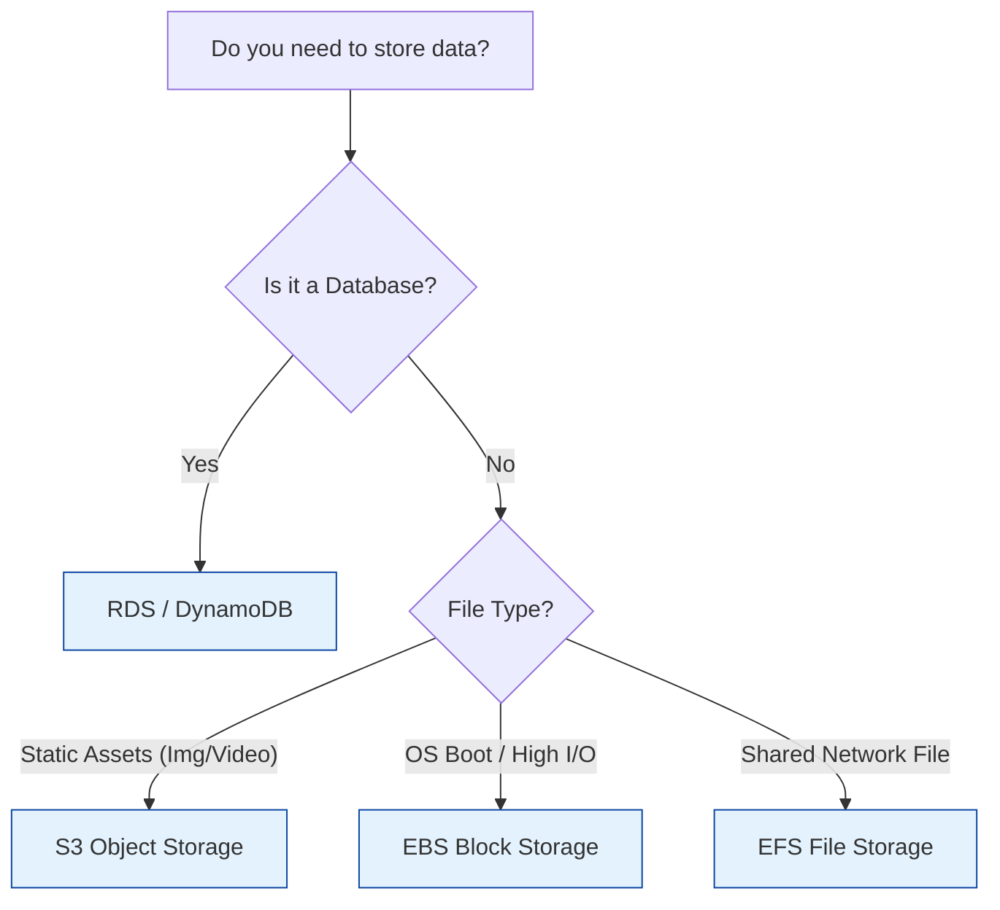

# AWS Storage Services

Overview of AWS storage options: S3 (Object), EFS (File), and EBS (Block).

## Storage Decision Matrix

## Real World Scenarios
### Scenario: CMS Media Library
**Context:** Wordpress site needs to store user uploads and be accessible by multiple servers.
**Solution:**
- **EFS:** Mount EFS to /var/www/html/wp-content/uploads on all web servers.
**Benefit:** All servers see the same files instantly. S3 could work with a plugin, but EFS is native filesystem access.

## Quiz

<b>1. S3 bucket names must be:</b>

A) Unique across all AWS accounts globally 
B) Unique within your account 
C) Unique within region 
D) Anything you want 
 
<b>Answer: A) Unique across all AWS accounts globally</b>

<b>2. Which S3 storage class is for "Unknown Access Patterns"?</b>

A) Standard 
B) Intelligent-Tiering 
C) Glacier 
D) One Zone-IA 
 
<b>Answer: B) Intelligent-Tiering</b>

<b>3. EBS Volumes persist independently of the EC2 instance unless:</b>

A) "Delete on Termination" is checked 
B) You pay extra 
C) They are SSD 
D) It is raining 
 
<b>Answer: A) "Delete on Termination" is checked</b>

<b>4. EFS is compatible with:</b>

A) Linux only (NFS) 
B) Windows only (SMB) 
C) Both 
D) Android 
 
<b>Answer: A) Linux only (NFS)</b>

<b>5. Does S3 support file locking?</b>

A) No 
B) Yes 
 
<b>Answer: A) No (It is object storage, not a file system)</b>

<b>6. Maximum size of a single S3 object?</b>

A) 5 TB 
B) 1 GB 
C) 100 GB 
D) unlimited 
 
<b>Answer: A) 5 TB</b>

<b>7. Which service is best for long-term audit logs that you hope never to read?</b>

A) S3 Glacier Deep Archive 
B) EBS io2 
C) EFS 
D) RDS 
 
<b>Answer: A) S3 Glacier Deep Archive</b>

<b>8. Can you resize an EBS volume while it is attached and in use?</b>

A) Yes (Elastic Volumes) 
B) No 
 
<b>Answer: A) Yes (Elastic Volumes)</b>

<b>9. S3 Transfer Acceleration uses:</b>

A) Edge Locations 
B) Magic 
C) VPN 
D) nothing 
 
<b>Answer: A) Edge Locations</b>

<b>10. What keeps track of object versions in S3?</b>

A) S3 Versioning 
B) Git 
C) Nothing 
D) CloudTrail 
 
<b>Answer: A) S3 Versioning</b>

<b>11. EFS grows and shrinks automatically. (True/False)</b>

A) True 
B) False 
 
<b>Answer: A) True</b>

<b>12. EBS Multi-Attach is supported on:</b>

A) io1/io2 volumes only (Provisioned IOPS) 
B) gp2 volumes 
C) all volumes 
D) none 
 
<b>Answer: A) io1/io2 volumes only (Provisioned IOPS)</b>

<b>13. S3 Select allows you to:</b>

A) Retrieve only a subset of data from an object using SQL 
B) Select a bucket 
C) Delete objects 
D) Encrypt objects 
 
<b>Answer: A) Retrieve only a subset of data from an object using SQL</b>

<b>14. Which EBS type is cheapest for infrequent access (boot volumes)?</b>

A) Cold HDD (sc1) 
B) Throughput Optimized HDD (st1) 
C) General Purpose SSD (gp3) 
D) Provisioned IOPS (io2) 
 
<b>Answer: A) Cold HDD (sc1) (Though technically sc1 cannot be boot volume. For boot volume it's usually gp2/gp3. But sc1 is cheapest block storage)</b>

<b>15. S3 Object Lock helps with:</b>

A) Compliance (WORM) 
B) Speed 
C) Cost 
D) Uploads 
 
<b>Answer: A) Compliance (WORM)</b>

<b>16. Can you access EFS from On-Premises?</b>

A) Yes, via Direct Connect or VPN 
B) No 
 
<b>Answer: A) Yes, via Direct Connect or VPN</b>

<b>17. FSx for Windows File Server uses which protocol?</b>

A) SMB 
B) NFS 
C) FTP 
D) HTTP 
 
<b>Answer: A) SMB</b>

<b>18. What is the durability of S3 Standard?</b>

A) 99.999999999% (11 9s) 
B) 99.9% 
C) 99.99% 
D) 100% 
 
<b>Answer: A) 99.999999999% (11 9s)</b>

<b>19. S3 Cross-Region Replication (CRR) requires:</b>

A) Versioning enabled on both source and destination buckets 
B) Nothing 
C) Public access 
D) Root access 
 
<b>Answer: A) Versioning enabled on both source and destination buckets</b>

<b>20. To serve S3 content privately to specific users, use:</b>

A) Pre-signed URLs or CloudFront Signed Cookies 
B) Public buckets 
C) E-mail 
D) FTP 
 
<b>Answer: A) Pre-signed URLs or CloudFront Signed Cookies</b>

<b>21. Does S3 support directory structure natively?</b>

A) No, it uses "Prefixes" to simulate folders 
B) Yes, it is a file system 
 
<b>Answer: A) No, it uses "Prefixes" to simulate folders</b>

